# PATH Framework: Process/AI/Technology/Human for Software Engineering

**Version 2.0.0** | **Released: August 3, 2025**

## Definition
**PATH Framework** (Process/AI/Technology/Human) is a comprehensive methodology framework that structures software engineering practices around four integrated phases: Software Engineering, Test-Driven Development, DevOps & Production Readiness, and Production Operations & Maintenance. Each phase implements the PATH model to ensure systematic, scalable, and technology-enabled software delivery through collaborative human-AI teams.

## PATH Framework Architecture

```mermaid
graph TB
    subgraph "PATH Framework Lifecycle"
        A[Product Goals & Requirements] --> B[Phase 1: Software Engineering]
        B --> C[Phase 2: TDD Implementation]
        C --> D[Phase 3: DevOps & CI/CD]
        D --> E[Phase 4: Production Operations]
        E --> F[Product Success Metrics]
    end
    
    subgraph "Phase 1: Architecture & Design"
        B1["🤖 AI Domain Analyst"] -.-> B
        B2["🤖 AI System Architect"] -.-> B
        B3["🤖 AI Component Designer"] -.-> B
        B4["🤖 AI Integration Architect"] -.-> B
        B --> G1[system_architecture.yaml]
        B --> G2[component_designs.yaml]
        B --> G3[interface_specifications.yaml]
        T1[Architecture Tools] -.-> B
        H1[👤 Human Oversight] -.-> B
    end
    
    subgraph "Phase 2: TDD Implementation"
        C1["🤖 AI TDD Orchestrator"] -.-> C
        C2["🤖 AI Test Strategist"] -.-> C
        C3["🤖 AI Implementation Specialist"] -.-> C
        C4["🤖 AI Coverage Validator"] -.-> C
        C --> H2[test_specifications.yaml]
        C --> H3[implementation_artifacts.yaml]
        C --> H4[deployment_packages.yaml]
        T2[Testing Frameworks] -.-> C
        T2b[Promptus Framework] -.-> C
        H2[👤 Human Code Review] -.-> C
    end
    
    subgraph "Phase 3: DevOps & CI/CD"
        D1["🤖 AI Pipeline Architect"] -.-> D
        D2["🤖 AI Infrastructure Engineer"] -.-> D
        D3["🤖 AI Deployment Specialist"] -.-> D
        D4["🤖 AI Monitoring Analyst"] -.-> D
        D --> I1[pipeline_configurations.yaml]
        D --> I2[infrastructure_templates.yaml]
        D --> I3[monitoring_configurations.yaml]
        T3[CI/CD Platforms] -.-> D
        H3[👤 Human Validation] -.-> D
    end
    
    subgraph "Phase 4: Operations"
        E1["🤖 AI Reliability Engineer"] -.-> E
        E2["🤖 AI Operations Specialist"] -.-> E
        E3["🤖 AI Performance Analyst"] -.-> E
        E4["🤖 AI Security Operator"] -.-> E
        E --> J1[kpi_reports.yaml]
        E --> J2[performance_reports.yaml]
        E --> J3[operational_excellence.yaml]
        T4[Monitoring Systems] -.-> E
        H4[👤 Human Escalation] -.-> E
    end
    
    subgraph "Process Quality Gates"
        L1[Architecture Validation] -.-> B
        L2[Coverage Validation] -.-> C
        L3[Deployment Validation] -.-> D
        L4[Performance Validation] -.-> E
    end
    
    style A fill:#e1f5fe
    style F fill:#fff3e0
    style B fill:#f3e5f5
    style C fill:#f3e5f5
    style D fill:#f3e5f5
    style E fill:#f3e5f5
    style B1 fill:#fff3e0
    style B2 fill:#fff3e0
    style B3 fill:#fff3e0
    style B4 fill:#fff3e0
    style C1 fill:#fff3e0
    style C2 fill:#fff3e0
    style C3 fill:#fff3e0
    style C4 fill:#fff3e0
    style D1 fill:#fff3e0
    style D2 fill:#fff3e0
    style D3 fill:#fff3e0
    style D4 fill:#fff3e0
    style E1 fill:#fff3e0
    style E2 fill:#fff3e0
    style E3 fill:#fff3e0
    style E4 fill:#fff3e0
    style T1 fill:#e8f5e8
    style T2 fill:#e8f5e8
    style T2b fill:#e8f5e8
    style T3 fill:#e8f5e8
    style T4 fill:#e8f5e8
    style H1 fill:#ffe0b2
    style H2 fill:#ffe0b2
    style H3 fill:#ffe0b2
    style H4 fill:#ffe0b2
    style L1 fill:#f0f0f0
    style L2 fill:#f0f0f0
    style L3 fill:#f0f0f0
    style L4 fill:#f0f0f0
    style G1 fill:#c8e6c9
    style H2 fill:#c8e6c9
    style I1 fill:#c8e6c9
    style J1 fill:#c8e6c9
```

## Core PATH Model

### **P**rocess
- **Systematic Workflows**: Clearly defined inputs, outputs, workflows, and quality gates for each phase
- **Methodical Execution**: Validated process steps with measurable checkpoints and criteria
- **Workflow Integration**: Seamless handoffs between phases with standardized YAML artifacts
- **Quality Assurance**: Built-in validation and continuous improvement with feedback loops

### **A**I (Artificial Intelligence)
- **Specialized AI Capabilities**: Autonomous agents, LLMs, decision models, and intelligent systems
- **Enhanced Consistency**: AI provides speed, analytical depth, and systematic execution
- **Predictive Intelligence**: AI-driven recommendations, optimization, and proactive insights
- **Adaptive Learning**: AI systems learn from patterns, feedback, and evolving requirements

### **T**echnology
- **Enabling Infrastructure**: Tooling, platforms, and automation that supports AI deployment
- **Integration Backbone**: CI/CD platforms, monitoring systems, testing frameworks, cloud services
- **Tool Orchestration**: Seamless integration across the entire technology stack
- **Platform Agnostic**: Support for multiple technology stacks, cloud-native, on-premises, hybrid

### **H**uman
- **Creative Direction**: Humans provide innovation, judgment, context awareness, and strategic thinking
- **Oversight & Governance**: Ethical decision-making, responsibility, and adaptive control
- **Quality Validation**: Human approval gates, code reviews, and architectural decisions
- **Continuous Learning**: Humans learn from AI insights while providing domain expertise

## PATH Software Engineering Lifecycle

### **Phase 1: PATH-Based Software Engineering**
**Purpose**: Architecture & Component Design

**PATH Implementation**:
- **Process**: 7 systematic phases from context analysis to validation with structured workflows
- **AI**: Domain analysis, architecture recommendation, component dependency mapping, specification generation
- **Technology**: Architectural patterns, design tools, specification compliance, modeling frameworks
- **Human**: Creative architectural decisions, oversight, validation, and strategic direction

**AI Roles**:
- **AI Domain Analyst**: Requirements analysis, domain modeling, knowledge extraction
- **AI System Architect**: Architecture design, technology selection, pattern recommendation
- **AI Component Designer**: Component design, SOLID principles, dependency management
- **AI Integration Architect**: Integration patterns, API design, system interfaces

**Key Outputs**: 
- system_architecture.yaml
- component_designs.yaml  
- interface_specifications.yaml
- architecture_decisions.md

**Quality Gates**: Architecture validation, pattern compliance, human approval
**Handoff**: Architecture specifications and design decisions to TDD phase

### **Phase 2: PATH-Based Test-Driven Development**
**Purpose**: Test-Driven Implementation

**PATH Implementation**:
- **Process**: RED-GREEN-REFACTOR cycles with coverage validation and systematic code review
- **AI**: TDD orchestration, test generation, implementation scaffolding, coverage analysis
- **Technology**: Testing frameworks, coverage tools, specification validators, automation tools
- **Human**: Code review, validation, creative problem-solving, quality oversight

**AI Roles**:
- **AI TDD Orchestrator**: Workflow planning, cycle management, process orchestration
- **AI Test Strategist**: Test case generation, strategy design, validation planning
- **AI Implementation Specialist**: Code generation, implementation suggestions, refactoring
- **AI Coverage Validator**: Coverage analysis, quality metrics, validation reporting

**Key Outputs**:
- test_specifications.yaml
- implementation_artifacts.yaml
- deployment_packages.yaml
- coverage_reports.yaml

**Quality Gates**: ≥90% test coverage, code quality metrics, human code review
**Handoff**: Working software with comprehensive tests to DevOps phase

### **Phase 3: PATH-Based DevOps & Production Readiness**
**Purpose**: CI/CD, Deployment, Infrastructure

**PATH Implementation**:
- **Process**: Infrastructure as Code, automated pipelines, monitoring setup with validation gates
- **AI**: Pipeline optimization, infrastructure templating, anomaly detection, observability setup
- **Technology**: CI/CD platforms, cloud infrastructure, monitoring tools, automation frameworks
- **Human**: Final deployment approval, infrastructure validation, security oversight

**AI Roles**:
- **AI Pipeline Architect**: CI/CD design, pipeline optimization, automation configuration
- **AI Infrastructure Engineer**: Infrastructure templating, resource optimization, scalability planning
- **AI Deployment Specialist**: Deployment strategies, rollback procedures, environment management
- **AI Monitoring Analyst**: Observability setup, alert configuration, performance monitoring

**Key Outputs**:
- pipeline_configurations.yaml
- infrastructure_templates.yaml
- monitoring_configurations.yaml
- deployment_procedures.yaml

**Quality Gates**: Deployment validation, security compliance, performance benchmarks
**Handoff**: Production-ready systems and operational procedures to Operations phase

### **Phase 4: PATH-Based Production Operations & Maintenance**
**Purpose**: Production Operations, SRE, Continuous Improvement

**PATH Implementation**:
- **Process**: SRE practices, incident response, performance optimization with human escalation
- **AI**: Anomaly detection, root cause analysis, performance assessment, proactive optimization
- **Technology**: Monitoring platforms, incident management, security tools, analytics systems
- **Human**: Incident escalation, strategic decisions, ethical governance, continuous improvement

**AI Roles**:
- **AI Reliability Engineer**: SLA monitoring, reliability analysis, system optimization
- **AI Operations Specialist**: Operational automation, runbook execution, maintenance scheduling
- **AI Performance Analyst**: Performance tracking, bottleneck identification, optimization recommendations
- **AI Security Operator**: Security monitoring, threat detection, compliance validation

**Key Outputs**:
- kpi_reports.yaml
- performance_reports.yaml
- operational_excellence.yaml
- improvement_recommendations.yaml

**Quality Gates**: SLA compliance, security validation, performance metrics
**Handoff**: Success metrics and evolution insights back to Architecture phase

## Process Quality Gates

Each phase includes comprehensive quality gates with human oversight:

### **Architecture Validation** (Phase 1)
- Alignment to system goals and technical standards
- Architecture pattern compliance and best practices
- Component interface validation and dependency analysis
- **Human Approval Required**: Strategic architectural decisions

### **Coverage Validation** (Phase 2)
- ≥90% test coverage with meaningful test cases
- Code quality metrics and SOLID principle compliance
- Implementation alignment with architectural specifications
- **Human Approval Required**: Code review and quality validation

### **Deployment Validation** (Phase 3)
- Artifact readiness and configuration integrity
- Security scanning and compliance verification
- Performance benchmarking and scalability validation
- **Human Approval Required**: Production deployment authorization

### **Performance Validation** (Phase 4)
- SLA compliance and reliability metrics
- Security posture and incident response effectiveness
- Operational excellence and continuous improvement metrics
- **Human Approval Required**: Strategic operational decisions

## PATH Integration Principles

### **Cross-Phase Continuity**
- **Forward Handoffs**: Standardized YAML artifacts ensure machine-readable continuity
- **Backward Feedback**: Performance insights and operational learnings feed back to design
- **Process Alignment**: Compatible workflows and validation criteria across all phases
- **Technology Backbone**: Integrated toolchain supporting the entire software lifecycle

### **Human-AI Collaboration Protocols**
- **AI Autonomy with Boundaries**: AI systems operate within defined scopes with human oversight
- **Shared Context**: Persistent structures maintain task state and knowledge across phases
- **Escalation Procedures**: Clear protocols for human intervention and decision-making
- **Continuous Learning**: Bidirectional learning between AI systems and human experts

### **Scalability Model**

| Project Size | AI Assignment | Process Depth | Human Oversight | Technology Scope |
|--------------|---------------|---------------|-----------------|------------------|
| **Small** | One AI model per phase | Lightweight workflows | Key decisions only | Minimal automation |
| **Medium** | Role-specialized AI models | Standard 7-phase workflows | Regular validation | Full automation |
| **Large** | Context-aware AI per role | Enhanced handoffs, cross-validation | Comprehensive review | Enterprise toolchain |
| **Enterprise** | AI co-pilots + governance | Formal QA, risk, compliance | Governance layers | Platform governance + SRE |

## PATH Framework Principles

### **Process Excellence**
- **Systematic Approach**: Each phase follows proven engineering methodologies
- **Quality Assurance**: Built-in quality gates ensure deliverable excellence
- **Iterative Improvement**: Regular retrospectives and process refinement
- **Measurable Outcomes**: Clear metrics and success criteria for each phase

### **AI-Enhanced Productivity**
- **Intelligent Automation**: AI handles repetitive, analytical tasks with consistency
- **Predictive Insights**: AI provides recommendations, optimization, and proactive analysis
- **Continuous Learning**: AI systems adapt and improve from patterns and feedback
- **Specialized Capabilities**: Purpose-built AI for specific domain expertise

### **Technology Integration**
- **Unified Toolchain**: Seamless integration across development, deployment, and operations
- **Platform Flexibility**: Support for diverse technology stacks and deployment models
- **Standards Compliance**: Adherence to industry standards and best practices
- **Scalable Infrastructure**: Architecture that grows with organizational complexity

### **Human-Centered Design**
- **Creative Leadership**: Humans drive innovation, strategy, and creative problem-solving
- **Ethical Governance**: Human oversight ensures responsible AI use and ethical decisions
- **Quality Validation**: Human expertise validates AI recommendations and outputs
- **Adaptive Control**: Humans maintain authority over critical decisions and strategic direction

## PATH Implementation Benefits

### **For Development Teams**
- **Enhanced Productivity**: AI automation accelerates routine tasks while humans focus on innovation
- **Improved Quality**: Systematic processes and AI validation reduce defects and technical debt
- **Faster Delivery**: Streamlined workflows and intelligent automation accelerate time-to-market
- **Better Collaboration**: Clear role separation between AI and human responsibilities

### **For Organizations**
- **Predictable Outcomes**: Systematic approach ensures consistent, reliable results
- **Risk Mitigation**: Built-in quality gates and human oversight reduce project risks
- **Scalable Growth**: Framework adapts from small projects to enterprise implementations
- **Knowledge Retention**: AI systems capture and preserve organizational knowledge and patterns

### **For End Users**
- **Higher Quality Software**: Rigorous testing and AI-assisted validation ensure superior products
- **Faster Feature Delivery**: Efficient development cycles accelerate feature releases
- **Better User Experience**: Human creativity combined with AI optimization delivers superior UX
- **Reliable Operations**: Proactive AI monitoring and human oversight ensure system reliability

## Technology Backbone

### **Coverage & Quality Tools**
- **Testing**: Jest, pytest, JUnit, xUnit frameworks
- **Coverage**: JaCoCo, pytest-cov, NYC, Istanbul
- **Quality**: SonarQube, CodeClimate, ESLint, Pylint

### **CI/CD Platforms**
- **Pipeline**: GitHub Actions, Jenkins, GitLab CI, Azure DevOps
- **Build**: Docker, Buildpacks, Bazel
- **Deployment**: Kubernetes, Helm, Terraform, CloudFormation

### **Observability & Monitoring**
- **Metrics**: Prometheus, Grafana, DataDog, New Relic
- **Logging**: ELK Stack, Splunk, Fluentd
- **Tracing**: Jaeger, Zipkin, OpenTelemetry

### **Security & Compliance**
- **Security**: Qualys, CrowdStrike, Snyk, OWASP ZAP
- **Compliance**: InSpec, Chef, Puppet
- **Vulnerability**: Safety, Bandit, npm audit

## Document Structure

The PATH framework is implemented through focused methodology documents:

### **Core Framework** (This Document)
- PATH model definition and principles (Process/AI/Technology/Human)
- Cross-phase integration and handoff protocols
- Scalability model and adaptation guidelines

### **Phase-Specific Methodologies**
1. **[PATH-Based Software Engineering](./path_software_engineering_methodology_v2.md)**
2. **[PATH-Based Test-Driven Development](./path_tdd_methodology_v2.md)**
3. **[PATH-Based DevOps & Production Readiness](./path_devops_methodology_v2.md)**
4. **[PATH-Based Production Operations](./path_operations_methodology_v2.md)**

### **Implementation Guides**
- Technology-specific adaptation guides
- Domain-specific customization patterns (IoT, Business Apps, Real-time Systems)
- Team scaling and organization strategies
- AI integration and workflow automation

## Getting Started with PATH

### **Assessment Phase**
1. **Project Analysis**: Determine complexity, scale, technology requirements, and team readiness
2. **AI Readiness**: Evaluate AI integration capabilities and human oversight capacity
3. **Technology Stack**: Select compatible tools, platforms, and infrastructure
4. **Process Customization**: Adapt methodology phases to organizational needs and constraints

### **Implementation Phase**
1. **Phase 1**: Establish Software Engineering methodology with AI-assisted architecture
2. **Phase 2**: Implement TDD methodology with AI-enhanced testing and development
3. **Phase 3**: Deploy DevOps methodology with AI-optimized CI/CD and infrastructure
4. **Phase 4**: Operate with AI-monitored production systems and human oversight

### **Optimization Phase**
1. **Measurement**: Track PATH methodology effectiveness and AI-human collaboration metrics
2. **Feedback Collection**: Gather insights from all phases, AI systems, and human stakeholders
3. **Process Improvement**: Refine workflows, AI capabilities, and human-AI collaboration
4. **Continuous Evolution**: Adapt methodology to changing technology and organizational requirements

The PATH framework provides a comprehensive, scalable approach to software engineering that leverages specialized AI capabilities while maintaining human creativity, oversight, and strategic direction for superior software delivery outcomes.
