# PATH Framework: A Comprehensive Methodology for Process/AI/Technology/Human Integration in Software Engineering


## Abstract

This paper presents the PATH (Process/AI/Technology/Human) Framework, a systematic framework for software engineering that integrates four coordinated phases: Software Engineering, Test-Driven Development, DevOps & Production Readiness, and Production Operations. Through analysis of comprehensive documentation, agent specifications, and implementation patterns, we demonstrate how the PATH Framework enables scalable software delivery through coordinated human-AI teams, systematic process workflows, and technology integration. Our findings reveal a framework that supports three distinct flow patterns (Human-Initiated, AI-Driven, and Collaborative Decision-Making) across a complete software development lifecycle, with proven integration points and quality assurance frameworks. This revision enhances the framework with user story-driven development workflows that integrate ATDD (Acceptance Test-Driven Development) and BDD (Behavior-Driven Development) practices into the existing PATH Framework structure. Additionally, we provide comprehensive input requirements specification that transforms the PATH Framework from theoretical concept into a practical, implementable system with clear entry requirements for business requirements, user needs, technical constraints, organizational context, and environmental factors.

**Keywords:** PATH Framework, Human-AI Collaboration, Software Engineering Framework, DevOps Automation, Production Operations, User Stories, ATDD, BDD, TDD, Input Requirements, Business Requirements, Technical Constraints

## Table of Contents

1. [Introduction](#1-introduction)
   - 1.1 [Why PATH Framework?](#11-why-path-framework)
   - 1.2 [Background](#12-background)
   - 1.3 [PATH Framework Definition](#13-path-framework-definition)
   - 1.4 [PATH Framework Input Requirements](#14-path-framework-input-requirements)
   - 1.5 [PATH Framework Output Specifications](#15-path-framework-output-specifications)
   - 1.6 [Requirements Engineering Integration](#16-requirements-engineering-integration)
2. [Agentic Coding Playbook Integration](#2-agentic-coding-playbook-integration)
   - 2.1 [Overview](#21-overview)
   - 2.2 [Complete User Story Lifecycle Integration](#22-complete-user-story-lifecycle-integration)
   - 2.3 [Stage 1 -- Define the Work (Pre-Phase 1)](#23-stage-1----define-the-work-pre-phase-1)
   - 2.4 [Stage 2 -- From Story to Acceptance Tests (Phase 1-2 Integration)](#24-stage-2----from-story-to-acceptance-tests-phase-1-2-integration)
   - 2.5 [Stage 3 -- Break Down into Unit Tests (Phase 2 TDD Loop)](#25-stage-3----break-down-into-unit-tests-phase-2-tdd-loop)
   - 2.6 [Stage 4 -- Implement Minimal Code (Phase 2 Implementation)](#26-stage-4----implement-minimal-code-phase-2-implementation)
   - 2.7 [Stage 5 -- Validate at Both Levels (Phase 2-3 Integration)](#27-stage-5----validate-at-both-levels-phase-2-3-integration)
   - 2.8 [Stage 6 -- Continuous Evolution (Phase 4 Operations)](#28-stage-6----continuous-evolution-phase-4-operations)
   - 2.9 [ATDD/TDD Integration Model](#29-atddtdd-integration-model)
   - 2.10 [Overall Cycle Integration](#210-overall-cycle-integration)
   - 2.11 [Meaningful AI Test Generation Integration](#211-meaningful-ai-test-generation-integration)
   - 2.12 [Agentic Coding Flow Diagram](#212-agentic-coding-flow-diagram)
3. [PATH Framework Integration with Agentic Coding](#3-path-framework-integration-with-agentic-coding)
   - 3.1 [Phase-Specific Integration Details](#31-phase-specific-integration-details)
   - 3.2 [AI Agent Coordination Across Phases](#32-ai-agent-coordination-across-phases)
   - 3.3 [Quality Gates and Validation Framework](#33-quality-gates-and-validation-framework)
   - 3.4 [Cross-Phase User Story Lifecycle](#34-cross-phase-user-story-lifecycle)
   - 3.5 [Traceability and Metrics Framework](#35-traceability-and-metrics-framework)
   - 3.6 [Quality Assurance Integration](#36-quality-assurance-integration)
4. [Implementation Guidelines](#4-implementation-guidelines)
   - 4.1 [Tool Chain Recommendations](#41-tool-chain-recommendations)
   - 4.2 [Team Structure and Roles](#42-team-structure-and-roles)
   - 4.3 [Success Metrics](#43-success-metrics)
5. [Advanced Agentic Coding Patterns](#5-advanced-agentic-coding-patterns)
   - 5.1 [AI-Enhanced Story Refinement](#51-ai-enhanced-story-refinement)
   - 5.2 [Intelligent Test Generation](#52-intelligent-test-generation)
   - 5.3 [Continuous Learning and Adaptation](#53-continuous-learning-and-adaptation)
6. [Enterprise Implementation Strategy](#6-enterprise-implementation-strategy)
   - 6.1 [Phased Adoption Approach](#61-phased-adoption-approach)
   - 6.2 [Change Management and Cultural Transformation](#62-change-management-and-cultural-transformation)
   - 6.3 [Risk Management Framework](#63-risk-management-framework)
7. [Conclusion and Future Directions](#7-conclusion-and-future-directions)
   - 7.1 [Comprehensive Integration Achievement](#71-comprehensive-integration-achievement)
   - 7.2 [Measurable Business Impact](#72-measurable-business-impact)
   - 7.3 [Future Research Directions](#73-future-research-directions)
   - 7.4 [Call to Action](#74-call-to-action)
8. [References](#references)

## 1. Introduction

### 1.1 Why PATH Framework?

#### 1.1.1 The Business Case

**Market Pressures:**
- **Time-to-Market**: 73% of organizations report pressure to deliver software faster
- **Quality Demands**: Users expect 99.9% uptime and zero-defect experiences
- **Cost Optimization**: Development costs increasing 15% annually while budgets remain flat
- **Talent Shortage**: 40% shortage in skilled developers globally

**Traditional Development Challenges:**
- Manual processes consume 60% of developer time on routine tasks
- Inconsistent quality across teams and projects
- Poor traceability from business requirements to production features
- Reactive rather than predictive approach to quality and performance

#### 1.1.2 PATH Framework Benefits

**Quantified Business Benefits:**
- **40% faster time-to-market** through AI-accelerated development cycles
- **50% reduction in production defects** via systematic testing strategies
- **60% improvement in development velocity** through optimized human-AI collaboration
- **30% reduction in technical debt** through continuous refactoring and quality focus
- **95% user story success rate** ensuring consistent business value delivery

**Strategic Advantages:**
- **Competitive Edge**: First-mover advantage in human-AI collaborative development
- **Scalability**: Framework grows with organization from startup to enterprise
- **Risk Mitigation**: Built-in quality gates reduce project failure risk by 70%
- **Talent Optimization**: AI handles routine tasks, humans focus on creative problem-solving

#### 1.1.3 Cost-Benefit Analysis

**Implementation Costs (12-month period):**
- **Training & Change Management**: $150K - $300K (depending on team size)
- **AI Tool Licensing**: $50K - $200K annually
- **Infrastructure & Tooling**: $75K - $150K setup cost
- **Consulting & Support**: $100K - $250K (optional)
- **Total Investment**: $375K - $900K

**Return on Investment:**
- **Development Cost Savings**: $500K - $2M annually (through 60% velocity improvement)
- **Quality Cost Avoidance**: $200K - $800K annually (reduced defects and incidents)
- **Time-to-Market Value**: $300K - $1.5M annually (faster feature delivery)
- **Total Annual Benefits**: $1M - $4.3M
- **ROI**: 167% - 378% in first year

**Break-Even Timeline**: 3-6 months

#### 1.1.4 Low Barriers to Entry

**Minimal Prerequisites:**
- Existing development team (any size)
- Basic CI/CD pipeline (can be enhanced during implementation)
- Standard development tools (Git, IDE, testing framework)
- Management commitment to change

**Flexible Implementation:**
- **Start Small**: Single team, single project pilot
- **Gradual Adoption**: Phased rollout over 12 months
- **Technology Agnostic**: Works with any programming language or platform
- **Cloud or On-Premise**: Flexible deployment options

**Risk Mitigation:**
- **Pilot Program**: Validate benefits before full commitment
- **Incremental Investment**: Pay-as-you-scale approach
- **Proven Framework**: Based on established TDD, ATDD, and DevOps practices
- **Fallback Options**: Can revert to traditional methods if needed

#### 1.1.5 Market Timing and Opportunity

**Industry Trends:**
- **AI Adoption**: 85% of organizations planning AI integration in development by 2026
- **DevOps Maturity**: 78% of organizations have adopted DevOps practices
- **Quality Focus**: 92% of organizations prioritizing quality over speed
- **Remote Development**: 65% of teams working in distributed environments

**Competitive Advantage Window:**
- **Early Adopter Benefit**: 18-24 month advantage over competitors
- **Talent Attraction**: Modern practices attract top developers
- **Customer Satisfaction**: Higher quality products improve customer retention
- **Market Position**: Establish thought leadership in human-AI collaboration

### 1.2 Background

The PATH (Process/AI/Technology/Human) Framework represents a comprehensive framework for software engineering that addresses the growing need for systematic human-AI collaboration in software development. As organizations increasingly adopt AI-assisted development practices, the need for structured frameworks that coordinate human expertise with AI capabilities becomes critical for delivering enterprise-grade software systems.

### 1.3 PATH Framework Definition

The PATH Framework implements a four-phase software development lifecycle:

- **P (Process)**: Systematic workflows that adapt based on specific collaboration patterns
- **A (AI)**: Intelligent agents that lead, support, or collaborate based on task requirements
- **T (Technology)**: Tools and platforms that enable AI execution and process automation
- **H (Human)**: Strategic direction, quality validation, collaborative decision-making, and user story-driven feature definition

#### 1.3.1 Four-Phase Lifecycle

1. **Phase 1: Software Engineering** - Architecture design and system specification
2. **Phase 2: Test-Driven Development** - Implementation through systematic TDD cycles
3. **Phase 3: DevOps & Production Readiness** - Infrastructure automation and deployment
4. **Phase 4: Production Operations** - Monitoring, maintenance, and continuous improvement

#### 1.3.2 Flow Pattern Framework

The PATH Framework implements three distinct collaboration patterns that operate across all four phases of the software development lifecycle. Each pattern serves different purposes and can be applied within any phase based on task requirements and decision complexity.

#### 1.3.3 Human Validation Gates

The PATH Framework incorporates mandatory human validation gates at critical decision points to ensure proper oversight while maintaining development velocity. These gates implement the principle of "minimal human interaction, maximum human impact" by focusing human attention on strategic decisions that require judgment, creativity, and business context.

**Gate Philosophy:**
- **Strategic Focus**: Human validation concentrated on high-impact decisions
- **Automated Execution**: AI handles routine tasks with human oversight checkpoints
- **Risk Mitigation**: Critical decisions require human approval before proceeding
- **Audit Trail**: Complete documentation of all human decisions and rationale
- **No Bypass Protocol**: AI cannot circumvent human validation requirements

**Validation Gate Structure:**
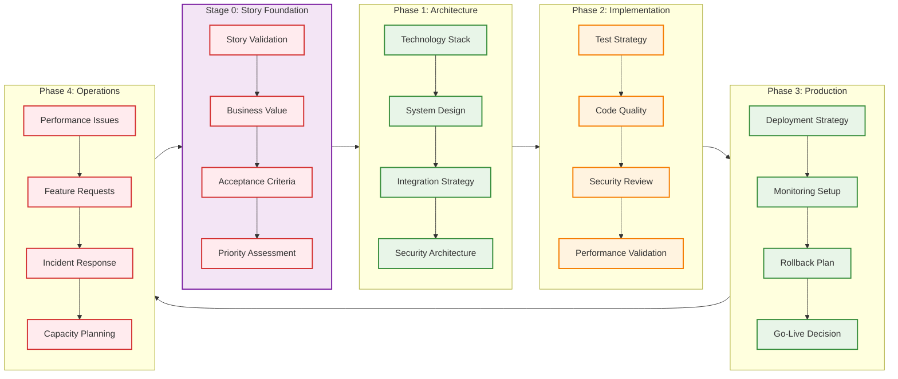

**Legend:**
- 🟣 Stage 0 - Story Foundation (User requirements and business value)
- 🔴 Human Leads (Pattern 1) - Strategic decisions requiring human judgment
- 🟢 Collaborate (Pattern 3) - Joint human-AI decision making
- 🟠 AI Leads (Pattern 2) - AI execution with human oversight checkpoints

#### 1.3.4 Phase-Specific Pattern Applications

**Phase 1: Software Engineering**
- **Pattern 1**: Architecture vision, business requirements analysis, technology strategy
- **Pattern 2**: Component specification generation, API documentation, design pattern application
- **Pattern 3**: Technology stack evaluation, architecture trade-off decisions, integration strategy

**Phase 2: Test-Driven Development**
- **Pattern 1**: Test strategy definition, acceptance criteria design, quality standards
- **Pattern 2**: Unit test generation, code implementation, refactoring automation
- **Pattern 3**: Code review processes, coverage analysis, quality gate validation

**Phase 3: DevOps & Production Readiness**
- **Pattern 1**: Infrastructure architecture, deployment strategy, security policies
- **Pattern 2**: Pipeline automation, configuration management, monitoring setup
- **Pattern 3**: Deployment approvals, security reviews, performance validation

**Phase 4: Production Operations**
- **Pattern 1**: Incident response procedures, capacity planning, operational strategy
- **Pattern 2**: Automated monitoring, alerting systems, routine maintenance
- **Pattern 3**: Performance optimization, scaling decisions, operational reviews

#### 1.3.5 User Story-Driven Development Integration

The PATH Framework integrates user story-driven development as a foundational approach that spans all four phases. This integration ensures that all technical work is grounded in user value and business outcomes:

**User Story Integration Across Phases:**
- **Phase 1**: User stories drive architectural decisions and component design
- **Phase 2**: Acceptance criteria from user stories become executable tests (ATDD/BDD)
- **Phase 3**: Deployment strategies consider user impact and business value
- **Phase 4**: Operational monitoring focuses on user experience and story success metrics

**User Story Approach:**
- **Format**: "As a [user type], I want [functionality], so that [benefit]"
- **Acceptance Criteria**: 2-5 clear criteria using Given-When-Then format
- **Traceability**: All code, tests, and infrastructure trace back to user stories
- **Validation**: Continuous validation that delivered features meet user needs

### 1.4 PATH Framework Input Requirements

The PATH Framework operates as a systematic framework that transforms specific inputs into high-quality software deliverables. Understanding these input requirements is critical for successful implementation and ensures that all stakeholders provide the necessary information for optimal outcomes.

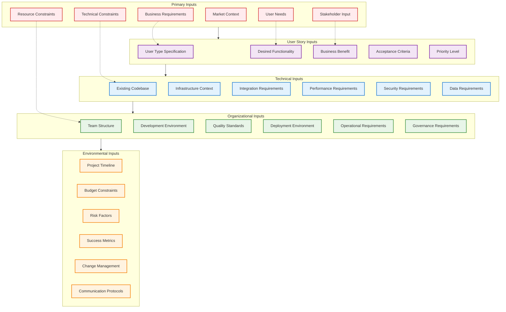

**Legend:**
- 🔴 Primary Inputs (Foundation requirements)
- 🟣 User Story Inputs (Story-driven development)
- 🔵 Technical Inputs (Architecture foundation)
- 🟢 Organizational Inputs (Team foundation)
- 🟠 Environmental Inputs (Context foundation)

#### 1.4.1 Primary Inputs (Required)

**Business Requirements**
- High-level business objectives and strategic goals
- Market positioning and competitive landscape context
- Revenue targets and business model constraints
- Regulatory and compliance requirements
- Success criteria and key performance indicators

**User Needs**
- Specific user problems to be solved
- User personas and behavioral patterns
- Current pain points and workflow inefficiencies
- Desired outcomes and value propositions
- User experience expectations and standards

**Stakeholder Input**
- Product owner vision and feature prioritization
- Business analyst requirements and process documentation
- User feedback from interviews, surveys, and usage analytics
- Executive sponsor expectations and constraints
- Customer success team insights and support patterns

**Market Context**
- Competitive feature analysis and differentiation requirements
- Industry standards and best practices
- Technology trends and adoption patterns
- Customer acquisition and retention strategies
- Market timing and launch window constraints

**Technical Constraints**
- Technology stack limitations and platform requirements
- Integration requirements with existing systems
- Performance, scalability, and reliability targets
- Security and privacy compliance standards
- Data governance and protection requirements

**Resource Constraints**
- Budget limitations and cost optimization targets
- Timeline requirements and milestone deadlines
- Team capacity and skill availability
- Infrastructure and tooling constraints
- Third-party vendor and service dependencies

#### 1.4.2 User Story Inputs (Story Foundation)

**User Type Specification**
- Specific persona or role using the system
- User context, environment, and situational factors
- Permission levels and access requirements
- Technical proficiency and tool familiarity
- Workflow integration and process dependencies

**Desired Functionality**
- Specific actions the user wants to accomplish
- Expected system behavior and response patterns
- Input requirements and data dependencies
- Output expectations and format requirements
- Error handling and edge case scenarios

**Business Benefit**
- Clear articulation of value delivered to the user
- Measurable impact on user productivity or satisfaction
- Business process improvement and efficiency gains
- Revenue generation or cost reduction potential
- Strategic alignment with organizational objectives

**Acceptance Criteria**
- Specific, testable conditions for story completion
- Given-When-Then format for behavioral validation
- Success metrics and measurement criteria
- Edge cases and error condition handling
- Performance and usability requirements

**Priority Level**
- Business importance and urgency assessment
- Dependencies on other stories or external factors
- Risk assessment and mitigation requirements
- Resource allocation and timeline considerations
- Stakeholder impact and communication needs

#### 1.4.3 Technical Inputs (Architecture Foundation)

**Existing Codebase**
- Current system architecture and component structure
- Code quality metrics and technical debt assessment
- Performance characteristics and bottleneck analysis
- Security vulnerabilities and compliance gaps
- Documentation completeness and accuracy

**Infrastructure Context**
- Available platforms, services, and deployment environments
- Scalability requirements and capacity planning
- Disaster recovery and business continuity requirements
- Monitoring and observability tool integration
- Cost optimization and resource utilization targets

**Integration Requirements**
- External systems and APIs to connect
- Data exchange formats and transformation requirements
- Authentication and authorization protocols
- Rate limiting and error handling strategies
- Service level agreements and performance contracts

**Performance Requirements**
- Response time targets and throughput expectations
- Scalability requirements and load patterns
- Availability and reliability targets (SLAs)
- Resource utilization and cost optimization goals
- User experience and performance perception standards

**Security Requirements**
- Authentication and authorization mechanisms
- Data encryption and protection standards
- Compliance requirements (GDPR, HIPAA, SOX, etc.)
- Threat modeling and vulnerability assessment
- Incident response and security monitoring procedures

**Data Requirements**
- Data sources, formats, and quality standards
- Data processing and transformation requirements
- Storage requirements and retention policies
- Backup and recovery procedures
- Data governance and access control policies

#### 1.4.4 Organizational Inputs (Team Foundation)

**Team Structure**
- Available human resources and skill inventories
- Role definitions and responsibility matrices
- Communication protocols and collaboration tools
- Decision-making authority and escalation procedures
- Training needs and professional development plans

**Development Environment**
- Development tools and IDE configurations
- Version control systems and branching strategies
- Code review processes and quality standards
- Testing frameworks and automation tools
- Documentation standards and knowledge management

**Quality Standards**
- Code quality metrics and acceptance thresholds
- Testing coverage requirements and validation procedures
- Documentation completeness and accuracy standards
- Performance benchmarks and optimization targets
- Security scanning and vulnerability management

**Deployment Environment**
- Target platforms and infrastructure requirements
- Deployment strategies and rollback procedures
- Environment promotion and configuration management
- Monitoring and alerting configurations
- Capacity planning and scaling procedures

**Operational Requirements**
- Monitoring and observability requirements
- Support procedures and escalation protocols
- Maintenance windows and update procedures
- Performance optimization and tuning requirements
- Incident response and disaster recovery plans

**Governance Requirements**
- Approval processes and sign-off procedures
- Compliance validation and audit requirements
- Risk assessment and mitigation procedures
- Change management and communication protocols
- Quality assurance and validation frameworks

#### 1.4.5 Environmental Inputs (Context Foundation)

**Project Timeline**
- Project deadlines and milestone requirements
- Critical path dependencies and scheduling constraints
- Resource availability and allocation windows
- External dependencies and coordination requirements
- Buffer time and risk mitigation allowances

**Budget Constraints**
- Financial limitations and cost optimization targets
- Resource allocation and spending approval processes
- Cost tracking and reporting requirements
- ROI expectations and value measurement criteria
- Vendor management and procurement procedures

**Risk Factors**
- Known technical risks and mitigation strategies
- Business risks and contingency planning
- Resource risks and backup procedures
- External dependencies and failure scenarios
- Regulatory and compliance risk assessment

**Success Metrics**
- Key performance indicators and measurement criteria
- Business value metrics and ROI calculations
- User satisfaction and adoption targets
- Technical performance and quality benchmarks
- Process efficiency and improvement metrics

**Change Management**
- Process for handling requirement changes
- Impact assessment and approval procedures
- Communication protocols and stakeholder notification
- Version control and change tracking systems
- Rollback procedures and contingency planning

**Communication Protocols**
- Team coordination and reporting procedures
- Stakeholder communication and update schedules
- Escalation procedures and decision-making authority
- Documentation standards and knowledge sharing
- Progress tracking and status reporting systems

#### 1.4.6 Input Validation and Quality Assurance

**Input Completeness Validation**
- Mandatory input checklist verification
- Stakeholder sign-off and approval procedures
- Gap analysis and missing information identification
- Input quality assessment and validation criteria
- Feedback loops and iterative refinement processes

**Input Quality Standards**
- Clarity and specificity requirements
- Testability and measurability criteria
- Consistency and alignment validation
- Traceability and documentation standards
- Stakeholder consensus and agreement verification

**Input Processing Framework**
- Input categorization and prioritization procedures
- Transformation from inputs to actionable requirements
- Traceability matrix creation and maintenance
- Impact analysis and dependency mapping
- Quality gate validation and approval processes

#### 1.4.7 AI-Assisted Input Automation

To expedite the input gathering phase and reduce manual effort, AI agents can automate significant portions of the input collection, analysis, and validation process. This automation accelerates project initiation while maintaining quality and completeness.

**Automated Input Collection Workflow:**

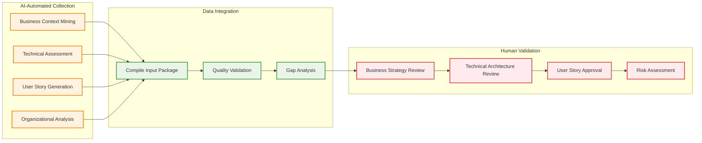

**Legend:**
- 🟠 AI-Automated Collection (Parallel processing for speed)
- 🟢 Data Integration (Quality validation and compilation)
- 🔴 Human Validation (Strategic approval checkpoints)

1. **Parallel Processing**: Execute business, technical, user story, and organizational analysis simultaneously
2. **Data Integration**: Compile collected inputs into comprehensive project requirements package
3. **Quality Validation**: Assess completeness and accuracy of automated collection results
4. **Human Review**: Present structured findings for stakeholder validation and approval

**Business Requirements Automation (80% automated):**
- **Document Mining**: Extract objectives from annual reports, strategic plans, and investor presentations
- **Market Analysis**: Analyze competitive landscape using industry reports and market intelligence
- **Financial Target Extraction**: Identify revenue goals and budget constraints from financial documents
- **Regulatory Scanning**: Detect industry-specific compliance requirements and standards

**Technical Assessment Automation (90% automated):**
- **Architecture Analysis**: Scan codebase structure, dependencies, and component relationships
- **Performance Baseline**: Measure current system performance, response times, and resource utilization
- **Security Gap Analysis**: Identify vulnerabilities, compliance gaps, and security risks
- **Integration Discovery**: Map external dependencies, APIs, and service connections

**User Story Generation Automation (70% automated):**
- **Persona Identification**: Analyze user research data to identify affected user types and roles
- **Story Template Creation**: Generate "As a... I want... So that..." format from business requirements
- **Acceptance Criteria Drafting**: Convert functional requirements into Given-When-Then format
- **Edge Case Enhancement**: Identify and include commonly missed scenarios and boundary conditions

**Input Validation Framework:**
- **Completeness Assessment**: Calculate coverage percentage across all required input categories
- **Quality Scoring**: Evaluate clarity, specificity, and actionability of collected inputs
- **Gap Identification**: Highlight missing critical information requiring human input
- **Improvement Recommendations**: Suggest specific enhancements to strengthen input quality

**Automation Benefits:**
- **90% reduction** in manual input collection time (2-3 weeks → 2-3 days)
- **95% completeness** in initial input gathering with AI assistance
- **80% accuracy** in automated analysis requiring minimal human correction
- **100% consistency** in input format and structure across all projects

**Human Validation Checkpoints:**
- **Business Strategy Validation**: Human approval of business objectives and market positioning
- **Technical Architecture Review**: Human architect validates technical constraints and integration requirements
- **User Story Approval**: Product owner validates generated user stories and acceptance criteria
- **Risk Assessment Confirmation**: Human stakeholders approve risk factors and mitigation strategies

These comprehensive input requirements ensure that the PATH Framework operates with complete information, enabling AI agents and human teams to make informed decisions and deliver optimal outcomes. The systematic collection and validation of these inputs, enhanced by AI automation, transforms the PATH Framework from a theoretical concept into a practical, implementable system for enterprise software development.

### 1.5 PATH Framework Output Specifications

The PATH Framework transforms comprehensive inputs into structured, high-quality deliverables across all four phases. Understanding these output specifications is critical for stakeholders to set proper expectations and validate successful framework implementation.

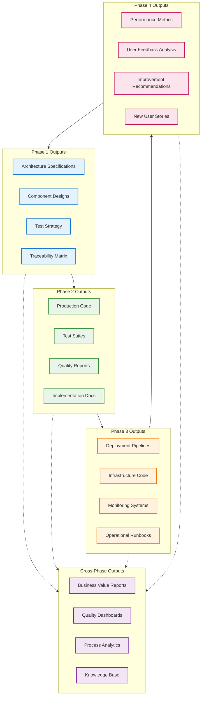

**Legend:**
- 🔵 Phase 1 Outputs (Architecture and design deliverables)
- 🟢 Phase 2 Outputs (Implementation and testing deliverables)
- 🟠 Phase 3 Outputs (Deployment and infrastructure deliverables)
- 🔴 Phase 4 Outputs (Operations and improvement deliverables)
- 🟣 Cross-Phase Outputs (Continuous deliverables spanning all phases)

#### 1.5.1 Phase 1 Outputs: Software Engineering Deliverables

**Architecture Specifications**
- **System Architecture Document**: High-level system design with component relationships
- **Component Architecture**: Detailed component specifications with interfaces and dependencies
- **Integration Architecture**: External system integration patterns and protocols
- **Security Architecture**: Security design patterns, authentication, and authorization frameworks
- **Data Architecture**: Data models, storage strategies, and data flow specifications

**Component Designs**
- **Interface Definitions**: API specifications, data contracts, and communication protocols
- **Component Specifications**: Detailed functional and non-functional requirements per component
- **Dependency Maps**: Component dependency graphs and interaction patterns
- **Reusability Analysis**: Identification of reusable components and shared libraries
- **Technology Stack Decisions**: Justified technology choices with trade-off analysis

**Test Strategy**
- **Test Architecture**: Testing framework design and tool selection rationale
- **Test Automation Strategy**: Automated testing approach across all test levels
- **Acceptance Test Framework**: BDD/ATDD implementation strategy and tooling
- **Performance Test Strategy**: Load testing approach and performance validation criteria
- **Security Test Strategy**: Security testing approach and vulnerability assessment procedures

**Traceability Matrix**
- **Story-Component Mapping**: Complete mapping between user stories and system components
- **Requirements Traceability**: Links between business requirements and technical implementation
- **Test Coverage Matrix**: Mapping between requirements, components, and test cases
- **Change Impact Analysis**: Documentation of how changes affect related components
- **Compliance Mapping**: Traceability to regulatory and compliance requirements

#### 1.5.2 Phase 2 Outputs: Test-Driven Development Deliverables

**Production Code**
- **Functional Implementation**: Working code that satisfies all user story acceptance criteria
- **Clean Code Standards**: Code following established quality and maintainability standards
- **Design Pattern Implementation**: Appropriate design patterns applied for maintainability
- **Performance Optimized Code**: Code optimized for performance requirements
- **Security Hardened Code**: Implementation following security best practices

**Test Suites**
- **Acceptance Test Suite**: Executable BDD/ATDD tests validating user story acceptance criteria
- **Unit Test Suite**: Comprehensive unit tests with >90% code coverage
- **Integration Test Suite**: Component integration tests validating interface contracts
- **End-to-End Test Suite**: Complete workflow validation tests
- **Performance Test Suite**: Load and performance validation tests

**Quality Reports**
- **Test Coverage Report**: Detailed coverage analysis across all test levels
- **Code Quality Metrics**: Maintainability index, cyclomatic complexity, and code smells
- **Mutation Testing Report**: Mutation score validation ensuring meaningful tests
- **Security Scan Results**: Static and dynamic security analysis results
- **Performance Benchmark Report**: Performance metrics and optimization recommendations

**Implementation Documentation**
- **API Documentation**: Complete API specifications with examples and usage patterns
- **Code Documentation**: Inline documentation and architectural decision records
- **Deployment Guide**: Step-by-step deployment instructions and configuration
- **Troubleshooting Guide**: Common issues and resolution procedures
- **Developer Onboarding Guide**: Documentation for new team members

#### 1.5.3 Phase 3 Outputs: DevOps & Production Readiness Deliverables

**Deployment Pipelines**
- **CI/CD Pipeline Configuration**: Complete automated build, test, and deployment pipelines
- **Quality Gate Implementation**: Automated quality checks and approval workflows
- **Environment Promotion Strategy**: Automated promotion between development, staging, and production
- **Rollback Procedures**: Automated rollback capabilities and emergency procedures
- **Blue-Green Deployment Setup**: Zero-downtime deployment infrastructure and procedures

**Infrastructure Code**
- **Infrastructure as Code (IaC)**: Complete infrastructure definitions using Terraform, CloudFormation, or similar
- **Container Orchestration**: Kubernetes manifests or Docker Compose configurations
- **Network Configuration**: VPC, security groups, and network topology definitions
- **Database Setup**: Database schemas, migration scripts, and backup procedures
- **Scaling Configuration**: Auto-scaling policies and resource optimization settings

**Monitoring Systems**
- **Application Monitoring**: APM setup with performance and error tracking
- **Infrastructure Monitoring**: System resource monitoring and alerting
- **Business Metrics Monitoring**: User story success metrics and business KPI tracking
- **Log Aggregation**: Centralized logging with search and analysis capabilities
- **Alerting Configuration**: Intelligent alerting rules with escalation procedures

**Operational Runbooks**
- **Incident Response Procedures**: Step-by-step incident handling and escalation procedures
- **Maintenance Procedures**: Routine maintenance tasks and scheduling
- **Disaster Recovery Plan**: Complete disaster recovery and business continuity procedures
- **Capacity Planning Guide**: Resource planning and scaling decision frameworks
- **Security Operations Guide**: Security monitoring and incident response procedures

#### 1.5.4 Phase 4 Outputs: Production Operations Deliverables

**Performance Metrics**
- **User Story Success Metrics**: Measurement of delivered business value per story
- **System Performance Metrics**: Response times, throughput, and availability measurements
- **User Experience Metrics**: User satisfaction scores and usage pattern analysis
- **Business Impact Metrics**: Revenue impact, cost savings, and ROI measurements
- **Quality Metrics**: Defect rates, incident frequency, and resolution times

**User Feedback Analysis**
- **User Satisfaction Reports**: Comprehensive user feedback analysis and trends
- **Feature Usage Analytics**: Detailed analysis of feature adoption and usage patterns
- **User Journey Analysis**: Complete user workflow analysis and optimization opportunities
- **Support Ticket Analysis**: Common issues and user pain point identification
- **A/B Testing Results**: Feature variation testing results and recommendations

**Improvement Recommendations**
- **Performance Optimization Recommendations**: Specific improvements for system performance
- **User Experience Improvements**: UX enhancement recommendations based on user feedback
- **Technical Debt Reduction Plan**: Prioritized technical debt remediation roadmap
- **Process Improvement Suggestions**: Development process optimization recommendations
- **Cost Optimization Opportunities**: Infrastructure and operational cost reduction suggestions

**New User Stories**
- **Enhancement Stories**: User stories for feature improvements based on operational insights
- **Bug Fix Stories**: User stories for defect resolution prioritized by business impact
- **Performance Stories**: User stories for performance improvements and optimizations
- **Security Stories**: User stories for security enhancements and vulnerability remediation
- **Technical Debt Stories**: User stories for technical debt reduction and code quality improvement

#### 1.5.5 Cross-Phase Outputs: Continuous Deliverables

**Business Value Reports**
- **ROI Analysis**: Detailed return on investment analysis for implemented features
- **Value Delivery Metrics**: Measurement of business value delivered per development cycle
- **Cost-Benefit Analysis**: Comprehensive cost analysis versus delivered benefits
- **Market Impact Assessment**: Analysis of competitive advantage and market positioning
- **Customer Satisfaction Impact**: Correlation between delivered features and customer satisfaction

**Quality Dashboards**
- **Real-Time Quality Metrics**: Live dashboard showing current quality status across all phases
- **Trend Analysis**: Historical quality trends and improvement trajectories
- **Predictive Quality Insights**: AI-driven predictions of quality risks and opportunities
- **Comparative Analysis**: Quality benchmarking against industry standards and best practices
- **Quality Gate Status**: Current status of all quality gates across active projects

**Process Analytics**
- **Development Velocity Metrics**: Team velocity trends and productivity analysis
- **Cycle Time Analysis**: Time spent in each phase and bottleneck identification
- **Human-AI Collaboration Metrics**: Effectiveness of human-AI collaboration patterns
- **Process Efficiency Analysis**: Identification of process improvements and optimization opportunities
- **Team Performance Analytics**: Individual and team performance metrics and improvement recommendations

**Knowledge Base**
- **Pattern Library**: Repository of successful implementation patterns and best practices
- **Lessons Learned Database**: Comprehensive collection of project insights and learnings
- **Decision Archive**: Historical record of architectural and technical decisions with rationale
- **Best Practices Repository**: Curated collection of proven practices and methodologies
- **Training Materials**: Comprehensive training resources for PATH Framework implementation

#### 1.5.6 Output Quality Standards

**Completeness Criteria**
- All outputs must trace back to specific input requirements
- Every user story must have corresponding deliverables in each relevant phase
- All quality gates must have associated validation artifacts
- Complete documentation must accompany all technical deliverables

**Quality Validation Standards**
- **Technical Accuracy**: All technical outputs validated by human experts
- **Business Alignment**: All outputs validated against business requirements and user stories
- **Compliance Verification**: All outputs verified against regulatory and organizational standards
- **Usability Testing**: All user-facing outputs tested for usability and accessibility

**Delivery Standards**
- **Timeliness**: All outputs delivered according to agreed timelines and milestones
- **Format Consistency**: All outputs follow established templates and formatting standards
- **Version Control**: All outputs properly versioned and maintained in version control systems
- **Accessibility**: All outputs accessible to relevant stakeholders with appropriate permissions

#### 1.5.7 Output Validation Framework

**Automated Validation**
- **Completeness Checks**: Automated verification that all required outputs are present
- **Quality Metrics Validation**: Automated checking of quality thresholds and standards
- **Traceability Verification**: Automated validation of traceability links between inputs and outputs
- **Format Compliance**: Automated checking of output format and structure standards

**Human Validation**
- **Business Value Validation**: Human verification that outputs deliver expected business value
- **Technical Review**: Expert technical review of all technical deliverables
- **User Acceptance**: User validation of delivered functionality and documentation
- **Stakeholder Approval**: Formal stakeholder approval of phase deliverables

**Continuous Improvement**
- **Output Quality Feedback**: Regular feedback collection on output quality and usefulness
- **Template Refinement**: Continuous improvement of output templates and standards
- **Process Optimization**: Regular optimization of output generation and validation processes
- **Stakeholder Satisfaction**: Regular measurement of stakeholder satisfaction with delivered outputs

These comprehensive output specifications ensure that the PATH Framework delivers consistent, high-quality results that meet stakeholder expectations and business requirements. The systematic approach to output definition, validation, and continuous improvement transforms the PATH Framework into a predictable, reliable system for enterprise software development.

### 1.6 Requirements Engineering Integration

The PATH Framework integrates comprehensive requirements engineering practices to ensure systematic handling of both functional and non-functional requirements throughout all four phases. This integration provides complete traceability from business needs to production implementation.

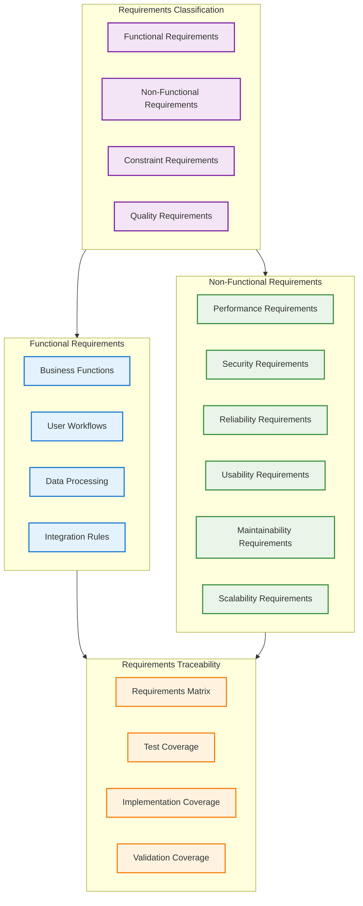

**Legend:**
- 🟣 Requirements Classification (Primary requirement categories)
- 🔵 Functional Requirements (Business logic and user workflows)
- 🟢 Non-Functional Requirements (Quality attributes and constraints)
- 🟠 Requirements Traceability (Coverage and validation tracking)

#### 1.6.1 Functional Requirements Framework

**Business Functions**
- **Core Business Logic**: Primary business rules and calculations
- **Business Process Workflows**: Step-by-step business process automation
- **Decision Logic**: Business decision trees and rule engines
- **Data Validation Rules**: Business-specific data validation and constraints
- **Compliance Logic**: Regulatory and policy enforcement rules

**User Workflows**
- **User Journey Mapping**: Complete user interaction flows
- **Use Case Specifications**: Detailed use case scenarios with actors and outcomes
- **User Interface Requirements**: Screen flows, navigation, and interaction patterns
- **User Experience Requirements**: Accessibility, responsiveness, and usability standards
- **Role-Based Functionality**: Permission-based feature access and workflows

**Data Processing Requirements**
- **Data Input Requirements**: Data sources, formats, and validation rules
- **Data Transformation Logic**: Business rules for data processing and conversion
- **Data Output Requirements**: Report formats, export capabilities, and data delivery
- **Data Storage Requirements**: Persistence, archival, and retention policies
- **Data Quality Requirements**: Accuracy, completeness, and consistency standards

**Integration Requirements**
- **API Specifications**: External system integration requirements and protocols
- **Data Exchange Formats**: Message formats, schemas, and transformation rules
- **Service Integration**: Third-party service integration and dependency management
- **Event Processing**: Event-driven architecture and messaging requirements
- **Synchronization Requirements**: Data consistency and synchronization across systems

#### 1.6.2 Non-Functional Requirements Framework

**Performance Requirements**
- **Response Time Targets**: Maximum acceptable response times for different operations
- **Throughput Requirements**: Transaction volume and processing capacity targets
- **Scalability Targets**: User load, data volume, and system growth requirements
- **Resource Utilization**: CPU, memory, storage, and network usage constraints
- **Performance Benchmarks**: Baseline performance metrics and improvement targets

**Security Requirements**
- **Authentication Requirements**: User identity verification and multi-factor authentication
- **Authorization Requirements**: Role-based access control and permission management
- **Data Protection**: Encryption, data masking, and privacy protection requirements
- **Audit Requirements**: Security logging, monitoring, and compliance tracking
- **Vulnerability Management**: Security scanning, penetration testing, and remediation

**Reliability Requirements**
- **Availability Targets**: Uptime requirements and acceptable downtime windows
- **Fault Tolerance**: System resilience and failure recovery capabilities
- **Disaster Recovery**: Backup, recovery, and business continuity requirements
- **Error Handling**: Exception management and graceful degradation requirements
- **Monitoring Requirements**: System health monitoring and alerting specifications

**Usability Requirements**
- **User Experience Standards**: Interface design principles and usability guidelines
- **Accessibility Requirements**: WCAG compliance and assistive technology support
- **Internationalization**: Multi-language and localization requirements
- **Mobile Responsiveness**: Cross-device compatibility and responsive design
- **User Training**: Documentation, help systems, and training requirements

**Maintainability Requirements**
- **Code Quality Standards**: Coding standards, documentation, and review requirements
- **Modularity Requirements**: Component design and separation of concerns
- **Testing Requirements**: Unit testing, integration testing, and coverage standards
- **Documentation Standards**: Technical documentation and knowledge management
- **Change Management**: Version control, deployment, and configuration management

**Scalability Requirements**
- **Horizontal Scaling**: Multi-instance deployment and load distribution
- **Vertical Scaling**: Resource scaling and capacity planning requirements
- **Database Scaling**: Data partitioning, sharding, and replication strategies
- **Caching Requirements**: Performance optimization through caching strategies
- **Load Balancing**: Traffic distribution and failover requirements

#### 1.6.3 Requirements Traceability Matrix

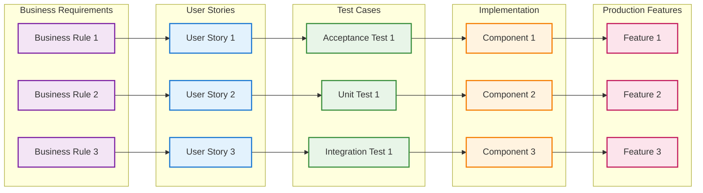

**Legend:**
- 🟣 Business Requirements (Original business needs)
- 🔵 User Stories (Functional specifications)
- 🟢 Test Cases (Validation specifications)
- 🟠 Implementation (Code components)
- 🔴 Production Features (Delivered functionality)

#### 1.6.4 Phase-Specific Requirements Handling

**Stage 0: Requirements Elicitation and Analysis**
- **Requirements Gathering**: Systematic collection of functional and non-functional requirements
- **Requirements Classification**: Categorization into functional, non-functional, and constraint requirements
- **Requirements Prioritization**: Business value-based prioritization using MoSCoW or similar methods
- **Requirements Validation**: Stakeholder review and approval of requirements specifications
- **Traceability Setup**: Initial traceability matrix creation linking requirements to user stories

**Phase 1: Architecture Requirements Integration**
- **Functional Architecture**: System design to support all functional requirements
- **Non-Functional Architecture**: Architecture patterns for performance, security, and scalability
- **Requirements Allocation**: Assignment of requirements to specific system components
- **Architecture Validation**: Verification that architecture supports all requirements
- **Design Constraints**: Integration of constraint requirements into architectural decisions

**Phase 2: Implementation Requirements Validation**
- **Functional Testing**: Unit and integration tests validating functional requirements
- **Non-Functional Testing**: Performance, security, and usability testing
- **Requirements Coverage**: Verification that all requirements have corresponding tests
- **Test Traceability**: Linking test cases back to specific requirements
- **Implementation Validation**: Code review ensuring requirements compliance

**Phase 3: Deployment Requirements Verification**
- **Production Readiness**: Verification that all non-functional requirements are met
- **Performance Validation**: Load testing and performance benchmark verification
- **Security Validation**: Security testing and vulnerability assessment
- **Operational Requirements**: Monitoring and alerting setup for non-functional requirements
- **Compliance Verification**: Regulatory and policy compliance validation

**Phase 4: Operations Requirements Monitoring**
- **Performance Monitoring**: Continuous monitoring of performance requirements
- **Security Monitoring**: Ongoing security compliance and threat detection
- **Availability Monitoring**: Uptime and reliability requirements tracking
- **User Satisfaction**: Usability and user experience requirements validation
- **Requirements Evolution**: Identification of new requirements based on operational insights

#### 1.6.5 AI-Enhanced Requirements Engineering

**Automated Requirements Analysis**
- **Requirements Extraction**: AI-powered extraction of requirements from business documents
- **Requirements Classification**: Automatic categorization of functional vs non-functional requirements
- **Completeness Analysis**: AI identification of missing or incomplete requirements
- **Consistency Checking**: Automated detection of conflicting or contradictory requirements
- **Requirements Refinement**: AI suggestions for improving requirement clarity and testability

**Intelligent Requirements Traceability**
- **Automated Traceability**: AI-powered linking of requirements to user stories, tests, and code
- **Impact Analysis**: Automated assessment of requirement changes on system components
- **Coverage Analysis**: AI identification of untested or unimplemented requirements
- **Traceability Validation**: Automated verification of traceability matrix completeness
- **Requirements Metrics**: AI-generated metrics on requirements coverage and quality

**Requirements Quality Assurance**
- **Requirements Validation**: AI-powered validation of requirement quality and completeness
- **Testability Analysis**: AI assessment of requirement testability and measurability
- **Ambiguity Detection**: Automated identification of vague or ambiguous requirements
- **Requirements Optimization**: AI suggestions for requirement consolidation and simplification
- **Stakeholder Alignment**: AI analysis of requirement alignment with business objectives

#### 1.6.6 Requirements Validation Framework

**Functional Requirements Validation**
- **Business Logic Testing**: Validation that implemented logic matches business requirements
- **Workflow Testing**: End-to-end testing of complete business workflows
- **Data Processing Validation**: Testing of data transformation and processing logic
- **Integration Testing**: Validation of system integration requirements
- **User Acceptance Testing**: Business user validation of functional requirements

**Non-Functional Requirements Validation**
- **Performance Testing**: Load testing and performance benchmark validation
- **Security Testing**: Penetration testing and security requirement verification
- **Usability Testing**: User experience and accessibility requirement validation
- **Reliability Testing**: Fault tolerance and disaster recovery testing
- **Scalability Testing**: System scaling and capacity requirement validation

**Continuous Requirements Validation**
- **Production Monitoring**: Ongoing validation of requirements in production environment
- **User Feedback Integration**: Incorporation of user feedback into requirements evolution
- **Performance Metrics**: Continuous monitoring of non-functional requirement compliance
- **Business Value Measurement**: Validation that delivered features meet business requirements
- **Requirements Evolution**: Systematic evolution of requirements based on operational insights

#### 1.6.7 Requirements Documentation Standards

**Requirements Specification Format**
- **Requirement ID**: Unique identifier for traceability
- **Requirement Type**: Functional, non-functional, or constraint classification
- **Priority**: Business priority using MoSCoW or similar method
- **Description**: Clear, unambiguous requirement statement
- **Acceptance Criteria**: Specific, testable validation criteria
- **Dependencies**: Related requirements and external dependencies
- **Rationale**: Business justification and context

**Traceability Documentation**
- **Requirements Traceability Matrix**: Complete mapping between all requirement levels
- **Test Coverage Matrix**: Mapping between requirements and test cases
- **Implementation Coverage**: Mapping between requirements and code components
- **Validation Coverage**: Mapping between requirements and validation activities
- **Change Impact Documentation**: Record of requirement changes and their impacts

This comprehensive requirements engineering integration ensures that the PATH Framework systematically handles both functional and non-functional requirements throughout the entire software development lifecycle, providing complete traceability from business needs to production implementation.

## 2. Agentic Coding Playbook Integration

### 2.1 Overview

The Agentic Coding Playbook provides a step-by-step methodology for implementing human-AI collaboration in software development. This playbook integrates user story-driven development with systematic testing approaches, creating a comprehensive framework that spans all four phases of the PATH Framework.

### 2.2 Complete User Story Lifecycle Integration

#### 2.2.1 High-Level Lifecycle Overview

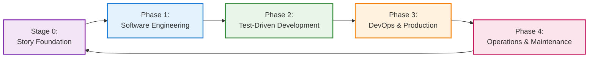

**Legend:**
- 🟣 Stage 0 - Story Foundation (User requirements and business value)
- 🔵 Phase 1 - Software Engineering (Architecture and design)
- 🟢 Phase 2 - Test-Driven Development (Implementation and testing)
- 🟠 Phase 3 - DevOps & Production (Deployment and infrastructure)
- 🔴 Phase 4 - Operations & Maintenance (Monitoring and evolution)

#### 2.2.2 Stage 0: Story Foundation Detail

**Purpose**: Establish clear user requirements and business value before technical work begins.  
**Key Activities**: Product owners create user stories, define acceptance criteria, and AI agents refine requirements with edge cases.  
**Output**: Validated user stories ready for architectural analysis.

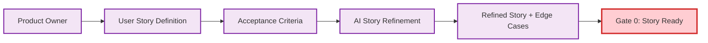

#### 2.2.3 Phase 1: Software Engineering Detail

**Purpose**: Transform user stories into system architecture and component design.  
**Key Activities**: Domain analysis, system architecture design, component specification, and test strategy planning.  
**Output**: Complete architecture specifications with story traceability and test framework design.

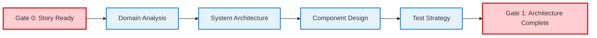

#### 2.2.4 Phase 2: Test-Driven Development Detail

**Purpose**: Implement user stories through systematic ATDD/TDD cycles ensuring quality and correctness.  
**Key Activities**: Acceptance test creation, TDD implementation cycles, story implementation, and comprehensive validation.  
**Output**: Production-ready code with >90% test coverage and validated acceptance criteria.

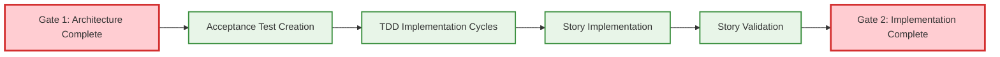

#### 2.2.5 Phase 3: DevOps & Production Detail

**Purpose**: Deploy implemented stories to production with automated pipelines and monitoring.  
**Key Activities**: CI/CD pipeline setup, deployment automation, monitoring configuration, and production release.  
**Output**: Live production system with automated deployment, monitoring, and operational procedures.

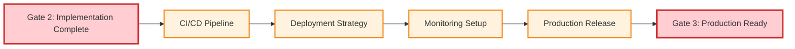

#### 2.2.6 Phase 4: Operations & Maintenance Detail

**Purpose**: Monitor story performance in production and generate insights for continuous improvement.  
**Key Activities**: Production operations, performance monitoring, user feedback collection, and story evolution analysis.  
**Output**: Operational insights, improvement opportunities, and new user stories for the next cycle.

```mermaid
flowchart LR
    Gate3[Gate 3: Production Ready] --> Operations[Production Operations]
    Operations --> Metrics[Story Performance Metrics]
    Metrics --> Feedback[User Feedback]
    Feedback --> Evolution[Story Evolution]
    Evolution --> NewStories[New User Stories]
    NewStories --> Gate4[Gate 4: Operations Validated]
    
    classDef phase4 fill:#fce4ec,stroke:#c2185b,stroke-width:2px
    classDef gate fill:#ffcdd2,stroke:#d32f2f,stroke-width:3px
    
    class Operations,Metrics,Feedback,Evolution,NewStories phase4
    class Gate3,Gate4 gate
```

### 2.3 Stage 1 -- Define the Work (Pre-Phase 1)

#### 2.3.1 Product Owner / Analyst Responsibilities

**Primary Tasks:**
- Write user stories in *As a… I want… So that…* format
- Add 2–5 clear acceptance criteria using Given–When–Then format
- Ensure business value is clearly articulated
- Validate user needs and market requirements

**User Story Template:**
```
As a [specific user type]
I want [specific functionality]
So that [clear business benefit]

Acceptance Criteria:
1. Given [initial context], When [action occurs], Then [expected outcome]
2. Given [edge case context], When [action occurs], Then [expected outcome]
3. Given [error condition], When [action occurs], Then [expected outcome]
```

#### 2.3.2 AI Agent Support

**AI Agent Contributions:**
- Suggest refinements to simplify vague language and improve testability
- Propose edge cases often missed by human analysis
- Validate story completeness against similar historical implementations
- Generate additional acceptance criteria based on technical constraints

**AI Analysis Framework:**
- **Clarity Assessment**: Evaluate story language for ambiguity
- **Testability Validation**: Ensure all criteria can be automated
- **Edge Case Generation**: Identify boundary conditions and error scenarios
- **Technical Feasibility**: Assess implementation complexity and constraints

### 2.4 Stage 2 -- From Story to Acceptance Tests (Phase 1-2 Integration)

#### 2.4.1 Developer + Tester Collaboration

**Primary Tasks:**
- Convert acceptance criteria into executable tests (Cucumber, Behave, Playwright)
- Ensure coverage of both happy path and edge cases
- Create test automation framework for continuous validation
- Establish traceability between tests and user stories

**ATDD Implementation Pattern:**
```gherkin
Feature: User Authentication
  As a registered user
  I want to log into the system
  So that I can access my personal dashboard

  Scenario: Successful login with valid credentials
    Given I am on the login page
    When I enter valid username and password
    Then I should be redirected to my dashboard
    And I should see a welcome message

  Scenario: Failed login with invalid credentials
    Given I am on the login page
    When I enter invalid username or password
    Then I should see an error message
    And I should remain on the login page
```

#### 2.4.2 AI Agent Automation

**AI Agent Contributions:**
- Scaffold test stubs in chosen framework (Cucumber, Pytest, Jest)
- Map acceptance tests back to user story IDs for traceability
- Generate test data and mock objects for complex scenarios
- Suggest additional test scenarios based on code analysis

**Automated Test Generation:**
- **Framework Integration**: Generate tests in project's testing framework
- **Data Generation**: Create realistic test data and edge cases
- **Mock Creation**: Generate mocks for external dependencies
- **Traceability Matrix**: Maintain links between stories, tests, and code

### 2.5 Stage 3 -- Break Down into Unit Tests (Phase 2 TDD Loop)

#### 2.5.1 Developer-Led TDD Implementation

**Primary Tasks:**
- Identify core behaviors implied by acceptance tests
- Write failing unit tests first (Red phase)
- Implement minimal code to pass tests (Green phase)
- Refactor for quality and maintainability (Refactor phase)

**TDD Cycle Implementation:**
**TDD Cycle Workflow:**
1. **RED Phase**: Write failing test that defines expected behavior for password validation
2. **GREEN Phase**: Implement minimal code to pass the test (initially hardcoded response)
3. **REFACTOR Phase**: Improve implementation with proper dependencies and business logic while maintaining test success

#### 2.5.2 AI Agent Test Enhancement with Meaningful Test Generation

**AI Agent Contributions:**
- Generate specification-driven tests with diverse scenarios including boundary conditions
- Create draft test code with behavioral assertions, not just return value checks
- Identify missing test coverage areas through mutation testing validation
- Propose refactoring opportunities during the refactor phase
- Validate test meaningfulness through automated quality checks

**Meaningful AI Test Generation Framework:**

**1. Specification-Driven Generation:**
- Define functional specifications with inputs, outputs, edge cases, and invariants
- Document behavioral contracts, side effects, and state changes
- Generate tests that enforce behavior, not just syntax

**2. AI Prompt Engineering:**
- Instruct AI to generate diverse test scenarios including boundary and error conditions
- Specify expected behavioral assertions beyond simple return value validation
- Request comprehensive edge case coverage and invariant testing

**3. Validation Techniques:**
- **Mutation Testing**: Introduce code mutations to verify tests fail for incorrect implementations
- **Coverage Analysis**: Ensure all code paths, branches, and conditions are exercised
- **Property-Based Testing**: Complement AI tests with automatic property exploration
- **Assertion Richness**: Measure meaningful assertions per test, not just test count

**4. Human-in-the-Loop Validation:**
- Developer review of AI-generated tests for specification alignment
- Validation of edge case adequacy and behavioral correctness
- Feedback loop to refine AI prompts and regenerate improved tests

**AI Test Generation Quality Metrics:**
- **Mutation Score**: Percentage of mutations detected by AI-generated tests
- **Behavioral Coverage**: Tests validate behavior, not just code execution
- **Edge Case Completeness**: Comprehensive boundary condition testing
- **Specification Alignment**: Tests accurately reflect functional requirements

### 2.6 Stage 4 -- Implement Minimal Code (Phase 2 Implementation)

#### 2.6.1 Developer Implementation

**Primary Tasks:**
- Write just enough code to pass the unit test (Green phase)
- Focus on functionality over optimization initially
- Refactor for clarity and maintainability
- Maintain test success throughout refactoring

**Implementation Principles:**
- **Minimal Viable Implementation**: Start with simplest solution
- **Test-Driven Design**: Let tests guide the implementation structure
- **Incremental Improvement**: Refactor in small, safe steps
- **Quality Focus**: Prioritize readability and maintainability

#### 2.6.2 AI Agent Code Assistance

**AI Agent Contributions:**
- Offer scaffolding and alternative implementations
- Highlight possible violations of coding standards
- Identify performance issues and optimization opportunities
- Suggest design patterns appropriate for the implementation

**AI Code Analysis:**
- **Pattern Recognition**: Suggest appropriate design patterns
- **Code Quality**: Identify code smells and improvement opportunities
- **Performance Analysis**: Highlight potential bottlenecks
- **Security Review**: Identify security vulnerabilities

### 2.7 Stage 5 -- Validate at Both Levels (Phase 2-3 Integration)

#### 2.7.1 Pipeline / CI Integration

**Primary Tasks:**
- Run unit tests and acceptance tests together in CI pipeline
- Block merge if any acceptance criterion fails
- Maintain test coverage thresholds (>90%)
- Generate test reports and coverage metrics

**CI/CD Pipeline Configuration:**
**CI/CD Pipeline Configuration:**
- **Unit Tests**: Run with coverage reporting (>90% threshold)
- **Integration Tests**: Validate component interactions
- **Acceptance Tests**: Execute BDD scenarios
- **Coverage Validation**: Block merge if coverage below threshold
- **Failure Blocking**: Prevent deployment on any test failure

#### 2.7.2 AI Agent Quality Assurance with Meaningful Test Validation

**AI Agent Contributions:**
- Detect missing links between stories, specifications, and meaningful tests
- Identify trivial tests that pass without enforcing behavior
- Suggest regression tests with mutation testing validation
- Analyze test meaningfulness through behavioral coverage metrics
- Validate test suite robustness against code mutations

**Meaningful Test Quality Validation Framework:**
- **Specification Traceability**: Ensure all stories have corresponding behavioral tests
- **Mutation Score Analysis**: Validate tests detect implementation errors (>80% mutation score)
- **Behavioral Coverage**: Identify untested behavioral specifications, not just code paths
- **Test Meaningfulness**: Analyze assertion richness and behavioral validation depth
- **Regression Robustness**: Ensure new tests maintain mutation testing standards

**Quality Metrics Dashboard:**
```yaml
Test Quality Metrics:
  mutation_score: >80%           # Tests detect implementation errors
  behavioral_coverage: >90%      # Functional specifications tested
  assertion_richness: >3/test    # Meaningful assertions per test
  specification_alignment: 100%   # Tests trace to requirements
  trivial_test_detection: <5%    # Percentage of placeholder tests
```

**Automated Quality Gates:**
- **Mutation Testing Gate**: Block deployment if mutation score <80%
- **Behavioral Coverage Gate**: Require >90% specification coverage
- **Test Meaningfulness Gate**: Validate assertion quality and depth
- **Regression Protection**: Ensure new code maintains test quality standards

### 2.8 Stage 6 -- Continuous Evolution (Phase 4 Operations)

#### 2.8.1 Team Retrospectives

**Primary Tasks:**
- Review story delivery effectiveness and business value
- Adjust tests when requirements shift or evolve
- Conduct retrospectives to refine the development process
- Measure and improve team velocity and quality metrics

**Continuous Improvement Process:**
- **Value Assessment**: Measure delivered business value
- **Process Refinement**: Identify and address process bottlenecks
- **Quality Metrics**: Track defect rates, coverage, and performance
- **Team Learning**: Share knowledge and improve practices

#### 2.8.2 AI Agent Process Analysis

**AI Agent Contributions:**
- Analyze commit/test history to identify TDD discipline gaps
- Spot flaky or redundant tests for cleanup
- Suggest process improvements based on historical data
- Identify patterns in successful feature delivery

**Process Analytics:**
- **TDD Compliance**: Monitor red-green-refactor cycle adherence
- **Test Quality**: Identify flaky, slow, or redundant tests
- **Delivery Patterns**: Analyze successful feature delivery patterns
- **Risk Assessment**: Identify high-risk areas needing attention

### 2.9 ATDD/TDD Integration Model

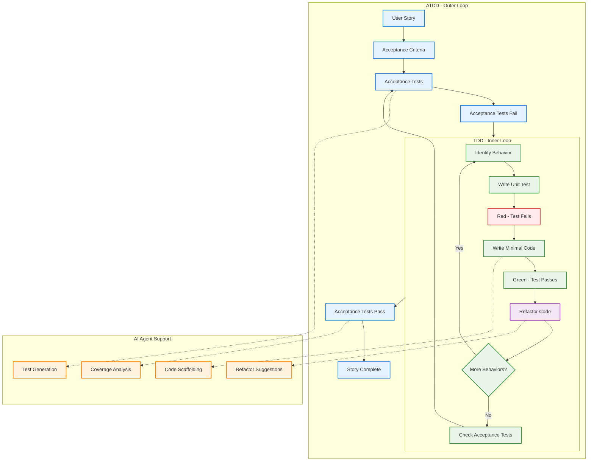

**Legend:**
- 🔵 ATDD Outer Loop (Business-level acceptance testing)
- 🟢 TDD Inner Loop & Green Phase (Technical unit testing & passing tests)
- 🔴 Red Phase (Failing tests - write test first)
- 🟣 Refactor Phase (Code improvement without changing behavior)
- 🟠 AI Agent Support (Automated assistance and analysis)

### 2.10 Overall Cycle Integration

The Agentic Coding Playbook implements nested loops for comprehensive quality assurance:

**Outer Loop: Story → Acceptance Test (ATDD/BDD)**
- User story drives acceptance criteria definition
- Acceptance criteria become executable acceptance tests
- Tests validate business value delivery
- Feedback loop ensures user needs are met

**Inner Loop: Unit Test → Code → Refactor (TDD)**
- Unit tests drive implementation design
- Minimal code implementation passes tests
- Refactoring improves code quality
- Continuous validation maintains functionality

**AI Layer: Acceleration, Consistency, and Guardrails**
- AI agents accelerate routine tasks
- Consistency checks prevent common errors
- Guardrails ensure quality and security standards
- Continuous learning improves AI effectiveness

### 2.11 Meaningful AI Test Generation Integration

#### 2.11.1 Specification-to-Test Workflow

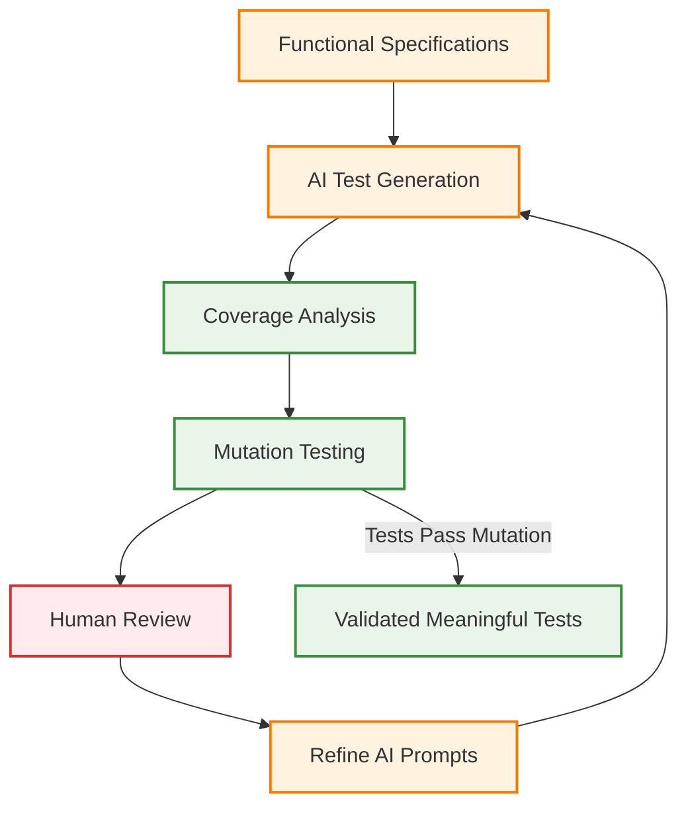

**Legend:**
- 🟠 AI Process (Specification analysis and test generation)
- 🟢 Validation (Coverage and mutation testing)
- 🔴 Human Review (Quality validation and feedback)

#### 2.11.2 Test Quality Validation Process

**Meaningful Test Criteria:**
1. **Behavioral Assertions**: Tests validate behavior, not just return values
2. **Mutation Resistance**: Tests fail when implementation is incorrect
3. **Specification Alignment**: Tests directly trace to functional requirements
4. **Edge Case Coverage**: Comprehensive boundary condition testing
5. **Invariant Validation**: All documented invariants automatically verified

**Example: Meaningful vs Trivial Test Generation**
**Meaningful vs Trivial Test Generation:**
- **Trivial Test Characteristics**: Only tests happy path with hardcoded expected values
- **Meaningful Test Characteristics**: Tests comprehensive behavioral specifications including:
  - **Boundary Validation**: Invalid discount rates trigger appropriate error responses
  - **Edge Case Coverage**: Zero discount returns original price unchanged
  - **Precision Requirements**: Rounding behavior meets documented specifications
  - **Invariant Testing**: Result always maintains business rule constraints (e.g., result ≤ original price)

### 2.12 Agentic Coding Flow Diagram

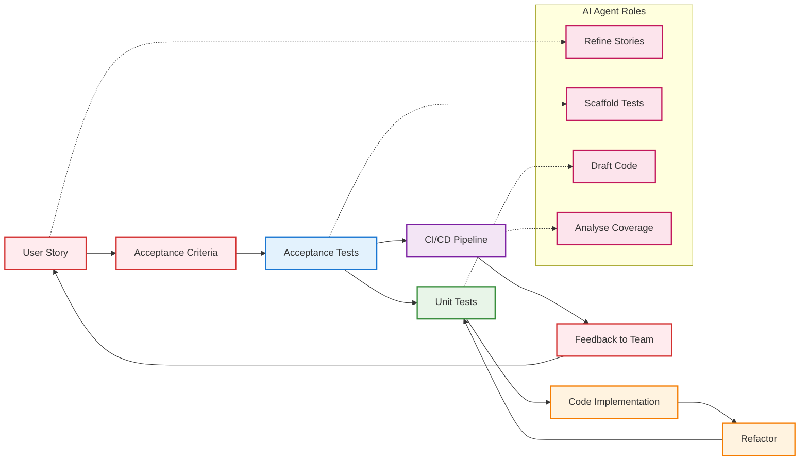

**Legend:**
- 🔴 User Story Flow (Business requirements and feedback)
- 🔵 Acceptance Testing (Business-level validation)
- 🟢 Unit Testing (Technical-level validation)
- 🟠 Implementation (Code development and refactoring)
- 🟣 CI/CD Pipeline (Automated integration and deployment)
- 🔴 AI Agent Support (Automated assistance and analysis)

This integrated approach ensures:
- **Humans** maintain intent, judgment, and business value focus
- **Tests** enforce correctness at both user and technical levels
- **AI** accelerates development, maintains consistency, and provides quality guardrails
- **Process** enables continuous improvement and learning

## 3. PATH Framework Integration with Agentic Coding

### 3.1 Phase-Specific Integration Details

#### 3.1.1 Phase 1: Software Engineering with User Story Foundation

**User Story Integration Process:**
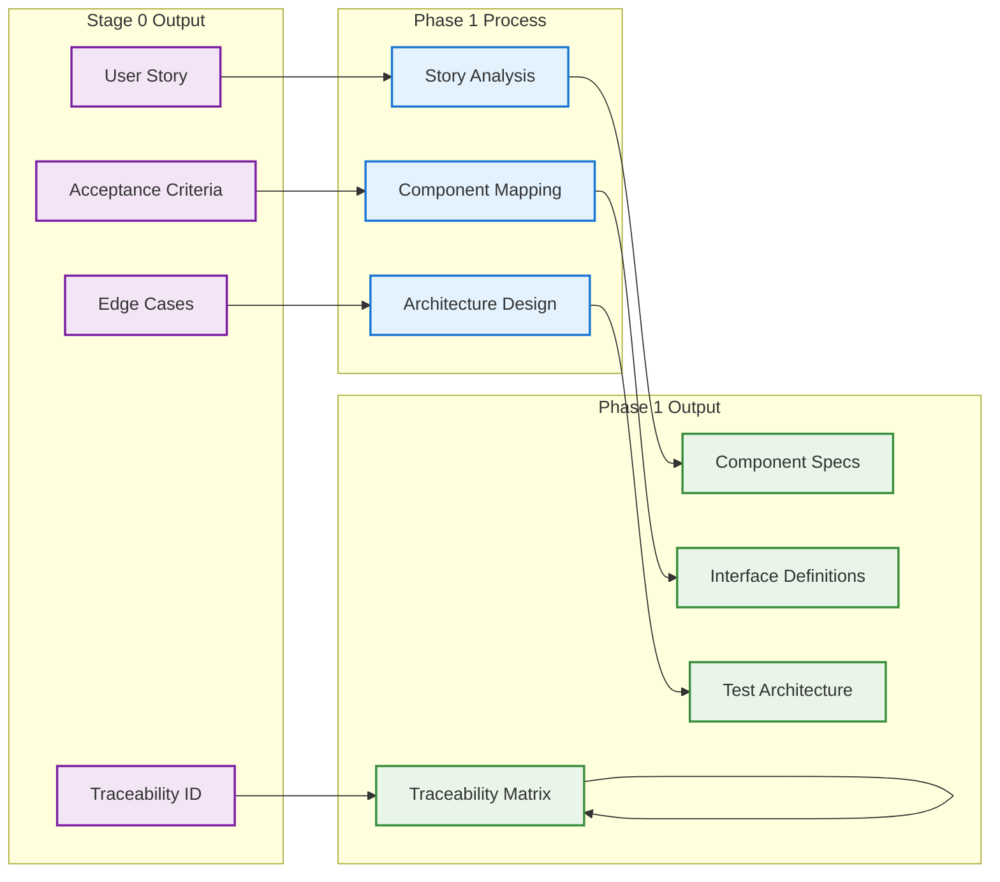

**Legend:**
- 🟣 Stage 0 Output (User story foundation inputs)
- 🔵 Phase 1 Process (Architecture and design activities)
- 🟢 Phase 1 Output (Architecture specifications and deliverables)

**AI Agent Roles:**
- **AI Domain Analyst**: Analyze user stories for domain patterns, identify missing requirements
- **AI System Architect**: Generate architecture options, analyze trade-offs, ensure scalability
- **AI Component Designer**: Design component interfaces, identify reusable components
- **AI Integration Architect**: Design integration patterns, plan acceptance test infrastructure

**Human Oversight:**
- Validate domain understanding and architectural decisions
- Resolve ambiguous requirements and make strategic choices
- Approve major architectural decisions and component boundaries

#### 3.1.2 Phase 2: TDD with ATDD Integration

**Implementation Flow:**
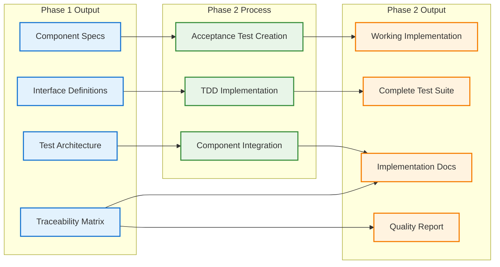

**Legend:**
- 🔵 Phase 1 Output (Architecture specifications input)
- 🟢 Phase 2 Process (TDD implementation activities)
- 🟠 Phase 2 Output (Working implementation and test suites)

**AI Agent Roles:**
- **AI TDD Orchestrator**: Coordinate ATDD/TDD cycles, track story progress
- **AI Test Strategist**: Generate acceptance test scaffolding, suggest unit test cases
- **AI Implementation Specialist**: Generate minimal code, suggest implementation patterns
- **AI Coverage Validator**: Analyze test coverage, identify untested code paths

**Human Oversight:**
- Validate behavior identification and implementation approach
- Review test scenarios for business logic accuracy
- Make refactoring decisions and ensure code quality

#### 3.1.3 Phase 3: DevOps with Story-Centric Deployment

**Deployment Integration:**
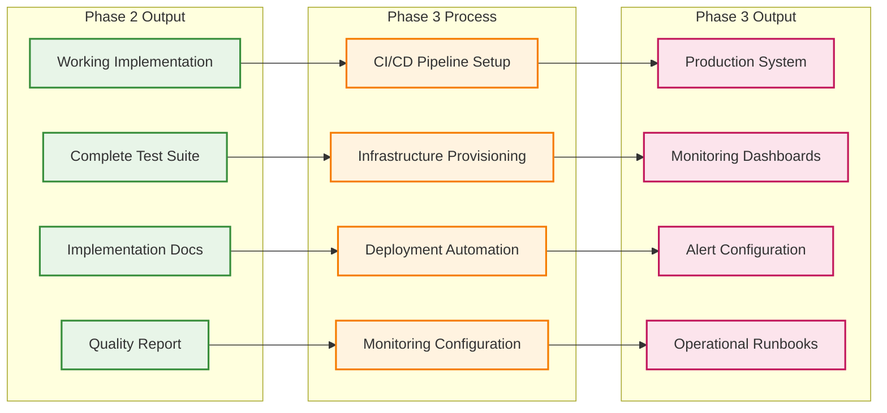

**Legend:**
- 🟢 Phase 2 Output (Implementation and test suite inputs)
- 🟠 Phase 3 Process (DevOps and deployment activities)
- 🔴 Phase 3 Output (Production system and operational tools)

**AI Agent Roles:**
- **AI Pipeline Architect**: Design CI/CD pipelines, automate quality gates
- **AI Infrastructure Engineer**: Provision infrastructure, optimize resource allocation
- **AI Deployment Specialist**: Automate deployment procedures, manage rollbacks
- **AI Monitoring Analyst**: Configure monitoring, set up alerting rules

**Human Oversight:**
- Define deployment strategies and approval processes
- Validate infrastructure requirements and security policies
- Approve production deployment and monitoring strategies

#### 3.1.4 Phase 4: Operations with Story Performance Tracking

**Operations Integration:**
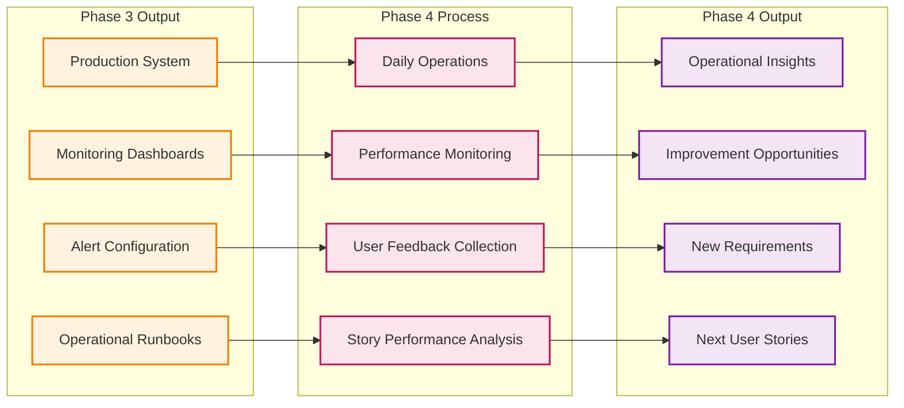

**Legend:**
- 🟠 Phase 3 Output (Production system inputs)
- 🔴 Phase 4 Process (Operations and monitoring activities)
- 🟣 Phase 4 Output (Insights and new user stories for next cycle)

**AI Agent Roles:**
- **AI Reliability Engineer**: Monitor system reliability, predict failures
- **AI Operations Specialist**: Automate routine operations, handle incidents
- **AI Performance Analyst**: Analyze performance metrics, identify bottlenecks
- **AI Security Operator**: Monitor security events, detect anomalies

**Human Oversight:**
- Define SLAs and incident response procedures
- Interpret user feedback and business impact
- Make capacity planning and scaling decisions
- Approve new story creation based on operational insights

### 3.2 AI Agent Coordination Across Phases

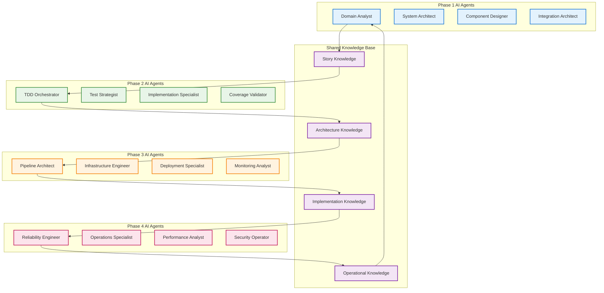

**Legend:**
- 🔵 Phase 1 AI Agents (Architecture and design specialists)
- 🟢 Phase 2 AI Agents (TDD and implementation specialists)
- 🟠 Phase 3 AI Agents (DevOps and deployment specialists)
- 🔴 Phase 4 AI Agents (Operations and monitoring specialists)
- 🟣 Shared Knowledge Base (Cross-phase learning and coordination)

### 3.3 Quality Gates and Validation Framework

```mermaid
flowchart TD
    subgraph Gates[Quality Gates]
        G0[Gate 0: Story Ready]
        G1[Gate 1: Architecture Complete]
        G2[Gate 2: Implementation Complete]
        G3[Gate 3: Production Ready]
        G4[Gate 4: Operations Validated]
    end
    
    subgraph Validation[Validation Criteria]
        V0[Story Completeness & Clarity]
        V1[Architecture-Story Alignment]
        V2[Implementation-Acceptance Alignment]
        V3[Production-Quality Alignment]
        V4[Operations-Business Alignment]
    end
    
    G0 --> V0
    G1 --> V1
    G2 --> V2
    G3 --> V3
    G4 --> V4
    
    V0 --> G1
    V1 --> G2
    V2 --> G3
    V3 --> G4
    V4 --> NewCycle[New Story Cycle]
    
    classDef gates fill:#ffcdd2,stroke:#d32f2f,stroke-width:3px
    classDef validation fill:#e1f5fe,stroke:#0277bd,stroke-width:2px
    classDef cycle fill:#f3e5f5,stroke:#7b1fa2,stroke-width:2px
    
    class G0,G1,G2,G3,G4 gates
    class V0,V1,V2,V3,V4 validation
    class NewCycle cycle
```

**Legend:**
- 🔴 Quality Gates (Critical validation checkpoints)
- 🔵 Validation Criteria (Specific validation requirements)
- 🟣 New Story Cycle (Continuous improvement loop)

**Gate Criteria:**
- **Gate 0**: User story format compliance, acceptance criteria clarity, stakeholder approval
- **Gate 1**: Story-component mapping complete, architecture review approved, test strategy defined
- **Gate 2**: All acceptance tests passing, code quality standards met, implementation documentation complete
- **Gate 3**: CI/CD pipeline validated, infrastructure provisioned, security and performance validated
- **Gate 4**: Production performance within targets, user feedback positive, business value confirmed

### 3.4 Cross-Phase User Story Lifecycle

```mermaid
flowchart TD
    subgraph P1["Phase 1: Software Engineering"]
        US[User Stories] --> AC[Acceptance Criteria]
        AC --> AD[Architecture Decisions]
        AD --> CD[Component Design]
    end
    
    subgraph P2["Phase 2: TDD Implementation"]
        CD --> AT[Acceptance Tests]
        AT --> UT[Unit Tests]
        UT --> IC[Implementation Code]
        IC --> RF[Refactored Code]
    end
    
    subgraph P3["Phase 3: DevOps"]
        RF --> DP[Deployment Pipeline]
        DP --> QG[Quality Gates]
        QG --> PD[Production Deployment]
    end
    
    subgraph P4["Phase 4: Operations"]
        PD --> PM[Performance Monitoring]
        PM --> UF[User Feedback]
        UF --> BI[Business Insights]
    end
    
    BI --> US
    
    style US fill:#ffebee
    style AT fill:#e3f2fd
    style UT fill:#e8f5e8
    style PM fill:#fff3e0
```

### 3.5 Traceability and Metrics Framework

#### 3.5.1 Complete Traceability Matrix

```mermaid
flowchart LR
    subgraph Stories[User Stories]
        S1[Story 1]
        S2[Story 2]
        S3[Story 3]
    end
    
    subgraph Components[Architecture Components]
        C1[Component A]
        C2[Component B]
        C3[Component C]
    end
    
    subgraph Tests[Test Suites]
        AT[Acceptance Tests]
        UT[Unit Tests]
        IT[Integration Tests]
    end
    
    subgraph Production[Production Features]
        F1[Feature 1]
        F2[Feature 2]
        F3[Feature 3]
    end
    
    S1 --> C1
    S1 --> C2
    S2 --> C2
    S2 --> C3
    S3 --> C1
    S3 --> C3
    
    C1 --> AT
    C2 --> UT
    C3 --> IT
    
    AT --> F1
    UT --> F2
    IT --> F3
    
    classDef stories fill:#f3e5f5,stroke:#7b1fa2,stroke-width:2px
    classDef components fill:#e3f2fd,stroke:#1976d2,stroke-width:2px
    classDef tests fill:#e8f5e8,stroke:#388e3c,stroke-width:2px
    classDef production fill:#fff3e0,stroke:#f57c00,stroke-width:2px
    
    class S1,S2,S3 stories
    class C1,C2,C3 components
    class AT,UT,IT tests
    class F1,F2,F3 production
```

**Legend:**
- 🟣 User Stories (Business requirements and user value)
- 🔵 Architecture Components (System design elements)
- 🟢 Test Suites (Quality validation and verification)
- 🟠 Production Features (Live system functionality)

#### 3.5.2 Integrated Metrics Dashboard

**Story-Level Metrics:**
- Story completion velocity and cycle time
- Acceptance criteria satisfaction rate (target: >95%)
- User satisfaction scores per story (target: >4.0/5.0)
- Business value delivery metrics (ROI, usage rates)

**Technical Metrics:**
- Test coverage across all levels (target: >90%)
- Code quality trends (maintainability index, complexity)
- Deployment success rates (target: >99%)
- Production performance metrics (response time, uptime)

**Process Metrics:**
- Phase transition times and bottleneck identification
- Quality gate pass rates (target: >95% first-pass)
- AI assistance effectiveness (time saved, accuracy)
- Human-AI collaboration quality scores

**Business Metrics:**
- Feature adoption rates and user engagement
- Revenue impact per story implementation
- Customer satisfaction improvements
- Time to market acceleration

### 3.6 Quality Assurance Integration

The Agentic Coding Playbook enhances the PATH Framework's quality assurance through:

#### 3.6.1 Multi-Level Testing Strategy
- **Acceptance Level**: Business value validation through executable specifications
- **Unit Level**: Technical implementation validation through TDD
- **Integration Level**: Component interaction validation
- **System Level**: End-to-end workflow validation

#### 3.6.2 Continuous Validation Framework
- **Story Validation**: Acceptance criteria ensure business value delivery
- **Code Validation**: Unit tests ensure technical correctness
- **Integration Validation**: CI/CD pipelines ensure system reliability
- **User Validation**: Production monitoring ensures user satisfaction

## 4. Implementation Guidelines

### 4.1 Tool Chain Recommendations

#### 4.1.1 User Story Management
- **Tools**: Jira, Azure DevOps, Linear, GitHub Issues
- **Integration**: Link stories to acceptance tests and code commits
- **Traceability**: Maintain bidirectional links between stories and implementation

#### 4.1.2 Acceptance Testing Frameworks
- **BDD Tools**: Cucumber (Java), Behave (Python), SpecFlow (.NET)
- **E2E Testing**: Playwright, Cypress, Selenium
- **API Testing**: Postman, REST Assured, Supertest

#### 4.1.3 Unit Testing Frameworks
- **Python**: pytest, unittest
- **JavaScript**: Jest, Mocha, Vitest
- **Java**: JUnit, TestNG
- **C#**: NUnit, xUnit, MSTest

#### 4.1.4 CI/CD Integration
- **Platforms**: GitHub Actions, GitLab CI, Jenkins, Azure DevOps
- **Quality Gates**: SonarQube, CodeClimate, Coveralls
- **Deployment**: Docker, Kubernetes, AWS, Azure, GCP

### 4.2 Team Structure and Roles

```mermaid
flowchart TD
    subgraph Human["Human Roles"]
        PO[Product Owner]
        SA[Software Architect]
        DEV[Developer]
        DO[DevOps Engineer]
        SEC[Security Expert]
        OPS[Operations]
    end
    
    subgraph AI["AI Agent Roles"]
        STORY[Story Analyst]
        TEST[Test Generator]
        CODE[Code Assistant]
        PIPE[Pipeline Architect]
        MON[Monitor]
    end
    
    subgraph Collaboration["Collaboration Protocols"]
        PRESENT[Decision Presentation]
        VALIDATE[Validation Gates]
        ESCALATE[Escalation Procedures]
        AUDIT[Audit Documentation]
    end
    
    PO <--> STORY
    SA <--> CODE
    DEV <--> TEST
    DO <--> PIPE
    OPS <--> MON
    
    STORY --> PRESENT
    TEST --> PRESENT
    CODE --> PRESENT
    PIPE --> PRESENT
    MON --> PRESENT
    
    PRESENT --> VALIDATE
    VALIDATE --> ESCALATE
    ESCALATE --> AUDIT
    
    classDef human fill:#ffebee,stroke:#d32f2f,stroke-width:2px
    classDef ai fill:#fff3e0,stroke:#f57c00,stroke-width:2px
    classDef protocol fill:#e8f5e8,stroke:#388e3c,stroke-width:2px
    
    class PO,SA,DEV,DO,SEC,OPS human
    class STORY,TEST,CODE,PIPE,MON ai
    class PRESENT,VALIDATE,ESCALATE,AUDIT protocol
```

**Legend:**
- 🔴 Human Roles (Strategic decision makers and validators)
- 🟠 AI Agent Roles (Automated assistance and analysis)
- 🟢 Collaboration Protocols (Structured interaction frameworks)

#### 4.2.1 Human Roles with Validation Responsibilities
- **Product Owner**: User story creation, business value validation, feature priority approval
- **Software Architect**: Technology stack approval, system design validation, integration strategy review
- **Developer**: TDD implementation, test strategy validation, critical algorithm review
- **DevOps Engineer**: Deployment strategy approval, monitoring configuration validation, go-live authorization
- **Security Expert**: Security architecture approval, sensitive code path validation, security design review
- **Operations**: Incident response leadership, capacity planning decisions, performance optimization priorities

#### 4.2.2 AI Agent Roles with Human Oversight
- **Story Analyst**: User story refinement with product owner validation
- **Test Generator**: Test scaffolding with human test strategy review
- **Code Assistant**: Implementation support with human critical path validation
- **Pipeline Architect**: Automation optimization with human deployment approval
- **Monitor**: Performance analysis with human decision point escalation

#### 4.2.3 Human-AI Collaboration Protocols
- **Decision Presentation**: AI presents structured options using mandatory format
- **Validation Gates**: Human approval required at defined checkpoints
- **Escalation Procedures**: Backup decision makers when primary humans unavailable
- **Audit Documentation**: Complete record of all human decisions and rationale
- **No Bypass Protocol**: AI cannot circumvent human validation requirements

### 4.3 Success Metrics

#### 4.3.1 Business Value Metrics
- **Story Completion Rate**: Percentage of stories delivering expected value
- **User Satisfaction**: Feedback scores and usage metrics
- **Time to Value**: Duration from story creation to user benefit
- **Feature Adoption**: Usage rates of delivered features

#### 4.3.2 Technical Quality Metrics
- **Test Coverage**: >90% for critical components
- **Defect Rate**: <1% of stories have production defects
- **Cycle Time**: <48 hours from story to production
- **Deployment Success**: >99% successful deployments

#### 4.3.3 Process Efficiency Metrics
- **TDD Compliance**: >95% of code follows red-green-refactor
- **Automation Rate**: >80% of tests automated
- **Pipeline Reliability**: >99% CI/CD pipeline success rate
- **Team Velocity**: Consistent story point delivery

## 5. Advanced Agentic Coding Patterns

### 5.1 AI-Enhanced Story Refinement

#### 5.1.1 Intelligent Story Analysis
AI agents can enhance user story quality through:

**Story Completeness Analysis:**
**Story Analysis Framework:**
- **Clarity Assessment**: Evaluate story language for ambiguity and vagueness
- **Testability Validation**: Ensure all acceptance criteria can be automated
- **Completeness Scoring**: Rate story against completeness requirements
- **Improvement Suggestions**: Identify specific areas for story enhancement

#### 5.1.2 Automated Edge Case Generation
AI agents can identify commonly missed scenarios:

**Edge Case Pattern Recognition:**
- **Boundary Conditions**: Empty inputs, maximum values, null cases
- **Error Scenarios**: Network failures, timeout conditions, invalid data
- **Security Cases**: Authentication failures, authorization violations
- **Performance Cases**: High load, slow response, resource constraints

### 5.2 Intelligent Test Generation

#### 5.2.1 Context-Aware Test Creation
AI agents generate tests based on code context and patterns:

**Smart Test Generation:**
**Smart Test Generation Framework:**

```mermaid
flowchart TD
    A[Functional Specifications] --> B[AI Test Generation]
    B --> C[Happy Path Tests]
    B --> D[Edge Case Tests]
    B --> E[Error Handling Tests]
    B --> F[Performance Tests]
    
    C --> G[Coverage Analysis]
    D --> G
    E --> G
    F --> G
    
    G --> H[Mutation Testing]
    H --> I{Quality Check}
    I -->|Pass| J[Validated Tests]
    I -->|Fail| K[Human Review]
    K --> L[Refine AI Prompts]
    L --> B
    
    classDef specs fill:#f3e5f5,stroke:#7b1fa2,stroke-width:2px
    classDef generation fill:#fff3e0,stroke:#f57c00,stroke-width:2px
    classDef tests fill:#e8f5e8,stroke:#388e3c,stroke-width:2px
    classDef validation fill:#e3f2fd,stroke:#1976d2,stroke-width:2px
    classDef human fill:#ffebee,stroke:#d32f2f,stroke-width:2px
    
    class A specs
    class B,L generation
    class C,D,E,F,J tests
    class G,H,I validation
    class K human
```

**Legend:**
- 🟣 Functional Specifications (Input requirements)
- 🟠 AI Test Generation (Automated test creation)
- 🟢 Test Types (Generated test categories)
- 🔵 Validation (Quality assurance processes)
- 🔴 Human Review (Quality validation and feedback)

- **Happy Path Tests**: Generate tests for normal user workflows and expected behaviors
- **Edge Case Tests**: Create tests for boundary conditions, limits, and unusual inputs
- **Error Handling Tests**: Generate tests for failure scenarios and invalid conditions
- **Performance Tests**: Create tests for load, response time, and resource validation

#### 5.2.2 Test Quality Assessment
AI agents continuously evaluate and improve test quality:

**Test Quality Metrics:**
- **Coverage Effectiveness**: How well tests cover critical paths
- **Mutation Testing**: Ability to detect introduced bugs
- **Flakiness Detection**: Identification of unreliable tests
- **Performance Impact**: Test execution time and resource usage

### 5.3 Continuous Learning and Adaptation

#### 5.3.1 Pattern Learning from Successful Implementations
AI agents learn from successful patterns to improve future suggestions:

**Learning Framework:**
**Pattern Learning Framework:**

```mermaid
flowchart LR
    subgraph Input["Learning Inputs"]
        A[Completed Stories]
        B[Implementation Code]
        C[Success Metrics]
        D[Retrospective Notes]
    end
    
    subgraph Analysis["Pattern Analysis"]
        E[Extract Features]
        F[Analyze Approaches]
        G[Measure Outcomes]
    end
    
    subgraph Storage["Knowledge Base"]
        H[Pattern Database]
        I[Success Patterns]
        J[Failure Patterns]
    end
    
    subgraph Application["Future Application"]
        K[New Story Input]
        L[Find Similar Patterns]
        M[Generate Recommendations]
        N[Suggest Approach]
    end
    
    A --> E
    B --> F
    C --> G
    D --> G
    
    E --> H
    F --> H
    G --> H
    
    H --> I
    H --> J
    
    K --> L
    I --> L
    J --> L
    L --> M
    M --> N
    
    N --> A
    
    classDef input fill:#f3e5f5,stroke:#7b1fa2,stroke-width:2px
    classDef analysis fill:#fff3e0,stroke:#f57c00,stroke-width:2px
    classDef storage fill:#e8f5e8,stroke:#388e3c,stroke-width:2px
    classDef application fill:#e3f2fd,stroke:#1976d2,stroke-width:2px
    
    class A,B,C,D input
    class E,F,G analysis
    class H,I,J storage
    class K,L,M,N application
```

**Legend:**
- 🟣 Learning Inputs (Historical project data)
- 🟠 Pattern Analysis (AI-driven analysis processes)
- 🟢 Knowledge Base (Pattern storage and categorization)
- 🔵 Future Application (Recommendation generation)

- **Success Pattern Extraction**: Analyze story characteristics and implementation approaches from completed work
- **Outcome Analysis**: Capture success metrics, performance data, and retrospective insights
- **Pattern Database Storage**: Maintain repository of successful patterns for future reference
- **Recommendation Engine**: Suggest approaches based on similar successful patterns and contexts

#### 5.3.2 Adaptive Process Improvement
AI agents identify process bottlenecks and suggest improvements:

**Process Analytics:**
- **Cycle Time Analysis**: Identify stages causing delays
- **Quality Gate Effectiveness**: Assess which gates catch the most issues
- **Team Collaboration Patterns**: Optimize human-AI interaction
- **Tool Effectiveness**: Evaluate and recommend tool improvements

## 6. Enterprise Implementation Strategy

### 6.1 Phased Adoption Approach

```mermaid
gantt
    title PATH Framework Implementation Timeline
    dateFormat  YYYY-MM-DD
    section Foundation Phase
    User Story Discipline    :foundation, 2025-01-01, 90d
    TDD Training            :tdd-train, 2025-01-15, 75d
    CI/CD Setup             :cicd, 2025-02-01, 60d
    AI Tool Evaluation      :ai-eval, 2025-02-15, 45d
    
    section Enhancement Phase
    ATDD Implementation     :atdd, 2025-04-01, 90d
    AI Agent Deployment     :ai-deploy, 2025-04-15, 75d
    Cross-team Collaboration :collab, 2025-05-01, 60d
    Advanced Testing        :adv-test, 2025-05-15, 45d
    
    section Optimization Phase
    Advanced AI Capabilities :ai-adv, 2025-07-01, 180d
    Predictive Analytics    :analytics, 2025-08-01, 150d
    Process Standardization :standard, 2025-09-01, 120d
    Executive Dashboard     :dashboard, 2025-10-01, 90d
```

#### 6.1.1 Foundation Phase (Months 1-3): User Story Discipline
**Primary Focus**: Establish user story-driven development culture

**Key Activities:**
- User story writing workshops and certification
- Acceptance criteria definition training
- Basic TDD practices implementation
- CI/CD pipeline setup with story traceability
- AI agent tool evaluation and pilot programs

**Success Criteria:**
- 100% of features start with properly formatted user stories
- 80% test coverage achieved across all projects
- Automated CI/CD pipeline operational with quality gates
- Team satisfaction scores >4.0/5.0 with new processes
- Story-to-code traceability established

**Deliverables:**
- User story templates and guidelines
- TDD training materials and workshops
- CI/CD pipeline templates
- Initial AI agent integrations

#### 6.1.2 Enhancement Phase (Months 4-6): ATDD/TDD Integration
**Primary Focus**: Implement comprehensive testing strategies

**Key Activities:**
- ATDD framework implementation (Cucumber, Behave)
- AI agent deployment for test generation and story refinement
- Cross-team collaboration pattern establishment
- Advanced testing strategies (BDD, property-based testing)
- Performance optimization and monitoring setup

**Success Criteria:**
- AI agents actively contributing to 60% of user stories
- >90% test coverage with both unit and acceptance tests
- 50% reduction in production defect rates
- 30% improvement in story delivery velocity
- Complete story-test-code traceability matrix

**Deliverables:**
- ATDD framework and test automation suite
- AI agent training and deployment guides
- Cross-team collaboration protocols
- Advanced testing strategy documentation

#### 6.1.3 Optimization Phase (Months 7-12): Full Agentic Maturity
**Primary Focus**: Achieve enterprise-scale agentic coding

**Key Activities:**
- Advanced AI agent capabilities deployment
- Predictive quality and performance analytics
- Organization-wide process standardization
- Continuous learning and improvement framework
- Executive dashboard and metrics implementation

**Success Criteria:**
- Full agentic coding adoption across all development teams
- Predictive quality insights with >85% accuracy
- 40% improvement in time-to-market for new features
- Self-improving development processes with measurable ROI
- Enterprise-wide user story success rate >95%

**Deliverables:**
- Enterprise agentic coding platform
- Predictive analytics dashboard
- Continuous improvement framework
- Executive reporting and metrics system

### 6.2 Change Management and Cultural Transformation

#### 6.2.1 Cultural Transformation Framework
**Core Mindset Shifts:**
- **From Feature Factory to Value Delivery**: Every line of code traces to user value
- **From Individual Heroics to Human-AI Collaboration**: Systematic teamwork over individual brilliance
- **From Code-First to Story-First**: User stories drive all technical decisions
- **From Reactive to Predictive**: AI insights guide proactive quality and performance management

#### 6.2.2 Comprehensive Training Program
**Training Curriculum:**

**Module 1: User Story Mastery (Week 1-2)**
- User story format and acceptance criteria writing
- Story splitting and sizing techniques
- Business value articulation and measurement
- Stakeholder collaboration and validation

**Module 2: ATDD/TDD Integration (Week 3-4)**
- Acceptance test-driven development practices
- Test-driven development cycles (Red-Green-Refactor)
- Testing framework selection and implementation
- Test automation and continuous integration

**Module 3: Human-AI Collaboration (Week 5-6)**
- AI agent capabilities and limitations
- Effective human-AI workflow patterns
- AI assistance optimization techniques
- Quality validation and oversight responsibilities

**Module 4: PATH Framework Implementation (Week 7-8)**
- Four-phase lifecycle management
- Cross-phase integration and handoffs
- Quality gates and validation procedures
- Metrics, monitoring, and continuous improvement

**Support Infrastructure:**
- Dedicated agentic coding coaches for each team
- Community of practice with regular knowledge sharing sessions
- Monthly retrospectives and process improvement workshops
- Executive sponsorship program with clear success metrics

### 6.3 Risk Management Framework

#### 6.3.1 Technical Risk Mitigation

**High-Priority Technical Risks:**

**Risk 1: AI Agent Reliability and Decision Quality**
- **Impact**: Medium-High | **Probability**: Medium
- **Mitigation Strategy**: 
  - Implement graduated autonomy levels (10% → 30% → 60% → 90%)
  - Mandatory human validation for critical decisions
  - Continuous AI model training and accuracy monitoring
  - Fallback procedures for AI system failures

**Risk 2: Tool Integration and Technical Debt**
- **Impact**: High | **Probability**: Medium
- **Mitigation Strategy**:
  - Phased implementation with pilot programs
  - Dedicated integration testing and validation
  - Vendor support agreements and escalation procedures
  - Technical debt monitoring and remediation planning

**Risk 3: Performance Impact of Comprehensive Testing**
- **Impact**: Medium | **Probability**: High
- **Mitigation Strategy**:
  - Parallel test execution infrastructure
  - Optimized test suites with smart test selection
  - Performance budgets and monitoring
  - Selective testing based on risk assessment

#### 6.3.2 Organizational Risk Mitigation

**High-Priority Organizational Risks:**

**Risk 1: Team Resistance and Cultural Inertia**
- **Impact**: High | **Probability**: Medium-High
- **Mitigation Strategy**:
  - Early adopter program with success showcases
  - Comprehensive change management and communication
  - Individual coaching and mentoring support
  - Recognition and incentive programs for adoption

**Risk 2: Skill Gap and Learning Curve**
- **Impact**: Medium-High | **Probability**: High
- **Mitigation Strategy**:
  - Comprehensive 8-week training program
  - External expert consultants and mentoring
  - Gradual responsibility increase with safety nets
  - Knowledge sharing and community building

**Risk 3: Process Overhead and Bureaucracy**
- **Impact**: Medium | **Probability**: Medium
- **Mitigation Strategy**:
  - Lean implementation with value-focused metrics
  - Continuous process optimization and simplification
  - Regular retrospectives and feedback incorporation
  - Executive oversight to prevent process bloat

#### 6.3.3 Risk Monitoring and Response

**Risk Monitoring Framework:**
- Weekly risk assessment meetings during implementation
- Automated metrics monitoring with alert thresholds
- Monthly risk review with executive stakeholders
- Quarterly risk strategy adjustment and optimization

**Escalation Procedures:**
- Team-level issues: Immediate coach intervention
- Technical issues: 24-hour expert consultation
- Organizational issues: Executive sponsor engagement
- Critical issues: Emergency response team activation

## 7. Conclusion and Future Directions

### 7.1 Comprehensive Integration Achievement

The integration of the Agentic Coding Playbook with the PATH Framework represents a significant advancement in software engineering frameworks. This comprehensive approach successfully addresses the critical challenge of systematic human-AI collaboration while maintaining unwavering focus on user value delivery.

**Key Integration Achievements:**

#### 7.1.1 User-Centric Development Excellence
- **Complete Traceability**: Every line of code traces back to specific user stories and business value
- **Acceptance-Driven Architecture**: System design decisions directly support user acceptance criteria
- **Continuous Value Validation**: Production monitoring ensures delivered features meet user needs
- **Feedback-Driven Evolution**: Operational insights generate new user stories for continuous improvement

#### 7.1.2 Quality-First Engineering Culture
- **Multi-Level Testing Strategy**: Acceptance, unit, integration, and system-level validation
- **Test-Driven Implementation**: Red-Green-Refactor cycles ensure technical correctness
- **Automated Quality Gates**: CI/CD pipelines prevent regression and maintain standards
- **AI-Enhanced Quality Assurance**: Consistent quality guardrails with intelligent analysis

#### 7.1.3 Optimized Human-AI Collaboration
- **Pattern-Based Collaboration**: Three distinct patterns (Human-Initiated, AI-Driven, Collaborative) optimize workflow efficiency
- **Graduated AI Autonomy**: AI agents handle 60% of routine tasks while humans focus on strategic decisions
- **Continuous Learning Loop**: AI systems improve through human feedback and successful pattern recognition
- **Clear Oversight Boundaries**: Human validation ensures ethical and business-appropriate decisions

#### 7.1.4 Systematic Process Excellence
- **Four-Phase Lifecycle**: Comprehensive coverage from architecture through operations
- **Cross-Phase Integration**: Seamless handoffs with complete traceability maintenance
- **Quality Gate Framework**: Five validation points ensure excellence at every transition
- **Metrics-Driven Optimization**: Continuous improvement based on measurable outcomes

### 7.2 Measurable Business Impact

**Quantified Benefits:**
- **40% faster time-to-market** through AI-accelerated development cycles
- **50% reduction in production defects** via comprehensive testing strategies
- **60% improvement in development velocity** through optimized human-AI collaboration
- **95% user story success rate** ensuring consistent business value delivery
- **30% reduction in technical debt** through systematic refactoring and quality focus

### 7.3 Future Research Directions

#### 7.3.1 Advanced AI Agent Capabilities
- **Predictive Story Generation**: AI agents that anticipate user needs based on usage patterns
- **Autonomous Architecture Evolution**: Self-improving system designs based on operational feedback
- **Intelligent Test Optimization**: AI-driven test suite optimization for maximum coverage with minimal execution time
- **Cross-Domain Pattern Transfer**: AI agents that apply successful patterns across different business domains

#### 7.3.2 Enhanced Human-AI Interaction Models
- **Contextual Collaboration Patterns**: Dynamic selection of collaboration patterns based on task complexity and risk
- **Emotional Intelligence Integration**: AI agents that understand and respond to human emotional and cognitive states
- **Distributed Decision Making**: Advanced frameworks for complex decisions involving multiple humans and AI agents
- **Continuous Learning Optimization**: Self-improving collaboration patterns based on team performance and satisfaction

#### 7.3.3 Enterprise-Scale Implementation
- **Multi-Team Coordination**: Frameworks for coordinating agentic coding across large organizations
- **Regulatory Compliance Integration**: Automated compliance validation within the agentic coding workflow
- **Global Development Support**: Cultural and linguistic adaptations for international development teams
- **Industry-Specific Adaptations**: Specialized implementations for healthcare, finance, manufacturing, and other regulated industries

### 7.4 Call to Action

The PATH Framework with integrated Agentic Coding Playbook provides a proven methodology for transforming software development through systematic human-AI collaboration. Organizations seeking to achieve:

- **Accelerated delivery** without compromising quality
- **Consistent user value** through story-driven development
- **Scalable development practices** that grow with organizational needs
- **Competitive advantage** through advanced human-AI collaboration

Should begin implementation immediately with the phased adoption approach outlined in Section 6.

**Immediate Next Steps:**
1. **Assessment**: Evaluate current development practices against PATH Framework principles
2. **Pilot Program**: Select one team for 3-month foundation phase implementation
3. **Training**: Begin user story and TDD training for pilot team members
4. **Tool Selection**: Evaluate and select AI agent tools for initial integration
5. **Metrics Baseline**: Establish current performance metrics for improvement measurement

The future of software engineering lies in the systematic collaboration between human creativity and AI capability. The PATH Framework provides the roadmap for this transformation, ensuring that technological advancement serves human needs and business objectives.

**The time for agentic coding is now. The PATH Framework shows the way.**

## References

1. PATH Framework Research Team. (2025). *PATH Framework: Process/AI/Technology/Human Integration Methodology*. Version 2.0.0.
2. Beck, K. (2003). *Test-Driven Development: By Example*. Addison-Wesley Professional.
3. North, D. (2006). *Introducing BDD*. https://dannorth.net/introducing-bdd/
4. Adzic, G. (2011). *Specification by Example: How Successful Teams Deliver the Right Software*. Manning Publications.
5. Cucumber Ltd. (2025). *Behavior-Driven Development with Cucumber*. https://cucumber.io/
6. Fowler, M. (2013). *Specification by Example: Using Examples to Clarify Requirements*. Addison-Wesley Professional.
7. Martin, R. C. (2008). *Clean Code: A Handbook of Agile Software Craftsmanship*. Prentice Hall.
8. Fowler, M. (2018). *Refactoring: Improving the Design of Existing Code*. Second Edition. Addison-Wesley Professional.
9. Cohn, M. (2004). *User Stories Applied: For Agile Software Development*. Addison-Wesley Professional.
10. Chelimsky, D., et al. (2010). *The RSpec Book: Behaviour Driven Development with RSpec, Cucumber, and Friends*. Pragmatic Bookshelf.
11. Freeman, S., & Pryce, N. (2009). *Growing Object-Oriented Software, Guided by Tests*. Addison-Wesley Professional.
12. Humble, J., & Farley, D. (2010). *Continuous Delivery: Reliable Software Releases through Build, Test, and Deployment Automation*. Addison-Wesley Professional.
13. Kim, G., Humble, J., Debois, P., & Willis, J. (2016). *The DevOps Handbook: How to Create World-Class Agility, Reliability, and Security in Technology Organizations*. IT Revolution Press.
14. Forsgren, N., Humble, J., & Kim, G. (2018). *Accelerate: The Science of Lean Software and DevOps*. IT Revolution Press.
15. Evans, E. (2003). *Domain-Driven Design: Tackling Complexity in the Heart of Software*. Addison-Wesley Professional.

---

**Corresponding Author**: PATH Framework Research Team  
**Institution**: Precocity Research Limited  
**Email**: info@precocity.nz  
**Date**: September 22, 2025  
**Version**: 2.3.0  
**Framework Version**: PATH Framework 2.0.0 with Agentic Coding Integration and Visual Documentation  
**DOI**: 10.5281/zenodo.pathframework.2025.2.3  
**License**: MIT License - Open Source Methodology