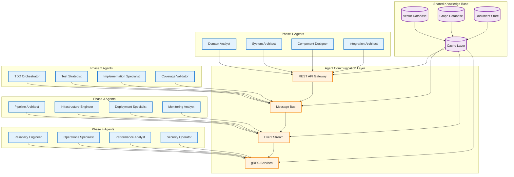

# PATH Framework Agent Data Exchange Protocols & Knowledge Base


## Abstract

This document defines comprehensive data exchange protocols and shared knowledge base architecture for PATH Framework AI agents. The specification covers inter-agent communication formats, shared knowledge structures, data synchronization mechanisms, and common interfaces that enable seamless collaboration across all 16 specialized agents. The protocols ensure consistent data flow, maintain system coherence, and support real-time collaboration while preserving data integrity and security throughout the software development lifecycle.

**Keywords:** Data Exchange, Knowledge Base, Agent Communication, Protocol Buffers, Event Streaming, Shared State Management

## Table of Contents

1. [Data Exchange Architecture](#1-data-exchange-architecture)
2. [Communication Protocols](#2-communication-protocols)
3. [Shared Knowledge Base](#3-shared-knowledge-base)
4. [Message Formats](#4-message-formats)
5. [Event Streaming System](#5-event-streaming-system)
6. [Data Synchronization](#6-data-synchronization)
7. [Security and Access Control](#7-security-and-access-control)
8. [Implementation Guidelines](#8-implementation-guidelines)

## 1. Data Exchange Architecture

### 1.1 Overall Architecture



### 1.2 Communication Patterns

**Synchronous Communication:**
- REST API calls for immediate responses
- gRPC for high-performance inter-agent calls
- Direct database queries for knowledge retrieval

**Asynchronous Communication:**
- Message queues for workflow coordination
- Event streams for real-time updates
- Pub/sub patterns for broadcast notifications

**Data Flow Patterns:**
- Request-Response for immediate operations
- Event-Driven for workflow progression
- Stream Processing for continuous monitoring
- Batch Processing for bulk operations

## 2. Communication Protocols

### 2.1 Protocol Stack

```yaml
ProtocolStack:
  application_layer:
    - rest_api: "HTTP/HTTPS RESTful services"
    - grpc: "High-performance RPC communication"
    - websocket: "Real-time bidirectional communication"
    - graphql: "Flexible query interface"
  
  message_layer:
    - protocol_buffers: "Structured data serialization"
    - json: "Human-readable data exchange"
    - avro: "Schema evolution support"
    - messagepack: "Compact binary serialization"
  
  transport_layer:
    - http2: "Multiplexed HTTP connections"
    - tcp: "Reliable connection-oriented transport"
    - tls: "Encrypted communication security"
    - quic: "Low-latency transport protocol"
  
  infrastructure_layer:
    - kafka: "Distributed event streaming"
    - redis: "In-memory data structure store"
    - rabbitmq: "Message broker and queuing"
    - etcd: "Distributed configuration store"
```

### 2.2 Message Exchange Formats

**Standard Message Envelope:**
```protobuf
syntax = "proto3";

message AgentMessage {
  MessageHeader header = 1;
  MessagePayload payload = 2;
  MessageMetadata metadata = 3;
}

message MessageHeader {
  string message_id = 1;
  string correlation_id = 2;
  string source_agent = 3;
  string target_agent = 4;
  string message_type = 5;
  int64 timestamp = 6;
  string version = 7;
}

message MessagePayload {
  oneof content {
    UserStoryData user_story = 1;
    ArchitectureData architecture = 2;
    TestData test_data = 3;
    CodeData code_data = 4;
    DeploymentData deployment = 5;
    MonitoringData monitoring = 6;
  }
}

message MessageMetadata {
  map<string, string> properties = 1;
  repeated string tags = 2;
  string priority = 3;
  int32 retry_count = 4;
  int64 expiry_time = 5;
}
```

### 2.3 Agent-Specific Data Structures

**User Story Data Structure:**
```protobuf
message UserStoryData {
  string story_id = 1;
  string title = 2;
  string description = 3;
  string user_type = 4;
  string functionality = 5;
  string benefit = 6;
  repeated AcceptanceCriteria acceptance_criteria = 7;
  BusinessValue business_value = 8;
  repeated string tags = 9;
  StoryStatus status = 10;
}

message AcceptanceCriteria {
  string criteria_id = 1;
  string given = 2;
  string when = 3;
  string then = 4;
  CriteriaStatus status = 5;
}

message BusinessValue {
  string value_proposition = 1;
  repeated string success_metrics = 2;
  string roi_estimate = 3;
  string priority = 4;
}
```

**Architecture Data Structure:**
```protobuf
message ArchitectureData {
  string architecture_id = 1;
  SystemDesign system_design = 2;
  repeated ComponentSpec components = 3;
  repeated IntegrationPattern integrations = 4;
  TechnologyStack technology_stack = 5;
  repeated QualityAttribute quality_attributes = 6;
}

message SystemDesign {
  string design_id = 1;
  string architecture_pattern = 2;
  repeated string design_principles = 3;
  ScalabilityRequirements scalability = 4;
  SecurityRequirements security = 5;
}

message ComponentSpec {
  string component_id = 1;
  string name = 2;
  string description = 3;
  repeated string responsibilities = 4;
  repeated InterfaceDefinition interfaces = 5;
  repeated string dependencies = 6;
}
```

**Test Data Structure:**
```protobuf
message TestData {
  string test_id = 1;
  TestType test_type = 2;
  string component_id = 3;
  repeated TestCase test_cases = 4;
  TestCoverage coverage = 5;
  TestResults results = 6;
}

message TestCase {
  string case_id = 1;
  string name = 2;
  string description = 3;
  TestScenario scenario = 4;
  repeated TestAssertion assertions = 5;
  TestData test_data = 6;
}

message TestCoverage {
  double line_coverage = 1;
  double branch_coverage = 2;
  double function_coverage = 3;
  double mutation_score = 4;
}
```

## 3. Shared Knowledge Base

### 3.1 Knowledge Base Architecture

```yaml
SharedKnowledgeBase:
  storage_layers:
    vector_database:
      technology: "Pinecone, Weaviate, or Chroma"
      purpose: "Semantic search and similarity matching"
      data_types: ["code_embeddings", "documentation_vectors", "pattern_embeddings"]
      
    graph_database:
      technology: "Neo4j or Amazon Neptune"
      purpose: "Relationship mapping and traversal"
      data_types: ["component_relationships", "dependency_graphs", "workflow_connections"]
      
    document_store:
      technology: "MongoDB or Amazon DocumentDB"
      purpose: "Structured and semi-structured data"
      data_types: ["user_stories", "specifications", "test_results", "deployment_configs"]
      
    cache_layer:
      technology: "Redis or Amazon ElastiCache"
      purpose: "High-performance data access"
      data_types: ["frequently_accessed_data", "session_state", "computed_results"]
  
  access_patterns:
    real_time_queries:
      latency: "<100ms"
      use_cases: ["agent_decision_making", "validation_checks", "status_updates"]
      
    batch_operations:
      latency: "<5 minutes"
      use_cases: ["knowledge_synchronization", "analytics_processing", "backup_operations"]
      
    semantic_search:
      latency: "<500ms"
      use_cases: ["pattern_matching", "similar_code_discovery", "best_practice_retrieval"]
```

### 3.2 Knowledge Categories

**Project Context Knowledge:**
```yaml
ProjectContext:
  current_state:
    - active_user_stories: "Stories currently in development"
    - component_status: "Implementation and testing progress"
    - deployment_state: "Current production and staging status"
    - quality_metrics: "Test coverage, performance, and quality indicators"
  
  historical_data:
    - completed_stories: "Successfully delivered features"
    - architecture_decisions: "Design choices and rationale"
    - performance_history: "System performance over time"
    - incident_history: "Production issues and resolutions"
  
  predictive_insights:
    - risk_assessments: "Potential issues and mitigation strategies"
    - performance_forecasts: "Expected system behavior"
    - resource_requirements: "Capacity and scaling predictions"
    - delivery_estimates: "Timeline and effort predictions"
```

**Pattern Library Knowledge:**
```yaml
PatternLibrary:
  architectural_patterns:
    - microservices: "Service decomposition and communication patterns"
    - event_driven: "Event sourcing and CQRS implementations"
    - layered_architecture: "Traditional n-tier application patterns"
    - hexagonal_architecture: "Ports and adapters implementations"
  
  implementation_patterns:
    - design_patterns: "GoF patterns and modern variations"
    - coding_patterns: "Language-specific best practices"
    - testing_patterns: "TDD, BDD, and testing strategies"
    - integration_patterns: "API and service integration approaches"
  
  operational_patterns:
    - deployment_patterns: "Blue-green, canary, and rolling deployments"
    - monitoring_patterns: "Observability and alerting strategies"
    - scaling_patterns: "Horizontal and vertical scaling approaches"
    - security_patterns: "Authentication, authorization, and data protection"
```

### 3.3 Knowledge Synchronization

**Synchronization Mechanisms:**
```yaml
KnowledgeSynchronization:
  real_time_sync:
    - event_streaming: "Immediate knowledge updates via Kafka"
    - change_data_capture: "Database change propagation"
    - websocket_notifications: "Real-time agent notifications"
    - cache_invalidation: "Immediate cache updates"
  
  batch_sync:
    - scheduled_updates: "Periodic knowledge base refresh"
    - bulk_operations: "Large dataset synchronization"
    - backup_restoration: "Knowledge base recovery procedures"
    - analytics_processing: "Batch analytics and insights generation"
  
  conflict_resolution:
    - timestamp_based: "Last-write-wins conflict resolution"
    - version_based: "Optimistic concurrency control"
    - merge_strategies: "Automated conflict resolution rules"
    - human_escalation: "Manual conflict resolution for critical decisions"
```

## 4. Message Formats

### 4.1 Standard Message Types

**Phase Transition Messages:**
```json
{
  "message_type": "phase_transition",
  "source_phase": 1,
  "target_phase": 2,
  "transition_data": {
    "user_stories": ["story_001", "story_002"],
    "architecture_artifacts": ["arch_001"],
    "quality_gates": {
      "story_ready": true,
      "design_complete": true,
      "human_approved": true
    },
    "handoff_checklist": [
      {
        "item": "User stories validated",
        "status": "complete",
        "validator": "human_product_owner"
      }
    ]
  }
}
```

**Quality Gate Messages:**
```json
{
  "message_type": "quality_gate_result",
  "gate_type": "test_coverage",
  "component_id": "user_service",
  "result": {
    "status": "passed",
    "metrics": {
      "line_coverage": 92.5,
      "branch_coverage": 88.3,
      "mutation_score": 82.1
    },
    "recommendations": [
      "Add edge case tests for user validation",
      "Improve error handling test coverage"
    ]
  }
}
```

**Resource Request Messages:**
```json
{
  "message_type": "resource_request",
  "requesting_agent": "AI_Implementation_Specialist",
  "resource_type": "compute_capacity",
  "requirements": {
    "cpu_cores": 4,
    "memory_gb": 16,
    "duration_minutes": 30,
    "priority": "high"
  },
  "justification": "Large codebase refactoring operation"
}
```

### 4.2 Agent-Specific Message Formats

**Domain Analysis Messages:**
```json
{
  "message_type": "domain_analysis_result",
  "analysis_id": "da_001",
  "user_story_id": "story_001",
  "domain_insights": {
    "business_entities": ["User", "Order", "Product"],
    "business_rules": [
      {
        "rule_id": "br_001",
        "description": "Users must be authenticated to place orders",
        "validation_logic": "user.isAuthenticated() && order.userId == user.id"
      }
    ],
    "edge_cases": [
      "Guest user checkout process",
      "Bulk order processing",
      "International shipping restrictions"
    ]
  }
}
```

**Test Strategy Messages:**
```json
{
  "message_type": "test_strategy",
  "component_id": "order_service",
  "test_plan": {
    "acceptance_tests": [
      {
        "scenario": "User places valid order",
        "given": "Authenticated user with valid payment method",
        "when": "User submits order with available products",
        "then": "Order is created and confirmation is sent"
      }
    ],
    "unit_tests": [
      {
        "test_class": "OrderValidationTest",
        "test_methods": ["testValidOrder", "testInvalidPayment", "testOutOfStock"]
      }
    ],
    "integration_tests": [
      {
        "test_scenario": "Order processing workflow",
        "components": ["OrderService", "PaymentService", "InventoryService"]
      }
    ]
  }
}
```

## 5. Event Streaming System

### 5.1 Event Stream Architecture

```yaml
EventStreamingSystem:
  event_broker:
    technology: "Apache Kafka"
    configuration:
      - partitions: 12
      - replication_factor: 3
      - retention_period: "7 days"
      - compression: "snappy"
  
  event_topics:
    - user_story_events: "Story creation, updates, and completion"
    - architecture_events: "Design decisions and component changes"
    - test_events: "Test execution, results, and coverage updates"
    - deployment_events: "Build, deployment, and infrastructure changes"
    - monitoring_events: "Performance metrics and alerts"
    - security_events: "Security incidents and compliance updates"
  
  event_schemas:
    - avro_schemas: "Schema evolution and compatibility"
    - json_schemas: "Human-readable event formats"
    - protobuf_schemas: "High-performance binary formats"
```

### 5.2 Event Types and Schemas

**User Story Events:**
```json
{
  "event_type": "user_story_created",
  "event_id": "evt_001",
  "timestamp": "2025-09-22T10:30:00Z",
  "source_agent": "AI_Domain_Analyst",
  "data": {
    "story_id": "story_001",
    "title": "User Authentication",
    "description": "As a user, I want to authenticate securely...",
    "business_value": {
      "priority": "high",
      "estimated_value": "$50000"
    }
  }
}
```

**Architecture Events:**
```json
{
  "event_type": "component_designed",
  "event_id": "evt_002",
  "timestamp": "2025-09-22T11:15:00Z",
  "source_agent": "AI_Component_Designer",
  "data": {
    "component_id": "auth_service",
    "interfaces": [
      {
        "name": "AuthenticationAPI",
        "methods": ["login", "logout", "validateToken"]
      }
    ],
    "dependencies": ["user_repository", "token_service"]
  }
}
```

**Test Events:**
```json
{
  "event_type": "test_execution_completed",
  "event_id": "evt_003",
  "timestamp": "2025-09-22T12:45:00Z",
  "source_agent": "AI_Coverage_Validator",
  "data": {
    "test_suite_id": "auth_service_tests",
    "results": {
      "total_tests": 25,
      "passed": 24,
      "failed": 1,
      "coverage": 91.2
    },
    "failed_tests": [
      {
        "test_name": "testInvalidTokenHandling",
        "error_message": "Expected exception not thrown"
      }
    ]
  }
}
```

### 5.3 Event Processing Patterns

**Stream Processing:**
```yaml
StreamProcessing:
  real_time_processing:
    - event_filtering: "Route events to relevant agents"
    - event_transformation: "Convert between event formats"
    - event_aggregation: "Combine related events for analysis"
    - event_correlation: "Link related events across time"
  
  batch_processing:
    - daily_summaries: "Aggregate daily development metrics"
    - trend_analysis: "Identify patterns in development data"
    - performance_analytics: "Analyze system performance trends"
    - quality_reporting: "Generate quality and compliance reports"
  
  complex_event_processing:
    - pattern_detection: "Identify complex event patterns"
    - anomaly_detection: "Detect unusual system behavior"
    - predictive_analytics: "Forecast future events and trends"
    - automated_responses: "Trigger automated actions based on events"
```

## 6. Data Synchronization

### 6.1 Synchronization Strategies

```yaml
DataSynchronization:
  consistency_models:
    - eventual_consistency: "Acceptable for non-critical data"
    - strong_consistency: "Required for critical business data"
    - causal_consistency: "Maintains causal relationships"
    - session_consistency: "Consistent within user sessions"
  
  synchronization_patterns:
    - master_slave: "Single source of truth with replicas"
    - multi_master: "Multiple writable copies with conflict resolution"
    - event_sourcing: "Append-only event log as source of truth"
    - cqrs: "Separate read and write models"
  
  conflict_resolution:
    - last_write_wins: "Simple timestamp-based resolution"
    - vector_clocks: "Causal ordering preservation"
    - operational_transform: "Concurrent operation transformation"
    - human_intervention: "Manual resolution for critical conflicts"
```

### 6.2 Data Versioning and Evolution

**Schema Evolution:**
```yaml
SchemaEvolution:
  versioning_strategy:
    - semantic_versioning: "Major.Minor.Patch version numbers"
    - backward_compatibility: "New versions support old data"
    - forward_compatibility: "Old versions ignore new fields"
    - migration_scripts: "Automated data transformation"
  
  evolution_patterns:
    - additive_changes: "Add new fields without breaking existing"
    - deprecation_process: "Gradual removal of obsolete fields"
    - field_renaming: "Maintain aliases during transition"
    - type_changes: "Safe type evolution strategies"
  
  validation_rules:
    - schema_validation: "Ensure data conforms to current schema"
    - business_rules: "Validate business logic constraints"
    - referential_integrity: "Maintain data relationship consistency"
    - data_quality: "Ensure data accuracy and completeness"
```

## 7. Security and Access Control

### 7.1 Security Architecture

```yaml
SecurityArchitecture:
  authentication:
    - agent_authentication: "Service-to-service authentication"
    - human_authentication: "Multi-factor authentication for users"
    - token_management: "JWT and OAuth 2.0 token lifecycle"
    - certificate_management: "TLS certificate rotation and validation"
  
  authorization:
    - role_based_access: "RBAC for human users and agents"
    - attribute_based_access: "ABAC for fine-grained permissions"
    - resource_permissions: "Data and operation access control"
    - dynamic_permissions: "Context-aware access decisions"
  
  data_protection:
    - encryption_at_rest: "Database and file system encryption"
    - encryption_in_transit: "Network communication protection"
    - key_management: "Centralized key lifecycle management"
    - data_masking: "Sensitive data protection in non-production"
```

### 7.2 Access Control Matrix

**Agent Access Permissions:**
```yaml
AgentAccessControl:
  phase_1_agents:
    domain_analyst:
      read: ["user_stories", "business_requirements", "domain_models"]
      write: ["refined_stories", "domain_analysis", "business_rules"]
      execute: ["story_validation", "gap_analysis", "stakeholder_alignment"]
    
    system_architect:
      read: ["refined_stories", "technical_constraints", "architecture_patterns"]
      write: ["system_architecture", "component_specs", "technology_decisions"]
      execute: ["architecture_generation", "trade_off_analysis", "scalability_planning"]
  
  phase_2_agents:
    tdd_orchestrator:
      read: ["user_stories", "component_specs", "test_strategies"]
      write: ["test_execution_plans", "progress_reports", "traceability_matrix"]
      execute: ["workflow_orchestration", "progress_tracking", "quality_assurance"]
    
    test_strategist:
      read: ["acceptance_criteria", "component_specs", "business_rules"]
      write: ["acceptance_tests", "unit_test_cases", "test_data"]
      execute: ["test_generation", "scenario_analysis", "quality_validation"]
```

### 7.3 Audit and Compliance

**Audit Framework:**
```yaml
AuditFramework:
  audit_events:
    - data_access: "All data read and write operations"
    - agent_actions: "All agent decisions and operations"
    - human_interactions: "All human approvals and interventions"
    - system_changes: "Configuration and deployment changes"
  
  audit_storage:
    - immutable_log: "Tamper-proof audit trail"
    - encrypted_storage: "Protected audit data"
    - long_term_retention: "Compliance-required retention periods"
    - searchable_index: "Efficient audit query capabilities"
  
  compliance_reporting:
    - regulatory_reports: "Automated compliance report generation"
    - access_reviews: "Periodic access permission audits"
    - security_assessments: "Regular security posture evaluations"
    - incident_reports: "Security incident documentation and analysis"
```

## 8. Implementation Guidelines

### 8.1 Technology Stack Recommendations

**Core Infrastructure:**
```yaml
TechnologyStack:
  message_broker:
    primary: "Apache Kafka"
    alternatives: ["Amazon MSK", "Confluent Cloud", "Azure Event Hubs"]
    
  databases:
    vector_db: "Pinecone or Weaviate"
    graph_db: "Neo4j or Amazon Neptune"
    document_db: "MongoDB or Amazon DocumentDB"
    cache: "Redis or Amazon ElastiCache"
    
  api_gateway:
    primary: "Kong or AWS API Gateway"
    alternatives: ["Istio", "Ambassador", "Zuul"]
    
  monitoring:
    metrics: "Prometheus + Grafana"
    logging: "ELK Stack or Amazon CloudWatch"
    tracing: "Jaeger or AWS X-Ray"
```

### 8.2 Deployment Architecture

**Containerized Deployment:**
```yaml
ContainerDeployment:
  orchestration: "Kubernetes"
  service_mesh: "Istio or Linkerd"
  ingress: "NGINX or AWS ALB"
  storage: "Persistent volumes for databases"
  
  scaling:
    horizontal_pod_autoscaler: "CPU and memory-based scaling"
    vertical_pod_autoscaler: "Resource optimization"
    cluster_autoscaler: "Node-level scaling"
    
  security:
    network_policies: "Pod-to-pod communication control"
    pod_security_policies: "Container security standards"
    secrets_management: "Kubernetes secrets or external vaults"
```

### 8.3 Performance Optimization

**Performance Guidelines:**
```yaml
PerformanceOptimization:
  caching_strategies:
    - application_cache: "In-memory caching for frequently accessed data"
    - distributed_cache: "Redis cluster for shared cache"
    - cdn_cache: "Content delivery network for static assets"
    - database_cache: "Query result caching"
  
  connection_pooling:
    - database_pools: "Optimized database connection management"
    - http_pools: "HTTP client connection reuse"
    - message_broker_pools: "Kafka producer and consumer optimization"
    
  data_optimization:
    - compression: "Data compression for storage and transmission"
    - indexing: "Optimized database indexes"
    - partitioning: "Data partitioning for scalability"
    - archiving: "Historical data archival strategies"
```

---

**Corresponding Author**: PATH Framework Research Team  
**Institution**: Precocity Research Limited  
**Email**: info@precocity.nz  
**Date**: September 22, 2025  
**Version**: 1.0.0  
**Framework Version**: PATH Framework 2.0.0 with Agent Data Exchange Protocols  
**License**: MIT License - Open Source Methodology