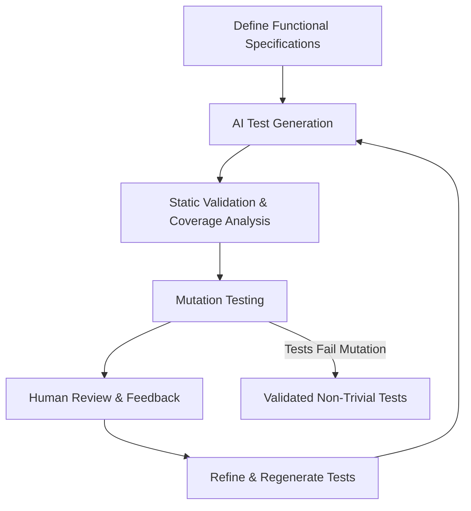

# **Title:** Ensuring Meaningful AI-Generated Tests in Test-Driven Development

## **Abstract**

Test-Driven Development (TDD) is a core practice in modern software engineering, ensuring that software elements are built to meet functional specifications. With the rise of AI-assisted development, AI agents are increasingly used to generate TDD tests. However, AI-generated tests risk being trivial or placeholder if not properly guided and validated. This paper presents a methodology to ensure AI-generated TDD tests are meaningful, specification-driven, and robust. Techniques include precise specification, AI prompt engineering, mutation testing, coverage analysis, and human-in-the-loop validation.

---

## **1. Introduction**

Test-Driven Development (TDD) requires writing tests before implementing software features. Tests define expected behavior and enforce correctness. The integration of AI agents to generate TDD tests offers potential efficiency gains but raises challenges: How can we guarantee that AI-generated tests are non-trivial, accurately reflect functional specifications, and genuinely validate software behavior?

This paper proposes a systematic approach for AI-assisted TDD that ensures test quality, alignment with specifications, and functional correctness.

---

## **2. Background**

### 2.1 Test-Driven Development

TDD follows a cycle: **Red → Green → Refactor**:

1. Write a test that fails.
2. Implement code to pass the test.
3. Refactor while maintaining passing tests.

The effectiveness of TDD depends on tests being **accurate, comprehensive, and behavior-driven**.

### 2.2 AI-Generated Testing

AI agents can produce test cases from specifications or natural language prompts. However:

* AI may generate **trivial tests** (e.g., testing only “happy path” scenarios).
* Without careful validation, AI tests may **pass without enforcing meaningful behavior**.

---

## **3. Methodology for Meaningful AI-Generated TDD**

### 3.1 Specification-Driven Test Generation

1. **Functional Specification Definition**

   * Define inputs, outputs, edge cases, and invariants.
   * Document behavioral contracts, side effects, and state changes.
2. **Prompt Engineering for AI**

   * Instruct the AI to generate **diverse tests**, including boundary and error conditions.
   * Specify expected **behavioral assertions**, not just return values.

### 3.2 Validation Techniques

1. **Mutation Testing**

   * Introduce small code mutations.
   * Verify tests fail for incorrect code; passing mutations indicate trivial tests.
2. **Coverage Analysis**

   * Ensure all code paths, branches, and conditions are exercised.
   * Measure assertion richness per test.
3. **Property-Based Testing**

   * Complement AI-generated tests with automatic property exploration for edge cases.

### 3.3 Human-in-the-Loop Review

* Developers review AI-generated tests for:

  * Alignment with functional specification.
  * Adequacy of edge cases and behavioral checks.
* Feedback is used to refine AI prompts and regenerate tests.

### 3.4 Iterative Refinement

* Regenerate tests when gaps are detected.
* Continuously validate against mutation testing and coverage metrics.

---

## **4. Implementation Workflow**

* **Key principle:** Tests only pass when the software meets the functional specification; trivial or placeholder tests are filtered out via iterative validation.

---

## **5. Discussion**

* **Advantages**

  * Reduces manual effort in writing comprehensive tests.
  * AI can identify diverse scenarios that humans might overlook.
* **Challenges**

  * AI quality depends on specification completeness.
  * Human review remains critical to ensure semantic correctness.
* **Future Work**

  * Explore automated semantic alignment of AI-generated tests with functional specifications.
  * Incorporate reinforcement learning to optimise test generation.

---

## **6. Conclusion**

AI agents can accelerate TDD, but meaningfulness of tests cannot be assumed. A structured methodology combining precise specifications, AI prompt engineering, mutation testing, coverage analysis, and human-in-the-loop validation ensures that AI-generated tests are non-trivial, behavior-enforcing, and aligned with functional specifications. This approach preserves the integrity of TDD while leveraging AI efficiency.

---

### **References**

1. Beck, K. *Test-Driven Development: By Example*. Addison-Wesley, 2003.
2. Stryker Mutator. [https://stryker-mutator.io/](https://stryker-mutator.io/)
3. Property-Based Testing: Hypothesis (Python). [https://hypothesis.readthedocs.io/](https://hypothesis.readthedocs.io/)
4. Fowler, M. *Refactoring: Improving the Design of Existing Code*. Addison-Wesley, 1999.

