# PATH Framework: Complete Integration with Flow Patterns


**Process/AI/Technology/Human for Software Engineering - Comprehensive Documentation**

## Table of Contents
1. [PATH Framework Overview](#path-framework-overview)
2. [PATH Flow Pattern Analysis](#path-flow-pattern-analysis)
3. [Detailed Agent Mapping](#detailed-agent-mapping-across-path-phases)
4. [Agent Collaboration Matrix](#agent-collaboration-matrix)
5. [Four-Phase Software Lifecycle](#four-phase-software-lifecycle)
6. [Cross-Methodology Integration](#cross-methodology-integration-points)
7. [Implementation Guidelines](#implementation-guidelines)
8. [Technology Backbone](#technology-backbone)
9. [Implementation Roadmap](#implementation-roadmap)

---

## PATH Framework Overview

### Definition
**PATH Framework** (Process/AI/Technology/Human) is a comprehensive methodology framework that structures software engineering practices around four integrated phases: Software Engineering, Test-Driven Development, DevOps & Production Readiness, and Production Operations & Maintenance. Each phase implements the PATH model to ensure systematic, scalable, and technology-enabled software delivery through collaborative human-AI teams.

### PATH Framework Architecture

```mermaid
graph TB
    subgraph "PATH Framework Lifecycle"
        A[Product Goals & Requirements] --> B[Phase 1: Software Engineering]
        B --> C[Phase 2: TDD Implementation]
        C --> D[Phase 3: DevOps & CI/CD]
        D --> E[Phase 4: Production Operations]
        E --> F[Product Success Metrics]
    end
    
    subgraph "Phase 1: Architecture & Design"
        B1["🤖 AI Domain Analyst"] -.-> B
        B2["🤖 AI System Architect"] -.-> B
        B3["🤖 AI Component Designer"] -.-> B
        B4["🤖 AI Integration Architect"] -.-> B
        B --> G1[system_architecture.yaml]
        B --> G2[component_designs.yaml]
        B --> G3[interface_specifications.yaml]
        T1[Architecture Tools] -.-> B
        H1[👤 Human Oversight] -.-> B
    end
    
    subgraph "Phase 2: TDD Implementation"
        C1["🤖 AI TDD Orchestrator"] -.-> C
        C2["🤖 AI Test Strategist"] -.-> C
        C3["🤖 AI Implementation Specialist"] -.-> C
        C4["🤖 AI Coverage Validator"] -.-> C
        C --> H2[test_specifications.yaml]
        C --> H3[implementation_artifacts.yaml]
        C --> H4[deployment_packages.yaml]
        T2[Testing Frameworks] -.-> C
        T2b[Promptus Framework] -.-> C
        H2[👤 Human Code Review] -.-> C
    end
    
    subgraph "Phase 3: DevOps & CI/CD"
        D1["🤖 AI Pipeline Architect"] -.-> D
        D2["🤖 AI Infrastructure Engineer"] -.-> D
        D3["🤖 AI Deployment Specialist"] -.-> D
        D4["🤖 AI Monitoring Analyst"] -.-> D
        D --> I1[pipeline_configurations.yaml]
        D --> I2[infrastructure_templates.yaml]
        D --> I3[monitoring_configurations.yaml]
        T3[CI/CD Platforms] -.-> D
        H3[👤 Human Validation] -.-> D
    end
    
    subgraph "Phase 4: Operations"
        E1["🤖 AI Reliability Engineer"] -.-> E
        E2["🤖 AI Operations Specialist"] -.-> E
        E3["🤖 AI Performance Analyst"] -.-> E
        E4["🤖 AI Security Operator"] -.-> E
        E --> J1[kpi_reports.yaml]
        E --> J2[performance_reports.yaml]
        E --> J3[operational_excellence.yaml]
        T4[Monitoring Systems] -.-> E
        H4[👤 Human Escalation] -.-> E
    end
    
    subgraph "Process Quality Gates"
        L1[Architecture Validation] -.-> B
        L2[Coverage Validation] -.-> C
        L3[Deployment Validation] -.-> D
        L4[Performance Validation] -.-> E
    end
```



---

## PATH Flow Pattern Analysis

The PATH Framework implements three distinct flow patterns that reflect the actual human-AI collaboration dynamics:

### **Flow Pattern 1: Human-Initiated Process**
```
INPUT → HUMAN → AI + TECHNOLOGY → PROCESS → OUTPUT
```

**When Used**: 
- Project initiation
- Strategic decisions
- Creative requirements
- Major direction changes

**Example - Phase 1 Architecture:**
```
Product Goals & Requirements 
    ↓
👤 Human Oversight (Strategic Direction)
    ↓
🤖 AI Domain Analyst + Architecture Tools
    ↓
Architecture Analysis Process
    ↓
system_architecture.yaml
```

**Human Role**: Strategic input, creative direction, goal setting
**AI Role**: Analysis, pattern recognition, systematic execution
**Technology Role**: Tools and frameworks for analysis and design
**Process Role**: Structured workflow for architecture creation

### **Flow Pattern 2: AI-Driven Automation**
```
OUTPUT (from previous phase) → AI + TECHNOLOGY → PROCESS → OUTPUT
```

**When Used**:
- Routine transformations
- Data processing
- Systematic analysis
- Pattern-based generation

**Example - Phase 2 TDD (Test Generation):**
```
system_architecture.yaml
    ↓
🤖 AI Test Strategist + Testing Frameworks
    ↓
Test Generation Process
    ↓
test_specifications.yaml
```

**AI Role**: Automated processing, pattern application, systematic generation
**Technology Role**: Testing frameworks, automation tools, validation systems
**Process Role**: RED-GREEN-REFACTOR workflow automation
**Human Role**: Quality validation (downstream)

### **Flow Pattern 3: Human-AI Collaborative Decision**
```
(OUTPUT from previous phase + HUMAN) → AI + TECHNOLOGY → PROCESS → OUTPUT
```

**When Used**:
- Critical decisions
- Risk assessment
- Quality validation
- Production deployment

**Example - Phase 3 DevOps (Deployment Approval):**
```
(deployment_packages.yaml + 👤 Human Validation)
    ↓
🤖 AI Deployment Specialist + CI/CD Platforms
    ↓
Deployment Authorization Process
    ↓
pipeline_configurations.yaml
```

**Human Role**: Approval gates, risk assessment, strategic oversight
**AI Role**: Technical analysis, automation execution, optimization
**Technology Role**: CI/CD platforms, monitoring, infrastructure tools
**Process Role**: Validated deployment workflow with human checkpoints

---

## Detailed Agent Mapping Across PATH Phases

### **Phase 1: Architecture & Design**
| Step | Flow Pattern | Input | Primary Agent | Supporting Agents | Human Role | Technology Stack | Process | Output |
|------|--------------|-------|---------------|------------------|------------|------------------|---------|---------|
| **Context Analysis** | Pattern 1 | Product Goals & Requirements | 🤖 **AI Domain Analyst** | - | 👤 Strategic Direction, Goal Setting | Requirements Tools, Domain Modeling | Requirements Analysis Workflow | domain_context.yaml |
| **Domain Modeling** | Pattern 2 | domain_context.yaml | 🤖 **AI Domain Analyst** | - | - | Domain Modeling Tools, UML Tools | Domain Analysis Workflow | domain_model.yaml |
| **Architecture Design** | Pattern 2 | domain_model.yaml | 🤖 **AI System Architect** | AI Domain Analyst (consultation) | - | Architecture Patterns, Design Tools | Architecture Design Workflow | system_architecture.yaml |
| **Component Design** | Pattern 2 | system_architecture.yaml | 🤖 **AI Component Designer** | AI System Architect (review) | - | SOLID Tools, Design Patterns | Component Design Workflow | component_designs.yaml |
| **Integration Design** | Pattern 2 | component_designs.yaml | 🤖 **AI Integration Architect** | AI Component Designer, AI System Architect | - | API Tools, Integration Patterns | Integration Design Workflow | integration_specs.yaml |
| **Architecture Validation** | Pattern 3 | integration_specs.yaml + Human Review | 🤖 **AI System Architect** | All Phase 1 Agents | 👤 Architecture Approval, Risk Assessment | Validation Tools, Review Frameworks | Architecture Validation Workflow | interface_specifications.yaml |
| **Final Documentation** | Pattern 2 | interface_specifications.yaml | 🤖 **AI Integration Architect** | All Phase 1 Agents | - | Documentation Tools | Documentation Workflow | architecture_decisions.md |

### **Phase 2: TDD Implementation**
| Step | Flow Pattern | Input | Primary Agent | Supporting Agents | Human Role | Technology Stack | Process | Output |
|------|--------------|-------|---------------|------------------|------------|------------------|---------|---------|
| **Test Strategy Planning** | Pattern 2 | interface_specifications.yaml | 🤖 **AI TDD Orchestrator** | AI Test Strategist (consultation) | - | TDD Frameworks, Planning Tools | TDD Planning Workflow | test_strategy.yaml |
| **Test Case Generation** | Pattern 2 | test_strategy.yaml | 🤖 **AI Test Strategist** | AI TDD Orchestrator (coordination) | - | Testing Frameworks, Test Generators | Test Generation Workflow | test_specifications.yaml |
| **RED Phase (Failing Tests)** | Pattern 2 | test_specifications.yaml | 🤖 **AI Implementation Specialist** | AI Test Strategist (test validation) | - | Testing Tools, Code Scaffolding | RED Workflow | failing_tests.yaml |
| **GREEN Phase (Implementation)** | Pattern 2 | failing_tests.yaml | 🤖 **AI Implementation Specialist** | AI TDD Orchestrator (workflow), AI Test Strategist (test compliance) | - | Development Tools, Code Generation | GREEN Workflow | working_implementation.yaml |
| **REFACTOR Phase** | Pattern 2 | working_implementation.yaml | 🤖 **AI Implementation Specialist** | AI Coverage Validator (quality check) | - | Refactoring Tools, Code Quality Tools | REFACTOR Workflow | refactored_code.yaml |
| **Coverage Validation** | Pattern 2 | refactored_code.yaml | 🤖 **AI Coverage Validator** | AI Implementation Specialist (code review), AI Test Strategist (test adequacy) | - | Coverage Tools, Quality Metrics | Coverage Analysis Workflow | coverage_report.yaml |
| **Code Review & Approval** | Pattern 3 | coverage_report.yaml + Human Code Review | 🤖 **AI Coverage Validator** | All Phase 2 Agents | 👤 Code Review, Quality Approval | Code Review Tools, Quality Gates | Human Code Review Workflow | implementation_artifacts.yaml |
| **Deployment Package Creation** | Pattern 2 | implementation_artifacts.yaml | 🤖 **AI TDD Orchestrator** | AI Implementation Specialist, AI Coverage Validator | - | Build Tools, Package Managers | Package Creation Workflow | deployment_packages.yaml |

### **Phase 3: DevOps & CI/CD**
| Step | Flow Pattern | Input | Primary Agent | Supporting Agents | Human Role | Technology Stack | Process | Output |
|------|--------------|-------|---------------|------------------|------------|------------------|---------|---------|
| **Pipeline Architecture** | Pattern 2 | deployment_packages.yaml | 🤖 **AI Pipeline Architect** | - | - | CI/CD Platforms, Pipeline Tools | Pipeline Design Workflow | pipeline_design.yaml |
| **Infrastructure Planning** | Pattern 2 | pipeline_design.yaml | 🤖 **AI Infrastructure Engineer** | AI Pipeline Architect (coordination) | - | IaC Tools, Cloud Platforms | Infrastructure Planning Workflow | infrastructure_plan.yaml |
| **Infrastructure Provisioning** | Pattern 2 | infrastructure_plan.yaml | 🤖 **AI Infrastructure Engineer** | AI Monitoring Analyst (observability setup) | - | Terraform, CloudFormation, Kubernetes | Infrastructure Workflow | infrastructure_templates.yaml |
| **Deployment Configuration** | Pattern 2 | infrastructure_templates.yaml | 🤖 **AI Deployment Specialist** | AI Infrastructure Engineer (infrastructure), AI Pipeline Architect (pipeline integration) | - | Deployment Tools, Container Orchestration | Deployment Config Workflow | deployment_config.yaml |
| **Monitoring & Observability Setup** | Pattern 2 | deployment_config.yaml | 🤖 **AI Monitoring Analyst** | AI Infrastructure Engineer (infrastructure integration), AI Deployment Specialist (deployment integration) | - | Monitoring Tools, Observability Platforms | Monitoring Setup Workflow | monitoring_config.yaml |
| **Security & Compliance Validation** | Pattern 2 | monitoring_config.yaml | 🤖 **AI Deployment Specialist** | AI Infrastructure Engineer (security review), AI Monitoring Analyst (security monitoring) | - | Security Tools, Compliance Scanners | Security Validation Workflow | security_validation.yaml |
| **Production Deployment Approval** | Pattern 3 | security_validation.yaml + Human Validation | 🤖 **AI Deployment Specialist** | All Phase 3 Agents | 👤 Deployment Approval, Risk Assessment, Security Sign-off | Approval Workflows, Risk Assessment Tools | Deployment Approval Workflow | pipeline_configurations.yaml |

### **Phase 4: Production Operations**
| Step | Flow Pattern | Input | Primary Agent | Supporting Agents | Human Role | Technology Stack | Process | Output |
|------|--------------|-------|---------------|------------------|------------|------------------|---------|---------|
| **Production Monitoring Setup** | Pattern 2 | pipeline_configurations.yaml | 🤖 **AI Reliability Engineer** | AI Monitoring Analyst (from Phase 3), AI Performance Analyst (performance metrics) | - | Monitoring Systems, SRE Tools | Production Monitoring Workflow | production_monitoring.yaml |
| **Performance Baseline Establishment** | Pattern 2 | production_monitoring.yaml | 🤖 **AI Performance Analyst** | AI Reliability Engineer (SLA integration), AI Operations Specialist (operational metrics) | - | Performance Tools, Analytics Platforms | Performance Baseline Workflow | performance_baseline.yaml |
| **Security Operations Setup** | Pattern 2 | performance_baseline.yaml | 🤖 **AI Security Operator** | AI Reliability Engineer (security SLAs), AI Operations Specialist (security operations) | - | Security Monitoring, Threat Detection | Security Operations Workflow | security_operations.yaml |
| **Operational Automation** | Pattern 2 | security_operations.yaml | 🤖 **AI Operations Specialist** | AI Reliability Engineer (automation review), AI Performance Analyst (performance impact) | - | Automation Tools, Runbook Systems | Operations Automation Workflow | operational_automation.yaml |
| **SLA Monitoring & Alerting** | Pattern 2 | operational_automation.yaml | 🤖 **AI Reliability Engineer** | All Phase 4 Agents | - | SLA Monitoring, Alerting Systems | SLA Monitoring Workflow | sla_monitoring.yaml |
| **Performance Analysis & Optimization** | Pattern 2 | sla_monitoring.yaml | 🤖 **AI Performance Analyst** | AI Reliability Engineer (SLA impact), AI Operations Specialist (operational impact) | - | Performance Analytics, Optimization Tools | Performance Analysis Workflow | performance_reports.yaml |
| **Security Incident Response** | Pattern 2 | performance_reports.yaml | 🤖 **AI Security Operator** | AI Operations Specialist (incident response), AI Reliability Engineer (system impact) | - | Incident Response Tools, Security Analytics | Security Response Workflow | security_incidents.yaml |
| **Operational Excellence Reporting** | Pattern 2 | security_incidents.yaml | 🤖 **AI Operations Specialist** | All Phase 4 Agents | - | Reporting Tools, Analytics Platforms | Excellence Reporting Workflow | operational_metrics.yaml |
| **Critical Incident Escalation** | Pattern 3 | operational_metrics.yaml + Critical Alert | 🤖 **AI Operations Specialist** | AI Reliability Engineer (system impact), AI Security Operator (security assessment) | 👤 Incident Commander, Strategic Decision Making | Incident Management, Escalation Procedures | Incident Escalation Workflow | incident_response.yaml |
| **Continuous Improvement Analysis** | Pattern 3 | incident_response.yaml + Human Review | 🤖 **AI Reliability Engineer** | All Phase 4 Agents | 👤 Strategic Improvement Decisions, Process Evolution | Improvement Analytics, Feedback Systems | Improvement Analysis Workflow | operational_excellence.yaml |

### **Cross-Phase Feedback Loops**
| Step | Flow Pattern | Input | Primary Agent | Supporting Agents | Human Role | Technology Stack | Process | Output |
|------|--------------|-------|---------------|------------------|------------|------------------|---------|---------|
| **Performance Feedback to Architecture** | Pattern 1 | operational_excellence.yaml | 🤖 **AI Domain Analyst** (Phase 1) | AI Performance Analyst (Phase 4), AI Reliability Engineer (Phase 4) | 👤 Strategic Architecture Evolution | Analytics Tools, Architecture Tools | Feedback Analysis Workflow | architecture_evolution.yaml |
| **Security Feedback to DevOps** | Pattern 2 | security_incidents.yaml | 🤖 **AI Deployment Specialist** (Phase 3) | AI Security Operator (Phase 4), AI Infrastructure Engineer (Phase 3) | - | Security Tools, DevOps Platforms | Security Improvement Workflow | security_improvements.yaml |
| **Quality Feedback to TDD** | Pattern 2 | performance_reports.yaml | 🤖 **AI Test Strategist** (Phase 2) | AI Performance Analyst (Phase 4), AI Coverage Validator (Phase 2) | - | Testing Tools, Quality Analytics | Quality Improvement Workflow | test_improvements.yaml |

---

## Agent Collaboration Matrix

### **Primary vs Supporting Agent Roles**

| Agent | Primary Responsibilities | Supporting Roles | Collaboration Patterns |
|-------|-------------------------|------------------|------------------------|
| **🤖 AI Domain Analyst** | Requirements analysis, domain modeling, feedback integration | Consultation for architecture decisions, cross-phase feedback | Works with System Architect on architecture validation, provides domain context to all Phase 1 agents |
| **🤖 AI System Architect** | Architecture design, pattern selection, technology stack decisions | Architecture validation, design reviews | Collaborates with all Phase 1 agents, coordinates with TDD Orchestrator for handoff |
| **🤖 AI Component Designer** | Component design, SOLID principles, dependency management | Design reviews, component validation | Works closely with System Architect and Integration Architect, provides input to Implementation Specialist |
| **🤖 AI Integration Architect** | Integration patterns, API design, system interfaces | Integration reviews, handoff coordination | Coordinates between Phase 1 and Phase 2, works with all Phase 1 agents for final specifications |
| **🤖 AI TDD Orchestrator** | TDD workflow coordination, process management, cycle orchestration | Phase coordination, handoff management | Coordinates all Phase 2 agents, manages RED-GREEN-REFACTOR cycles, interfaces with Phase 1 and Phase 3 |
| **🤖 AI Test Strategist** | Test case generation, test strategy design, test adequacy assessment | Test validation, quality consultation | Works with TDD Orchestrator and Implementation Specialist, provides feedback to Phase 1 architecture |
| **🤖 AI Implementation Specialist** | Code generation, implementation, refactoring | Code reviews, implementation validation | Collaborates with Test Strategist and Coverage Validator, coordinates with TDD Orchestrator |
| **🤖 AI Coverage Validator** | Coverage analysis, quality metrics, validation reporting | Quality gates, code review support | Works with all Phase 2 agents, provides quality assurance for human review gates |
| **🤖 AI Pipeline Architect** | CI/CD design, pipeline optimization, automation configuration | Pipeline reviews, DevOps coordination | Coordinates with Infrastructure Engineer and Deployment Specialist, interfaces with Phase 2 and Phase 4 |
| **🤖 AI Infrastructure Engineer** | Infrastructure templating, resource optimization, IaC management | Infrastructure reviews, security consultation | Works with Pipeline Architect and Monitoring Analyst, supports Deployment Specialist |
| **🤖 AI Deployment Specialist** | Deployment strategies, rollback procedures, environment management | Security validation, deployment reviews | Collaborates with all Phase 3 agents, manages deployment approval processes |
| **🤖 AI Monitoring Analyst** | Observability setup, alert configuration, monitoring design | Performance monitoring, infrastructure monitoring | Works across Phase 3 and Phase 4, supports Reliability Engineer and Performance Analyst |
| **🤖 AI Reliability Engineer** | SLA monitoring, reliability analysis, system optimization | SRE practices, incident analysis | Coordinates all Phase 4 agents, provides feedback to Phase 1 for architecture evolution |
| **🤖 AI Operations Specialist** | Operational automation, runbook execution, incident response | Day-to-day operations, escalation management | Works with all Phase 4 agents, manages critical incident escalation |
| **🤖 AI Performance Analyst** | Performance tracking, bottleneck identification, optimization | Performance validation, monitoring support | Collaborates with Reliability Engineer and Operations Specialist, provides feedback to earlier phases |
| **🤖 AI Security Operator** | Security monitoring, threat detection, compliance validation | Security reviews, incident response | Works across all phases for security concerns, coordinates with Operations Specialist for incidents |

### **Agent Handoff Protocols**

#### **Phase 1 → Phase 2 Handoff**
- **Primary Handoff**: AI Integration Architect → AI TDD Orchestrator
- **Artifact**: interface_specifications.yaml
- **Supporting Consultation**: All Phase 1 agents available for Phase 2 questions
- **Human Gate**: Architecture approval before TDD begins

#### **Phase 2 → Phase 3 Handoff**
- **Primary Handoff**: AI TDD Orchestrator → AI Pipeline Architect  
- **Artifact**: deployment_packages.yaml
- **Supporting Consultation**: AI Coverage Validator provides quality metrics, AI Implementation Specialist provides deployment notes
- **Human Gate**: Code review and deployment package approval

#### **Phase 3 → Phase 4 Handoff**
- **Primary Handoff**: AI Deployment Specialist → AI Reliability Engineer
- **Artifact**: pipeline_configurations.yaml
- **Supporting Consultation**: AI Monitoring Analyst provides observability setup, AI Infrastructure Engineer provides infrastructure details
- **Human Gate**: Production deployment approval

#### **Phase 4 → Phase 1 Feedback**
- **Primary Feedback**: AI Reliability Engineer → AI Domain Analyst
- **Artifact**: operational_excellence.yaml
- **Supporting Input**: All Phase 4 agents provide operational insights
- **Human Gate**: Strategic architecture evolution decisions

### **Agent Decision Authority Matrix**

| Decision Type | Primary Agent | Required Approvals | Escalation Path |
|---------------|---------------|-------------------|-----------------|
| **Architecture Patterns** | AI System Architect | Human Architect | Strategic Review Board |
| **Technology Stack** | AI System Architect | Human Technical Lead | Architecture Review Committee |
| **Component Design** | AI Component Designer | AI System Architect Review | Human Architecture Review |
| **Integration Patterns** | AI Integration Architect | Human Integration Review | Architecture Committee |
| **Test Strategy** | AI Test Strategist | AI TDD Orchestrator Approval | Human QA Lead |
| **Implementation Approach** | AI Implementation Specialist | AI Coverage Validator Validation | Human Code Review |
| **Code Quality Gates** | AI Coverage Validator | Human Code Reviewer | Development Manager |
| **Deployment Strategy** | AI Deployment Specialist | Human DevOps Lead | Operations Manager |
| **Infrastructure Changes** | AI Infrastructure Engineer | Human Infrastructure Approval | Platform Architecture Board |
| **Production Deployment** | AI Deployment Specialist | Human Production Approval | Change Advisory Board |
| **Security Policies** | AI Security Operator | Human Security Officer | Security Review Board |
| **Performance SLAs** | AI Performance Analyst | Human SRE Lead | Service Owner |
| **Incident Response** | AI Operations Specialist | Human Incident Commander | Escalation Matrix |
| **Architecture Evolution** | AI Domain Analyst | Human Strategic Review | Executive Architecture Board |

---

## Four-Phase Software Lifecycle

### **Phase 1: Architecture & Design**
**Methodology**: PATH-Based Software Engineering
**Focus**: System architecture, component design, integration patterns
**Key Agents**: AI Domain Analyst, AI System Architect, AI Component Designer, AI Integration Architect
**Inputs**: Product goals and functionalities, technical specifications, industry standards, regulatory requirements, business constraints
**Primary Deliverables**: 
- Architecture specifications
- Component designs
- Integration patterns
- Technical design documents
- System interfaces
- Data models

### **Phase 2: Implementation & Testing**
**Methodology**: PATH-Based TDD (with Promptus Integration)
**Focus**: Test-driven development, implementation, code quality
**Key Agents**: AI TDD Orchestrator, AI Test Strategist, AI Implementation Specialist, AI Coverage Validator
**Inputs**: Architecture specifications, component designs, integration patterns, technical design documents, system interfaces, data models
**Primary Deliverables**: 
- Test suites
- Production-ready code
- Quality metrics
- Code documentation
- Test reports
- Deployment artifacts

### **Phase 3: Deployment & CI/CD**
**Methodology**: PATH-Based DevOps
**Focus**: Continuous integration, deployment automation, infrastructure management
**Key Agents**: AI Pipeline Architect, AI Infrastructure Engineer, AI Deployment Specialist, AI Monitoring Analyst
**Inputs**: Test suites, production-ready code, quality metrics, code documentation, test reports, deployment artifacts
**Primary Deliverables**: 
- CI/CD pipelines
- Infrastructure automation
- Deployment systems
- Monitoring infrastructure
- Operational procedures
- Security configurations

### **Phase 4: Operations & Maintenance**
**Methodology**: PATH-Based Operations
**Focus**: Production operations, monitoring, incident response, continuous improvement
**Key Agents**: AI Reliability Engineer, AI Operations Specialist, AI Performance Analyst, AI Security Operator
**Inputs**: CI/CD pipelines, infrastructure automation, deployment systems, monitoring infrastructure, operational procedures, security configurations
**Primary Deliverables**: 
- Key performance indicators (KPIs)
- Product success metrics
- System reliability reports
- Performance analytics
- Security compliance reports
- Operational excellence metrics
- Continuous improvement recommendations

---

## Cross-Methodology Integration Points

### **Software Engineering → TDD Integration**
**Deliverable Mapping**:
- Architecture specifications → Test architecture design foundation
- Component designs → Unit test strategies and component test plans
- Integration patterns → Integration test frameworks and API test suites
- Technical design documents → Test specification documents
- System interfaces → Interface testing specifications
- Data models → Test data models and validation rules

**Agent Collaboration**:
- `system_architect` + `tdd_orchestrator`: Architecture-driven test strategy
- `component_designer` + `test_strategist`: Component-level test design
- `integration_architect` + `implementation_specialist`: Integration test implementation

### **TDD → DevOps Integration**
**Deliverable Mapping**:
- Test suites → Automated test pipelines and quality gates
- Production-ready code → Deployment artifacts and containerized applications
- Quality metrics → Pipeline quality gates and deployment validation criteria
- Code documentation → Deployment documentation and operational guides
- Test reports → Pipeline testing reports and quality dashboards
- Deployment artifacts → CI/CD pipeline inputs and infrastructure deployment packages

**Agent Collaboration**:
- `coverage_validator` + `pipeline_architect`: Quality gate design and implementation
- `implementation_specialist` + `deployment_specialist`: Deployment automation and artifact management
- `tdd_orchestrator` + `infrastructure_engineer`: Test infrastructure and pipeline orchestration

### **DevOps → Operations Integration**
**Deliverable Mapping**:
- CI/CD pipelines → Production deployment automation and release management
- Infrastructure automation → Operations infrastructure and system management
- Deployment systems → Production deployment procedures and rollback capabilities
- Monitoring infrastructure → Production monitoring systems and alerting
- Operational procedures → Day-to-day operations workflows and maintenance schedules
- Security configurations → Production security monitoring and compliance systems

**Agent Collaboration**:
- `monitoring_analyst` + `reliability_engineer`: Production monitoring setup and SRE practices
- `infrastructure_engineer` + `operations_specialist`: Infrastructure operations and maintenance
- `deployment_specialist` + `security_operator`: Secure deployment operations and compliance

### **Operations → Software Engineering Feedback**
**Feedback Loop Deliverables**:
- Key performance indicators (KPIs) → Performance requirements for next iteration
- Product success metrics → Business value insights for architecture evolution
- System reliability reports → Reliability requirements and architecture constraints
- Performance analytics → Performance optimization requirements for system design
- Security compliance reports → Security requirements and architecture security patterns
- Operational excellence metrics → Operational considerations for architecture decisions
- Continuous improvement recommendations → Architecture evolution and enhancement requirements

**Agent Collaboration**:
- `performance_analyst` + `system_architect`: Performance-driven architecture evolution
- `reliability_engineer` + `integration_architect`: Reliability patterns and system resilience
- `security_operator` + `domain_analyst`: Security requirements analysis and threat modeling

---

## Implementation Guidelines

### **For Pattern 1 (Human-Initiated):**
```python
def human_initiated_process(human_input, ai_agent, technology_stack):
    # Human provides strategic direction
    strategic_context = human_input.get_strategic_direction()
    
    # AI processes with human context
    ai_analysis = ai_agent.analyze_with_human_context(
        input_data=strategic_context,
        technology=technology_stack
    )
    
    # Execute systematic process
    result = process_workflow.execute(ai_analysis)
    return result
```

### **For Pattern 2 (AI-Driven):**
```python
def ai_driven_process(previous_output, ai_agent, technology_stack):
    # AI processes previous phase output
    ai_analysis = ai_agent.process_autonomously(
        input_data=previous_output,
        technology=technology_stack
    )
    
    # Execute automated workflow
    result = process_workflow.execute_automated(ai_analysis)
    return result
```

### **For Pattern 3 (Collaborative):**
```python
def collaborative_process(previous_output, human_validation, ai_agent, technology_stack):
    # Combine previous output with human validation
    combined_input = merge_inputs(previous_output, human_validation)
    
    # AI processes with human oversight
    ai_recommendation = ai_agent.analyze_with_human_oversight(
        input_data=combined_input,
        technology=technology_stack
    )
    
    # Human approves before execution
    if human_validation.approve(ai_recommendation):
        result = process_workflow.execute_with_approval(ai_recommendation)
    else:
        result = process_workflow.escalate_to_human(ai_recommendation)
    
    return result
```

---

## Technology Backbone

### **Coverage & Quality Tools**
- **Testing**: Jest, pytest, JUnit, xUnit frameworks
- **Coverage**: JaCoCo, pytest-cov, NYC, Istanbul
- **Quality**: SonarQube, CodeClimate, ESLint, Pylint

### **CI/CD Platforms**
- **Pipeline**: GitHub Actions, Jenkins, GitLab CI, Azure DevOps
- **Build**: Docker, Buildpacks, Bazel
- **Deployment**: Kubernetes, Helm, Terraform, CloudFormation

### **Observability & Monitoring**
- **Metrics**: Prometheus, Grafana, DataDog, New Relic
- **Logging**: ELK Stack, Splunk, Fluentd
- **Tracing**: Jaeger, Zipkin, OpenTelemetry

### **Security & Compliance**
- **Security**: Qualys, CrowdStrike, Snyk, OWASP ZAP
- **Compliance**: InSpec, Chef, Puppet
- **Vulnerability**: Safety, Bandit, npm audit

---

## Promptus Framework Integration

### **TDD Methodology Integration**
**Direct YAML Integration**: TDD methodology directly uses promptus YAML files:
- `tdd_workflow_promptus.yaml`: Core TDD workflow orchestration
- `coverage_validation_promptus.yaml`: Code coverage validation
- `emergency_repair_promptus.yaml`: Critical issue response

**Agent Promptus Mapping**:
- `tdd_orchestrator` → Uses tdd_workflow_promptus for orchestration
- `coverage_validator` → Uses coverage_validation_promptus for quality gates
- All agents → Use emergency_repair_promptus for critical issues

### **Cross-Methodology Promptus Extension**
**Architecture Promptus**: Software Engineering methodology can leverage promptus patterns
**DevOps Promptus**: DevOps methodology can adopt promptus automation patterns
**Operations Promptus**: Operations methodology can use promptus for incident response

---

## Implementation Roadmap

### **Phase 1: Foundation Setup**
1. Establish PATH framework understanding across teams
2. Implement promptus framework integration for TDD
3. Establish basic toolchain integration

### **Phase 2: Methodology Implementation**
1. Implement Software Engineering methodology for architecture phase
2. Integrate TDD methodology with promptus framework
3. Establish DevOps methodology for deployment automation
4. Implement Operations methodology for production management

### **Phase 3: Integration Optimization**
1. Optimize handoff procedures between methodologies
2. Enhance cross-methodology agent collaboration
3. Implement continuous feedback loops
4. Optimize technology ecosystem integration

### **Phase 4: Continuous Evolution**
1. Monitor methodology effectiveness metrics
2. Implement continuous improvement processes
3. Adapt methodologies based on domain-specific needs
4. Evolve PATH framework based on practical experience

---

## Key Insights from Flow Pattern Analysis

### **Pattern 1 (Human-Initiated) Characteristics:**
- **Frequency**: 20% of workflows
- **Purpose**: Strategic direction, creative input, major decisions
- **Human Authority**: High - Humans drive the process
- **AI Role**: Supportive analysis and execution
- **Examples**: Project initiation, major architectural decisions

### **Pattern 2 (AI-Driven) Characteristics:**
- **Frequency**: 60% of workflows  
- **Purpose**: Systematic processing, automation, pattern application
- **Human Authority**: Low - Validation only
- **AI Role**: Primary execution with technology integration
- **Examples**: Code generation, test creation, routine analysis

### **Pattern 3 (Collaborative) Characteristics:**
- **Frequency**: 20% of workflows
- **Purpose**: Critical decisions, quality gates, risk management
- **Human Authority**: High - Approval and oversight
- **AI Role**: Technical analysis and recommendation
- **Examples**: Deployment approval, code review, incident response

---

## Corrected PATH Model Definition

**PATH Framework** implements a dynamic flow model where:

- **P (Process)**: The systematic workflow that gets executed based on the specific flow pattern
- **A (AI)**: Intelligent agents that either lead (Pattern 2), support (Pattern 1), or collaborate (Pattern 3)  
- **T (Technology)**: The tools and platforms that enable AI execution and process automation
- **H (Human)**: Strategic direction (Pattern 1), quality validation (Pattern 2), or collaborative approval (Pattern 3)

The framework's power comes from recognizing when to use which flow pattern based on the nature of the work: strategic (Pattern 1), routine (Pattern 2), or critical (Pattern 3).

This comprehensive PATH framework provides a complete approach to software development lifecycle management through systematic methodology integration, agent collaboration, and technology ecosystem optimization, with clear understanding of human-AI collaboration patterns throughout the entire process.
