# PATH-Based Production Operations & Maintenance Methodology
**Process/AI/Technology/Human for Production Operations - Phase 4 Implementation**

**Version 2.0.0** | **Released: August 3, 2025**

## Overview
**PATH-Based Production Operations & Maintenance** is a systematic methodology for Site Reliability Engineering (SRE), production monitoring, and continuous improvement that follows the PATH (Process/AI/Technology/Human) framework. This methodology ensures reliable, performant, and maintainable production systems through proactive monitoring, incident response, and operational excellence practices, serving as Phase 4 of the complete PATH Framework lifecycle.

## Methodology Input/Output Specification

### **Input Deliverables (YAML Format)**
```yaml
methodology_inputs:
  ci_cd_pipelines:
    format: "YAML"
    files:
      - "pipeline_configurations.yaml"
      - "build_automation.yaml"
      - "deployment_workflows.yaml"
    content:
      - Production deployment pipelines
      - Automated release processes
      - Rollback and recovery procedures
  
  infrastructure_automation:
    format: "YAML"
    files:
      - "infrastructure_templates.yaml"
      - "environment_configurations.yaml"
      - "scaling_policies.yaml"
    content:
      - Production infrastructure setup
      - Environment management configurations
      - Scaling and resource management rules
  
  monitoring_systems:
    format: "YAML"
    files:
      - "monitoring_configurations.yaml"
      - "alerting_rules.yaml"
      - "dashboard_definitions.yaml"
    content:
      - Production monitoring infrastructure
      - Alerting and escalation procedures
      - Operational visibility and dashboards
```

### **Output Deliverables (YAML Format)**
```yaml
methodology_outputs:
  operational_metrics:
    format: "YAML"
    files:
      - "kpi_reports.yaml"
      - "sla_performance.yaml"
      - "system_health_metrics.yaml"
    content:
      - Key Performance Indicators (KPIs)
      - Service Level Agreement performance
      - System reliability and health metrics
  
  performance_analytics:
    format: "YAML"
    files:
      - "performance_reports.yaml"
      - "capacity_analysis.yaml"
      - "optimization_recommendations.yaml"
    content:
      - System performance analysis
      - Capacity planning and utilization
      - Performance optimization insights
  
  operational_excellence:
    format: "YAML"
    files:
      - "incident_reports.yaml"
      - "improvement_plans.yaml"
      - "compliance_status.yaml"
    content:
      - Incident response and resolution data
      - Continuous improvement initiatives
      - Security and compliance status
```

## Operations Management Process Flow

```mermaid
graph TD
    A[CI/CD & Infrastructure] --> B[Production Monitoring Setup]
    B --> C[Performance Baseline Establishment]
    C --> D[Security Operations Setup]
    D --> E[Operational Automation]
    E --> F[SLA Monitoring & Alerting]
    F --> G[Performance Analysis & Optimization]
    G --> H[Security Incident Response]
    H --> I[Operational Excellence Reporting]
    I --> J{Critical Incident?}
    J -->|Yes| K[Critical Incident Escalation]
    J -->|No| L[Continuous Improvement Analysis]
    K --> L
    L --> M[Operational Excellence]
    
    subgraph "AI Agent Responsibilities"
        N["🤖 AI Reliability Engineer"] -.-> B
        N -.-> F
        N -.-> K
        N -.-> L
        O["🤖 AI Performance Analyst"] -.-> C
        O -.-> G
        P["🤖 AI Security Operator"] -.-> D
        P -.-> H
        Q["🤖 AI Operations Specialist"] -.-> E
        Q -.-> I
        Q -.-> K
    end
    
    subgraph "Technology Tools"
        R[Monitoring Systems] -.-> B
        S[Performance Tools] -.-> C
        T[Security Tools] -.-> D
        U[Automation Tools] -.-> E
        V[SRE Tools] -.-> F
        W[Analytics Platforms] -.-> G
        X[Incident Response] -.-> H
        Y[Reporting Tools] -.-> I
        Z[Escalation Systems] -.-> K
        AA[Improvement Analytics] -.-> L
    end
    
    subgraph "Flow Patterns"
        BB1["Pattern 2: AI-Driven"] -.-> B
        BB1 -.-> C
        BB1 -.-> D
        BB1 -.-> E
        BB1 -.-> F
        BB1 -.-> G
        BB1 -.-> H
        BB1 -.-> I
        BB2["Pattern 3: Collaborative"] -.-> K
        BB2 -.-> L
    end
    
    subgraph "Output Deliverables"
        M --> CC[kpi_reports.yaml]
        M --> DD[performance_reports.yaml]
        M --> EE[incident_reports.yaml]
        M --> FF[operational_excellence.yaml]
    end
    
    style A fill:#e1f5fe
    style B fill:#f3e5f5
    style C fill:#f3e5f5
    style D fill:#f3e5f5
    style E fill:#f3e5f5
    style F fill:#f3e5f5
    style G fill:#f3e5f5
    style H fill:#f3e5f5
    style I fill:#f3e5f5
    style J fill:#f3e5f5
    style K fill:#f3e5f5
    style L fill:#f3e5f5
    style M fill:#f3e5f5
    style N fill:#fff3e0
    style O fill:#fff3e0
    style P fill:#fff3e0
    style Q fill:#fff3e0
    style R fill:#e8f5e8
    style S fill:#e8f5e8
    style T fill:#e8f5e8
    style U fill:#e8f5e8
    style V fill:#e8f5e8
    style W fill:#e8f5e8
    style X fill:#e8f5e8
    style Y fill:#e8f5e8
    style Z fill:#e8f5e8
    style AA fill:#e8f5e8
    style BB1 fill:#fff8e1
    style BB2 fill:#fff8e1
    style CC fill:#c8e6c9
    style DD fill:#c8e6c9
    style EE fill:#c8e6c9
    style FF fill:#c8e6c9
```



## PATH Flow Pattern Integration

### **Flow Pattern 2: AI-Driven Automation** (Operational Monitoring & Analysis)
```
pipeline_configurations.yaml → 🤖 AI Reliability Engineer + Monitoring Systems → Production Monitoring Process → production_monitoring.yaml
```
**Usage**: Continuous monitoring, performance analysis, security operations, routine maintenance
**AI Role**: Automated monitoring, pattern analysis, operational optimization, systematic maintenance
**Technology Role**: Monitoring systems, SRE tools, automation platforms, analytics tools
**Process Role**: Continuous operations workflow with proactive optimization

### **Flow Pattern 3: Human-AI Collaborative Decision** (Critical Incidents & Improvements)
```
(operational_metrics.yaml + 👤 Critical Alert) → 🤖 AI Operations Specialist + Incident Management → Incident Escalation Process → incident_response.yaml
```
**Usage**: Critical incident escalation, strategic improvement decisions, process evolution, major operational changes
**Human Role**: Incident commander, strategic decision making, process evolution, escalation authority
**AI Role**: Technical analysis, impact assessment, automated response coordination, optimization recommendations
**Technology Role**: Incident management systems, escalation procedures, improvement analytics, feedback systems

## PATH Implementation for Production Operations

### **People-Agent Teams: Core Human-AI Operations Team**

#### **AI Reliability Engineer**
**Primary Responsibility**: Site Reliability Engineering and system reliability with SRE teams
**Key Capabilities**: SRE practices, incident response, reliability patterns, chaos engineering
**Decision Authority**: SLA management recommendations, reliability target proposals (human approval)
**Human Collaboration**: Works with SRE teams and operations managers on reliability standards

#### **AI Operations Specialist**
**Primary Responsibility**: Day-to-day operations and maintenance with operations teams
**Key Capabilities**: System maintenance, operational procedures, routine tasks automation
**Decision Authority**: Maintenance schedule recommendations, operational workflow proposals (human oversight)
**Human Collaboration**: Partners with operations engineers and system administrators

#### **AI Performance Analyst**
**Primary Responsibility**: Performance monitoring and optimization with performance engineering teams
**Key Capabilities**: Performance analysis, capacity planning, optimization strategies
**Decision Authority**: Performance target recommendations, scaling decision analysis (human approval)
**Human Collaboration**: Collaborates with performance engineers and capacity planners

#### **AI Security Operator**
**Primary Responsibility**: Production security and compliance maintenance with security teams
**Key Capabilities**: Security monitoring, threat response, compliance validation
**Decision Authority**: Security policy recommendations, threat response proposals (human validation)
**Human Collaboration**: Works with security teams and compliance officers

### **Process: Operations Management Phases**

## Detailed Phase Mapping (Aligned with PATH Framework)

| Step | Flow Pattern | Input | Primary Agent | Supporting Agents | Human Role | Technology Stack | Process | Output |
|------|--------------|-------|---------------|------------------|------------|------------------|---------|---------|
| **Production Monitoring Setup** | Pattern 2 | pipeline_configurations.yaml | 🤖 **AI Reliability Engineer** | AI Monitoring Analyst (from Phase 3), AI Performance Analyst (performance metrics) | - | Monitoring Systems, SRE Tools | Production Monitoring Workflow | production_monitoring.yaml |
| **Performance Baseline Establishment** | Pattern 2 | production_monitoring.yaml | 🤖 **AI Performance Analyst** | AI Reliability Engineer (SLA integration), AI Operations Specialist (operational metrics) | - | Performance Tools, Analytics Platforms | Performance Baseline Workflow | performance_baseline.yaml |
| **Security Operations Setup** | Pattern 2 | performance_baseline.yaml | 🤖 **AI Security Operator** | AI Reliability Engineer (security SLAs), AI Operations Specialist (security operations) | - | Security Monitoring, Threat Detection | Security Operations Workflow | security_operations.yaml |
| **Operational Automation** | Pattern 2 | security_operations.yaml | 🤖 **AI Operations Specialist** | AI Reliability Engineer (automation review), AI Performance Analyst (performance impact) | - | Automation Tools, Runbook Systems | Operations Automation Workflow | operational_automation.yaml |
| **SLA Monitoring & Alerting** | Pattern 2 | operational_automation.yaml | 🤖 **AI Reliability Engineer** | All Phase 4 Agents | - | SLA Monitoring, Alerting Systems | SLA Monitoring Workflow | sla_monitoring.yaml |
| **Performance Analysis & Optimization** | Pattern 2 | sla_monitoring.yaml | 🤖 **AI Performance Analyst** | AI Reliability Engineer (SLA impact), AI Operations Specialist (operational impact) | - | Performance Analytics, Optimization Tools | Performance Analysis Workflow | performance_reports.yaml |
| **Security Incident Response** | Pattern 2 | performance_reports.yaml | 🤖 **AI Security Operator** | AI Operations Specialist (incident response), AI Reliability Engineer (system impact) | - | Incident Response Tools, Security Analytics | Security Response Workflow | security_incidents.yaml |
| **Operational Excellence Reporting** | Pattern 2 | security_incidents.yaml | 🤖 **AI Operations Specialist** | All Phase 4 Agents | - | Reporting Tools, Analytics Platforms | Excellence Reporting Workflow | operational_metrics.yaml |
| **Critical Incident Escalation** | Pattern 3 | operational_metrics.yaml + Critical Alert | 🤖 **AI Operations Specialist** | AI Reliability Engineer (system impact), AI Security Operator (security assessment) | 👤 Incident Commander, Strategic Decision Making | Incident Management, Escalation Procedures | Incident Escalation Workflow | incident_response.yaml |
| **Continuous Improvement Analysis** | Pattern 3 | incident_response.yaml + Human Review | 🤖 **AI Reliability Engineer** | All Phase 4 Agents | 👤 Strategic Improvement Decisions, Process Evolution | Improvement Analytics, Feedback Systems | Improvement Analysis Workflow | operational_excellence.yaml |

#### **Phase 1: Production Monitoring Setup**
**Lead Agent**: `AI Reliability Engineer`
**Flow Pattern**: AI-Driven Automation
**Inputs**: Monitoring infrastructure, SLA definitions, operational baselines
**Process Steps**:
1. **SLI/SLO Management**: Monitor Service Level Indicators against Service Level Objectives
2. **Incident Detection**: Automated detection and classification of production incidents
3. **Alert Optimization**: Continuous refinement of alerting thresholds and escalation
4. **Trend Analysis**: Long-term trend analysis for capacity and performance planning

**Outputs**: SLI/SLO dashboards, incident detection systems, optimized alerting
**Quality Gates**: Alert accuracy, detection speed, escalation effectiveness

#### **Phase 2: Performance Baseline Establishment**
**Lead Agent**: `AI Performance Analyst`
**Flow Pattern**: AI-Driven Automation
**Inputs**: Performance monitoring data, capacity trends, business growth projections
**Process Steps**:
1. **Performance Analysis**: Continuous analysis of system performance and bottlenecks
2. **Capacity Planning**: Proactive capacity planning based on growth and usage patterns
3. **Baseline Establishment**: Set performance benchmarks and SLA targets
4. **Optimization Planning**: Identify performance optimization opportunities

**Outputs**: Performance baselines, capacity analysis, optimization roadmap
**Quality Gates**: Baseline accuracy, capacity adequacy, optimization effectiveness

#### **Phase 3: Security Operations Setup**
**Lead Agent**: `AI Security Operator`
**Flow Pattern**: AI-Driven Automation
**Inputs**: Security monitoring data, compliance requirements, threat intelligence
**Process Steps**:
1. **Security Monitoring**: Continuous monitoring for security threats and vulnerabilities
2. **Threat Response**: Rapid response to security incidents and threats
3. **Compliance Validation**: Regular compliance checking and audit preparation
4. **Security Maintenance**: Security updates, patch management, and vulnerability remediation

**Outputs**: Security monitoring, threat response procedures, compliance reports
**Quality Gates**: Security posture, threat detection, compliance maintenance

#### **Phase 4: Operational Automation**
**Lead Agent**: `AI Operations Specialist`
**Flow Pattern**: AI-Driven Automation
**Inputs**: Operational procedures, maintenance schedules, system health data
**Process Steps**:
1. **Routine Maintenance**: Scheduled maintenance, updates, and system care
2. **Operational Procedures**: Execute routine operational tasks and workflows
3. **System Health Monitoring**: Regular system health checks and preventive maintenance
4. **Documentation Maintenance**: Keep operational documentation current and accurate

**Outputs**: Maintenance logs, operational reports, updated documentation
**Quality Gates**: Maintenance effectiveness, system health, documentation accuracy

#### **Phase 5: SLA Monitoring & Alerting**
**Lead Agent**: `AI Reliability Engineer`
**Flow Pattern**: AI-Driven Automation
**Inputs**: SLA definitions, monitoring data, performance baselines
**Process Steps**:
1. **SLA Tracking**: Continuous tracking of SLA compliance and performance
2. **Alert Management**: Intelligent alerting based on SLA thresholds and trends
3. **Escalation Procedures**: Automated escalation for SLA violations
4. **Reporting**: Regular SLA performance reporting and analysis

**Outputs**: SLA dashboards, alert configurations, performance reports
**Quality Gates**: SLA compliance, alert effectiveness, reporting accuracy

#### **Phase 6: Performance Analysis & Optimization**
**Lead Agent**: `AI Performance Analyst`
**Flow Pattern**: AI-Driven Automation
**Inputs**: Performance data, optimization opportunities, capacity analysis
**Process Steps**:
1. **Performance Optimization**: Performance optimization and resource efficiency improvements
2. **Scaling Management**: Automated and manual scaling based on demand patterns
3. **Bottleneck Analysis**: Identify and resolve system bottlenecks
4. **Capacity Adjustments**: Adjust capacity based on usage patterns and forecasts

**Outputs**: Performance reports, optimization implementations, scaling policies
**Quality Gates**: Performance target compliance, scaling effectiveness, resource efficiency

#### **Phase 7: Security Incident Response**
**Lead Agent**: `AI Security Operator`
**Flow Pattern**: AI-Driven Automation
**Inputs**: Security alerts, threat intelligence, incident data
**Process Steps**:
1. **Incident Detection**: Automated detection of security incidents and threats
2. **Response Coordination**: Coordinate security incident response procedures
3. **Containment & Recovery**: Contain threats and recover affected systems
4. **Post-Incident Analysis**: Analyze incidents and improve security posture

**Outputs**: Incident reports, response procedures, security improvements
**Quality Gates**: Detection speed, response effectiveness, security enhancement

#### **Phase 8: Operational Excellence Reporting**
**Lead Agent**: `AI Operations Specialist`
**Flow Pattern**: AI-Driven Automation
**Inputs**: All operational metrics, performance data, incident data
**Process Steps**:
1. **Metrics Collection**: Collect and analyze operational excellence metrics
2. **Trend Analysis**: Analyze trends and patterns in operational data
3. **Report Generation**: Generate comprehensive operational reports
4. **Insight Development**: Develop actionable insights for improvement

**Outputs**: Operational reports, trend analysis, improvement recommendations
**Quality Gates**: Report accuracy, insight quality, improvement actionability

#### **Phase 9: Critical Incident Escalation**
**Lead Agent**: `AI Operations Specialist`
**Supporting Agents**: `AI Reliability Engineer`, `AI Security Operator`
**Flow Pattern**: Human-AI Collaborative Decision
**Process Steps**:
1. **Incident Classification**: Rapid classification and severity assessment
2. **Human Escalation**: Escalate critical incidents to human incident commanders
3. **Response Coordination**: Coordinate response team and communication
4. **Strategic Decision Support**: Provide analysis for strategic incident decisions

**Outputs**: Incident response procedures, escalation documentation, decision support
**Quality Gates**: Response time, escalation effectiveness, decision quality

#### **Phase 10: Continuous Improvement Analysis**
**Lead Agent**: `AI Reliability Engineer`
**Supporting Agents**: All Phase 4 Agents
**Flow Pattern**: Human-AI Collaborative Decision
**Process Steps**:
1. **Improvement Opportunity Analysis**: Analyze operational data for improvement opportunities
2. **Human Strategic Review**: Strategic review with human stakeholders
3. **Process Evolution**: Evolve operational processes based on insights
4. **Implementation Planning**: Plan and execute operational improvements

**Outputs**: Improvement plans, process optimizations, evolution roadmap
**Quality Gates**: Improvement effectiveness, process efficiency, strategic alignment

### **Technology: Operations Management Tools**

#### **Monitoring and Observability**
- **Infrastructure Monitoring**: Prometheus, Grafana, DataDog, New Relic
- **Application Performance**: AppDynamics, Dynatrace, New Relic APM
- **Log Management**: ELK Stack, Splunk, Fluentd for centralized logging
- **Distributed Tracing**: Jaeger, Zipkin for microservices observability

#### **Incident Management**
- **Incident Response**: PagerDuty, Opsgenie, VictorOps for alerting and escalation
- **Communication**: Slack, Microsoft Teams, status pages for incident communication
- **Documentation**: Confluence, Notion, GitBook for runbooks and procedures
- **Analysis**: Datadog Incident Management, Splunk for incident analysis

#### **Automation and Orchestration**
- **Infrastructure Automation**: Ansible, Terraform, CloudFormation for infrastructure management
- **Task Automation**: Python scripts, PowerShell, Bash for routine task automation
- **Workflow Orchestration**: Apache Airflow, Temporal for complex workflow management
- **Configuration Management**: Chef, Puppet, Ansible for system configuration

#### **Security and Compliance**
- **Security Monitoring**: Splunk Security, IBM QRadar, CrowdStrike for threat detection
- **Vulnerability Management**: Nessus, Qualys, Rapid7 for vulnerability scanning
- **Compliance Management**: Chef InSpec, AWS Config for compliance automation
- **Backup and Recovery**: Veeam, Commvault, AWS Backup for data protection

## Agent Collaboration Framework

### **Incident Response Collaboration**
- **Primary Response**: `AI Reliability Engineer` leads incident response coordination
- **Specialized Support**: Other agents provide domain-specific expertise based on incident type
- **Communication**: Coordinated communication through incident management platforms
- **Learning**: All agents contribute to post-incident analysis and improvement

### **Operational Decision Making**
- **SLA Decisions**: Led by `AI Reliability Engineer` with input from performance and operations
- **Performance Decisions**: Led by `AI Performance Analyst` with infrastructure and reliability input
- **Security Decisions**: Led by `AI Security Operator` with validation from other agents
- **Operational Decisions**: Led by `AI Operations Specialist` with cross-agent coordination

### **Continuous Improvement Collaboration**
- **Metrics Sharing**: All agents share operational metrics and insights
- **Process Evolution**: Collaborative improvement of operational processes
- **Knowledge Management**: Shared documentation and knowledge base maintenance
- **Technology Evaluation**: Collaborative evaluation of new tools and technologies

## Domain-Specific Operations Adaptations

### **Protocol-Based Systems** (MQTT, HTTP, WebSocket)
- **Monitoring Focus**: Protocol-level monitoring, connection health, message throughput
- **Performance Focus**: Network latency, connection pooling, protocol optimization
- **Security Focus**: Protocol security, connection encryption, authentication monitoring
- **Incident Response**: Protocol-specific debugging, connection analysis, network diagnostics

### **Business Applications** (ERP, CRM, E-commerce)
- **Monitoring Focus**: Business process monitoring, user experience, transaction success
- **Performance Focus**: Database performance, application response time, user satisfaction
- **Security Focus**: Data protection, user access monitoring, business data security
- **Incident Response**: Business impact assessment, user communication, data integrity validation

### **Data Processing Systems** (ETL, Analytics, ML)
- **Monitoring Focus**: Data pipeline health, processing performance, data quality
- **Performance Focus**: Processing throughput, resource utilization, data freshness
- **Security Focus**: Data privacy, access control, data lineage protection
- **Incident Response**: Data pipeline recovery, quality validation, processing resumption

### **Real-Time Systems** (Trading, IoT, Gaming)
- **Monitoring Focus**: Real-time performance, latency monitoring, throughput tracking
- **Performance Focus**: Ultra-low latency optimization, high-frequency processing
- **Security Focus**: Real-time threat detection, performance security, data integrity
- **Incident Response**: Real-time recovery, performance restoration, latency optimization

## Quality Assurance Framework

### **Operations Quality Metrics**
- **Reliability Metrics**: Uptime, MTBF (Mean Time Between Failures), MTTR (Mean Time To Recovery)
- **Performance Metrics**: Response time, throughput, resource utilization, SLA compliance
- **Security Metrics**: Security incident frequency, vulnerability resolution time, compliance score
- **Operational Metrics**: Maintenance effectiveness, process efficiency, automation coverage

### **SRE Quality Framework**
- **Error Budgets**: Define and manage error budgets for service reliability
- **SLI/SLO Management**: Continuous monitoring and optimization of service level objectives
- **Reliability Engineering**: Systematic approach to improving system reliability
- **Chaos Engineering**: Proactive testing of system resilience and failure modes

### **Success Criteria**
- **High Availability**: Consistent uptime meeting or exceeding SLA requirements
- **Performance Excellence**: Optimal system performance under varying load conditions
- **Security Posture**: Strong security with rapid threat detection and response
- **Operational Efficiency**: Streamlined operations with high automation and minimal manual intervention

## Integration with DevOps Methodology

### **DevOps-to-Operations Handoff**
- **Monitoring Infrastructure**: DevOps monitoring systems become operations monitoring foundation
- **Automation Frameworks**: DevOps automation extended to operations workflows
- **Deployment Pipelines**: Operations team manages ongoing deployments and updates
- **Infrastructure Management**: Operations inherits and maintains DevOps infrastructure

### **Operations-to-Architecture Feedback**
- **Performance Insights**: Operations performance data influences architecture evolution
- **Scalability Requirements**: Operations scaling experience guides architecture decisions
- **Reliability Patterns**: Operations reliability insights inform architecture patterns
- **Technology Evaluation**: Operations experience with technology informs architecture choices

The PATH-Based Production Operations methodology provides systematic production system management that ensures reliable, performant, and secure operation while enabling continuous improvement and evolution of production systems.
