# PATH-Based Software Engineering Methodology
**Process/AI/Technology/Human for Architecture & Design - Phase 1 Implementation**

**Version 2.0.0** | **Released: August 3, 2025**

## Overview
**PATH-Based Software Engineering** is a systematic methodology for architecture and component design that follows the PATH (Process/AI/Technology/Human) framework. This methodology transforms domain requirements into comprehensive implementation blueprints through coordinated human-AI team expertise and systematic design phases, serving as Phase 1 of the complete PATH Framework lifecycle.

## Methodology Input/Output Specification

### **Input Deliverables (YAML Format)**
```yaml
methodology_inputs:
  product_requirements:
    format: "YAML"
    files:
      - "product_goals.yaml"
      - "functional_requirements.yaml"
      - "non_functional_requirements.yaml"
    content:
      - Business objectives and success criteria
      - Functional specifications and user stories
      - Performance, security, and scalability requirements
  
  technical_specifications:
    format: "YAML"
    files:
      - "technical_constraints.yaml"
      - "integration_requirements.yaml"
      - "platform_specifications.yaml"
    content:
      - Technology stack constraints
      - Third-party integration requirements
      - Platform and infrastructure specifications
  
  standards_and_compliance:
    format: "YAML"
    files:
      - "industry_standards.yaml"
      - "regulatory_requirements.yaml"
      - "security_standards.yaml"
    content:
      - Industry-specific standards (MQTT, REST API, etc.)
      - Regulatory compliance requirements
      - Security and privacy standards
```

### **Output Deliverables (YAML Format)**
```yaml
methodology_outputs:
  architecture_specifications:
    format: "YAML"
    files:
      - "system_architecture.yaml"
      - "component_architecture.yaml"
      - "integration_architecture.yaml"
    content:
      - High-level system architecture
      - Component relationships and dependencies
      - Integration patterns and protocols
  
  technical_design:
    format: "YAML"
    files:
      - "component_designs.yaml"
      - "interface_specifications.yaml"
      - "data_models.yaml"
    content:
      - Detailed component designs
      - API and interface specifications
      - Data models and schemas
  
  design_documentation:
    format: "Markdown"
    files:
      - "architecture_decisions.md"
      - "design_rationale.md"
      - "technical_specifications.md"
    content:
      - Architecture decision records (ADRs)
      - Design rationale and trade-offs
      - Technical implementation guidelines
```

## Architecture & Design Process Flow

```mermaid
graph TD
    A[Product Goals & Requirements] --> B[Context Analysis]
    B --> C[Domain Modeling]
    C --> D[Architecture Design]
    D --> E[Component Design]
    E --> F[Integration Design]
    F --> G[Architecture Validation]
    G --> H[Final Documentation]
    
    subgraph "AI Agent Responsibilities"
        I["🤖 AI Domain Analyst"] -.-> B
        I -.-> C
        I -.-> G
        I -.-> H
        J["🤖 AI System Architect"] -.-> D
        J -.-> G
        K["🤖 AI Component Designer"] -.-> E
        L["🤖 AI Integration Architect"] -.-> F
        L -.-> H
    end
    
    subgraph "Technology Tools"
        M[Requirements Tools] -.-> B
        N[Domain Modeling Tools] -.-> C
        O[Architecture Patterns] -.-> D
        P[SOLID Tools] -.-> E
        Q[API Tools] -.-> F
        R[Validation Tools] -.-> G
        S[Documentation Tools] -.-> H
    end
    
    subgraph "Flow Patterns"
        T1["Pattern 1: Human-Initiated"] -.-> B
        T2["Pattern 2: AI-Driven"] -.-> C
        T2 -.-> D
        T2 -.-> E
        T2 -.-> F
        T3["Pattern 3: Collaborative"] -.-> G
        T2 -.-> H
    end
    
    subgraph "Output Deliverables"
        H --> U[system_architecture.yaml]
        H --> V[component_designs.yaml]
        H --> W[interface_specifications.yaml]
        H --> X[integration_specs.yaml]
        H --> Y[architecture_decisions.md]
    end
    
    style A fill:#e1f5fe
    style B fill:#f3e5f5
    style C fill:#f3e5f5
    style D fill:#f3e5f5
    style E fill:#f3e5f5
    style F fill:#f3e5f5
    style G fill:#f3e5f5
    style H fill:#f3e5f5
    style I fill:#fff3e0
    style J fill:#fff3e0
    style K fill:#fff3e0
    style L fill:#fff3e0
    style M fill:#e8f5e8
    style N fill:#e8f5e8
    style O fill:#e8f5e8
    style P fill:#e8f5e8
    style Q fill:#e8f5e8
    style R fill:#e8f5e8
    style S fill:#e8f5e8
    style T1 fill:#fff8e1
    style T2 fill:#fff8e1
    style T3 fill:#fff8e1
    style U fill:#c8e6c9
    style V fill:#c8e6c9
    style W fill:#c8e6c9
    style X fill:#c8e6c9
    style Y fill:#c8e6c9
```



## PATH Flow Pattern Integration

### **Flow Pattern 1: Human-Initiated Process** (Context Analysis)
```
Product Goals & Requirements → 👤 Human Strategic Direction → 🤖 AI Domain Analyst + Requirements Tools → Requirements Analysis Process → domain_context.yaml
```
**Usage**: Project initiation, strategic direction setting, requirement clarification
**Human Role**: Strategic input, goal setting, requirement validation
**AI Role**: Requirements extraction, domain analysis, context mapping
**Technology Role**: Requirements analysis tools, domain modeling frameworks

### **Flow Pattern 2: AI-Driven Automation** (Design Phases)
```
domain_context.yaml → 🤖 AI System Architect + Architecture Tools → Architecture Design Process → system_architecture.yaml
```
**Usage**: Systematic design transformation, pattern application, technical analysis
**AI Role**: Pattern recognition, systematic design, technical optimization
**Technology Role**: Architecture patterns, design tools, validation frameworks
**Process Role**: Structured design workflow with quality gates

### **Flow Pattern 3: Human-AI Collaborative Decision** (Architecture Validation)
```
(integration_specs.yaml + 👤 Human Review) → 🤖 AI System Architect + Validation Tools → Architecture Validation Process → interface_specifications.yaml
```
**Usage**: Critical architecture decisions, risk assessment, quality validation
**Human Role**: Architecture approval, risk assessment, strategic oversight
**AI Role**: Technical validation, compliance checking, optimization analysis
**Technology Role**: Validation tools, review frameworks, quality assessment tools

## PATH Implementation for Software Engineering

### **People-Agent Teams: Core Human-AI Team**

#### **AI Domain Analyst**
- **Role**: Requirements analysis and domain modeling expert
- **Primary Focus**: Translating business requirements into technical understanding
- **Key Capabilities**: Domain analysis, knowledge extraction, requirements validation, context understanding

#### **AI System Architect** 
- **Role**: Overall system architecture and technology selection expert
- **Primary Focus**: High-level architecture design and technical direction
- **Key Capabilities**: Architecture patterns, technology selection, system design, scalability planning

#### **AI Component Designer**
- **Role**: Component-level design and implementation planning expert
- **Primary Focus**: Detailed component design and interface specification
- **Key Capabilities**: Component design, SOLID principles, dependency management, interface design

#### **AI Integration Architect**
- **Role**: System integration and interface design expert
- **Primary Focus**: Integration patterns, API design, and system interfaces
- **Key Capabilities**: Integration strategies, API design, data flow, service orchestration

### **Process: Systematic Design Phases**

## Detailed Phase Mapping (Aligned with PATH Framework)

| Step | Flow Pattern | Input | Primary Agent | Supporting Agents | Human Role | Technology Stack | Process | Output |
|------|--------------|-------|---------------|------------------|------------|------------------|---------|---------|
| **Context Analysis** | Pattern 1 | Product Goals & Requirements | 🤖 **AI Domain Analyst** | - | 👤 Strategic Direction, Goal Setting | Requirements Tools, Domain Modeling | Requirements Analysis Workflow | domain_context.yaml |
| **Domain Modeling** | Pattern 2 | domain_context.yaml | 🤖 **AI Domain Analyst** | - | - | Domain Modeling Tools, UML Tools | Domain Analysis Workflow | domain_model.yaml |
| **Architecture Design** | Pattern 2 | domain_model.yaml | 🤖 **AI System Architect** | AI Domain Analyst (consultation) | - | Architecture Patterns, Design Tools | Architecture Design Workflow | system_architecture.yaml |
| **Component Design** | Pattern 2 | system_architecture.yaml | 🤖 **AI Component Designer** | AI System Architect (review) | - | SOLID Tools, Design Patterns | Component Design Workflow | component_designs.yaml |
| **Integration Design** | Pattern 2 | component_designs.yaml | 🤖 **AI Integration Architect** | AI Component Designer, AI System Architect | - | API Tools, Integration Patterns | Integration Design Workflow | integration_specs.yaml |
| **Architecture Validation** | Pattern 3 | integration_specs.yaml + Human Review | 🤖 **AI System Architect** | All Phase 1 Agents | 👤 Architecture Approval, Risk Assessment | Validation Tools, Review Frameworks | Architecture Validation Workflow | interface_specifications.yaml |
| **Final Documentation** | Pattern 2 | interface_specifications.yaml | 🤖 **AI Integration Architect** | All Phase 1 Agents | - | Documentation Tools | Documentation Workflow | architecture_decisions.md |

### **Phase 1: Context Analysis** (Domain Understanding)

**Lead Agent**: `AI Domain Analyst`
**Flow Pattern**: Human-Initiated Process
**Inputs**: Requirements documents, specifications, stakeholder inputs
**Process Steps**:
1. **Specification Analysis**: Extract domain entities, rules, and constraints
2. **Domain Modeling**: Create comprehensive domain models with ubiquitous language
3. **Stakeholder Mapping**: Identify external systems and integration points
4. **Compliance Identification**: Document regulatory and compliance requirements

**Outputs**: Domain model, context map, requirement matrix
**Quality Gates**: Domain completeness, stakeholder validation, compliance mapping

#### **Phase 2: Domain Modeling**
**Lead Agent**: `AI Domain Analyst`
**Flow Pattern**: AI-Driven Automation
**Inputs**: Domain context, stakeholder requirements, compliance standards
**Process Steps**:
1. **Entity Identification**: Define core domain entities and their relationships
2. **Ubiquitous Language**: Establish consistent terminology across the domain
3. **Bounded Context**: Define domain boundaries and integration points
4. **Domain Rules**: Capture business rules and domain constraints

**Outputs**: Domain model, ubiquitous language glossary, bounded context map
**Quality Gates**: Domain accuracy, language consistency, boundary clarity

#### **Phase 3: Architecture Design**
**Lead Agent**: `AI System Architect`
**Flow Pattern**: AI-Driven Automation
**Inputs**: Domain model, scalability requirements, technical constraints
**Process Steps**:
1. **Pattern Assessment**: Evaluate architectural patterns against requirements
2. **Decision Matrix**: Score patterns using weighted criteria
3. **Technology Evaluation**: Assess technology stack compatibility
4. **Risk Analysis**: Identify architectural risks and mitigation strategies

**Outputs**: Architecture pattern selection, technology recommendations, risk assessment
**Quality Gates**: Pattern justification, technology compatibility, risk mitigation

#### **Phase 4: Component Design**
**Lead Agent**: `AI Component Designer`
**Flow Pattern**: AI-Driven Automation
**Inputs**: Architecture blueprint, domain model, functional requirements
**Process Steps**:
1. **Component Specification**: Define scope, responsibilities, and interfaces
2. **Interface Design**: Create contracts following interface segregation
3. **Dependency Analysis**: Map component dependencies and abstractions
4. **Behavioral Modeling**: Define component interactions and state management

**Outputs**: Component specifications, interface definitions, interaction models
**Quality Gates**: Single responsibility compliance, interface clarity, dependency inversion

#### **Phase 5: Integration Design**
**Lead Agent**: `AI Integration Architect`
**Flow Pattern**: AI-Driven Automation
**Inputs**: Component specifications, system boundaries, performance requirements
**Process Steps**:
1. **Dependency Injection Design**: Plan composition root and DI strategy
2. **Orchestration Patterns**: Define coordination and workflow patterns
3. **Communication Design**: Establish inter-component communication
4. **Error Handling Strategy**: Design error recovery and resilience patterns

**Outputs**: Integration architecture, orchestration design, communication protocols
**Quality Gates**: Dependency management, orchestration clarity, error handling completeness

#### **Phase 6: Architecture Validation**
**Lead Agent**: `AI System Architect`
**Flow Pattern**: Human-AI Collaborative Decision
**Inputs**: All design artifacts, original requirements, compliance standards
**Process Steps**:
1. **Requirements Traceability**: Map requirements to implementation components
2. **Architecture Validation**: Verify architectural principles adherence
3. **Human Review**: Strategic validation and approval gates
4. **Risk Assessment**: Final risk evaluation and mitigation planning

**Outputs**: Traceability matrix, validation report, approval documentation
**Quality Gates**: Complete traceability, principle compliance, human approval

#### **Phase 7: Final Documentation**
**Lead Agent**: `AI Integration Architect`
**Flow Pattern**: AI-Driven Automation
**Inputs**: Validated architecture, approval documentation, compliance validation
**Process Steps**:
1. **Documentation Generation**: Create comprehensive architecture documentation
2. **Decision Records**: Generate Architecture Decision Records (ADRs)
3. **Implementation Readiness**: Confirm readiness for development phase
4. **Handoff Preparation**: Prepare materials for TDD methodology handoff

**Outputs**: Architecture documentation, ADRs, implementation guidelines
**Quality Gates**: Documentation quality, completeness, implementation readiness

### **Technology: Adaptable Design Tools**

#### **Architecture Pattern Support**
- **Hexagonal/Ports & Adapters**: Isolation, testability, protocol compliance
- **Clean Architecture**: Dependency inversion, maintainability
- **Event-Driven**: Scalability, decoupling, real-time processing
- **Microservices**: Distributed systems, independent deployment
- **Modular Monolith**: Simplicity, cohesion, easier deployment
- **CQRS/Event Sourcing**: Complex domains, audit requirements

#### **Technology Stack Integration**
- **Programming Languages**: Go, Java, Python, JavaScript/TypeScript, C#, Rust
- **Frameworks**: Spring Boot, .NET Core, Express.js, FastAPI, Gin, Echo
- **Databases**: PostgreSQL, MongoDB, Redis, Elasticsearch, InfluxDB
- **Message Systems**: Apache Kafka, RabbitMQ, NATS, Apache Pulsar
- **Cloud Platforms**: AWS, Azure, GCP, hybrid, on-premises

#### **Design and Documentation Tools**
- **Architecture Modeling**: C4 Model, UML, ArchiMate, PlantUML
- **Documentation**: Architecture Decision Records (ADRs), API documentation
- **Validation Tools**: Architecture testing frameworks, dependency analyzers
- **Collaboration**: Shared modeling tools, version control integration

## Agent Collaboration Framework

### **Agent Interaction Patterns**

```mermaid
graph TB
    subgraph "Phase 1: Context Analysis (Pattern 1)"
        A1[Product Goals & Requirements] --> B1[👤 Human Strategic Direction]
        B1 --> C1[🤖 AI Domain Analyst + Requirements Tools]
        C1 --> D1[Requirements Analysis Process]
        D1 --> E1[domain_context.yaml]
    end
    
    subgraph "Phase 2-5: Design Phases (Pattern 2)"
        E1 --> F2[🤖 AI Domain Analyst + Domain Tools]
        F2 --> G2[Domain Analysis Process] 
        G2 --> H2[domain_model.yaml]
        
        H2 --> I3[🤖 AI System Architect + Architecture Tools]
        I3 --> J3[Architecture Design Process]
        J3 --> K3[system_architecture.yaml]
        
        K3 --> L4[🤖 AI Component Designer + SOLID Tools]
        L4 --> M4[Component Design Process]
        M4 --> N4[component_designs.yaml]
        
        N4 --> O5[🤖 AI Integration Architect + API Tools]
        O5 --> P5[Integration Design Process]
        P5 --> Q5[integration_specs.yaml]
    end
    
    subgraph "Phase 6: Validation (Pattern 3)"
        Q5 --> R6[👤 Human Review + integration_specs.yaml]
        R6 --> S6[🤖 AI System Architect + Validation Tools]
        S6 --> T6[Architecture Validation Process]
        T6 --> U6[interface_specifications.yaml]
    end
    
    subgraph "Phase 7: Documentation (Pattern 2)"
        U6 --> V7[🤖 AI Integration Architect + Documentation Tools]
        V7 --> W7[Documentation Process]
        W7 --> X7[architecture_decisions.md]
    end
    
    subgraph "Cross-Phase Validation"
        Y1[🤖 AI Domain Analyst] -.-> |validates| I3
        Y1 -.-> |validates| L4
        Y1 -.-> |validates| O5
        Y1 -.-> |validates| S6
        
        Z2[🤖 AI System Architect] -.-> |reviews| L4
        Z2 -.-> |reviews| O5
        Z2 -.-> |leads| S6
        
        AA3[🤖 AI Component Designer] -.-> |supports| O5
        AA3 -.-> |supports| S6
        
        BB4[🤖 AI Integration Architect] -.-> |coordinates| S6
        BB4 -.-> |leads| V7
    end
    
    style A1 fill:#e1f5fe
    style B1 fill:#ffecb3
    style R6 fill:#ffecb3
    style C1 fill:#fff3e0
    style F2 fill:#fff3e0
    style I3 fill:#fff3e0
    style L4 fill:#fff3e0
    style O5 fill:#fff3e0
    style S6 fill:#fff3e0
    style V7 fill:#fff3e0
    style E1 fill:#c8e6c9
    style H2 fill:#c8e6c9
    style K3 fill:#c8e6c9
    style N4 fill:#c8e6c9
    style Q5 fill:#c8e6c9
    style U6 fill:#c8e6c9
    style X7 fill:#c8e6c9
```



### **Sequential Leadership Model**
Each phase has a designated lead agent with specific decision authority, while other agents provide specialized input and validation within their expertise areas.

### **Cross-Agent Validation Protocol**
- **Domain Validation**: `AI Domain Analyst` validates all designs against requirements
- **Architecture Consistency**: `AI System Architect` ensures architectural coherence
- **Design Quality**: `AI Component Designer` validates component design quality
- **Integration Feasibility**: `AI Integration Architect` confirms integration viability

### **Decision Making Framework**
- **Consensus Building**: Complex decisions involve multiple agent perspectives
- **Evidence-Based**: All decisions supported by analysis and evaluation
- **Documentation**: Decision rationale captured in Architecture Decision Records
- **Validation**: Decisions validated against requirements and constraints

## Domain-Specific Adaptations

### **Protocol-Based Systems** (MQTT, HTTP, WebSocket)
- **Emphasis**: Protocol compliance, specification adherence, state management
- **Architecture Focus**: Protocol adapters, state machines, message processing
- **Validation**: Protocol conformance testing, specification mapping

### **Business Applications** (ERP, CRM, E-commerce)
- **Emphasis**: Business rule modeling, workflow management, data integrity
- **Architecture Focus**: Domain-driven design, business process automation
- **Validation**: Business rule validation, regulatory compliance

### **Data Processing Systems** (ETL, Analytics, ML)
- **Emphasis**: Data pipeline design, transformation accuracy, performance
- **Architecture Focus**: Pipeline patterns, data flow optimization, error handling
- **Validation**: Data quality validation, performance benchmarking

### **Real-Time Systems** (Trading, IoT, Gaming)
- **Emphasis**: Latency optimization, throughput, consistency guarantees
- **Architecture Focus**: Event-driven patterns, performance optimization
- **Validation**: Performance testing, latency measurement, load validation

## Quality Assurance Framework

### **Design Quality Metrics**
- **Requirements Coverage**: 100% traceability from requirements to components
- **Architecture Compliance**: Adherence to selected architectural patterns
- **Design Principles**: SOLID principles compliance, clean architecture adherence
- **Integration Readiness**: Clear interfaces and dependency management

### **Validation Checkpoints**
- **Phase Gates**: Each phase must meet quality criteria before progression
- **Cross-Agent Review**: Multiple agent validation for complex decisions
- **Stakeholder Validation**: External validation for critical design decisions
- **Documentation Quality**: Complete, accurate, and maintainable documentation

### **Success Criteria**
- **Complete Architecture**: All system components designed and specified
- **Clear Interfaces**: Well-defined component boundaries and contracts
- **Implementation Ready**: Sufficient detail for development team execution
- **Maintainable Design**: Architecture supports evolution and maintenance

## Integration with PATH Framework Lifecycle

### **Phase 1 → Phase 2 Handoff (Software Engineering → TDD)**
- **Architecture Specifications**: Complete system and component architecture designs
- **Implementation Guidelines**: Technology-specific implementation patterns and constraints
- **Test Strategy Foundation**: Architecture-driven test planning and coverage requirements
- **Quality Criteria**: Architecture compliance testing and validation requirements

### **Cross-Phase Feedback Loops**
- **Implementation Insights**: TDD phase feedback influences architecture refinement and evolution
- **Performance Reality**: Real-world performance data from operations influences design decisions
- **Technical Debt**: Architecture decisions informed by implementation complexity and maintenance cost
- **Evolution Planning**: Implementation experience and operational insights guide architecture evolution

### **PATH Framework Integration Benefits**
- **Systematic Design**: Structured, repeatable approach to architecture design across all domains
- **Agent Specialization**: Each agent brings focused expertise while maintaining system coherence
- **Quality Assurance**: Multiple validation checkpoints ensure architecture quality and compliance
- **Implementation Readiness**: Architecture designs provide complete foundation for TDD implementation
- **Traceability**: Complete mapping from requirements through architecture to implementation guidelines

The PATH-Based Software Engineering methodology provides the systematic foundation for the entire PATH Framework lifecycle, ensuring that all subsequent phases build upon a solid, well-designed architectural foundation that supports scalable, maintainable, and compliant software systems.
"Create a **[BUSINESS_DOMAIN]** application that complies with **[REGULATIONS]** and integrates with **[EXISTING_SYSTEMS]** to support **[BUSINESS_PROCESSES]** with **[SCALABILITY_REQUIREMENTS]**."

**Primary Agent Assignments**:
- **agent_domain_analyst**: Extract business rules, entities, and process workflows
- **agent_compliance_validator**: Ensure regulatory compliance and audit trail requirements
- **agent_architect**: Select patterns optimized for business workflow and user experience
- **agent_component_designer**: Design business service interfaces and data integrity components
- **agent_integration_architect**: Orchestrate business process coordination and external system integration
- **agent_implementation_designer**: Structure business-domain folder organization
- **agent_documentation_specialist**: Document business rules traceability and compliance matrices

#### Template 3: Data Processing Systems (Agent Team Composition)
"Develop a **[DATA_TYPE]** processing system that handles **[DATA_SOURCES]** according to **[PROCESSING_STANDARDS]** and delivers **[OUTPUT_FORMATS]** with **[PERFORMANCE_REQUIREMENTS]**."

**Primary Agent Assignments**:
- **agent_domain_analyst**: Analyze data quality requirements and transformation rules
- **agent_compliance_validator**: Ensure data processing standards and quality metrics compliance
- **agent_architect**: Select patterns optimized for data pipeline and scalability
- **agent_component_designer**: Design data transformation and validation components
- **agent_integration_architect**: Orchestrate data flow coordination and error handling strategies
- **agent_implementation_designer**: Structure data processing pipeline organization
- **agent_documentation_specialist**: Document data quality validation and transformation traceability

The agent team methodology systematically analyzes your context, collaboratively selects appropriate patterns, designs comprehensive architecture through specialized expertise, and delivers a complete implementation blueprint with full requirement traceability across all agent domains.

## PATH-Based Software Engineering Benefits for Agent Teams

### For AI-Driven Development Teams
- **Systematic Multi-Agent Processing**: Clear, repeatable algorithmic process distributed across specialized agents
- **Reduced Agent Hallucination**: Evidence-based decisions tied to specifications with cross-agent validation
- **Consistent Quality Across Domains**: Standardized methodology with specialized expertise ensures uniform outcomes
- **Scalable Agent Architecture**: Specialized agent teams can work on multiple projects with domain-specific optimizations

### For Human-AI Agent Collaboration
- **Transparent Multi-Agent Reasoning**: All architectural decisions include explicit rationale from relevant agent specialists
- **Comprehensive Audit Trail**: Complete traceability from requirements to implementation across all agent contributions
- **Iterative Multi-Agent Refinement**: Methodology supports human feedback with agent team architectural adjustments
- **Specialized Knowledge Transfer**: Agent-specific expertise enables effective handoff between specialized teams

### For Complex System Design via Agent Teams
- **Distributed Specification Compliance**: Automated validation against industry standards across all agent specializations
- **Multi-Domain Risk Mitigation**: Built-in analysis of architectural risks across all agent expertise areas
- **Technology Agnostic Agent Framework**: Pattern-based approach works across languages and frameworks with specialized agent input
- **Coordinated Evolution Planning**: Designed-in capability for system growth and technology migration across agent domains

## Agent Team Execution Capabilities

### Automated Multi-Agent Analysis Features
- **Distributed Document Parsing**: Extract structured requirements across specialized agent domains
- **Collaborative Domain Modeling**: Generate comprehensive models through agent team collaboration
- **Multi-Perspective Pattern Matching**: Identify optimal patterns through combined agent expertise
- **Comprehensive Compliance Checking**: Validate designs against standards across all agent specializations

### Agent Team Code Generation Readiness
- **Specialized Interface Generation**: Produce complete interface definitions from agent-specific component specifications
- **Coordinated Structure Templates**: Generate folder structures and boilerplate through agent collaboration
- **Multi-Domain Configuration Templates**: Create deployment and configuration files across agent expertise
- **Comprehensive Test Strategy**: Define testing approaches across all architectural layers by relevant agents

### Agent Team Quality Assurance Automation
- **Multi-Agent Consistency Validation**: Ensure architectural decisions align across all system layers and agent domains
- **Comprehensive Completeness Checking**: Verify all requirements addressed through specialized agent validation
- **Cross-Domain Principle Adherence**: Validate SOLID principles and best practices across all agent expertise
- **Coordinated Documentation Generation**: Produce comprehensive architectural documentation through agent team collaboration

This agent-centric meta-prompt can be applied to any software application domain by providing specific context, specifications, and requirements to the specialized agent team. The methodology ensures systematic, thorough, and architecturally sound software design through coordinated agent expertise regardless of application type or complexity.

## Application Examples with Agent Team Assignments

### Domain: E-commerce Platform
- **Specifications**: PCI DSS, GDPR, payment gateway APIs
- **Pattern**: Microservices for scalability and compliance isolation
- **Agent Team Assignment**:
  - **agent_domain_analyst**: Extract e-commerce business rules, customer journey, and product catalog requirements
  - **agent_compliance_validator**: Ensure PCI DSS and GDPR compliance across all payment and data handling components
  - **agent_architect**: Select microservices pattern with compliance isolation and scalability considerations
  - **agent_component_designer**: Design payment, catalog, and user management service interfaces
  - **agent_integration_architect**: Orchestrate secure payment gateway integration and inter-service communication
  - **agent_implementation_designer**: Structure microservice-based folder organization with compliance boundaries
  - **agent_documentation_specialist**: Document compliance matrices and payment security architectural decisions
- **Outcome**: Secure, scalable, compliant payment processing system with full agent team validation

### Domain: Financial Trading System
- **Specifications**: FIX protocol, regulatory compliance, low-latency requirements
- **Pattern**: Event-driven architecture for real-time processing
- **Agent Team Assignment**:
  - **agent_domain_analyst**: Analyze trading rules, market data requirements, and order lifecycle management
  - **agent_compliance_validator**: Ensure FIX protocol compliance and financial regulatory adherence
  - **agent_architect**: Select event-driven pattern optimized for low-latency and high-throughput trading
  - **agent_component_designer**: Design order management, market data, and risk management component interfaces
  - **agent_integration_architect**: Orchestrate real-time event flow and FIX protocol message handling
  - **agent_implementation_designer**: Structure high-performance trading system organization
  - **agent_documentation_specialist**: Document FIX protocol compliance and performance optimization decisions
- **Outcome**: High-performance trading platform with audit trails and regulatory compliance

### Domain: Healthcare Management System
- **Specifications**: HIPAA, HL7 FHIR, medical device integration
- **Pattern**: Hexagonal architecture for testing and compliance
- **Agent Team Assignment**:
  - **agent_domain_analyst**: Extract healthcare workflows, patient data models, and clinical decision requirements
  - **agent_compliance_validator**: Ensure HIPAA compliance and HL7 FHIR standard adherence across all components
  - **agent_architect**: Select hexagonal pattern for healthcare compliance testability and device integration
  - **agent_component_designer**: Design patient management, clinical decision support, and device integration interfaces
  - **agent_integration_architect**: Orchestrate secure healthcare data exchange and medical device communication
  - **agent_implementation_designer**: Structure HIPAA-compliant folder organization with clear audit boundaries
  - **agent_documentation_specialist**: Document healthcare compliance matrices and clinical decision traceability
- **Outcome**: Secure, interoperable healthcare data management with comprehensive compliance validation

### Domain: IoT Device Management
- **Specifications**: MQTT, CoAP, device security standards
- **Pattern**: Clean architecture with protocol adapters
- **Agent Team Assignment**:
  - **agent_domain_analyst**: Analyze device lifecycle, telemetry requirements, and command-control workflows
  - **agent_compliance_validator**: Ensure MQTT/CoAP protocol compliance and IoT security standard adherence
  - **agent_architect**: Select clean architecture with protocol adapters for multi-protocol device support
  - **agent_component_designer**: Design device management, telemetry processing, and command dispatch interfaces
  - **agent_integration_architect**: Orchestrate multi-protocol device communication and data aggregation
  - **agent_implementation_designer**: Structure protocol-agnostic folder organization with adapter patterns
  - **agent_documentation_specialist**: Document protocol compliance and device security architectural decisions
- **Outcome**: Scalable IoT platform with multiple protocol support and comprehensive security validation

### Key Success Patterns Across Agent Teams
- **Specification-driven component design** (led by **agent_compliance_validator**) ensures compliance across all domains
- **Clear separation of protocol/business logic** (coordinated by **agent_component_designer**) enables comprehensive testing
- **Systematic pattern application** (led by **agent_architect**) provides consistency across all agent contributions
- **Comprehensive validation** (orchestrated by **agent_compliance_validator**) maintains quality standards across all agent domains

This agent-centric meta-prompt enables specialized LLM agent teams to systematically architect software applications across any domain by providing structured context, objective decision criteria, and comprehensive validation frameworks. The methodology ensures AI-driven software design maintains consistency, quality, and compliance through coordinated agent expertise regardless of application complexity or domain specificity.

## Agent Implementation Checklist

### Phase Completion Validation by Agent Role
- [ ] **Phase 1** (**agent_domain_analyst** + **agent_compliance_validator**): Domain model extracted and validated against specifications
- [ ] **Phase 2** (**agent_architect** + supporting agents): Architectural pattern selected with quantified justification from all relevant agents  
- [ ] **Phase 3** (**agent_architect** + **agent_component_designer**): Component structure defined with clear layer responsibilities
- [ ] **Phase 4** (**agent_component_designer** + supporting agents): Interfaces designed following SOLID principles with cross-agent validation
- [ ] **Phase 5** (**agent_implementation_designer** + **agent_component_designer**): Implementation structure documented with naming conventions
- [ ] **Phase 6** (**agent_integration_architect** + supporting agents): Integration patterns defined with dependency management across agent domains
- [ ] **Phase 7** (**agent_compliance_validator** + **agent_documentation_specialist**): Compliance matrix completed with requirement traceability across all agent contributions

### Quality Gates for Agent Teams
- **Multi-Agent Consistency Check**: All components align with selected architectural pattern across agent specializations
- **Cross-Domain Completeness Check**: All requirements mapped to implementation components by relevant agent expertise
- **Comprehensive Compliance Check**: Design validates against all specified standards across agent domains
- **Coordinated Evolution Check**: Architecture supports planned growth and technology changes across agent specializations
- **Agent Team Documentation Check**: All decisions include rationale and trade-off analysis from relevant agent perspectives

### Agent Team Success Metrics
- **Cross-Agent Validation Rate**: Percentage of decisions validated by multiple relevant agents
- **Specification Coverage**: Percentage of requirements addressed by appropriate agent expertise
- **Agent Collaboration Efficiency**: Time and quality metrics for cross-agent handoffs and validation
- **Compliance Validation Coverage**: Percentage of compliance requirements validated across all agent domains

Agent-Centric Software Engineering delivers systematic, compliant, and maintainable software architecture across diverse application domains through coordinated AI agent team expertise and systematic multi-domain analysis and design.
