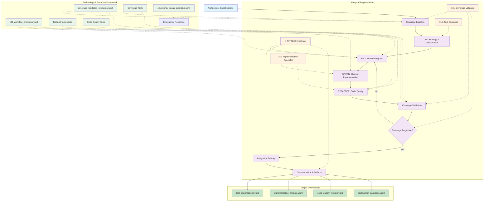

# PATH-Based Test-Driven Development Methodology

## Overview
**PATH-Based Test-Driven Development** is a systematic methodology for test-driven implementation that follows the PATH (Process/AI/Technology/Human) framework. This methodology transforms architecture specifications into working software through strict RED-GREEN-REFACTOR cycles, leveraging the proven promptus TDD framework while maintaining coordinated human-AI team expertise.

## Methodology Input/Output Specification

### **Input Deliverables (YAML Format)**
```yaml
methodology_inputs:
  architecture_specifications:
    format: "YAML"
    files:
      - "system_architecture.yaml"
      - "component_architecture.yaml"
      - "integration_architecture.yaml"
    content:
      - System design and component structure
      - Component relationships and dependencies
      - Integration patterns and interfaces
  
  technical_design:
    format: "YAML"
    files:
      - "component_designs.yaml"
      - "interface_specifications.yaml"
      - "data_models.yaml"
    content:
      - Detailed component specifications
      - API contracts and interface definitions
      - Data structures and validation rules
  
  design_documentation:
    format: "Markdown"
    files:
      - "architecture_decisions.md"
      - "design_rationale.md"
      - "technical_specifications.md"
    content:
      - Implementation guidance and constraints
      - Technical requirements and patterns
      - Quality and compliance requirements
```

### **Output Deliverables (YAML Format)**
```yaml
methodology_outputs:
  test_suites:
    format: "YAML"
    files:
      - "test_specifications.yaml"
      - "test_coverage_report.yaml"
      - "test_results.yaml"
    content:
      - Comprehensive test suite definitions
      - Coverage metrics and analysis
      - Test execution results and trends
  
  production_code:
    format: "YAML"
    files:
      - "implementation_artifacts.yaml"
      - "code_quality_metrics.yaml"
      - "refactoring_log.yaml"
    content:
      - Production-ready code implementations
      - Code quality and maintainability metrics
      - Refactoring history and improvements
  
  deployment_artifacts:
    format: "YAML"
    files:
      - "build_configurations.yaml"
      - "dependency_specifications.yaml"
      - "deployment_packages.yaml"
    content:
      - Build and compilation configurations
      - Dependency management and versions
      - Deployable application packages
```

## TDD Process Flow with Promptus Integration



## PATH Implementation for Test-Driven Development

### **People-Agent Teams: Core Human-AI Development Team**

#### **AI TDD Orchestrator**
**Primary Responsibility**: TDD cycle coordination and compliance enforcement with development leads
**Key Capabilities**: RED-GREEN-REFACTOR management, coverage validation, emergency repair coordination
**Decision Authority**: TDD workflow enforcement recommendations, coverage threshold proposals (human approval)
**Human Collaboration**: Works with senior developers and team leads on workflow optimization

#### **AI Test Strategist**
**Primary Responsibility**: Test strategy design and specification compliance with QA teams
**Key Capabilities**: Test scenario analysis, specification mapping, test classification
**Decision Authority**: Test approach recommendations, coverage expectation analysis (with QA approval)
**Human Collaboration**: Partners with QA engineers and testing specialists

#### **AI Implementation Specialist**
**Primary Responsibility**: Minimal implementation and refactoring execution with developer teams
**Key Capabilities**: Code implementation, refactoring techniques, architectural pattern application
**Decision Authority**: Implementation approach proposals, refactoring suggestions (human code review)
**Human Collaboration**: Works closely with developers during pair programming and code reviews

#### **AI Coverage Validator**
**Primary Responsibility**: Coverage measurement and quality validation with quality assurance teams
**Key Capabilities**: Coverage analysis, quality metrics, baseline tracking
**Decision Authority**: Coverage validation reports, quality gate assessments (human final validation)
**Human Collaboration**: Collaborates with QA managers and technical leads on quality standards

### **Process: Promptus-Based TDD Workflow**

#### **Phase 1: Pre-Task Coverage Baseline**
**Lead Agent**: `AI Coverage Validator`
**Promptus Integration**: Direct implementation of `coverage_validation_promptus.yaml`
**Process Steps**:
1. **Baseline Measurement**: Execute coverage measurement before any task
2. **Coverage Recording**: Document current coverage percentage and uncovered paths
3. **Target Setting**: Establish coverage improvement targets based on test type
4. **Validation Criteria**: Set quality gates for coverage validation

**Outputs**: Coverage baseline, improvement targets, validation criteria
**Quality Gates**: Accurate baseline measurement, clear coverage targets

#### **Phase 2: Test Strategy & Classification**
**Lead Agent**: `AI Test Strategist`
**Promptus Integration**: Implementation of `test_classification_promptus.yaml` and `test_intent_preservation_promptus.yaml`
**Process Steps**:
1. **Requirement Analysis**: Extract testable requirements from architecture specifications
2. **Test Classification**: Classify tests as UNIT (improve coverage), INTEGRATION (maintain/improve), E2E (not measured)
3. **Scenario Design**: Design test scenarios covering functionality, edge cases, error conditions
4. **Specification Mapping**: Map test scenarios to specification requirements

**Outputs**: Test strategy, test scenarios, specification traceability
**Quality Gates**: Complete scenario coverage, clear test classification, specification compliance

#### **Phase 3: RED Phase - Failing Test Implementation**
**Lead Agent**: `AI Implementation Specialist`
**Supporting Agent**: `AI TDD Orchestrator`
**Promptus Integration**: Core implementation of `tdd_workflow_promptus.yaml` RED phase
**Process Steps**:
1. **Single Test Implementation**: Write exactly one failing test for smallest feature increment
2. **Failure Validation**: Confirm test fails for right reasons (missing functionality, not errors)
3. **Test Isolation**: Ensure test independence and proper isolation
4. **TDD Compliance**: Validate no immediate test passes (TDD violation detection)

**Outputs**: Single failing test, confirmed failure validation
**Quality Gates**: Test fails correctly, no TDD violations, test isolation confirmed

#### **Phase 4: GREEN Phase - Minimal Implementation**
**Lead Agent**: `AI Implementation Specialist`
**Supporting Agent**: `AI TDD Orchestrator`
**Promptus Integration**: Core implementation of `tdd_workflow_promptus.yaml` GREEN phase
**Process Steps**:
1. **Minimal Code Implementation**: Write absolute minimum code to make test pass
2. **Regression Testing**: Ensure all existing tests continue to pass
3. **Implementation Validation**: Confirm implementation satisfies test requirements
4. **Over-Implementation Prevention**: Avoid implementation beyond test scope

**Outputs**: Minimal working implementation, all tests passing
**Quality Gates**: Single test passes, no regressions, minimal implementation scope

#### **Phase 5: Coverage Validation**
**Lead Agent**: `AI Coverage Validator`
**Promptus Integration**: Implementation of `coverage_validation_promptus.yaml`
**Process Steps**:
1. **Coverage Measurement**: Execute coverage analysis after implementation
2. **Improvement Validation**: Ensure UNIT tests improve coverage by ≥0.1%
3. **Threshold Compliance**: Validate INTEGRATION tests maintain or improve coverage
4. **Quality Metrics**: Generate coverage trend analysis and quality indicators

**Outputs**: Coverage validation report, quality metrics, trend analysis
**Quality Gates**: Coverage improvement validated, thresholds met, quality trends positive

#### **Phase 6: REFACTOR Phase - Code Improvement**
**Lead Agent**: `AI Implementation Specialist`
**Supporting Agent**: `AI TDD Orchestrator`
**Promptus Integration**: Core implementation of `tdd_workflow_promptus.yaml` REFACTOR phase
**Process Steps**:
1. **Quality Analysis**: Identify code structure and quality improvement opportunities
2. **Refactoring Implementation**: Apply SOLID principles and architectural patterns
3. **Test Suite Integrity**: Ensure all tests pass throughout refactoring
4. **Behavior Preservation**: Maintain functionality while improving structure

**Outputs**: Improved code structure, maintained functionality, all tests passing
**Quality Gates**: Structure improvements, no behavior changes, test suite integrity

#### **Phase 7: Emergency Repair Mode** (When Activated)
**Lead Agent**: `AI TDD Orchestrator`
**Supporting Agent**: `AI Implementation Specialist`
**Promptus Integration**: Implementation of `emergency_repair_promptus.yaml`
**Process Steps**:
1. **Infrastructure Diagnosis**: Identify build failures, import errors, API mismatches
2. **Continuous Repair Loop**: Apply minimal fixes and re-run tests until all pass
3. **Test Intent Preservation**: Maintain test intent during infrastructure repairs
4. **Workflow Recovery**: Return to normal TDD cycle after repairs

**Outputs**: Restored test infrastructure, all tests passing, normal workflow resumed
**Quality Gates**: Zero infrastructure failures, test intent preserved, TDD workflow restored

### **Technology: TDD Tool Integration**

#### **Coverage Measurement Tools**
- **Go**: `go test -coverprofile` and `go tool cover`
- **JavaScript/Node.js**: Jest, Mocha, NYC for coverage reporting
- **Python**: pytest-cov, coverage.py for comprehensive analysis
- **Java**: JaCoCo, Cobertura for enterprise coverage measurement
- **C#**: dotnet test with coverage collectors

#### **Testing Frameworks**
- **Go**: Native testing package with table-driven tests
- **JavaScript**: Jest, Mocha, Jasmine with async/await support
- **Python**: pytest with fixtures and parameterized tests
- **Java**: JUnit 5 with Mockito for comprehensive unit testing
- **C#**: xUnit, NUnit with dependency injection support

#### **Build and CI Integration**
- **Continuous Integration**: GitHub Actions, Jenkins, GitLab CI
- **Build Automation**: Make, Gradle, npm scripts, pip requirements
- **Quality Gates**: SonarQube, CodeClimate integration
- **Automated Testing**: Pipeline integration with coverage reporting

## Promptus Framework Integration

### **Core Promptus Modules Utilized**

#### **`tdd_workflow_promptus.yaml`** - Primary TDD Cycle
**Integration**: Direct implementation as core process framework
**Agent Mapping**:
- RED phase → `AI Implementation Specialist` + `AI TDD Orchestrator`
- GREEN phase → `AI Implementation Specialist` + `AI TDD Orchestrator`  
- REFACTOR phase → `AI Implementation Specialist` + `AI TDD Orchestrator`
- Coverage validation → `AI Coverage Validator`

#### **`test_classification_promptus.yaml`** - Test Strategy
**Integration**: Test type classification and scenario design
**Agent Mapping**:
- Test analysis → `AI Test Strategist`
- Classification decisions → `agent_test_strategist`
- Coverage expectations → `agent_coverage_validator`

#### **`coverage_validation_promptus.yaml`** - Coverage Requirements
**Integration**: Coverage measurement and validation protocols
**Agent Mapping**:
- Baseline measurement → `agent_coverage_validator`
- Coverage validation → `agent_coverage_validator`
- Threshold enforcement → `agent_tdd_orchestrator`

#### **`emergency_repair_promptus.yaml`** - Infrastructure Recovery
**Integration**: Emergency mode activation and recovery procedures
**Agent Mapping**:
- Emergency detection → `agent_tdd_orchestrator`
- Repair execution → `agent_implementation_specialist`
- Recovery validation → `agent_coverage_validator`

#### **`test_intent_preservation_promptus.yaml`** - Quality Assurance
**Integration**: Test intent maintenance during repairs and refactoring
**Agent Mapping**:
- Intent preservation → `agent_test_strategist`
- Validation → `agent_tdd_orchestrator`
- Quality monitoring → `agent_coverage_validator`

### **Promptus Context Integration**

#### **Critical Rules Integration**
From `critical_rules_promptus.yaml`:
- **TDD Violations**: Immediate test passes are violations, handled by `agent_tdd_orchestrator`
- **Emergency Repair**: Infrastructure issues trigger emergency mode
- **Coverage Thresholds**: >90% coverage maintained through `agent_coverage_validator`

#### **Core Identity Integration**
From `core_identity_promptus.yaml`:
- **Specification Compliance**: All tests validate against domain specifications
- **Test Quality**: No dummy tests, all tests meaningful and comprehensive
- **Implementation Completeness**: Full functionality as specified

#### **Quality Gates Integration**
From `quality_gates_promptus.yaml`:
- **Coverage Requirements**: UNIT tests must improve coverage by ≥0.1%
- **Test Execution**: All tests must pass before task completion
- **Documentation**: Test intent and coverage documented for maintenance

### **TDD Cycle Coordination**
- **Phase Leadership**: Each TDD phase has designated lead agent
- **Cross-Agent Validation**: Supporting agents validate phase completion
- **Emergency Escalation**: `agent_tdd_orchestrator` can activate emergency mode
- **Quality Assurance**: `agent_coverage_validator` validates all phases

### **Promptus Protocol Integration**
- **Workflow Enforcement**: `agent_tdd_orchestrator` enforces promptus TDD workflow
- **Context Loading**: All agents load relevant promptus context modules
- **Precedence Rules**: Critical rules > core identity > quality gates > specific guidance
- **Module Integration**: Cross-module references and consistency maintained

### **Decision Making Framework**
- **TDD Decisions**: Led by `agent_tdd_orchestrator` with agent team input
- **Test Strategy**: Led by `agent_test_strategist` with validation from others
- **Implementation**: Led by `agent_implementation_specialist` with TDD compliance
- **Quality Validation**: Led by `agent_coverage_validator` with threshold enforcement

## Domain-Specific TDD Adaptations

### **Protocol-Based Systems** (MQTT, HTTP, WebSocket)
- **Test Strategy**: Protocol state machine testing, packet handling validation
- **Coverage Focus**: Protocol compliance paths, error condition handling
- **Emergency Repair**: Protocol API changes, connection handling fixes
- **Specification Mapping**: Protocol RFCs and specification compliance testing

### **Business Applications** (ERP, CRM, E-commerce)
- **Test Strategy**: Business rule validation, workflow testing, data integrity
- **Coverage Focus**: Business logic paths, validation rules, edge cases
- **Emergency Repair**: Database schema changes, API contract updates
- **Specification Mapping**: Business requirements and regulatory compliance

### **Data Processing Systems** (ETL, Analytics, ML)
- **Test Strategy**: Data transformation accuracy, pipeline validation, performance
- **Coverage Focus**: Data paths, transformation logic, error handling
- **Emergency Repair**: Data format changes, API updates, dependency issues
- **Specification Mapping**: Data quality requirements, processing accuracy

### **Real-Time Systems** (Trading, IoT, Gaming)
- **Test Strategy**: Latency testing, concurrency validation, performance benchmarks
- **Coverage Focus**: Critical paths, performance constraints, error recovery
- **Emergency Repair**: API changes, performance degradation, timing issues
- **Specification Mapping**: Performance requirements, latency constraints

## Quality Assurance Framework

### **TDD Quality Metrics**
- **Coverage Progress**: Continuous improvement tracking (≥0.1% for UNIT tests)
- **Test Quality**: Test intent preservation, meaningful test scenarios
- **TDD Compliance**: RED-GREEN-REFACTOR cycle adherence
- **Specification Coverage**: Test scenarios map to all requirements

### **Promptus Quality Integration**
- **Workflow Compliance**: Strict adherence to promptus TDD workflow
- **Coverage Validation**: Automated coverage measurement and validation
- **Emergency Procedures**: Rapid infrastructure repair and recovery
- **Quality Gates**: Multi-layered quality validation at each phase

### **Success Criteria**
- **Working Software**: All features implemented with comprehensive tests
- **High Coverage**: >90% coverage maintained throughout development
- **Clean Code**: Refactored, maintainable code following architectural patterns
- **Specification Compliance**: Full traceability from tests to requirements

## Integration with Architecture Methodology

### **Architecture-to-TDD Handoff**
- **Component Specifications**: Architecture provides detailed component interfaces
- **Test Strategy**: Architecture influences test classification and approach
- **Implementation Guidelines**: Architecture patterns guide implementation approach
- **Quality Criteria**: Architecture defines testing and validation requirements

### **TDD-to-DevOps Handoff**
- **Working Software**: Implemented features with comprehensive test suites
- **Test Automation**: Test suites ready for CI/CD pipeline integration
- **Coverage Reports**: Coverage baselines and improvement tracking
- **Quality Metrics**: Code quality indicators and technical debt analysis

The PATH-Based TDD methodology provides systematic, test-driven implementation that leverages the proven promptus framework while maintaining agent specialization and PATH structure for reliable, high-quality software delivery.
- **agent_test_analyst** designs tests to achieve comprehensive coverage of scenarios
- **agent_red_phase_specialist** implements tests that improve coverage metrics
- **agent_tdd_orchestrator** enforces coverage requirements before phase completion

#### 5. Emergency Recovery Protocol (Led by `agent_emergency_repair_specialist`)
**Agent Team Behavior**:
- **agent_emergency_repair_specialist** provides rapid infrastructure failure recovery
- **agent_tdd_orchestrator** activates emergency mode only for infrastructure failures
- **agent_test_analyst** preserves test intent during emergency repairs
- **agent_coverage_validator** maintains coverage integrity during repair operations

## Agent Team TDD Usage Examples

Apply PATH-Based TDD methodology with specialized agent teams to implement **[FEATURE_TYPE]** that must satisfy **[REQUIREMENTS]** and comply with **[STANDARDS]** using **[TECHNOLOGY_STACK]** with **[QUALITY_THRESHOLDS]**.

### Agent Team TDD Usage Templates

#### Template 1: Protocol Implementation (Agent Team Composition)
"Implement **[PROTOCOL]** compliant **[FEATURE]** that handles **[SCENARIOS]** with **[PERFORMANCE_REQUIREMENTS]** using **[TECHNOLOGY]** maintaining **[COVERAGE_THRESHOLD]**."

**Primary Agent Assignments**:
- **agent_test_analyst**: Analyze protocol specification and design comprehensive test scenarios
- **agent_red_phase_specialist**: Implement failing tests for protocol packet handling and state transitions
- **agent_green_phase_specialist**: Create minimal protocol implementation to satisfy test requirements
- **agent_refactor_specialist**: Optimize protocol handling while maintaining compliance and performance
- **agent_coverage_validator**: Ensure >90% coverage of protocol scenarios including edge cases
- **agent_specification_validator**: Validate protocol compliance against RFC specifications
- **agent_tdd_orchestrator**: Coordinate TDD cycle compliance and protocol testing workflow
- **agent_emergency_repair_specialist**: Handle build failures, dependency issues, and test infrastructure problems

#### Template 2: Business Logic Implementation (Agent Team Composition)
"Implement **[BUSINESS_RULE]** for **[DOMAIN]** that validates **[CONDITIONS]** and handles **[EXCEPTIONS]** with **[REGULATORY_COMPLIANCE]** maintaining **[QUALITY_STANDARDS]**."

**Primary Agent Assignments**:
- **agent_test_analyst**: Analyze business requirements and design test scenarios for rules and exceptions
- **agent_red_phase_specialist**: Implement failing tests for business rule validation and edge cases
- **agent_green_phase_specialist**: Create minimal business logic implementation to satisfy validation requirements
- **agent_refactor_specialist**: Apply domain-driven design patterns and improve business model clarity
- **agent_coverage_validator**: Ensure comprehensive coverage of business scenarios and regulatory requirements
- **agent_specification_validator**: Validate compliance with business requirements and regulatory standards
- **agent_tdd_orchestrator**: Coordinate business logic TDD cycle and requirement traceability
- **agent_emergency_repair_specialist**: Handle business model refactoring issues and dependency conflicts

#### Template 3: Data Processing Implementation (Agent Team Composition)
"Implement **[DATA_TRANSFORMATION]** that processes **[DATA_SOURCES]** according to **[QUALITY_RULES]** with **[PERFORMANCE_REQUIREMENTS]** maintaining **[ACCURACY_STANDARDS]**."

**Primary Agent Assignments**:
- **agent_test_analyst**: Design test scenarios for data quality, transformation accuracy, and performance validation
- **agent_red_phase_specialist**: Implement failing tests for data processing scenarios including error conditions
- **agent_green_phase_specialist**: Create minimal data processing implementation to satisfy quality requirements
- **agent_refactor_specialist**: Optimize data processing algorithms and improve transformation efficiency
- **agent_coverage_validator**: Ensure coverage of data paths, transformation scenarios, and quality validations
- **agent_specification_validator**: Validate data processing compliance against quality standards and requirements
- **agent_tdd_orchestrator**: Coordinate data processing TDD cycle and performance validation
- **agent_emergency_repair_specialist**: Handle data pipeline issues, dependency problems, and test data setup

## PATH-Based Software Engineering Integration

### PATH TDD Integration with Architecture Design
The PATH-Based TDD methodology integrates seamlessly with the PATH-Based Software Engineering methodology by providing implementation discipline:

#### Architectural Implementation Workflow
- **PATH-Based Software Engineering** provides architectural design and component specifications
- **PATH-Based TDD** implements each component using disciplined test-driven development
- **agent_specification_validator** ensures TDD implementation maintains architectural compliance
- **agent_refactor_specialist** applies architectural patterns during refactoring phases

#### Component Development Lifecycle
1. **Architecture Phase**: PATH-Based Software Engineering defines component interfaces and responsibilities
2. **TDD Implementation Phase**: PATH-Based TDD implements components with test-first discipline
3. **Integration Phase**: Both methodologies validate component integration and architectural compliance
4. **Quality Validation Phase**: Combined validation ensures both architectural soundness and implementation quality

### Benefits of Integrated Methodology

#### For Comprehensive Software Engineering
- **Systematic Architecture**: PATH-Based Software Engineering provides systematic architectural design
- **Disciplined Implementation**: PATH-Based TDD ensures test-driven implementation quality
- **End-to-End Traceability**: Requirements flow from architecture through test-driven implementation
- **Quality Assurance**: Both methodologies provide complementary quality validation approaches

#### For Agent Team Coordination
- **Architectural Agents**: Design system structure and component relationships
- **TDD Agents**: Implement components with test-first discipline and quality validation
- **Cross-Methodology Validation**: Agents from both methodologies validate each other's outputs
- **Unified Quality Standards**: Combined quality gates ensure comprehensive system quality

## Agent TDD Implementation Checklist

### TDD Cycle Completion Validation by Agent Role
- [ ] **RED Phase** (**agent_red_phase_specialist** + **agent_test_analyst**): Failing test implemented and validated
- [ ] **GREEN Phase** (**agent_green_phase_specialist** + **agent_tdd_orchestrator**): Minimal implementation passes all tests
- [ ] **REFACTOR Phase** (**agent_refactor_specialist** + **agent_tdd_orchestrator**): Code improved while maintaining test passes
- [ ] **Coverage Validation** (**agent_coverage_validator**): Coverage threshold met or improved
- [ ] **Specification Compliance** (**agent_specification_validator**): Domain requirements satisfied
- [ ] **TDD Compliance** (**agent_tdd_orchestrator**): Proper cycle execution validated
- [ ] **Emergency Repairs** (**agent_emergency_repair_specialist**): Infrastructure issues resolved if encountered

### Quality Gates for TDD Agent Teams
- **TDD Cycle Compliance**: All phases executed in proper sequence by appropriate agents
- **Test Quality Validation**: Tests provide meaningful coverage and specification validation
- **Implementation Minimalism**: Code implements only what tests require, no over-engineering
- **Refactoring Safety**: Code improvements maintain behavior and improve quality
- **Coverage Threshold Compliance**: >90% coverage maintained with meaningful tests
- **Specification Adherence**: Implementation satisfies all domain requirements and standards
- **Emergency Recovery Capability**: Infrastructure issues addressed without compromising TDD discipline

### Agent Team TDD Success Metrics
- **TDD Cycle Adherence Rate**: Percentage of implementations following proper RED-GREEN-REFACTOR sequence
- **Test Coverage Progression**: Coverage improvement trends across development cycles
- **Specification Compliance Rate**: Percentage of implementations satisfying domain requirements
- **Agent Collaboration Efficiency**: Time and quality metrics for TDD phase handoffs
- **Emergency Recovery Frequency**: Rate of infrastructure failures and recovery effectiveness
- **Implementation Quality Metrics**: Code quality trends through TDD cycle execution

PATH-Based Test-Driven Development delivers disciplined, high-quality software implementation across diverse technology stacks and domains through coordinated AI agent team expertise and systematic test-first development practices. This methodology ensures comprehensive test coverage, specification compliance, and maintainable code through collaborative TDD excellence.
