# PATH Framework: A Comprehensive Methodology for Process/AI/Technology/Human Integration in Software Engineering

## Abstract

This paper presents the PATH (Process/AI/Technology/Human) Framework, a systematic methodology for software engineering that integrates four coordinated phases: Software Engineering, Test-Driven Development, DevOps & Production Readiness, and Production Operations. Through analysis of comprehensive documentation, agent specifications, and implementation patterns, we demonstrate how the PATH Framework enables scalable software delivery through coordinated human-AI teams, systematic process workflows, and technology integration. Our findings reveal a methodology that supports three distinct flow patterns (Human-Initiated, AI-Driven, and Collaborative Decision-Making) across a complete software development lifecycle, with proven integration points and quality assurance frameworks.

**Keywords:** PATH Framework, Human-AI Collaboration, Software Engineering Methodology, DevOps Automation, Production Operations

## 1. Introduction

### 1.1 Background

The PATH (Process/AI/Technology/Human) Framework represents a comprehensive methodology for software engineering that addresses the growing need for systematic human-AI collaboration in software development. As organizations increasingly adopt AI-assisted development practices, the need for structured methodologies that coordinate human expertise with AI capabilities becomes critical for delivering enterprise-grade software systems.

### 1.2 PATH Framework Definition

The PATH Framework implements a four-phase software development lifecycle:

- **P (Process)**: Systematic workflows that adapt based on specific collaboration patterns
- **A (AI)**: Intelligent agents that lead, support, or collaborate based on task requirements
- **T (Technology)**: Tools and platforms that enable AI execution and process automation
- **H (Human)**: Strategic direction, quality validation, and collaborative decision-making

#### 1.2.1 Four-Phase Lifecycle

1. **Phase 1: Software Engineering** - Architecture design and system specification
2. **Phase 2: Test-Driven Development** - Implementation through systematic TDD cycles
3. **Phase 3: DevOps & Production Readiness** - Infrastructure automation and deployment
4. **Phase 4: Production Operations** - Monitoring, maintenance, and continuous improvement

#### 1.2.2 Flow Pattern Framework

The PATH Framework implements three distinct collaboration patterns that operate across all four phases of the software development lifecycle. Each pattern serves different purposes and can be applied within any phase based on task requirements and decision complexity.

#### Flow Patterns Across Four-Phase Lifecycle


**Pattern Distribution Across Phases:**
- **Pattern 1 (Human-Initiated)**: Strategic decisions, creative problem-solving, major direction changes
- **Pattern 2 (AI-Driven)**: Systematic execution, automation, routine processing (60% of workflows) - *Highlighted in orange as primary agentic workflows*
- **Pattern 3 (Collaborative)**: Critical decisions, quality gates, risk assessment

**Why Pattern 2 Focus**: Pattern 2 represents the core of agentic workflows where AI agents operate with high autonomy. These workflows comprise 60% of software development activities and demonstrate the framework's ability to leverage AI for systematic, repeatable tasks across all phases while maintaining quality and consistency.

The PATH Framework implements three distinct collaboration patterns:

**Pattern 1: Human-Initiated Process (20% of <span style="color: #2196F3;">agentic workflows</span>)**


*Human Authority: High* - Humans drive the entire process from initial input through decision-making. AI provides supportive analysis and systematic execution of human-defined strategies.

**Sequential Handoff Pattern**: Human makes strategic decisions first, then hands off to AI for systematic execution. This represents **human-led workflow** where AI acts as an intelligent tool following human direction.

*Process Example*: Human architect decides "We need microservices architecture" → AI analyzes codebase dependencies → AI suggests service boundaries → AI generates service specifications → Human reviews and approves final design.

**Software Engineering Use Cases:**
- **Microservices Architecture Design**: Human architect decides to decompose monolith into services, AI analyzes dependencies and suggests service boundaries
- **Database Technology Selection**: Human evaluates business requirements (ACID vs BASE), AI provides performance benchmarks and migration complexity analysis
- **API Design Strategy**: Human defines business logic and user workflows, AI generates OpenAPI specifications and suggests RESTful patterns
- **Security Architecture**: Human assesses threat landscape and compliance needs, AI recommends authentication patterns and encryption strategies
- **Performance Optimization Strategy**: Human identifies bottlenecks from user feedback, AI analyzes profiling data and suggests caching/scaling solutions

**Pattern 2: AI-Driven Automation (60% of <span style="color: #2196F3;">agentic workflows</span>)**


*Human Authority: Low* - AI takes primary execution role with minimal human intervention. Humans provide validation only at completion checkpoints.

**Autonomous AI Pattern**: AI works independently from input to output with minimal human involvement. This represents **AI-led workflow** where humans only validate final results, allowing AI to handle routine and systematic tasks efficiently.

*Process Example*: Database schema changes trigger → AI generates migration scripts → AI creates rollback procedures → AI runs tests → AI validates data integrity → Human receives completion notification and approves deployment.

**Software Engineering Use Cases:**
- **CRUD Operations Generation**: AI generates complete REST endpoints, database models, and validation logic from schema definitions
- **Unit Test Suite Creation**: AI automatically creates comprehensive test cases covering edge cases, mocks, and assertions for existing functions
- **Docker Configuration**: AI generates Dockerfile, docker-compose.yml, and Kubernetes manifests from application requirements
- **Database Migration Scripts**: AI creates SQL migration files, rollback procedures, and data transformation scripts from schema changes
- **Code Refactoring**: AI applies design patterns, extracts common functions, and optimizes algorithms while maintaining functionality
- **Dependency Updates**: AI automatically updates package versions, resolves conflicts, and runs regression tests

**Pattern 3: Human-AI Collaborative Decision (20% of <span style="color: #2196F3;">agentic workflows</span>)**


*Human Authority: High* - Equal partnership where humans and AI jointly analyze, decide, and execute. Both contribute expertise to reach optimal outcomes.

**Simultaneous Collaboration Pattern**: This represents **simultaneous real-time collaboration** where both human and AI work together on the same decision at the same time, rather than sequential handoffs. Unlike Pattern 1 (Human → AI sequential) or Pattern 2 (AI alone), Pattern 3 shows true partnership where both parties jointly analyze problems, share decision-making in real-time, and contribute different expertise simultaneously (human judgment + AI analysis) to reach consensus together.

*Process Example*: Production deployment review → Human evaluates business impact while AI analyzes technical readiness → Both discuss risk factors together → Human considers user impact while AI calculates rollback time → Joint decision reached on deployment timing and strategy.

**Software Engineering Use Cases:**
- **Production Deployment Review**: Human evaluates business impact and timing, AI analyzes code changes, test coverage, and infrastructure readiness
- **Pull Request Assessment**: Human reviews business logic and architecture decisions, AI checks code quality, security vulnerabilities, and performance impact
- **Bug Investigation**: Human provides user context and business priority, AI analyzes logs, traces execution paths, and suggests root causes
- **Scaling Decision**: Human considers cost and user experience, AI analyzes traffic patterns, resource utilization, and suggests horizontal/vertical scaling
- **Technical Debt Prioritization**: Human weighs feature delivery pressure, AI quantifies code complexity, maintenance cost, and refactoring effort
- **Third-Party Integration**: Human evaluates vendor relationships and SLAs, AI assesses API compatibility, rate limits, and fallback strategies

#### 1.2.3 Phase-Specific Pattern Applications

**Phase 1: Software Engineering**
- **Pattern 1**: Architecture vision, business requirements analysis, technology strategy
- **Pattern 2**: Component specification generation, API documentation, design pattern application
- **Pattern 3**: Technology stack evaluation, architecture trade-off decisions, integration strategy

**Phase 2: Test-Driven Development**
- **Pattern 1**: Test strategy definition, acceptance criteria design, quality standards
- **Pattern 2**: Unit test generation, code implementation, refactoring automation
- **Pattern 3**: Code review processes, coverage analysis, quality gate validation

**Phase 3: DevOps & Production Readiness**
- **Pattern 1**: Infrastructure architecture, deployment strategy, security policies
- **Pattern 2**: Pipeline automation, configuration management, monitoring setup
- **Pattern 3**: Deployment approvals, security reviews, performance validation

**Phase 4: Production Operations**
- **Pattern 1**: Incident response procedures, capacity planning, operational strategy
- **Pattern 2**: Automated monitoring, alerting systems, routine maintenance
- **Pattern 3**: Performance optimization, scaling decisions, operational reviews


### 1.3 Research Objectives

- Analyze the PATH Framework's systematic approach to human-AI collaboration
- Evaluate the effectiveness of the four-phase software development lifecycle
- Document the three flow patterns and their appropriate usage contexts
- Examine agent specialization and cross-phase integration mechanisms
- Assess the framework's scalability across diverse software engineering domains

### 1.4 Scope

This paper presents the PATH Framework as a general methodology applicable across diverse software engineering domains, covering:
- Universal four-phase development lifecycle adaptable to any software project
- Scalable agent specialization framework supporting 4-16+ agents based on project complexity
- Three fundamental flow patterns for human-AI collaboration across all software engineering contexts
- Generic integration protocols and handoff mechanisms applicable to any technology stack
- Universal quality assurance and validation frameworks independent of specific tools or platforms

### 1.5 Related Frameworks

Several frameworks in the literature and industry demonstrate approaches akin to the PATH Framework's emphasis on structured human-AI collaboration across software development lifecycles, including phased processes, adaptive interaction patterns, and mechanisms for validation and guardrails.

#### 1.5.1 Taxonomy of Human-AI Interactions in Software Engineering (Treude & Gerosa, 2025)
This taxonomy categorizes 11 distinct interaction types between developers and AI tools, such as auto-complete code suggestions (AI-driven contextual prompts), command-driven actions (human-initiated explicit triggers), and conversational assistance (collaborative dialogue for guidance). These types span software engineering activities, with mappings to lifecycle phases: code suggestions align with implementation (Test-Driven Development), while event-based triggers support deployment checks (DevOps). Guardrails include confidence scores, developer review mandates, and feedback loops to mitigate hallucinations, echoing PATH's evidence-based validation and quality gates. Similarities to PATH include the classification of flow patterns—human-initiated (explicit commands), AI-driven (automatic suggestions), and collaborative (iterative chats)—though it lacks explicit specialized agents or a full four-phase structure, focusing instead on granular interaction dynamics.

#### 1.5.2 SmythOS Collaborative Framework (SmythOS, 2025)
Designed for AI agent integration in development workflows, this framework features a visual builder for agent creation, centralized monitoring dashboards, and seamless integrations with over 300,000 tools, supporting phases like design (agent building), integration (data connectivity), operation (performance tracking), and maintenance (security controls). It promotes complementary roles, with AI handling repetitive tasks (code analysis) and humans focusing on judgment, facilitated by adaptive interaction patterns and feedback mechanisms. This mirrors PATH's phased lifecycle and specialized agents through its emphasis on autonomous AI roles, while flow patterns emerge in synergistic workflows (AI-led automation with human oversight). Hallucination prevention is addressed via enterprise-grade security and transparency in AI operations, akin to PATH's guardrails, though it prioritizes tool interoperability over domain-specific agent specialization.

#### 1.5.3 Framework for Efficient Co-Creation in Human-AI Software Design (Advanced International Journal of Multidisciplinary Research, 2025)
This framework outlines a three-phase process—UI design, code generation, and feature implementation—with AI providing data-driven insights, automation of repetitive tasks, and predictive simulations to support human decision-making. Validation occurs through experimental metrics (35% faster task completion) and explainable AI (XAI) for trust-building, addressing hallucination risks via iterative testing and thematic analysis. It aligns with PATH's collaborative patterns by integrating AI as a complementary tool in real-time workflows, and its phases partially overlap with PATH's Software Engineering and Test-Driven Development stages, though it omits explicit DevOps or Operations coverage. Specialized roles are implied for developers and AI systems, but without PATH's 16-agent granularity; overall, it complements broader lifecycles by enhancing design efficiency.

These frameworks collectively advance human-AI integration but often emphasize interaction granularity or tool-specific applications over PATH's comprehensive, agent-orchestrated lifecycle.

## 2. Related Work Comparison

### 2.1 Framework Comparison Matrix

| Framework | Phases | Agents | Flow Patterns | Guardrails | Lifecycle Coverage |
|-----------|--------|--------|---------------|------------|-------------------|
| PATH Framework | 4 (SE, TDD, DevOps, Ops) | 16 specialized | 3 distinct patterns | Multi-layered validation | Complete |
| Treude & Gerosa Taxonomy | Activity-based | Implicit roles | 11 interaction types | Confidence scores | Partial |
| SmythOS Framework | 4 (Design, Integration, Operation, Maintenance) | Visual agent builder | Synergistic workflows | Enterprise security | Tool-focused |
| Co-Creation Framework | 3 (UI, Code, Features) | Developer-AI pairs | Real-time collaboration | XAI validation | Design-focused |

### 2.2 Comparative Analysis

#### 2.2.1 Phase Structure Comparison
- **PATH Framework**: Comprehensive four-phase lifecycle covering complete software development
- **Treude & Gerosa**: Activity-based categorization without explicit phase structure
- **SmythOS**: Tool-centric phases focused on agent management and integration
- **Co-Creation**: Design-focused three-phase process with limited operational coverage

#### 2.2.2 Agent Specialization Comparison
- **PATH Framework**: 16 domain-specialized agents with clear responsibilities
- **Treude & Gerosa**: Implicit agent roles within interaction taxonomy
- **SmythOS**: Visual agent creation with 300,000+ tool integrations
- **Co-Creation**: Developer-AI pairing without explicit agent specialization

#### 2.2.3 Flow Pattern Comparison
- **PATH Framework**: Three systematic patterns (Human-Initiated, AI-Driven, Collaborative)
- **Treude & Gerosa**: 11 granular interaction types across development activities
- **SmythOS**: Synergistic workflows with adaptive interaction patterns
- **Co-Creation**: Real-time collaborative workflows with iterative feedback

### 2.3 PATH Framework Differentiation

The PATH Framework distinguishes itself through:
- **Complete Lifecycle Coverage**: Only framework addressing full software development lifecycle
- **Systematic Agent Specialization**: 16 specialized agents vs. implicit or tool-focused approaches
- **Structured Flow Patterns**: Three clear patterns vs. granular interactions or ad-hoc collaboration
- **Comprehensive Guardrails**: Multi-layered validation across all phases vs. point solutions
- **Evidence-Based Validation**: Systematic hallucination prevention vs. confidence-based approaches
- **Task Execution & Evolution Framework**: Systematic task tracking, progress monitoring, and continuous evolution methodology

## 3. Task Execution and Evolution Framework

### 3.1 Task Execution Methodology

The PATH Framework implements systematic task execution through structured tracking and evolution mechanisms:

#### 3.1.1 Task Definition and Decomposition
- **Hierarchical Task Structure**: Tasks organized by phase, component, and implementation priority
- **Atomic Task Units**: Each task represents a single, testable, completable unit of work
- **Dependency Mapping**: Clear identification of task dependencies and execution order
- **Acceptance Criteria**: Explicit definition of completion criteria for each task

#### 3.1.2 Task Tracking Framework

```mermaid
flowchart TD
    Start([Start]) --> Defined[Task Defined]
    Defined --> RED[🔴 RED Phase: Write Failing Tests]
    RED --> GREEN[🟢 GREEN Phase: Minimal Implementation]
    GREEN --> REFACTOR[🔵 REFACTOR Phase: Optimize Code]
    REFACTOR --> Coverage{Coverage > 90%?}
    Coverage -->|Yes| Complete[✅ Task Complete]
    Coverage -->|No| GREEN
    REFACTOR --> Quality{Quality Gates Met?}
    Quality -->|Yes| Complete
    Quality -->|No| REFACTOR
    Complete --> End([End])
```



**Tracking Elements:**
- Task ID and description
- Assigned agent(s) and phase
- Current TDD phase status
- Test coverage percentage
- Completion timestamp
- Quality validation status

#### 3.1.3 Progress Monitoring System
- **Real-Time Status Updates**: Continuous tracking of task progress across all phases
- **Milestone Checkpoints**: Regular assessment of phase completion and quality gates
- **Bottleneck Identification**: Automatic detection of blocked or delayed tasks
- **Resource Allocation**: Dynamic agent assignment based on task priority and capacity

### 3.2 Evolution and Adaptation Mechanisms

#### 3.2.1 Continuous Learning Framework
- **Implementation Feedback**: Lessons learned from each task execution cycle
- **Pattern Recognition**: Identification of successful implementation patterns
- **Process Optimization**: Refinement of workflows based on execution data
- **Agent Capability Enhancement**: Improvement of agent performance through experience

#### 3.2.2 Adaptive Task Management
- **Dynamic Prioritization**: Task priority adjustment based on changing requirements
- **Scope Evolution**: Task modification and refinement during execution
- **Quality Threshold Adaptation**: Adjustment of quality gates based on project needs
- **Technology Stack Evolution**: Integration of new tools and technologies

#### 3.2.3 Progress Documentation Framework
```
Progress Tracking Structure:
├── IMPLEMENTATION_TASKS.md     # Master task list with status tracking
├── progress_logs.md            # Timestamped achievement summaries
├── logs/                       # Detailed execution logs
│   ├── build-{command}-{timestamp}.log
│   └── tdd-{phase}-{timestamp}.log
└── archive/                    # Historical progress records
```

### 3.3 Task Execution Quality Assurance

#### 3.3.1 TDD-Based Task Validation
- **Red Phase Verification**: Each task begins with failing tests to ensure actual requirements
- **Green Phase Validation**: Minimal implementation to achieve test success
- **Refactor Phase Optimization**: Code improvement while maintaining test success
- **Coverage Enforcement**: Minimum 90% test coverage per task completion

#### 3.3.2 Cross-Phase Task Integration
- **Phase Handoff Validation**: Tasks must meet phase exit criteria before progression
- **Integration Testing**: Cross-component task validation
- **Regression Prevention**: Continuous validation of completed tasks
- **Quality Gate Enforcement**: Automated quality checks at task completion

### 3.4 Evolution Tracking and Metrics

#### 3.4.1 Performance Metrics
- **Task Completion Velocity**: Rate of task completion across phases
- **Quality Metrics**: Test coverage, defect rates, performance benchmarks
- **Efficiency Indicators**: Time-to-completion, resource utilization, bottleneck frequency
- **Evolution Metrics**: Process improvement rate, adaptation effectiveness

#### 3.4.2 Continuous Improvement Cycle


## 4. Methodology Analysis

### 4.1 PATH Framework Architecture Analysis

The PATH Framework implements a systematic four-phase architecture with specialized agent teams:


### 4.2 Flow Pattern Implementation

The PATH Framework implements three distinct collaboration patterns:

#### Pattern Summary
- **Pattern 1 (20%)**: Human-driven strategic decisions with AI support
- **Pattern 2 (60%)**: AI-driven automation with human validation
- **Pattern 3 (20%)**: Collaborative human-AI decision-making

### 4.3 Agent Specialization Framework

The PATH Framework implements specialized agents with defined responsibilities:

#### Agent Specialization Overview
- **16 specialized agents** distributed across four phases (4 agents per phase)
- **Domain-focused expertise** with clear responsibilities and handoff protocols
- **Cross-phase coordination** through structured integration points
- **Detailed agent specifications** provided in Section 4.3

## 5. Framework Analysis Results

### 5.1 Framework Effectiveness Metrics

| Component | Measurement | Effectiveness |
|-----------|-------------|---------------|
| Agent Specialization | 16 specialized agents | Complete lifecycle coverage |
| Flow Patterns | 3 distinct patterns | 100% workflow coverage |
| Phase Integration | 4 coordinated phases | Seamless handoff protocols |
| Technology Integration | Multi-stack support | Universal applicability |
| Quality Gates | Multi-layered validation | Comprehensive quality assurance |
| Human-AI Collaboration | Defined authority matrix | Clear decision frameworks |

### 5.2 Phase Integration Analysis

#### 5.2.1 Phase 1: Software Engineering
**Deliverables**: Architecture specifications, component designs, integration patterns
**Agent Coordination**: 4 specialized agents with clear handoff protocols
**Flow Patterns**: Primarily Pattern 1 (Human-Initiated) for strategic decisions
**Quality Gates**: Architecture validation, design reviews, specification compliance

#### 5.2.2 Phase 2: Test-Driven Development
**Deliverables**: Test suites, production code, deployment artifacts
**Agent Coordination**: 4 TDD-specialized agents with RED-GREEN-REFACTOR cycles
**Flow Patterns**: Primarily Pattern 2 (AI-Driven) with Pattern 3 for quality gates
**Quality Gates**: Coverage validation, code review, TDD compliance

#### 5.2.3 Phase 3: DevOps & Production Readiness
**Deliverables**: CI/CD pipelines, infrastructure automation, monitoring systems
**Agent Coordination**: 4 DevOps agents with infrastructure and deployment focus
**Flow Patterns**: Pattern 2 for automation, Pattern 3 for deployment approval
**Quality Gates**: Pipeline validation, security scanning, deployment readiness

#### 5.2.4 Phase 4: Production Operations
**Deliverables**: KPIs, performance reports, operational excellence metrics
**Agent Coordination**: 4 operations agents with monitoring and maintenance focus
**Flow Patterns**: Pattern 2 for monitoring, Pattern 3 for incident escalation
**Quality Gates**: SLA compliance, performance validation, security monitoring

### 5.3 Integration Point Analysis

#### 5.3.1 Cross-Phase Handoff Protocols


#### 5.3.2 Agent Collaboration Effectiveness
- **Primary vs Supporting Roles**: Clear responsibility matrix across all phases
- **Decision Authority**: Defined escalation paths and approval gates
- **Cross-Agent Validation**: Supporting agents validate primary agent outputs
- **Emergency Protocols**: Rapid response procedures for critical issues

### 5.4 Technology Integration Effectiveness

#### 5.4.1 Multi-Stack Support
- **Programming Languages**: Go, JavaScript, Python, Java, C# support
- **Infrastructure Platforms**: AWS, Azure, Google Cloud compatibility
- **CI/CD Tools**: GitHub Actions, Jenkins, GitLab CI integration
- **Monitoring Systems**: Prometheus, Grafana, DataDog support

#### 5.4.2 Quality Assurance Framework
- **Multi-Layered Validation**: Architecture, implementation, deployment, operations
- **Automated Quality Gates**: Coverage validation, security scanning, performance testing
- **Human Oversight Points**: Strategic decisions, critical approvals, risk assessment
- **Continuous Improvement**: Feedback loops from operations to architecture

## 6. Hallucination Avoidance and Guardrails Framework

### 6.1 Hallucination Prevention Mechanisms

The PATH Framework implements systematic hallucination avoidance through structured validation and evidence-based decision making:

#### 6.1.1 Evidence-Based Validation
- **Mandatory Documentation**: All decisions must reference concrete evidence from system specifications, test results, or operational data
- **Traceability Requirements**: Every implementation decision must trace back to documented requirements or architectural specifications
- **Verification Protocols**: Multi-layered validation ensures AI outputs align with actual system capabilities and constraints
- **Reality Anchoring**: All AI recommendations must be validated against existing system state and documented capabilities

#### 6.1.2 Systematic Quality Gates
- **Phase Transition Validation**: Each phase transition requires evidence-based validation of deliverables
- **Human Oversight Points**: Critical decisions require human validation to prevent AI hallucination
- **Automated Verification**: Systematic testing and validation prevent implementation of non-functional solutions
- **Continuous Reality Checking**: Regular validation against actual system behavior and performance metrics

### 6.2 Guardrails Implementation Framework

#### 6.2.1 Process Guardrails
- **Mandatory Test-First Development**: All implementations must begin with failing tests to ensure actual functionality
- **Coverage Validation**: Minimum coverage thresholds prevent incomplete implementations
- **Systematic Logging**: All operations must be logged with timestamps for audit trails and accountability
- **Archive-Never-Delete Policy**: All artifacts must be archived rather than deleted to maintain historical context

#### 6.2.2 Technical Guardrails
- **Clean Environment Enforcement**: Strict directory structure prevents contamination and maintains system integrity
- **Tool-Mediated Execution**: All operations must use defined build tools rather than direct execution
- **Metadata Requirements**: All documents must include creation dates, versions, and status for accountability
- **Compliance Validation**: Regular checks ensure adherence to established patterns and standards

#### 6.2.3 Decision Authority Guardrails
- **Human Authority Matrix**: Clear definition of when human approval is required vs. AI autonomy
- **Escalation Protocols**: Defined procedures for escalating decisions beyond AI authority
- **Risk Assessment Gates**: Critical decisions require explicit risk evaluation and mitigation
- **Rollback Procedures**: All changes must include rollback mechanisms to prevent irreversible errors

### 6.3 Anti-Hallucination Validation Patterns

#### 6.3.1 Red-Green-Refactor Validation
- **Red Phase Verification**: Tests must actually fail before implementation to prevent false positives
- **Green Phase Validation**: Minimal implementation must actually make tests pass
- **Refactor Phase Checking**: Improvements must maintain test success to prevent regression
- **Coverage Reality Check**: Coverage metrics must reflect actual test execution, not theoretical coverage

#### 6.3.2 Operational Reality Validation
- **Deployment Verification**: All deployments must be validated in actual target environments
- **Performance Reality Check**: Performance claims must be validated with actual measurements
- **Integration Validation**: All integrations must be tested with actual external systems
- **User Acceptance Validation**: All features must be validated with actual user workflows

### 6.4 Guardrail Enforcement Mechanisms


#### 6.4.1 Automated Enforcement
- **Pipeline Validation**: CI/CD pipelines enforce quality gates and prevent non-compliant deployments
- **Linting and Standards**: Automated tools enforce coding standards and prevent common errors
- **Security Scanning**: Automated security validation prevents deployment of vulnerable code
- **Dependency Validation**: Automated checks ensure all dependencies are secure and up-to-date

#### 6.4.2 Human Validation Points
- **Architecture Review**: Human architects must approve major architectural decisions
- **Security Review**: Security specialists must validate security-critical implementations
- **Performance Review**: Performance specialists must validate performance-critical changes
- **Business Logic Review**: Domain experts must validate business logic implementations

### 6.5 Shared Knowledge Management Framework

#### 6.5.1 Centralized Knowledge Repository
- **Living Documentation**: Single source of truth updated by all agents with versioned changes
- **Decision Registry**: All architectural and implementation decisions logged with rationale and context
- **Artifact Repository**: Shared access to specifications, code, tests, and deployment configurations
- **Knowledge Graph**: Interconnected relationships between components, decisions, and implementations

#### 6.5.2 Agent Knowledge Synchronization
- **Phase Handoff Protocols**: Structured knowledge transfer between phase transitions
- **Cross-Agent Validation**: Supporting agents validate and update shared understanding
- **Context Propagation**: Critical context automatically propagated to relevant agents
- **Knowledge Conflict Resolution**: Systematic resolution of conflicting information

#### 6.5.3 Knowledge Consistency Mechanisms
- **Shared Vocabulary**: Standardized terminology and definitions across all agents
- **Context Templates**: Structured formats for sharing domain-specific knowledge
- **Validation Checkpoints**: Regular verification that all agents have consistent understanding
- **Knowledge Audit Trails**: Complete history of knowledge changes and decision evolution

#### 6.5.4 Real-Time Knowledge Distribution
- **Event-Driven Updates**: Automatic notification when relevant knowledge changes
- **Context-Aware Filtering**: Agents receive only relevant knowledge updates
- **Priority Propagation**: Critical updates immediately distributed to affected agents
- **Feedback Loops**: Agents contribute observations back to shared knowledge base

## 7. Agent Knowledge Access and Information Flow

### 7.1 Agent Access Patterns

**Direct Access Pattern**
- **Usage**: Individual agents accessing specific knowledge artifacts
- **Example**: AI System Architect retrieving architecture specifications
- **Technology**: GraphQL queries for structured data retrieval
- **Storage**: Primarily hot knowledge for immediate needs

**Cached Access Pattern**
- **Usage**: Frequently accessed knowledge cached in agent memory
- **Example**: AI Test Strategist caching test patterns and templates
- **Technology**: MemGPT/Mem0 for persistent agent memory
- **Storage**: Hot knowledge with local agent caching

**Federated Search Pattern**
- **Usage**: Complex queries spanning multiple knowledge domains
- **Example**: AI Integration Architect searching across architecture, code, and deployment knowledge
- **Technology**: RAG frameworks (LlamaIndex, Haystack) for semantic search
- **Storage**: Both hot and cold knowledge with intelligent routing

**Collaborative Access Pattern**
- **Usage**: Multiple agents sharing context and knowledge in real-time
- **Example**: Cross-phase collaboration during deployment decisions
- **Technology**: MCP (Model Context Protocol) for live knowledge sharing
- **Storage**: Hot knowledge with real-time synchronization

### 7.2 Agent-Specific Knowledge Access Examples

```mermaid
flowchart LR
    subgraph Example1["Example 1: Architecture Decision"]
        E1_Agent["🤖 AI System Architect"]
        E1_Query["Query: Similar architecture patterns"]
        E1_RAG[RAG Search]
        E1_Result["Historical patterns + Current constraints"]
    end
    
    subgraph Example2["Example 2: Test Generation"]
        E2_Agent["🤖 AI Implementation Specialist"]
        E2_Query["Query: Test templates for component"]
        E2_Cache[Cached Access]
        E2_Result["Cached templates + Recent patterns"]
    end
    
    subgraph Example3["Example 3: Deployment Review"]
        E3_Agents["🤖 Multiple Agents"]
        E3_Query["Collaborative: Deployment readiness"]
        E3_MCP[MCP Sharing]
        E3_Result["Shared context + Real-time updates"]
    end
    
    E1_Agent --> E1_Query --> E1_RAG --> E1_Result
    E2_Agent --> E2_Query --> E2_Cache --> E2_Result
    E3_Agents --> E3_Query --> E3_MCP --> E3_Result
    
    style Example1 fill:#e3f2fd
    style Example2 fill:#f3e5f5
    style Example3 fill:#fff3e0
```



### 7.3 Information Flow, Relevance, and Pattern Logic

```mermaid
flowchart TD
    subgraph Input["Information Input"]
        New[New Knowledge]
        Update[Knowledge Updates]
        Query[Agent Queries]
    end
    
    subgraph Relevance["Relevance Engine"]
        Context[Context Analysis]
        Priority[Priority Scoring]
        Recency[Recency Weighting]
        Usage[Usage Patterns]
    end
    
    subgraph Routing["Intelligent Routing"]
        Hot_Route{Hot Storage?}
        Cold_Route{Cold Storage?}
        Hybrid_Route{Hybrid Search?}
    end
    
    subgraph Storage["Storage Tiers"]
        Hot_Store[("🗄️ Hot Knowledge")]
        Cold_Store[("🗄️ Cold Knowledge")]
    end
    
    subgraph Patterns["Pattern Recognition"]
        Freq[Frequency Patterns]
        Temporal[Temporal Patterns]
        Agent_Patterns[Agent Usage Patterns]
        Cross_Phase[Cross-Phase Patterns]
    end
    
    Input --> Relevance
    Relevance --> Context
    Context --> Priority
    Priority --> Routing
    
    Routing --> Hot_Route
    Routing --> Cold_Route
    Routing --> Hybrid_Route
    
    Hot_Route -->|High Priority/Recent| Hot_Store
    Cold_Route -->|Historical/Archive| Cold_Store
    Hybrid_Route -->|Complex Queries| Hot_Store
    Hybrid_Route -->|Complex Queries| Cold_Store
    
    Hot_Store --> Patterns
    Cold_Store --> Patterns
    Patterns --> Relevance
    
    Hot_Store -->|Age Out| Cold_Store
    Cold_Store -->|Promote| Hot_Store
    
    style Input fill:#e3f2fd
    style Relevance fill:#ff9800,color:#fff
    style Routing fill:#2196F3,color:#fff
    style Storage fill:#4caf50,color:#fff
    style Patterns fill:#9c27b0,color:#fff
```



**Information Flow Logic:**

#### 7.3.1 Relevance Scoring Algorithm
- **Context Analysis**: Semantic similarity to current agent tasks and phase requirements
- **Priority Scoring**: Business impact, security level, and decision criticality weighting
- **Recency Weighting**: Time-decay function favoring recent knowledge over historical
- **Usage Patterns**: Frequency of access by similar agent roles and task contexts

#### 7.3.2 Intelligent Routing Patterns
- **Hot Storage Criteria**: Active tasks, recent decisions, frequently accessed patterns
- **Cold Storage Criteria**: Historical analysis, compliance records, archived decisions
- **Hybrid Queries**: Complex cross-phase analysis requiring both current and historical context
- **Dynamic Promotion**: Cold knowledge promoted to hot based on sudden relevance spikes

#### 7.3.3 Pattern Recognition and Learning
- **Frequency Patterns**: Most accessed knowledge types per agent and phase
- **Temporal Patterns**: Time-based access patterns and seasonal knowledge needs
- **Agent Usage Patterns**: Individual agent preferences and specialization knowledge
- **Cross-Phase Patterns**: Knowledge sharing patterns between different development phases

## 8. Knowledge Base Architecture and Technologies

### 8.1 Hot and Cold Knowledge Base Architecture

The PATH Framework implements a dual-tier knowledge architecture optimizing for both speed of access and comprehensive storage. This architecture separates frequently accessed, real-time knowledge (hot) from persistent, historical knowledge (cold) to ensure optimal performance across all 16 specialized agents.

#### 8.1.1 Hot Knowledge Base (Fast Access, Real-Time Context)


**Hot Knowledge Components:**
- **Agent Memory**: Short-term working memory for active tasks and decisions
- **Real-time RAG**: Live retrieval from vector stores for immediate context
- **Live MCP**: Real-time context sharing between agents via Model Context Protocol
- **Fast Technologies**: Redis, Kafka, Elasticsearch, Vector databases, WebSockets

#### 8.1.2 Cold Knowledge Base (Persistent Storage, Historical Context)


**Cold Knowledge Components:**
- **Long-term Memory**: Persistent agent learning and experience storage
- **Historical RAG**: Deep retrieval from archived decisions and outcomes
- **Persistent MCP**: Long-term context preservation across sessions
- **Persistent Technologies**: PostgreSQL, MongoDB, Git, Neo4j, Object Storage

### 8.2 Agent Knowledge Access Architecture

```mermaid
flowchart LR
    subgraph Agents["16 Specialized Agents"]
        subgraph P1["Phase 1: Software Engineering"]
            A1["🤖 AI Domain Analyst"]
            A2["🤖 AI System Architect"]
            A3["🤖 AI Component Designer"]
            A4["🤖 AI Integration Architect"]
        end
        
        subgraph P2["Phase 2: TDD"]
            B1["🤖 AI TDD Orchestrator"]
            B2["🤖 AI Test Strategist"]
            B3["🤖 AI Implementation Specialist"]
            B4["🤖 AI Coverage Validator"]
        end
        
        subgraph P3["Phase 3: DevOps"]
            C1["🤖 AI Pipeline Architect"]
            C2["🤖 AI Infrastructure Engineer"]
            C3["🤖 AI Deployment Specialist"]
            C4["🤖 AI Monitoring Analyst"]
        end
        
        subgraph P4["Phase 4: Operations"]
            D1["🤖 AI Reliability Engineer"]
            D2["🤖 AI Operations Specialist"]
            D3["🤖 AI Performance Analyst"]
            D4["🤖 AI Security Operator"]
        end
    end
    
    subgraph Access_Layer["Knowledge Access Layer"]
        subgraph Query_Types["Query Types"]
            Read[Read Queries]
            Write[Write Operations]
            Search[Semantic Search]
            Subscribe[Event Subscriptions]
        end
        
        subgraph Access_Patterns["Access Patterns"]
            Direct[Direct Access]
            Cached[Cached Access]
            Federated[Federated Search]
            Collaborative[Collaborative Access]
        end
    end
    
    Agents --> Access_Layer
    Access_Layer --> Hot
    Access_Layer --> Cold
    
    style Hot fill:#ffebee
    style Cold fill:#e8f5e8
    style Access_Layer fill:#e3f2fd
```



## Appendices

### Appendix A: Agent Specialization Matrix

Complete mapping of 16 specialized agents across four phases with responsibilities and collaboration patterns.

#### A.1 Agent Responsibility Matrix

| Phase | Agent | Primary Responsibility | Secondary Support | Collaboration Pattern |
|-------|-------|----------------------|-------------------|----------------------|
| **Phase 1: Software Engineering** |
| 1 | AI Domain Analyst | Requirements analysis, domain modeling | Business logic validation | Pattern 1 (Human-Initiated) |
| 1 | AI System Architect | Architecture design, technology selection | Integration planning | Pattern 3 (Collaborative) |
| 1 | AI Component Designer | Component specification, interface design | API documentation | Pattern 2 (AI-Driven) |
| 1 | AI Integration Architect | Integration patterns, data flow design | Security architecture | Pattern 3 (Collaborative) |
| **Phase 2: Test-Driven Development** |
| 2 | AI TDD Orchestrator | TDD cycle management, test strategy | Quality gate enforcement | Pattern 2 (AI-Driven) |
| 2 | AI Test Strategist | Test case design, coverage planning | Test automation | Pattern 1 (Human-Initiated) |
| 2 | AI Implementation Specialist | Code generation, refactoring | Performance optimization | Pattern 2 (AI-Driven) |
| 2 | AI Coverage Validator | Coverage analysis, quality metrics | Code review support | Pattern 2 (AI-Driven) |
| **Phase 3: DevOps & Production Readiness** |
| 3 | AI Pipeline Architect | CI/CD design, automation strategy | Tool integration | Pattern 3 (Collaborative) |
| 3 | AI Infrastructure Engineer | Infrastructure as code, provisioning | Security hardening | Pattern 2 (AI-Driven) |
| 3 | AI Deployment Specialist | Deployment automation, rollback procedures | Environment management | Pattern 2 (AI-Driven) |
| 3 | AI Monitoring Analyst | Monitoring setup, alerting configuration | Performance baseline | Pattern 2 (AI-Driven) |
| **Phase 4: Production Operations** |
| 4 | AI Reliability Engineer | SLA monitoring, incident response | Capacity planning | Pattern 3 (Collaborative) |
| 4 | AI Operations Specialist | Routine maintenance, system health | Backup management | Pattern 2 (AI-Driven) |
| 4 | AI Performance Analyst | Performance monitoring, optimization | Resource allocation | Pattern 2 (AI-Driven) |
| 4 | AI Security Operator | Security monitoring, threat detection | Compliance validation | Pattern 3 (Collaborative) |

#### A.2 Cross-Phase Agent Collaboration

*See Section 4.1 PATH Framework Architecture Analysis diagram for complete agent collaboration visualization with handoff protocols, cross-phase coordination, and feedback loops.*

#### A.3 Agent Authority and Decision Matrix

| Decision Type | Primary Agent | Supporting Agents | Human Oversight Required | Pattern |
|---------------|---------------|-------------------|-------------------------|----------|
| Architecture Strategy | System Architect | Domain Analyst, Integration Architect | Yes | Pattern 1 |
| Technology Selection | System Architect | All Phase 1 Agents | Yes | Pattern 3 |
| Test Strategy | Test Strategist | TDD Orchestrator | Partial | Pattern 1 |
| Code Implementation | Implementation Specialist | Coverage Validator | No | Pattern 2 |
| Deployment Approval | Deployment Specialist | Pipeline Architect, Monitoring Analyst | Yes | Pattern 3 |
| Incident Response | Reliability Engineer | Operations Specialist, Security Operator | Escalation-based | Pattern 3 |
| Performance Optimization | Performance Analyst | Infrastructure Engineer | No | Pattern 2 |
| Security Policies | Security Operator | All Agents | Yes | Pattern 1 |

### Appendix B: Flow Pattern Implementation Guide

Detailed implementation guidelines for Human-Initiated, AI-Driven, and Collaborative Decision-Making patterns.

#### B.1 Pattern 1: Human-Initiated Process Implementation


**Implementation Guidelines:**
- **Human Authority**: High - Humans drive strategic decisions
- **AI Role**: Analytical support and systematic execution
- **Technology Role**: Data analysis and implementation tools
- **Process Role**: Structured workflows following human direction

**Use Cases:**
- Architecture strategy definition
- Technology stack selection
- Security policy establishment
- Business requirement analysis

**Quality Gates:**
- Human approval required for all strategic decisions
- Evidence-based recommendations from AI
- Systematic validation of human decisions
- Documentation of decision rationale

#### B.2 Pattern 2: AI-Driven Automation Implementation


**Implementation Guidelines:**
- **Human Authority**: Low - Validation checkpoints only
- **AI Role**: Primary execution and decision-making
- **Technology Role**: Automated execution platform
- **Process Role**: Systematic automation workflows

**Use Cases:**
- Code generation and testing
- Infrastructure provisioning
- Deployment automation
- Monitoring and alerting

**Quality Gates:**
- Automated validation at each step
- Rollback procedures for failures
- Human notification for exceptions
- Audit trails for all actions

#### B.3 Pattern 3: Collaborative Decision-Making Implementation


**Implementation Guidelines:**
- **Human Authority**: High - Equal partnership in decisions
- **AI Role**: Technical analysis and recommendation
- **Technology Role**: Decision support and implementation
- **Process Role**: Collaborative workflow facilitation

**Use Cases:**
- Production deployment decisions
- Performance optimization strategies
- Incident response planning
- Risk assessment and mitigation

**Quality Gates:**
- Consensus required for critical decisions
- Both human and AI validation
- Risk assessment documentation
- Escalation procedures for disagreements

### Appendix C: Technology Integration Framework

Comprehensive technology stack integration specifications across multiple platforms and languages.

#### C.1 Multi-Stack Technology Matrix

| Category | Primary Technologies | Secondary Options | Integration Points |
|----------|---------------------|-------------------|-------------------|
| **Programming Languages** |
| Backend | Python, Go, Java | C#, Rust, Scala | API gateways, microservices |
| Frontend | JavaScript/TypeScript, React | Vue.js, Angular | REST/GraphQL APIs |
| Mobile | React Native, Flutter | Native iOS/Android | Backend APIs |
| **Infrastructure Platforms** |
| Cloud | AWS, Azure, GCP | DigitalOcean, Linode | Multi-cloud abstractions |
| Containers | Docker, Kubernetes | Podman, OpenShift | Container orchestration |
| Serverless | AWS Lambda, Azure Functions | Vercel, Netlify | Event-driven architecture |
| **Data & Storage** |
| Databases | PostgreSQL, MongoDB | MySQL, CassandraDB | Database abstraction layers |
| Caching | Redis, Memcached | Hazelcast | Cache-aside patterns |
| Message Queues | Apache Kafka, RabbitMQ | AWS SQS, Azure Service Bus | Event streaming |
| **CI/CD & DevOps** |
| Version Control | Git (GitHub, GitLab) | Bitbucket, Azure DevOps | Webhook integrations |
| CI/CD | GitHub Actions, Jenkins | GitLab CI, CircleCI | Pipeline orchestration |
| Monitoring | Prometheus, Grafana | DataDog, New Relic | Metrics aggregation |

#### C.2 Integration Architecture


#### C.3 Cross-Platform Integration Patterns

**API-First Architecture**
- RESTful APIs for standard CRUD operations
- GraphQL for complex data relationships
- WebSocket for real-time communications
- gRPC for high-performance service-to-service communication

**Event-Driven Integration**
- Message queues for asynchronous processing
- Event streaming for real-time data pipelines
- Webhook integrations for external system notifications
- Event sourcing for audit trails and state reconstruction

**Data Integration Patterns**
- Database per service for microservices architecture
- Shared databases for monolithic applications
- Data lakes for analytics and machine learning
- Cache-aside patterns for performance optimization

### Appendix D: Quality Assurance Protocols

Multi-layered quality validation procedures and continuous improvement mechanisms.

#### D.1 Multi-Layered Quality Framework


#### D.2 Quality Gate Implementation

| Phase | Quality Gates | Automated Checks | Human Validation | Failure Actions |
|-------|---------------|------------------|------------------|----------------|
| **Development** |
| Code Commit | Linting, Unit Tests | ✅ Automated | ❌ Not Required | Block commit |
| Pull Request | Integration Tests, Security Scan | ✅ Automated | ✅ Code Review | Block merge |
| **Testing** |
| Feature Complete | E2E Tests, Performance Tests | ✅ Automated | ✅ QA Approval | Block promotion |
| Release Candidate | Full Test Suite, Security Audit | ✅ Automated | ✅ Release Approval | Block release |
| **Deployment** |
| Staging Deploy | Smoke Tests, Integration Validation | ✅ Automated | ❌ Not Required | Rollback |
| Production Deploy | Health Checks, SLA Validation | ✅ Automated | ✅ Deployment Approval | Immediate rollback |
| **Operations** |
| Runtime Monitoring | Performance Metrics, Error Rates | ✅ Automated | ❌ Not Required | Auto-scaling/alerts |
| Incident Response | Automated Detection, Escalation | ✅ Automated | ✅ Human Response | Incident procedures |

#### D.3 Continuous Improvement Framework


#### D.4 Quality Metrics and KPIs

**Code Quality Metrics**
- Code coverage: >90% for critical components
- Cyclomatic complexity: <10 for individual functions
- Technical debt ratio: <5% of total development time
- Code review coverage: 100% of production code

**Security Quality Metrics**
- Vulnerability detection rate: >95% of known vulnerabilities
- Mean time to patch: <24 hours for critical vulnerabilities
- Security test coverage: 100% of authentication/authorization flows
- Compliance score: 100% for regulatory requirements

**Operational Quality Metrics**
- System availability: >99.9% uptime
- Mean time to recovery (MTTR): <30 minutes
- Error rate: <0.1% of total requests
- Performance SLA compliance: >99% of requests within thresholds

**Process Quality Metrics**
- Deployment frequency: Multiple deployments per day
- Lead time: <24 hours from commit to production
- Change failure rate: <5% of deployments
- Customer satisfaction: >4.5/5.0 rating

## 9. Conclusion

The PATH Framework represents a comprehensive methodology for software engineering that successfully integrates Process, AI, Technology, and Human elements across a complete four-phase development lifecycle. Through systematic analysis of agent specialization, flow patterns, and integration mechanisms, this research demonstrates a scalable approach to human-AI collaboration in software development.

### 9.1 Key Contributions

- **Systematic Four-Phase Lifecycle**: Complete coverage from Software Engineering through Production Operations
- **16 Specialized Agents**: Domain-focused expertise with clear responsibilities and collaboration patterns
- **Three Flow Patterns**: Structured approaches for Human-Initiated, AI-Driven, and Collaborative workflows
- **Comprehensive Quality Framework**: Multi-layered validation with automated and human oversight
- **Technology Integration**: Universal applicability across diverse technology stacks and platforms

### 9.2 Framework Effectiveness

The PATH Framework demonstrates effectiveness through:
- **Complete Lifecycle Coverage**: All phases of software development systematically addressed
- **Scalable Agent Architecture**: 16 specialized agents providing comprehensive domain expertise
- **Structured Collaboration**: Three distinct flow patterns covering 100% of workflow scenarios
- **Quality Assurance**: Multi-layered validation ensuring high-quality deliverables
- **Technology Agnostic**: Universal applicability across programming languages and platforms

### 9.3 Future Research Directions

- **Agent Learning and Adaptation**: Enhanced machine learning capabilities for agent improvement
- **Cross-Domain Applications**: Extension to other engineering disciplines beyond software
- **Scalability Studies**: Performance analysis with larger agent teams and complex projects
- **Human Factors Research**: Optimization of human-AI collaboration patterns
- **Integration Ecosystem**: Broader technology platform integrations and standards

### 9.4 Practical Implications

The PATH Framework provides organizations with:
- **Structured Methodology**: Clear guidelines for implementing human-AI collaboration
- **Scalable Architecture**: Adaptable to projects of varying size and complexity
- **Quality Assurance**: Systematic validation and continuous improvement mechanisms
- **Technology Flexibility**: Support for diverse technology stacks and platforms
- **Operational Excellence**: Complete lifecycle management from development to operations

The PATH Framework establishes a foundation for systematic human-AI collaboration in software engineering, providing both theoretical framework and practical implementation guidance for organizations seeking to leverage AI capabilities while maintaining human oversight and quality standards.

## 10. Shared Knowledge Implementation Patterns

### 10.1 Knowledge Architecture Patterns

#### 10.1.1 Centralized Knowledge Store

```mermaid
graph LR
    KB[Shared Knowledge Base]
    
    subgraph AS["Architecture Specifications"]
        SDD[System Design Documents]
        CI[Component Interfaces]
        IP[Integration Patterns]
    end
    
    subgraph IA["Implementation Artifacts"]
        CR[Code Repository]
        TS[Test Suites]
        CF[Configuration Files]
    end
    
    subgraph OK["Operational Knowledge"]
        DP[Deployment Procedures]
        MC[Monitoring Configurations]
        IRP[Incident Response Playbooks]
    end
    
    subgraph DH["Decision History"]
        ADR[Architectural Decisions]
        IC[Implementation Choices]
        OP[Operational Procedures]
    end
    
    KB --> AS
    KB --> IA
    KB --> OK
    KB --> DH
    
    style KB fill:#e3f2fd
    style AS fill:#f3e5f5
    style IA fill:#fff3e0
    style OK fill:#e8f5e8
    style DH fill:#fce4ec
```

#### 10.1.2 Agent Knowledge Access Patterns
- **Read-Only Access**: Agents consume shared knowledge without modification
- **Validated Updates**: Agents propose changes that require validation before acceptance
- **Collaborative Editing**: Multiple agents contribute to shared documents with conflict resolution
- **Specialized Ownership**: Specific agents own particular knowledge domains with cross-validation

### 10.2 Knowledge Synchronization Protocols

#### 10.2.1 Phase Transition Knowledge Transfer

```mermaid
flowchart LR
    subgraph P1to2["Software Engineering → TDD"]
        AS[Architecture Specs] --> TS[Test Strategy]
        CD[Component Designs] --> TT[Test Templates]
        IP[Integration Patterns] --> IT[Integration Tests]
        TD[Technology Decisions] --> IC[Implementation Constraints]
    end
    
    subgraph P2to3["TDD → DevOps"]
        IA[Implementation Artifacts] --> DP[Deployment Packages]
        TR[Test Results] --> QV[Quality Validation]
        PM[Performance Metrics] --> IR[Infrastructure Requirements]
        SV[Security Validations] --> DS[Deployment Security]
    end
    
    subgraph P3to4["DevOps → Operations"]
        IConfig[Infrastructure Config] --> MS[Monitoring Setup]
        DProc[Deployment Procedures] --> OR[Operational Runbooks]
        PB[Performance Baselines] --> SLA[SLA Definitions]
        SConfig[Security Config] --> TM[Threat Monitoring]
    end
    
    subgraph P4to1["Operations → Software Engineering"]
        OI[Operational Insights] --> AE[Architecture Evolution]
        PD[Performance Data] --> DO[Design Optimization]
        SI[Security Incidents] --> AH[Architecture Hardening]
        UF[User Feedback] --> RR[Requirements Refinement]
    end
```

#### 10.2.2 Cross-Agent Validation Protocols
- **Primary-Secondary Validation**: Supporting agents validate primary agent outputs
- **Peer Review Cycles**: Agents within same phase cross-validate decisions
- **Cross-Phase Consultation**: Agents consult with other phases for impact assessment
- **Expert Escalation**: Complex decisions escalated to specialized human experts

### 10.3 Knowledge Consistency Enforcement

#### 10.3.1 Automated Consistency Checks
- **Schema Validation**: All knowledge artifacts conform to defined schemas
- **Reference Integrity**: All cross-references between artifacts remain valid
- **Version Synchronization**: All agents work with consistent artifact versions
- **Conflict Detection**: Automatic identification of contradictory information

#### 10.3.2 Human Knowledge Governance
- **Knowledge Stewards**: Human experts responsible for domain knowledge accuracy
- **Review Cycles**: Regular human review of critical knowledge artifacts
- **Conflict Resolution**: Human arbitration of agent knowledge conflicts
- **Quality Assurance**: Human validation of knowledge completeness and accuracy

## 11. Framework Evaluation

### 11.1 PATH Framework Advantages

The PATH Framework demonstrates significant advantages for systematic software engineering:

#### 11.1.1 Systematic Human-AI Collaboration
- **Clear Authority Matrix**: Defined decision-making responsibilities across all phases
- **Adaptive Flow Patterns**: Three patterns accommodate different collaboration needs
- **Specialized Agent Teams**: 16 agents with focused expertise and clear handoff protocols
- **Quality Gate Integration**: Multi-layered validation with human oversight at critical points

#### 11.1.2 Scalable Process Framework
- **Four-Phase Lifecycle**: Complete coverage from architecture to operations
- **Technology Agnostic**: Supports multiple programming languages and platforms
- **Domain Adaptable**: Flexible implementation across diverse software engineering domains
- **Continuous Improvement**: Built-in feedback loops for process evolution

### 11.2 Implementation Considerations

#### 11.2.1 Flow Pattern Selection Criteria
The framework provides clear guidance for pattern selection:
- **Pattern 1 (Human-Initiated)**: Strategic decisions, creative requirements, major changes
- **Pattern 2 (AI-Driven)**: Routine processing, systematic analysis, automation tasks
- **Pattern 3 (Collaborative)**: Critical decisions, quality gates, risk assessment

#### 11.2.2 Agent Specialization Benefits
- **Domain Expertise**: Each agent focuses on specific technical areas
- **Consistent Quality**: Specialized knowledge ensures uniform output quality
- **Efficient Handoffs**: Clear responsibilities enable smooth phase transitions
- **Scalable Teams**: Agent specialization supports team growth and complexity

### 11.3 Quality Assurance Integration

The PATH Framework implements comprehensive quality assurance:

#### 11.3.1 Multi-Layered Validation
- **Architecture Phase**: Design validation, pattern compliance, technology alignment
- **TDD Phase**: Test coverage, code quality, specification compliance
- **DevOps Phase**: Pipeline validation, security scanning, deployment readiness
- **Operations Phase**: Performance monitoring, SLA compliance, incident response

#### 11.3.2 Continuous Improvement Mechanisms
- **Cross-Phase Feedback**: Operations insights inform architecture evolution
- **Agent Learning**: Specialized agents improve through domain-specific experience
- **Process Optimization**: Framework adapts based on implementation effectiveness
- **Technology Evolution**: Framework accommodates new tools and platforms

## 12. Framework Limitations and Evolution

### 12.1 Current Framework Limitations

#### 12.1.1 Implementation Complexity
- **Agent Coordination**: Requires sophisticated orchestration for 16 specialized agents
- **Technology Integration**: Complex setup for multi-platform, multi-language support
- **Human Training**: Significant learning curve for effective human-AI collaboration
- **Process Overhead**: Comprehensive methodology may be excessive for simple projects

#### 12.1.2 Scalability Challenges
- **Agent Management**: Coordination complexity increases with team size
- **Decision Latency**: Multiple validation layers may slow critical decisions
- **Technology Dependencies**: Framework effectiveness depends on tool availability
- **Domain Adaptation**: Requires customization for specialized engineering domains

### 12.2 Framework Evolution Directions

#### 12.2.1 Methodology Enhancement
- **Dynamic Agent Allocation**: Adaptive agent assignment based on project complexity
- **Automated Flow Pattern Selection**: AI-driven pattern recommendation
- **Cross-Domain Specialization**: Industry-specific agent variants
- **Real-Time Collaboration**: Enhanced human-AI interaction protocols

#### 12.2.2 Technology Integration Evolution
- **Cloud-Native Implementation**: Kubernetes-based agent orchestration
- **AI Model Integration**: Advanced language models for specialized agents
- **Real-Time Analytics**: Comprehensive framework effectiveness monitoring
- **Security Integration**: Built-in security validation across all phases

## 13. Framework Assessment Conclusions

This analysis demonstrates that the PATH Framework provides a comprehensive methodology for systematic human-AI collaboration in software engineering. Key findings include:

### 13.1 Primary Framework Contributions

1. **Systematic Human-AI Integration**: PATH Framework provides structured approach to human-AI collaboration with clear authority matrices and decision frameworks
2. **Complete Lifecycle Coverage**: Four-phase methodology covers entire software development lifecycle from architecture to operations
3. **Adaptive Collaboration Patterns**: Three flow patterns accommodate different collaboration needs across diverse software engineering contexts
4. **Scalable Agent Specialization**: 16 specialized agents provide focused expertise while maintaining coordinated teamwork
5. **Hallucination Prevention**: Systematic validation and evidence-based decision making prevent AI hallucination and ensure reality-grounded implementations
6. **Comprehensive Guardrails**: Multi-layered guardrails ensure quality, security, and compliance across all development phases

### 13.2 Practical Implementation Implications

#### 13.2.1 For Software Engineering Organizations
- **Structured AI Adoption**: PATH Framework provides systematic approach to integrating AI into development workflows
- **Quality Assurance**: Multi-layered validation ensures consistent quality across all development phases
- **Process Standardization**: Defined workflows and handoff protocols improve predictability and efficiency
- **Technology Integration**: Framework accommodates diverse technology stacks and platforms

#### 13.2.2 For Enterprise Software Development
- **Risk Management**: Systematic approach with human oversight reduces technical and business risks
- **Scalability Framework**: Agent specialization and phase coordination support complex project requirements
- **Continuous Improvement**: Built-in feedback loops enable process evolution and optimization
- **Operational Excellence**: Complete lifecycle coverage ensures production readiness and operational effectiveness

### 13.3 Framework Validation

The PATH Framework analysis validates a comprehensive methodology that enables:
- **Systematic human-AI collaboration** with clear roles and responsibilities
- **Complete software lifecycle management** from architecture through operations
- **Adaptive process frameworks** that accommodate diverse project requirements
- **Quality assurance integration** across all development phases
- **Technology-agnostic implementation** supporting multiple platforms and languages

This represents a significant contribution to software engineering methodology, providing organizations with a structured approach to leveraging AI capabilities while maintaining human oversight and quality standards throughout the software development lifecycle.

## References

1. PATH Framework Documentation. (2025). *PATH Framework: Complete Integration with Flow Patterns*. Version 2.0.0.
2. PATH Framework Documentation. (2025). *PATH-Based Test-Driven Development Methodology*. Version 2.0.0.
3. PATH Framework Documentation. (2025). *PATH-Based DevOps & Production Readiness Methodology*. Version 2.0.0.
4. PATH Framework Documentation. (2025). *PATH-Based Operations Methodology*. Version 2.0.0.
5. Beck, K. (2003). *Test-Driven Development: By Example*. Addison-Wesley Professional.
6. Martin, R. C. (2008). *Clean Code: A Handbook of Agile Software Craftsmanship*. Prentice Hall.
7. Fowler, M. (2018). *Refactoring: Improving the Design of Existing Code*. Addison-Wesley Professional.

## Appendices

### Appendix A: Agent Specialization Matrix

Complete mapping of 16 specialized agents across four phases with responsibilities and collaboration patterns.

#### A.1 Agent Responsibility Matrix

| Phase | Agent | Primary Responsibility | Secondary Support | Collaboration Pattern |
|-------|-------|----------------------|-------------------|----------------------|
| **Phase 1: Software Engineering** |
| 1 | AI Domain Analyst | Requirements analysis, domain modeling | Business logic validation | Pattern 1 (Human-Initiated) |
| 1 | AI System Architect | Architecture design, technology selection | Integration planning | Pattern 3 (Collaborative) |
| 1 | AI Component Designer | Component specification, interface design | API documentation | Pattern 2 (AI-Driven) |
| 1 | AI Integration Architect | Integration patterns, data flow design | Security architecture | Pattern 3 (Collaborative) |
| **Phase 2: Test-Driven Development** |
| 2 | AI TDD Orchestrator | TDD cycle management, test strategy | Quality gate enforcement | Pattern 2 (AI-Driven) |
| 2 | AI Test Strategist | Test case design, coverage planning | Test automation | Pattern 1 (Human-Initiated) |
| 2 | AI Implementation Specialist | Code generation, refactoring | Performance optimization | Pattern 2 (AI-Driven) |
| 2 | AI Coverage Validator | Coverage analysis, quality metrics | Code review support | Pattern 2 (AI-Driven) |
| **Phase 3: DevOps & Production Readiness** |
| 3 | AI Pipeline Architect | CI/CD design, automation strategy | Tool integration | Pattern 3 (Collaborative) |
| 3 | AI Infrastructure Engineer | Infrastructure as code, provisioning | Security hardening | Pattern 2 (AI-Driven) |
| 3 | AI Deployment Specialist | Deployment automation, rollback procedures | Environment management | Pattern 2 (AI-Driven) |
| 3 | AI Monitoring Analyst | Monitoring setup, alerting configuration | Performance baseline | Pattern 2 (AI-Driven) |
| **Phase 4: Production Operations** |
| 4 | AI Reliability Engineer | SLA monitoring, incident response | Capacity planning | Pattern 3 (Collaborative) |
| 4 | AI Operations Specialist | Routine maintenance, system health | Backup management | Pattern 2 (AI-Driven) |
| 4 | AI Performance Analyst | Performance monitoring, optimization | Resource allocation | Pattern 2 (AI-Driven) |
| 4 | AI Security Operator | Security monitoring, threat detection | Compliance validation | Pattern 3 (Collaborative) |

#### A.2 Cross-Phase Agent Collaboration

*See Section 4.1 PATH Framework Architecture Analysis diagram for complete agent collaboration visualization with handoff protocols, cross-phase coordination, and feedback loops.*

#### A.3 Agent Authority and Decision Matrix

| Decision Type | Primary Agent | Supporting Agents | Human Oversight Required | Pattern |
|---------------|---------------|-------------------|-------------------------|----------|
| Architecture Strategy | System Architect | Domain Analyst, Integration Architect | Yes | Pattern 1 |
| Technology Selection | System Architect | All Phase 1 Agents | Yes | Pattern 3 |
| Test Strategy | Test Strategist | TDD Orchestrator | Partial | Pattern 1 |
| Code Implementation | Implementation Specialist | Coverage Validator | No | Pattern 2 |
| Deployment Approval | Deployment Specialist | Pipeline Architect, Monitoring Analyst | Yes | Pattern 3 |
| Incident Response | Reliability Engineer | Operations Specialist, Security Operator | Escalation-based | Pattern 3 |
| Performance Optimization | Performance Analyst | Infrastructure Engineer | No | Pattern 2 |
| Security Policies | Security Operator | All Agents | Yes | Pattern 1 |

### Appendix B: Flow Pattern Implementation Guide

Detailed implementation guidelines for Human-Initiated, AI-Driven, and Collaborative Decision-Making patterns.

#### B.1 Pattern 1: Human-Initiated Process Implementation

```mermaid
sequenceDiagram
    participant H as Human
    participant AI as AI Agent
    participant T as Technology
    participant P as Process
    
    H->>AI: Strategic Decision/Direction
    AI->>T: Analyze Requirements
    T-->>AI: Analysis Results
    AI->>P: Execute Systematic Process
    P-->>AI: Process Outcomes
    AI->>H: Recommendations + Evidence
    H->>AI: Approval/Modifications
    AI->>T: Implement Decisions
    T-->>H: Final Results
```

**Implementation Guidelines:**
- **Human Authority**: High - Humans drive strategic decisions
- **AI Role**: Analytical support and systematic execution
- **Technology Role**: Data analysis and implementation tools
- **Process Role**: Structured workflows following human direction

**Use Cases:**
- Architecture strategy definition
- Technology stack selection
- Security policy establishment
- Business requirement analysis

**Quality Gates:**
- Human approval required for all strategic decisions
- Evidence-based recommendations from AI
- Systematic validation of human decisions
- Documentation of decision rationale

#### B.2 Pattern 2: AI-Driven Automation Implementation

```mermaid
sequenceDiagram
    participant I as Input/Trigger
    participant AI as AI Agent
    participant T as Technology
    participant P as Process
    participant H as Human
    
    I->>AI: Automated Trigger
    AI->>T: Analyze Context
    T-->>AI: System State
    AI->>P: Execute Automation
    P->>T: Implement Changes
    T-->>AI: Execution Results
    AI->>AI: Validate Outcomes
    AI-->>H: Notification (Success/Failure)
    
    Note over H: Human intervention only on failure
```

**Implementation Guidelines:**
- **Human Authority**: Low - Validation checkpoints only
- **AI Role**: Primary execution and decision-making
- **Technology Role**: Automated execution platform
- **Process Role**: Systematic automation workflows

**Use Cases:**
- Code generation and testing
- Infrastructure provisioning
- Deployment automation
- Monitoring and alerting

**Quality Gates:**
- Automated validation at each step
- Rollback procedures for failures
- Human notification for exceptions
- Audit trails for all actions

#### B.3 Pattern 3: Collaborative Decision-Making Implementation

```mermaid
sequenceDiagram
    participant H as Human
    participant AI as AI Agent
    participant T as Technology
    participant P as Process
    
    par Human Analysis
        H->>T: Business Context Analysis
    and AI Analysis
        AI->>T: Technical Analysis
    end
    
    T-->>H: Business Insights
    T-->>AI: Technical Insights
    
    H->>AI: Share Human Perspective
    AI->>H: Share AI Analysis
    
    par Joint Decision
        H->>P: Human Judgment
    and
        AI->>P: AI Recommendations
    end
    
    P->>T: Implement Joint Decision
    T-->>H: Results
    T-->>AI: Results
```

**Implementation Guidelines:**
- **Human Authority**: High - Equal partnership in decisions
- **AI Role**: Technical analysis and recommendation
- **Technology Role**: Decision support and implementation
- **Process Role**: Collaborative workflow facilitation

**Use Cases:**
- Production deployment decisions
- Performance optimization strategies
- Incident response planning
- Risk assessment and mitigation

**Quality Gates:**
- Consensus required for critical decisions
- Both human and AI validation
- Risk assessment documentation
- Escalation procedures for disagreements

### Appendix C: Technology Integration Framework

Comprehensive technology stack integration specifications across multiple platforms and languages.

#### C.1 Multi-Stack Technology Matrix

| Category | Primary Technologies | Secondary Options | Integration Points |
|----------|---------------------|-------------------|-------------------|
| **Programming Languages** |
| Backend | Python, Go, Java | C#, Rust, Scala | API gateways, microservices |
| Frontend | JavaScript/TypeScript, React | Vue.js, Angular | REST/GraphQL APIs |
| Mobile | React Native, Flutter | Native iOS/Android | Backend APIs |
| **Infrastructure Platforms** |
| Cloud | AWS, Azure, GCP | DigitalOcean, Linode | Multi-cloud abstractions |
| Containers | Docker, Kubernetes | Podman, OpenShift | Container orchestration |
| Serverless | AWS Lambda, Azure Functions | Vercel, Netlify | Event-driven architecture |
| **Data & Storage** |
| Databases | PostgreSQL, MongoDB | MySQL, CassandraDB | Database abstraction layers |
| Caching | Redis, Memcached | Hazelcast | Cache-aside patterns |
| Message Queues | Apache Kafka, RabbitMQ | AWS SQS, Azure Service Bus | Event streaming |
| **CI/CD & DevOps** |
| Version Control | Git (GitHub, GitLab) | Bitbucket, Azure DevOps | Webhook integrations |
| CI/CD | GitHub Actions, Jenkins | GitLab CI, CircleCI | Pipeline orchestration |
| Monitoring | Prometheus, Grafana | DataDog, New Relic | Metrics aggregation |

#### C.2 Integration Architecture

```mermaid
flowchart TD
    subgraph Frontend["Frontend Layer"]
        Web["Web Applications"]
        Mobile["Mobile Applications"]
        Desktop["Desktop Applications"]
    end
    
    subgraph API["API Gateway Layer"]
        REST["REST APIs"]
        GraphQL["GraphQL APIs"]
        WebSocket["WebSocket APIs"]
    end
    
    subgraph Services["Service Layer"]
        Auth["Authentication Service"]
        Business["Business Logic Services"]
        Data["Data Access Services"]
    end
    
    subgraph Infrastructure["Infrastructure Layer"]
        Compute["Compute Resources"]
        Storage["Storage Systems"]
        Network["Network Services"]
    end
    
    subgraph Monitoring["Observability Layer"]
        Logs["Logging Systems"]
        Metrics["Metrics Collection"]
        Tracing["Distributed Tracing"]
    end
    
    Frontend --> API
    API --> Services
    Services --> Infrastructure
    
    Services --> Monitoring
    Infrastructure --> Monitoring
    
    style Frontend fill:#ffebee
    style API fill:#e3f2fd
    style Services fill:#e8f5e8
    style Infrastructure fill:#fff3e0
    style Monitoring fill:#f3e5f5
```

#### C.3 Cross-Platform Integration Patterns

**API-First Architecture**
- RESTful APIs for standard CRUD operations
- GraphQL for complex data relationships
- WebSocket for real-time communications
- gRPC for high-performance service-to-service communication

**Event-Driven Integration**
- Message queues for asynchronous processing
- Event streaming for real-time data pipelines
- Webhook integrations for external system notifications
- Event sourcing for audit trails and state reconstruction

**Data Integration Patterns**
- Database per service for microservices architecture
- Shared databases for monolithic applications
- Data lakes for analytics and machine learning
- Cache-aside patterns for performance optimization

### Appendix D: Quality Assurance Protocols

Multi-layered quality validation procedures and continuous improvement mechanisms.

#### D.1 Multi-Layered Quality Framework

```mermaid
flowchart TD
    subgraph L1["Layer 1: Code Quality"]
        Lint["Linting & Formatting"]
        Static["Static Analysis"]
        Unit["Unit Testing"]
        Coverage["Coverage Analysis"]
    end
    
    subgraph L2["Layer 2: Integration Quality"]
        Integration["Integration Testing"]
        Contract["Contract Testing"]
        E2E["End-to-End Testing"]
        Performance["Performance Testing"]
    end
    
    subgraph L3["Layer 3: Security Quality"]
        SAST["Static Security Analysis"]
        DAST["Dynamic Security Testing"]
        Dependency["Dependency Scanning"]
        Compliance["Compliance Validation"]
    end
    
    subgraph L4["Layer 4: Operational Quality"]
        Monitoring["Health Monitoring"]
        Alerting["Alerting Systems"]
        SLA["SLA Monitoring"]
        Incident["Incident Response"]
    end
    
    L1 --> L2
    L2 --> L3
    L3 --> L4
    
    style L1 fill:#ffebee
    style L2 fill:#e3f2fd
    style L3 fill:#fff3e0
    style L4 fill:#e8f5e8
```

#### D.2 Quality Gate Implementation

| Phase | Quality Gates | Automated Checks | Human Validation | Failure Actions |
|-------|---------------|------------------|------------------|----------------|
| **Development** |
| Code Commit | Linting, Unit Tests | ✅ Automated | ❌ Not Required | Block commit |
| Pull Request | Integration Tests, Security Scan | ✅ Automated | ✅ Code Review | Block merge |
| **Testing** |
| Feature Complete | E2E Tests, Performance Tests | ✅ Automated | ✅ QA Approval | Block promotion |
| Release Candidate | Full Test Suite, Security Audit | ✅ Automated | ✅ Release Approval | Block release |
| **Deployment** |
| Staging Deploy | Smoke Tests, Integration Validation | ✅ Automated | ❌ Not Required | Rollback |
| Production Deploy | Health Checks, SLA Validation | ✅ Automated | ✅ Deployment Approval | Immediate rollback |
| **Operations** |
| Runtime Monitoring | Performance Metrics, Error Rates | ✅ Automated | ❌ Not Required | Auto-scaling/alerts |
| Incident Response | Automated Detection, Escalation | ✅ Automated | ✅ Human Response | Incident procedures |

#### D.3 Continuous Improvement Framework

```mermaid
flowchart TD
    subgraph Collect["Data Collection"]
        Metrics["Quality Metrics"]
        Feedback["User Feedback"]
        Incidents["Incident Reports"]
        Performance["Performance Data"]
    end
    
    subgraph Analyze["Analysis"]
        Trends["Trend Analysis"]
        RCA["Root Cause Analysis"]
        Patterns["Pattern Recognition"]
        Benchmarks["Benchmark Comparison"]
    end
    
    subgraph Improve["Improvement"]
        Process["Process Updates"]
        Tools["Tool Enhancement"]
        Training["Team Training"]
        Automation["Automation Expansion"]
    end
    
    subgraph Validate["Validation"]
        Testing["A/B Testing"]
        Monitoring["Impact Monitoring"]
        Measurement["Effectiveness Measurement"]
        Rollback["Rollback Procedures"]
    end
    
    Collect --> Analyze
    Analyze --> Improve
    Improve --> Validate
    Validate --> Collect
    
    style Collect fill:#ffebee
    style Analyze fill:#e3f2fd
    style Improve fill:#e8f5e8
    style Validate fill:#fff3e0
```

#### D.4 Quality Metrics and KPIs

**Code Quality Metrics**
- Code coverage: >90% for critical components
- Cyclomatic complexity: <10 for individual functions
- Technical debt ratio: <5% of total development time
- Code review coverage: 100% of production code

**Security Quality Metrics**
- Vulnerability detection rate: >95% of known vulnerabilities
- Mean time to patch: <24 hours for critical vulnerabilities
- Security test coverage: 100% of authentication/authorization flows
- Compliance score: 100% for regulatory requirements

**Operational Quality Metrics**
- System availability: >99.9% uptime
- Mean time to recovery (MTTR): <30 minutes
- Error rate: <0.1% of total requests
- Performance SLA compliance: >99% of requests within thresholds

**Process Quality Metrics**
- Deployment frequency: Multiple deployments per day
- Lead time: <24 hours from commit to production
- Change failure rate: <5% of deployments
- Customer satisfaction: >4.5/5.0 rating

---

**Corresponding Author**: PATH Framework Research Team  
**Institution**: PATH Framework Development Consortium  
**Date**: September 14, 2025  
**Version**: 2.0  
**Framework Version**: PATH Framework 2.0.0