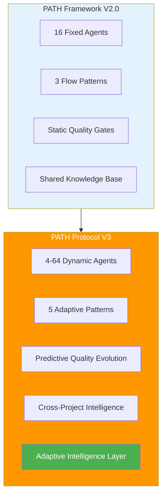
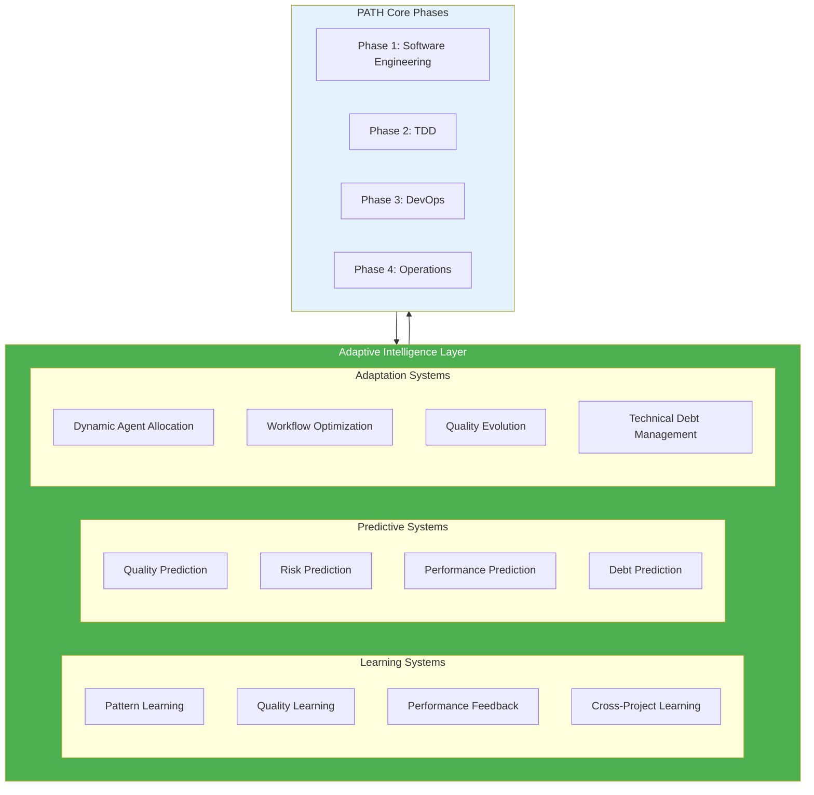
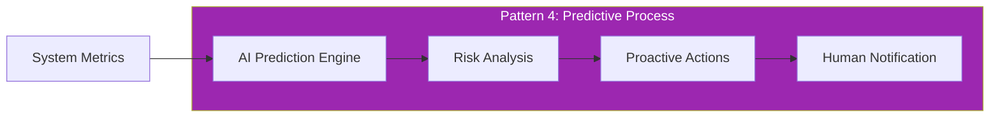
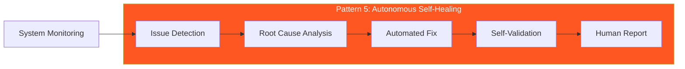
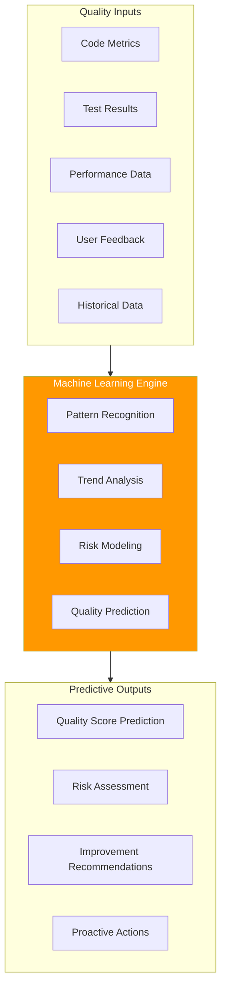
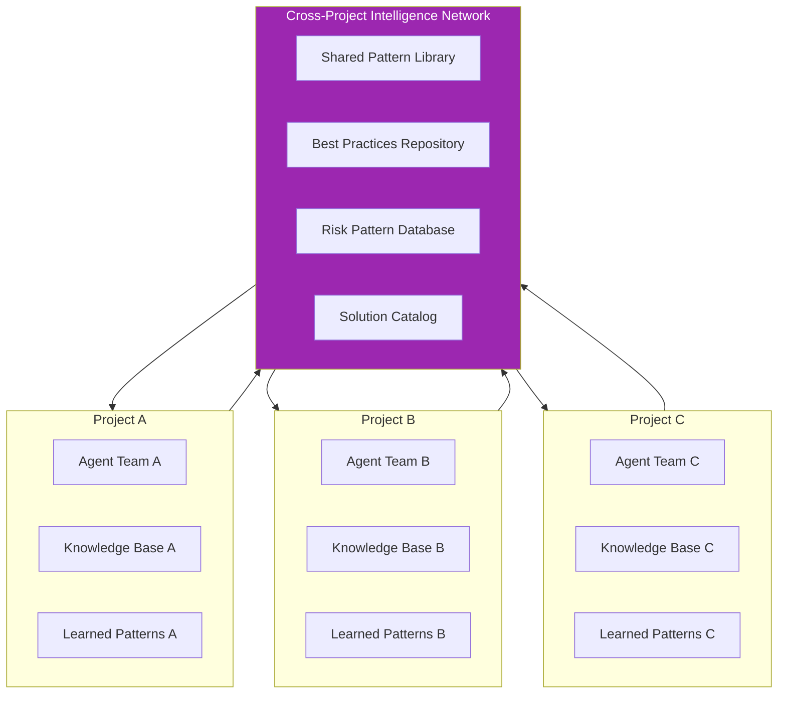
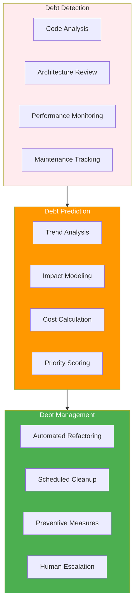

# PATH Protocol V3: Adaptive Intelligence Framework

## Document Metadata
**Created**: 2025-01-14  
**Last Updated**: 2025-01-14  
**Version**: 3.0  
**Status**: Draft  
**Based on**: PATH Framework V2.0 Research Analysis

## Abstract

PATH Protocol V3 introduces the **Adaptive Intelligence Framework** - an evolution of the PATH methodology that incorporates dynamic agent orchestration, real-time learning adaptation, and autonomous quality evolution. Building upon the proven four-phase lifecycle and three flow patterns, V3 adds **Adaptive Intelligence (AI²)** capabilities that enable self-optimizing development workflows, predictive quality assurance, and autonomous technical debt management.

## 1. Protocol Evolution Overview

### 1.1 From PATH Framework to PATH Protocol V3

**PATH Framework V2.0 Achievements:**
- ✅ 16 specialized agents across 4 phases
- ✅ 3 flow patterns (Human-Initiated, AI-Driven, Collaborative)
- ✅ Comprehensive quality gates and guardrails
- ✅ Multi-technology stack support

**PATH Protocol V3 Enhancements:**
- 🚀 **Dynamic Agent Scaling**: 4-64 agents based on project complexity
- 🧠 **Adaptive Intelligence**: Self-learning and self-optimizing workflows
- ⚡ **Real-Time Quality Evolution**: Predictive quality assurance
- 🔄 **Autonomous Debt Management**: Self-healing technical debt
- 🌐 **Cross-Project Learning**: Knowledge transfer between projects

### 1.2 Core V3 Innovations

## 2. Adaptive Intelligence (AI²) Layer

### 2.1 AI² Architecture

The Adaptive Intelligence layer operates above the traditional PATH phases, providing:

### 2.2 Dynamic Agent Orchestration

**Adaptive Agent Scaling:**
- **Micro Projects**: 4-8 agents (core specializations)
- **Standard Projects**: 16 agents (full PATH Framework)
- **Complex Projects**: 32 agents (domain specializations)
- **Enterprise Projects**: 64 agents (multi-domain expertise)

**Agent Specialization Evolution:**

```mermaid
flowchart TD
    subgraph Base[Base Agents - 4]
        BA1[Architect Agent]
        BA2[Developer Agent]
        BA3[DevOps Agent]
        BA4[Operations Agent]
    end
    
    subgraph Standard[Standard Agents - 16]
        SA1[Domain Analyst]
        SA2[System Architect]
        SA3[Component Designer]
        SA4[Integration Architect]
        SA5[TDD Orchestrator]
        SA6[Test Strategist]
        SA7[Implementation Specialist]
        SA8[Coverage Validator]
        SA9[Pipeline Architect]
        SA10[Infrastructure Engineer]
        SA11[Deployment Specialist]
        SA12[Monitoring Analyst]
        SA13[Reliability Engineer]
        SA14[Operations Specialist]
        SA15[Performance Analyst]
        SA16[Security Operator]
    end
    
    subgraph Complex[Complex Agents - 32]
        CA1[AI/ML Specialist]
        CA2[Data Engineer]
        CA3[Frontend Specialist]
        CA4[Backend Specialist]
        CA5[Mobile Specialist]
        CA6[API Designer]
        CA7[Database Architect]
        CA8[Security Architect]
        CA9[Performance Engineer]
        CA10[Quality Assurance]
        CA11[UX/UI Specialist]
        CA12[Integration Tester]
        CA13[Load Tester]
        CA14[Compliance Officer]
        CA15[Documentation Specialist]
        CA16[Release Manager]
    end
    
    Base --> Standard
    Standard --> Complex
    
    style Base fill:#ffebee
    style Standard fill:#e3f2fd
    style Complex fill:#e8f5e8
```

## 3. Enhanced Flow Patterns

### 3.1 Five Adaptive Flow Patterns

Building on V2's three patterns, V3 introduces two new adaptive patterns:

**Pattern 1: Human-Initiated (Strategic)** - 15%
**Pattern 2: AI-Driven (Systematic)** - 50%
**Pattern 3: Collaborative (Critical)** - 20%
**Pattern 4: Predictive (Proactive)** - 10% ⭐ NEW
**Pattern 5: Autonomous (Self-Healing)** - 5% ⭐ NEW

### 3.2 Pattern 4: Predictive Process

**Predictive Capabilities:**
- **Quality Degradation Prediction**: Identify potential quality issues before they occur
- **Performance Bottleneck Prediction**: Predict performance issues from code patterns
- **Security Vulnerability Prediction**: Anticipate security risks from architectural changes
- **Technical Debt Accumulation**: Predict when technical debt will impact velocity

### 3.3 Pattern 5: Autonomous Self-Healing

**Self-Healing Capabilities:**
- **Code Quality Auto-Fix**: Automatic refactoring for code quality issues
- **Performance Auto-Optimization**: Automatic performance improvements
- **Security Auto-Patching**: Automatic security vulnerability fixes
- **Infrastructure Auto-Scaling**: Automatic resource optimization

## 4. Predictive Quality Evolution

### 4.1 Quality Prediction Engine

### 4.2 Adaptive Quality Gates

**Traditional Quality Gates (V2):**
- Fixed thresholds (e.g., 90% test coverage)
- Static validation rules
- Manual threshold adjustments

**Adaptive Quality Gates (V3):**
- **Dynamic Thresholds**: Adjust based on project complexity and risk
- **Context-Aware Validation**: Rules adapt to project type and domain
- **Predictive Enforcement**: Prevent quality issues before they occur
- **Self-Optimizing Standards**: Quality gates improve based on outcomes

### 4.3 Quality Evolution Metrics

```mermaid
flowchart LR
    subgraph Traditional[Traditional Metrics]
        T1[Test Coverage %]
        T2[Bug Count]
        T3[Performance Benchmarks]
        T4[Security Scan Results]
    end
    
    subgraph Predictive[Predictive Metrics]
        P1[Quality Trend Prediction]
        P2[Risk Probability Scores]
        P3[Performance Degradation Forecast]
        P4[Security Vulnerability Likelihood]
    end
    
    subgraph Adaptive[Adaptive Metrics]
        A1[Quality Gate Effectiveness]
        A2[Prediction Accuracy]
        A3[Auto-Fix Success Rate]
        A4[Learning Velocity]
    end
    
    Traditional --> Predictive
    Predictive --> Adaptive
    
    style Traditional fill:#e3f2fd
    style Predictive fill:#ff9800,color:#fff
    style Adaptive fill:#4caf50,color:#fff
```

## 5. Cross-Project Intelligence Network

### 5.1 Project Intelligence Sharing

### 5.2 Knowledge Transfer Protocols

**Automatic Knowledge Sharing:**
- **Pattern Recognition**: Successful patterns automatically shared across projects
- **Risk Mitigation**: Failed approaches documented and shared as anti-patterns
- **Solution Reuse**: Proven solutions automatically suggested for similar problems
- **Best Practice Evolution**: Continuously updated best practices based on collective learning

**Privacy-Preserving Learning:**
- **Federated Learning**: Learn from patterns without sharing sensitive data
- **Anonymized Insights**: Share learnings while protecting proprietary information
- **Selective Sharing**: Control what knowledge is shared between projects
- **Compliance Awareness**: Respect data privacy and security requirements

## 6. Autonomous Technical Debt Management

### 6.1 Technical Debt Prediction and Prevention

### 6.2 Autonomous Debt Resolution

**Automated Debt Resolution:**
- **Code Refactoring**: Automatic code quality improvements
- **Architecture Cleanup**: Systematic architecture debt reduction
- **Performance Optimization**: Automatic performance debt resolution
- **Documentation Updates**: Automatic documentation debt management

**Debt Prevention:**
- **Pattern Enforcement**: Prevent debt-inducing patterns
- **Quality Gates**: Block debt-creating changes
- **Proactive Monitoring**: Early debt detection and intervention
- **Education Systems**: Teach developers debt-free practices

## 7. Implementation Roadmap

### 7.1 Migration from V2 to V3

**Phase 1: Foundation (Months 1-3)**
- Implement AI² layer infrastructure
- Add predictive analytics capabilities
- Enhance agent orchestration system
- Develop cross-project intelligence network

**Phase 2: Enhancement (Months 4-6)**
- Deploy Pattern 4 (Predictive) workflows
- Implement adaptive quality gates
- Add autonomous debt management
- Enable cross-project learning

**Phase 3: Optimization (Months 7-9)**
- Deploy Pattern 5 (Autonomous) workflows
- Optimize prediction accuracy
- Enhance self-healing capabilities
- Scale to enterprise deployments

**Phase 4: Evolution (Months 10-12)**
- Continuous learning optimization
- Advanced AI² capabilities
- Multi-domain specialization
- Global intelligence network

### 7.2 Backward Compatibility

**V2 Compatibility Guarantee:**
- All V2 workflows continue to function
- Gradual migration path available
- No breaking changes to existing APIs
- Optional V3 feature adoption

## 8. Success Metrics and KPIs

### 8.1 V3-Specific Metrics

**Adaptive Intelligence Metrics:**
- **Prediction Accuracy**: >95% for quality and risk predictions
- **Auto-Fix Success Rate**: >90% for autonomous resolutions
- **Learning Velocity**: Continuous improvement in agent performance
- **Cross-Project Knowledge Transfer**: Measurable knowledge reuse

**Quality Evolution Metrics:**
- **Proactive Issue Prevention**: >80% of issues prevented before occurrence
- **Quality Gate Adaptation**: Dynamic threshold optimization effectiveness
- **Technical Debt Reduction**: Autonomous debt resolution rate
- **Continuous Improvement**: Quality metrics improvement over time

### 8.2 Business Impact Metrics

**Development Velocity:**
- **Faster Time-to-Market**: 40% reduction in development cycles
- **Reduced Manual Effort**: 60% reduction in manual quality assurance
- **Improved Code Quality**: 50% reduction in production defects
- **Enhanced Predictability**: 90% accuracy in delivery predictions

**Operational Excellence:**
- **Reduced Incidents**: 70% reduction in production incidents
- **Faster Recovery**: 80% reduction in mean time to recovery
- **Proactive Optimization**: 90% of performance issues prevented
- **Autonomous Operations**: 50% reduction in manual operations

## 9. Technology Requirements

### 9.1 AI² Infrastructure

**Machine Learning Platform:**
- **Model Training**: Continuous learning from project data
- **Inference Engine**: Real-time prediction and decision making
- **Feature Store**: Centralized feature management
- **Model Registry**: Version control for ML models

**Data Infrastructure:**
- **Real-Time Streaming**: Live data processing and analysis
- **Data Lake**: Historical data storage and analysis
- **Feature Engineering**: Automated feature extraction
- **Privacy Controls**: Data anonymization and access control

### 9.2 Enhanced Technology Stack

**Core Technologies:**
- **Kubernetes**: Container orchestration for agent scaling
- **Apache Kafka**: Real-time event streaming
- **TensorFlow/PyTorch**: Machine learning frameworks
- **Redis Cluster**: High-performance caching
- **Elasticsearch**: Advanced search and analytics

**Integration Technologies:**
- **GraphQL Federation**: Unified API layer
- **gRPC**: High-performance service communication
- **WebRTC**: Real-time collaboration
- **Blockchain**: Immutable audit trails (optional)

## 10. Security and Compliance

### 10.1 Enhanced Security Framework

**AI² Security:**
- **Model Security**: Protection against adversarial attacks
- **Data Privacy**: Federated learning and differential privacy
- **Access Control**: Fine-grained permissions for AI systems
- **Audit Trails**: Complete traceability of AI decisions

**Compliance Integration:**
- **Regulatory Compliance**: Automated compliance checking
- **Data Governance**: Automated data classification and protection
- **Risk Management**: Continuous risk assessment and mitigation
- **Audit Automation**: Automated compliance reporting

## 11. Conclusion

PATH Protocol V3 represents a significant evolution in software engineering methodology, introducing Adaptive Intelligence capabilities that enable self-optimizing, predictive, and autonomous development workflows. By building upon the proven foundation of the PATH Framework V2.0, V3 delivers:

**Key Innovations:**
- **Adaptive Intelligence Layer**: Self-learning and self-optimizing capabilities
- **Dynamic Agent Orchestration**: Scalable from 4 to 64 agents based on complexity
- **Predictive Quality Evolution**: Proactive quality assurance and risk prevention
- **Autonomous Technical Debt Management**: Self-healing code and architecture
- **Cross-Project Intelligence Network**: Shared learning across projects

**Business Benefits:**
- **40% faster development cycles** through predictive optimization
- **60% reduction in manual effort** through autonomous operations
- **70% reduction in production incidents** through proactive prevention
- **90% prediction accuracy** for quality and delivery outcomes

PATH Protocol V3 establishes the next generation of human-AI collaboration in software engineering, providing organizations with intelligent, adaptive, and autonomous development capabilities while maintaining the quality, security, and compliance standards required for enterprise software delivery.

---

**Protocol Version**: PATH Protocol V3.0  
**Framework Compatibility**: PATH Framework V2.0+  
**Implementation Status**: Draft Specification  
**Next Review**: 2025-02-14