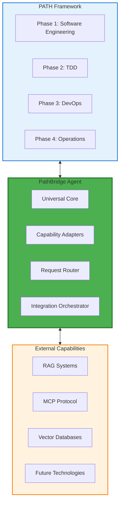

# PathBridge Agent

## Overview

**PathBridge Agent** is the universal bridge that connects the PATH Framework with all current and future capabilities including RAG, MCP, Vector Databases, and emerging AI technologies.

## Core Concept

## Key Features

### **Universal Integration**
- **Framework Agnostic**: Works with PATH Framework while remaining independent
- **Capability Extensible**: Easy integration of new technologies
- **Protocol Adaptive**: Supports multiple communication protocols

### **Bridge Architecture**
- **Bidirectional Communication**: PATH ↔ External Capabilities
- **Request Routing**: Intelligent routing to appropriate capabilities
- **Response Orchestration**: Coordinated responses from multiple sources

### **Future-Proof Design**
- **Modular Adapters**: Add new capabilities without core changes
- **Version Management**: Handle multiple versions of external systems
- **Graceful Degradation**: Continue operation when capabilities are unavailable

## Domain Strategy

- **Primary Domain**: `pathbridge.ai`
- **Purpose**: Official PathBridge Agent platform
- **Future Use**: Documentation, API endpoints, community resources

## Next Steps

1. **Architecture Design**: Define core PathBridge architecture
2. **Adapter Framework**: Design capability adapter system
3. **Integration Protocols**: Define PATH Framework integration points
4. **Implementation Plan**: Create development roadmap
5. **Domain Registration**: Secure pathbridge.ai domain

## Integration Capabilities

### **Current Targets**
- **RAG Systems**: Retrieval-Augmented Generation integration
- **MCP Protocol**: Model Context Protocol support
- **Vector Databases**: Semantic search and similarity matching
- **PATH Framework**: Native PATH methodology support

### **Future Expansion**
- **Emerging AI Technologies**: Automatic integration framework
- **Custom Protocols**: User-defined integration capabilities
- **Multi-Modal Systems**: Vision, audio, and text processing
- **Distributed Systems**: Cross-platform capability orchestration