# PATH Framework Agent Architecture

```mermaid
graph LR
    %% External Services
    USER[👤 User/Developer] --> REQ[CapabilityRequest]
    LLM_SERVICE[🤖 LLM Service<br/>GPT-4/Claude/Local] 
    FILE_SYSTEM[💾 File System<br/>/tmp, /project]
    OS[🖥️ Operating System<br/>Commands & Processes]
    GIT[📚 Git Repository<br/>Version Control]
    
    %% BaseAgent Core Architecture
    REQ --> BA[🎯 BaseAgent<br/>PATH_DEVELOPMENT]
    
    %% Core Services Layer
    BA --> CORE_SERVICES[Core Services Layer]
    CORE_SERVICES --> KB[📊 SharedKnowledgeBase<br/>• Data storage<br/>• Context management<br/>• Learning history]
    CORE_SERVICES --> CL[🔗 CommunicationLayer<br/>• Inter-agent messaging<br/>• Event broadcasting<br/>• Protocol handling]
    CORE_SERVICES --> HV[👥 HumanValidationInterface<br/>• Critical operation approval<br/>• Decision escalation<br/>• Feedback collection]
    
    %% System Integration Layer
    BA --> SYS_LAYER[System Integration Layer]
    SYS_LAYER --> SA[⚙️ SystemAdapter<br/>• File operations<br/>• Command execution<br/>• Process management]
    SYS_LAYER --> LLM[🧠 UnifiedLLMInterface<br/>• Code generation<br/>• Analysis & insights<br/>• Natural language processing]
    
    %% Capability Services
    BA --> CAP_LAYER[Capability Services Layer]
    CAP_LAYER --> FO[📁 FileOperations Service<br/>• read, write, delete<br/>• directory management<br/>• file validation]
    CAP_LAYER --> CE[⚡ CommandExecution Service<br/>• shell commands<br/>• async execution<br/>• output streaming]
    CAP_LAYER --> CG[💻 CodeGeneration Service<br/>• source code creation<br/>• template processing<br/>• code formatting]
    CAP_LAYER --> AT[🔍 AnalysisTools Service<br/>• static analysis<br/>• metrics calculation<br/>• quality assessment]
    
    %% Validation & Compliance Layer
    BA --> VAL_LAYER[Validation & Compliance Layer]
    VAL_LAYER --> UTC[⏰ UTC TimeTracker<br/>• Session timestamps<br/>• Execution timing<br/>• Duration tracking]
    VAL_LAYER --> RC[✅ RuleCompliance Engine<br/>• PATH Framework rules<br/>• Validation gates<br/>• Audit trails]
    VAL_LAYER --> TDD[🔄 TDD StateManager<br/>• RED-GREEN-REFACTOR<br/>• Test coverage tracking<br/>• Quality gates]
    
    %% Profile & Configuration
    BA --> PROF[👤 AgentProfile<br/>development]
    PROF --> CONFIG[⚙️ Profile Configuration<br/>• Capability mappings<br/>• Rule customization<br/>• Behavior settings]
    
    %% External Service Connections
    SA --> FILE_SYSTEM
    SA --> OS
    LLM --> LLM_SERVICE
    KB --> GIT
    
    %% Response Flow
    BA --> RESP[📤 CapabilityResponse<br/>• Status & results<br/>• Execution metadata<br/>• Compliance report]
    RESP --> USER
    
    %% Data Sources
    DATA_SOURCES[📋 Data Sources]
    DATA_SOURCES --> US[📖 User Stories<br/>• Business requirements<br/>• Acceptance criteria<br/>• Value propositions]
    DATA_SOURCES --> CD[⚙️ Configuration Data<br/>• App settings<br/>• Environment configs<br/>• Feature flags]
    DATA_SOURCES --> MS[🏗️ Model Specifications<br/>• Class definitions<br/>• Validation rules<br/>• Business logic]
    
    US --> BA
    CD --> BA
    MS --> BA
    
    %% Styling
    classDef agent fill:#e1f5fe,stroke:#01579b,stroke-width:3px
    classDef services fill:#f3e5f5,stroke:#4a148c,stroke-width:2px
    classDef validation fill:#ffebee,stroke:#b71c1c,stroke-width:2px
    classDef external fill:#e8f5e8,stroke:#1b5e20,stroke-width:2px
    classDef data fill:#fff3e0,stroke:#e65100,stroke-width:2px
    classDef layers fill:#f1f8e9,stroke:#33691e,stroke-width:2px
    
    class BA,PROF agent
    class CORE_SERVICES,SYS_LAYER,CAP_LAYER layers
    class KB,CL,HV,SA,LLM,FO,CE,CG,AT services
    class VAL_LAYER,UTC,RC,TDD validation
    class USER,LLM_SERVICE,FILE_SYSTEM,OS,GIT external
    class DATA_SOURCES,US,CD,MS,REQ,RESP data
```

## Legend

🔵 **Agent Core** - BaseAgent with profile configuration  
🟢 **Service Layers** - Organized service architecture  
🟣 **Services** - Individual service components  
🔴 **Validation** - PATH Framework compliance & quality gates  
🟢 **External** - External systems and services  
🟠 **Data Flow** - Requests, responses, and data sources

## Service Architecture

### Core Services Layer
- **SharedKnowledgeBase**: Centralized data storage and context management
- **CommunicationLayer**: Inter-agent messaging and event handling
- **HumanValidationInterface**: Human-in-the-loop decision making

### System Integration Layer  
- **SystemAdapter**: Direct system operations (files, commands)
- **UnifiedLLMInterface**: AI/ML service integration

### Capability Services Layer
- **FileOperations**: File system management service
- **CommandExecution**: System command execution service
- **CodeGeneration**: Source code creation service
- **AnalysisTools**: Code analysis and metrics service

### Validation & Compliance Layer
- **UTC TimeTracker**: Precise timing and duration tracking
- **RuleCompliance Engine**: PATH Framework rule enforcement
- **TDD StateManager**: Test-driven development workflow management