# CoreAgent Design


> Minimal CoreAgent foundation with hexagonal architecture for PATH Framework's 16 specialized agents

## Design Philosophy

**CoreAgent**: Minimal essential foundation shared by all 16 PATH Framework agents
**TypeAgents**: Specialized implementations (DomainAnalystAgent, TDDOrchestratorAgent, etc.)
**Hexagonal Architecture**: Clean separation with ports and adapters for external systems

### Core Principles
- **Minimal Core**: Only 5 essential services in CoreAgent
- **Dynamic Capabilities**: TypeAgents register specialized capabilities as needed
- **Universal Connectivity**: Generic adapter port for any external system
- **Clean Boundaries**: Hexagonal architecture ensures testability and maintainability

```mermaid
graph TD
    %% Primary Adapters (Driving Side)
    ORCHESTRATOR[🎯 Agent Orchestrator<br/>Workflow Control] --> ORCHESTRATOR_ADAPTER[🔄 Orchestrator Adapter<br/>Sequential/Concurrent Execution]
    EXTERNAL_AGENTS[🤖 External Agents] --> AGENT_ADAPTER[🔗 Agent-to-Agent Adapter<br/>Inter-agent Communication]
    KNOWLEDGE_BASE[📚 Knowledge Base<br/>Shared Data] --> KB_ADAPTER[💾 Knowledge Base Adapter<br/>Data Access with Caching]
    SCHEDULER[⏰ Scheduler] --> CRON_ADAPTER[📅 Cron Adapter<br/>Scheduled Tasks]
    
    %% Application Layer (Ports)
    ORCHESTRATOR_ADAPTER --> APP_LAYER[Application Layer]
    AGENT_ADAPTER --> APP_LAYER
    KB_ADAPTER --> APP_LAYER
    CRON_ADAPTER --> APP_LAYER
    
    APP_LAYER --> CAPABILITY_PORT[📋 Capability Port<br/>execute_capability]
    APP_LAYER --> VALIDATION_PORT[✅ Validation Port<br/>validate_request]
    APP_LAYER --> PROFILE_PORT[👤 Profile Port<br/>load_profile]
    APP_LAYER --> ERROR_PORT[🚨 Error Handling Port<br/>handle_error]
    APP_LAYER --> SECURITY_PORT[🔒 Security Port<br/>authenticate_authorize]
    
    %% Domain Layer (Core Business Logic)
    CAPABILITY_PORT --> DOMAIN[🎯 Domain Layer]
    VALIDATION_PORT --> DOMAIN
    PROFILE_PORT --> DOMAIN
    ERROR_PORT --> DOMAIN
    SECURITY_PORT --> DOMAIN
    
    DOMAIN --> CORE_AGENT[🏛️ CoreAgent<br/>Minimal Skeleton]
    DOMAIN --> TYPE_AGENTS[👤 TypeAgents<br/>DA, SA, TO, TS, etc.]
    DOMAIN --> RULE_ENGINE[📏 Rule Engine<br/>PATH Framework Rules]
    DOMAIN --> ERROR_HANDLER[🚨 Error Handler<br/>Retry, Fallback, Logging]
    DOMAIN --> SECURITY_MODULE[🔒 Security Module<br/>Auth & Encryption]
    
    CORE_AGENT --> SHARED_SERVICES[📊 Shared Services<br/>Knowledge Base, Validation]
    CORE_AGENT --> CAPABILITY_REGISTRY[📋 Capability Registry<br/>Dynamic Loading]
    TYPE_AGENTS --> SPECIALIZED_CAPS[⚙️ Specialized Capabilities<br/>Agent-Specific Logic]
    RULE_ENGINE --> COMPLIANCE_RULES[✅ Compliance Rules<br/>Validation Gates]
    
    %% Secondary Adapters (Driven Side - Generic Adapter Interface)
    CORE_AGENT --> GENERIC_PORT[🔌 Generic Adapter Port<br/>Universal Interface]
    TYPE_AGENTS --> CAPABILITY_PORTS[Capability-Specific Ports]
    
    CAPABILITY_PORTS --> FILE_PORT[📁 File Operations Port<br/>Phase 2,3 Agents]
    CAPABILITY_PORTS --> CMD_PORT[⚡ Command Execution Port<br/>Phase 2,3 Agents]
    CAPABILITY_PORTS --> LLM_PORT[🧠 LLM Integration Port<br/>Phase 1,2 Agents]
    CAPABILITY_PORTS --> ANALYSIS_PORT[🔍 Analysis Port<br/>Phase 1,4 Agents]
    
    CORE_AGENT --> KB_PORT[📊 Knowledge Base Port]
    CORE_AGENT --> VALIDATION_PORT_CORE[👥 Human Validation Port]
    CORE_AGENT --> TEST_PORT[🧪 Testing Port<br/>Mocking & Simulation]
    
    GENERIC_PORT --> GENERIC_ADAPTER[🔌 Generic Adapter<br/>Connect Any External System]
    FILE_PORT --> FILE_ADAPTER[📂 File System Adapter<br/>Local/Remote Files]
    CMD_PORT --> CMD_ADAPTER[🖥️ Command Adapter<br/>Shell/Process Execution]
    LLM_PORT --> LLM_ADAPTER[🤖 LLM Adapter<br/>OpenAI/Claude/Local]
    ANALYSIS_PORT --> ANALYSIS_ADAPTER[🔍 Analysis Adapter<br/>Code Quality/Metrics]
    KB_PORT --> KB_ADAPTER_CORE[📊 Knowledge Base Adapter<br/>Agent Communication]
    VALIDATION_PORT_CORE --> HUMAN_ADAPTER[👥 Human Validation Adapter<br/>Approval Workflow]
    TEST_PORT --> TEST_ADAPTER[🧪 Testing Adapter<br/>Unit/Integration Testing]
    
    %% External Systems
    GENERIC_ADAPTER --> EXTERNAL_SYSTEM[🌐 External System<br/>Any System/Service]
    FILE_ADAPTER --> FILE_SYSTEM[💾 File System]
    CMD_ADAPTER --> OS[🖥️ Operating System]
    LLM_ADAPTER --> LLM_SERVICE[🤖 LLM Services<br/>GPT-4/Claude/Local]
    ANALYSIS_ADAPTER --> ANALYSIS_TOOLS[🔍 Analysis Tools<br/>Static Analysis/Metrics]
    KB_ADAPTER_CORE --> SHARED_KB[📊 Shared Knowledge Base<br/>Agent Communication Hub]
    HUMAN_ADAPTER --> HUMAN_REVIEWER[👤 Human Reviewer]
    TEST_ADAPTER --> TEST_ENV[🧪 Test Environment<br/>Mocked Systems]
    
    %% Styling
    classDef primary fill:#e3f2fd,stroke:#1976d2,stroke-width:3px
    classDef application fill:#f3e5f5,stroke:#7b1fa2,stroke-width:2px
    classDef domain fill:#fff3e0,stroke:#f57c00,stroke-width:3px
    classDef secondary fill:#e8f5e8,stroke:#388e3c,stroke-width:2px
    classDef external fill:#fce4ec,stroke:#c2185b,stroke-width:2px
    
    class ORCHESTRATOR,EXTERNAL_AGENTS,KNOWLEDGE_BASE,SCHEDULER,ORCHESTRATOR_ADAPTER,AGENT_ADAPTER,KB_ADAPTER,CRON_ADAPTER primary
    class APP_LAYER,CAPABILITY_PORT,VALIDATION_PORT,PROFILE_PORT,ERROR_PORT,SECURITY_PORT application
    class DOMAIN,CORE_AGENT,TYPE_AGENTS,RULE_ENGINE,SHARED_SERVICES,CAPABILITY_REGISTRY,SPECIALIZED_CAPS,COMPLIANCE_RULES,ERROR_HANDLER,SECURITY_MODULE domain
    class GENERIC_PORT,CAPABILITY_PORTS,FILE_PORT,CMD_PORT,LLM_PORT,ANALYSIS_PORT,KB_PORT,VALIDATION_PORT_CORE,TEST_PORT,GENERIC_ADAPTER,FILE_ADAPTER,CMD_ADAPTER,LLM_ADAPTER,ANALYSIS_ADAPTER,KB_ADAPTER_CORE,HUMAN_ADAPTER,TEST_ADAPTER secondary
    class EXTERNAL_SYSTEM,FILE_SYSTEM,OS,LLM_SERVICE,ANALYSIS_TOOLS,SHARED_KB,HUMAN_REVIEWER,TEST_ENV external
```



## CoreAgent Architecture Elements by Layer

### 🔵 Primary Adapters Layer
| Element | Type | Responsibility |
|---------|------|----------------|
| **ORCHESTRATOR** | External Driver | Sequential or concurrent workflow execution control |
| **EXTERNAL_AGENTS** | External Driver | Inter-agent communication requests |
| **KNOWLEDGE_BASE** | External Driver | Shared data access requests with caching |
| **SCHEDULER** | External Driver | Scheduled task execution |
| **ORCHESTRATOR_ADAPTER** | Adapter | Workflow execution interface supporting concurrency |
| **AGENT_ADAPTER** | Adapter | Agent-to-agent communication interface |
| **KB_ADAPTER** | Adapter | Knowledge base access interface with performance optimizations |
| **CRON_ADAPTER** | Adapter | Scheduled task interface |

### 🟣 Application Layer
| Element | Type | Responsibility |
|---------|------|----------------|
| **APP_LAYER** | Orchestrator | Request coordination, routing, error propagation, and security checks |
| **CAPABILITY_PORT** | Port | Capability execution entry point |
| **VALIDATION_PORT** | Port | Request validation and rule checking |
| **PROFILE_PORT** | Port | Agent profile management and configuration |
| **ERROR_PORT** | Port | Error handling and recovery interface |
| **SECURITY_PORT** | Port | Authentication and authorization interface |

### 🟠 Domain Layer
| Element | Type | Responsibility |
|---------|------|----------------|
| **DOMAIN** | Container | Core business logic container |
| **CORE_AGENT** | Entity | Minimal skeleton with identity, KB access, validation, compliance, and registry |
| **TYPE_AGENTS** | Entity | Specialized agent implementations inheriting CoreAgent |
| **RULE_ENGINE** | Service | PATH Framework rule enforcement |
| **SHARED_SERVICES** | Service | Knowledge base and validation services |
| **CAPABILITY_REGISTRY** | Service | Dynamic capability loading and management |
| **SPECIALIZED_CAPS** | Service | Agent-specific business logic |
| **COMPLIANCE_RULES** | Value Object | Validation gates and audit rules |
| **ERROR_HANDLER** | Service | Retry mechanisms, fallback strategies, and error logging |
| **SECURITY_MODULE** | Service | Authentication, authorization, and encryption services |

### 🟢 Secondary Adapters Layer

#### Ports
| Element | Type | Responsibility |
|---------|------|----------------|
| **GENERIC_PORT** | Port | Universal interface for connecting any external adapter |
| **CAPABILITY_PORTS** | Port | Agent-specific capability interfaces |
| **FILE_PORT** | Port | File operations interface (Phase 2,3 agents) |
| **CMD_PORT** | Port | Command execution interface (Phase 2,3 agents) |
| **LLM_PORT** | Port | LLM integration interface (Phase 1,2 agents) |
| **ANALYSIS_PORT** | Port | Analysis tools interface (Phase 1,4 agents) |
| **KB_PORT** | Port | Knowledge base interface (all agents) |
| **VALIDATION_PORT_CORE** | Port | Human validation interface (all agents) |
| **TEST_PORT** | Port | Testing and mocking interface (all agents) |

#### Adapters
| Element | Type | Responsibility |
|---------|------|----------------|
| **GENERIC_ADAPTER** | Adapter | Pluggable connector for any external system |
| **FILE_ADAPTER** | Adapter | Local/remote file system operations |
| **CMD_ADAPTER** | Adapter | Shell and process execution |
| **LLM_ADAPTER** | Adapter | AI/ML service integration with fallback options |
| **ANALYSIS_ADAPTER** | Adapter | Code quality and metrics tools |
| **KB_ADAPTER_CORE** | Adapter | Agent communication hub with scalability features |
| **HUMAN_ADAPTER** | Adapter | Human approval workflow |
| **TEST_ADAPTER** | Adapter | Mocking and simulation for testing |

### 🔴 External Systems Layer
| Element | Type | Responsibility |
|---------|------|----------------|
| **EXTERNAL_SYSTEM** | External | Any arbitrary system or service |
| **FILE_SYSTEM** | External | Operating system file operations |
| **OS** | External | Operating system commands and processes |
| **LLM_SERVICE** | External | AI/ML services (GPT-4, Claude, Local) |
| **ANALYSIS_TOOLS** | External | Static analysis and metrics tools |
| **SHARED_KB** | External | Centralized or distributed agent communication database |
| **HUMAN_REVIEWER** | External | Human decision makers and approvers |
| **TEST_ENV** | External | Mocked environments for testing |

## CoreAgent Architecture Summary

### Element Categories
- **🔵 Primary Adapters (8)**: Handle incoming requests and drive the application.
- **🟣 Application Layer (5)**: Coordinate between adapters and domain logic, including error and security ports.
- **🟠 Domain Layer (9)**: Core business rules and entities, enhanced with error handling and security modules.
- **🟢 Secondary Adapters (16)**: Handle outgoing requests, including generic adapter for universal connectivity.
- **🔴 External Systems (8)**: External dependencies, now including generic and test environments.

**Total Elements**: 46 components in the CoreAgent architecture.

## Architecture Layers

### 🔵 Primary Adapters (Driving Side)
**Purpose**: Handle incoming requests and drive the application.
- **Orchestrator Adapter**: Supports sequential and concurrent workflow execution.
- **Agent-to-Agent Adapter**: Facilitates inter-agent communication via the shared knowledge base.
- **Knowledge Base Adapter**: Manages data access with built-in caching for performance.
- **Cron Adapter**: Handles scheduled tasks (optional).

### 🟣 Application Layer (Orchestration)
**Purpose**: Coordinate between adapters and domain logic.
- **Capability Port**: Main entry point for capability execution.
- **Validation Port**: Request validation and rule checking.
- **Profile Port**: Agent profile management and configuration.
- **Error Handling Port**: Propagates and manages errors from domain to adapters.
- **Security Port**: Enforces authentication and authorization for incoming requests.

### 🟠 Domain Layer (Core Business Logic)
**Purpose**: Contains the core business rules and entities.
- **CoreAgent**: Minimal skeleton with five essential services:
  - Agent identity (code, phase, ID, logging).
  - Knowledge base access (agent-to-agent communication).
  - Human validation interface (critical decisions).
  - PATH Framework compliance (UTC tracking, rule validation).
  - Capability registry (dynamic loading of specialized capabilities).
- **TypeAgents**: Specialized implementations inheriting CoreAgent foundation.
- **Rule Engine**: Enforces PATH Framework rules.
- **Error Handler**: Manages retries, fallbacks, and logging for fault tolerance.
- **Security Module**: Handles authentication, authorization, and data encryption.

### 🟢 Secondary Adapters (Driven Side)
**Purpose**: Handle outgoing requests to external systems.

**Generic Adapter** (core to all agents):
- **Generic Adapter**: Universal connector allowing integration with any external system via configurable interfaces.

**Agent-Specific Adapters** (loaded dynamically):
- **File System Adapter**: Local and remote file operations (Phase 2,3 agents).
- **Command Adapter**: Shell and process execution (Phase 2,3 agents).
- **LLM Adapter**: Integration with AI/ML services, with fallback to local models (Phase 1,2 agents).
- **Analysis Adapter**: Code quality and metrics (Phase 1,4 agents).

**Core Shared Adapters** (all agents):
- **Knowledge Base Adapter**: Agent-to-agent communication hub, scalable via distributed databases.
- **Human Validation Adapter**: Human approval workflows.
- **Testing Adapter**: Supports mocking and simulation for unit/integration testing.

### 🔴 External Systems
**Purpose**: External dependencies and infrastructure.
- **Modular Secondary Adapters**: Pluggable integrations, including generic for custom systems.
- **Shared Knowledge Base**: Supports centralized or distributed setups for scalability.
- **LLM Services**: Multiple providers with fallback mechanisms.
- **File Systems & OS**: Direct system operations.
- **Human Reviewers**: Approval and validation workflows.
- **Test Environment**: Mocked systems for testing.

## Scalability and Performance
The architecture is designed for scalability:
- **Knowledge Base Scaling**: Use distributed databases (e.g., sharding, replication) to handle high-volume interactions. Caching mechanisms (e.g., Redis integration via generic adapter) reduce latency.
- **Performance Optimizations**: Batch LLM requests, cache frequent data accesses, and implement asynchronous processing for non-blocking operations.
- **Load Balancing**: Orchestrator supports distributing workloads across multiple agent instances.

## Error Handling and Fault Tolerance
- **Mechanisms**: The Error Handler implements exponential backoff retries, fallback strategies (e.g., switch LLM providers on failure), and comprehensive logging.
- **Recovery**: Circuit breakers prevent cascading failures; errors are propagated through the Error Port for centralized management.
- **Examples**: If an LLM service fails, fallback to a local model; log all errors with timestamps and agent IDs for auditing.

## Concurrency and Synchronization
- **Orchestrator Support**: Handles concurrent operations using thread pools or asynchronous queues (e.g., via Python's asyncio).
- **Synchronization**: Locks or semaphores protect shared resources like the knowledge base; optimistic concurrency control for data updates.
- **Use Cases**: Multiple TypeAgents can process tasks in parallel, with the orchestrator coordinating dependencies.

## Security Considerations
- **Authentication and Authorization**: Security Module enforces role-based access control (RBAC) for agent interactions and human validations.
- **Encryption**: Data in transit (e.g., agent communication) and at rest (knowledge base) uses AES-256 encryption.
- **Best Practices**: Input sanitization to prevent injection attacks; secure token management for external adapters.
- **Compliance**: Integrates with PATH Framework rules for audit logging of security events.

## Testing Strategy
- **Unit Testing**: Mock ports and adapters using the Test Port to isolate domain logic.
- **Integration Testing**: Simulate external systems via Test Adapter; verify end-to-end flows.
- **Tools**: Leverage pytest for automated tests; include coverage for capabilities and error paths.
- **Mocking**: Dynamic mocks for LLM or file adapters to ensure test reliability without external dependencies.

## Versioning and Evolution
- **Semantic Versioning**: Use major.minor.patch for CoreAgent updates; ensure backward compatibility for ports.
- **Migration Strategy**: Deprecate old capabilities gradually; provide migration scripts for knowledge base schema changes.
- **Compatibility**: TypeAgents specify compatible CoreAgent versions in profiles.

## CoreAgent Design Benefits

### 🎯 **Minimal Core**
- Only five essential services in the skeleton, shared by all agents.
- No bloat—specialized capabilities loaded dynamically.
- Universal foundation for consistent behavior across phases.

### 🔄 **Specialized Extensions**
- TypeAgents add only required capabilities via registry.
- Examples: DomainAnalystAgent focuses on analysis; TDDOrchestratorAgent adds file and command ops.
- Clean inheritance and pluggable adapters.

### 📏 **PATH Framework Compliance**
- Built-in rule enforcement, UTC tracking, and audit trails.
- Human validation for critical ops.
- Consistent across all agents.

### 🛡️ **Agent Communication**
- Scalable shared knowledge base.
- Sequential or concurrent orchestration.
- Generic adapter for flexible integrations.

### 🔒 **Enhanced Robustness**
- Integrated error handling, security, and testing.
- Scalable and performant for production use.

## Onboarding New TypeAgents
To add a new TypeAgent:
1. Inherit from CoreAgent in a new class (e.g., `class NewAgent(CoreAgent):`).
2. Override `__init__` to register specific capabilities via `self.capabilities.register(...)`.
3. Define agent-specific ports if needed, or use the generic port for custom adapters.
4. Update profiles and dependencies in configuration files.
5. Test using the Test Adapter.

API for registration:
```python
self.capabilities.register("custom_cap", CustomCapabilityImplementation())
```

## Deployment Considerations
- **Containerization**: Use Docker for packaging agents; Kubernetes for orchestration and scaling.
- **Cloud Compatibility**: Deploy on AWS, GCP, or Azure; leverage managed databases for knowledge base.
- **Resource Requirements**: Minimum 2GB RAM per agent instance; scale based on workload.
- **Monitoring**: Integrate with Prometheus for metrics; ELK stack for logs.

## Troubleshooting
- **Common Issues**:
  - **Connection Failures**: Check adapter configurations; verify external system availability.
  - **Performance Bottlenecks**: Enable caching; monitor knowledge base queries.
  - **Security Errors**: Ensure tokens are valid; review RBAC settings.
  - **Concurrency Conflicts**: Inspect logs for lock contention; adjust thread pool sizes.
- **Debugging Tips**: Use CoreAgent logging; simulate scenarios with Test Adapter.
- **FAQ**: 
  - Q: How to switch LLM providers? A: Update LLM Adapter configuration.
  - Q: Agent not registering capabilities? A: Verify registry initialization in `__init__`.

## CoreAgent Communication Patterns

### 🔄 **CoreAgent Foundation**
```python
class CoreAgent:
    def __init__(self, agent_code: str, phase: int):
        self.agent_id = f"PATH_{agent_code}"  # Identity
        self.knowledge_base = SharedKnowledgeBase()  # Communication with scaling
        self.validation = HumanValidationInterface()  # Approval
        self.capabilities = CapabilityRegistry()  # Dynamic loading
        self.error_handler = ErrorHandler()  # Fault tolerance
        self.security = SecurityModule()  # Auth and encryption
        self._initialize_generic_adapter()  # Universal connectivity
```

### 📊 **TypeAgent Specialization**
```python
class DomainAnalystAgent(CoreAgent):
    def __init__(self):
        super().__init__("DA", 1)
        self.capabilities.register("analyze_requirements", RequirementsAnalysis())
        self.capabilities.register("domain_modeling", DomainModeling())

class TDDOrchestratorAgent(CoreAgent):
    def __init__(self):
        super().__init__("TO", 2)
        self.capabilities.register("tdd_workflow", TDDWorkflow())
        self.capabilities.register("file_ops", FileOperations())
        self.capabilities.register("cmd_exec", CommandExecution())
```

### 🔗 **Agent Communication**
```python
# Inherited from CoreAgent
await agent.store_output("operation", result)  # Share data securely
previous_work = await agent.get_previous_work("PATH_DA", "analyze")  # Retrieve with auth check
approval = agent.request_human_approval("critical_op", data)  # Validated request
try:
    result = await agent.execute_capability("tdd_workflow")
except Exception as e:
    agent.error_handler.handle(e)  # Retry or fallback
```