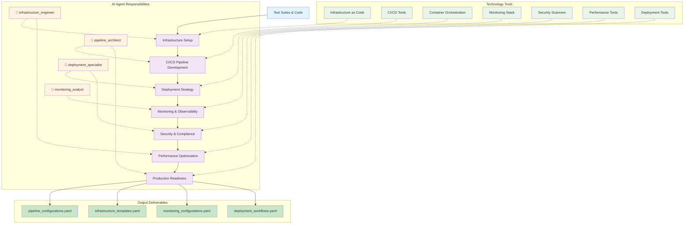

# PATH-Based DevOps & Production Readiness Methodology

## Overview
**PATH-Based DevOps & Production Readiness** is a systematic methodology for infrastructure automation, deployment, and monitoring that follows the PATH (People-Agent Teams/Process/Technology) framework. This methodology transforms tested software into production-ready systems through coordinated DevOps practices, CI/CD automation, and comprehensive monitoring.

## Methodology Input/Output Specification

### **Input Deliverables (YAML Format)**
```yaml
methodology_inputs:
  test_suites:
    format: "YAML"
    files:
      - "test_specifications.yaml"
      - "test_coverage_report.yaml"
      - "test_results.yaml"
    content:
      - Automated test suites for pipeline integration
      - Quality gates and coverage requirements
      - Test execution and validation results
  
  production_code:
    format: "YAML"
    files:
      - "implementation_artifacts.yaml"
      - "code_quality_metrics.yaml"
      - "refactoring_log.yaml"
    content:
      - Deployable code implementations
      - Quality metrics and compliance data
      - Code evolution and improvement history
  
  deployment_artifacts:
    format: "YAML"
    files:
      - "build_configurations.yaml"
      - "dependency_specifications.yaml"
      - "deployment_packages.yaml"
    content:
      - Build and compilation settings
      - Dependency management and versions
      - Application packages ready for deployment
```

### **Output Deliverables (YAML Format)**
```yaml
methodology_outputs:
  ci_cd_pipelines:
    format: "YAML"
    files:
      - "pipeline_configurations.yaml"
      - "build_automation.yaml"
      - "deployment_workflows.yaml"
    content:
      - Complete CI/CD pipeline definitions
      - Automated build and test processes
      - Deployment and rollback procedures
  
  infrastructure_automation:
    format: "YAML"
    files:
      - "infrastructure_templates.yaml"
      - "environment_configurations.yaml"
      - "scaling_policies.yaml"
    content:
      - Infrastructure as Code templates
      - Environment setup and management
      - Auto-scaling and resource policies
  
  monitoring_systems:
    format: "YAML"
    files:
      - "monitoring_configurations.yaml"
      - "alerting_rules.yaml"
      - "dashboard_definitions.yaml"
    content:
      - Comprehensive monitoring setup
      - Alerting and notification systems
      - Operational dashboards and metrics
```

## DevOps Process Flow



## PATH Implementation for DevOps

### **People-Agent Teams: Core Human-AI DevOps Team**

#### **agent_pipeline_architect**
**Primary Responsibility**: CI/CD pipeline design and automation with DevOps engineers
**Key Capabilities**: Pipeline orchestration, build automation, deployment workflows
**Decision Authority**: Pipeline architecture recommendations, CI/CD tool analysis (human approval)
**Human Collaboration**: Works with DevOps engineers and release managers

#### **agent_infrastructure_engineer**
**Primary Responsibility**: Infrastructure as Code and environment management with platform teams
**Key Capabilities**: Cloud infrastructure, containerization, resource optimization
**Decision Authority**: Infrastructure design proposals, technology stack recommendations (human validation)
**Human Collaboration**: Partners with platform engineers and cloud architects

#### **agent_deployment_specialist**
**Primary Responsibility**: Deployment strategies and release management with operations teams
**Key Capabilities**: Blue-green deployments, canary releases, rollback procedures
**Decision Authority**: Deployment pattern recommendations, release coordination proposals (human oversight)
**Human Collaboration**: Collaborates with release managers and operations teams

#### **agent_monitoring_analyst**
**Primary Responsibility**: Observability and performance monitoring with SRE teams
**Key Capabilities**: Metrics collection, alerting, dashboard design, log analysis
**Decision Authority**: Monitoring strategy recommendations, SLI/SLO proposals (human approval)
**Human Collaboration**: Works with SRE teams and operations specialists

### **Process: DevOps Automation Phases**

#### **Phase 1: Infrastructure Foundation Setup**
**Lead Agent**: `agent_infrastructure_engineer`
**Inputs**: Architecture specifications, technology requirements, scalability needs
**Process Steps**:
1. **Infrastructure Design**: Design cloud infrastructure using Infrastructure as Code
2. **Environment Provisioning**: Set up development, staging, and production environments
3. **Security Foundation**: Implement security baselines and compliance frameworks
4. **Resource Optimization**: Configure resource allocation and cost management

**Outputs**: Infrastructure templates, environment configurations, security policies
**Quality Gates**: Infrastructure scalability, security compliance, cost optimization

#### **Phase 2: CI/CD Pipeline Development**
**Lead Agent**: `agent_pipeline_architect`
**Inputs**: Test suites, build requirements, deployment targets
**Process Steps**:
1. **Pipeline Architecture**: Design CI/CD pipeline structure and workflow
2. **Build Automation**: Implement automated build, test, and packaging
3. **Quality Gates**: Integrate testing, security scanning, and coverage validation
4. **Artifact Management**: Set up artifact storage and version management

**Outputs**: CI/CD pipelines, build automation, quality gates configuration
**Quality Gates**: Build reliability, test integration, deployment automation

#### **Phase 3: Deployment Strategy Implementation**
**Lead Agent**: `agent_deployment_specialist`
**Inputs**: Infrastructure setup, CI/CD pipelines, application requirements
**Process Steps**:
1. **Deployment Pattern Selection**: Choose optimal deployment strategy (blue-green, canary, rolling)
2. **Release Automation**: Implement automated deployment and rollback procedures
3. **Environment Coordination**: Coordinate deployments across multiple environments
4. **Validation Integration**: Integrate post-deployment testing and validation

**Outputs**: Deployment automation, release procedures, validation workflows
**Quality Gates**: Deployment reliability, rollback capability, environment consistency

#### **Phase 4: Monitoring and Observability Setup**
**Lead Agent**: `agent_monitoring_analyst`
**Inputs**: Application metrics, performance requirements, SLA definitions
**Process Steps**:
1. **Monitoring Strategy**: Design comprehensive monitoring and observability
2. **Metrics Collection**: Implement application and infrastructure metrics
3. **Alerting Configuration**: Set up intelligent alerting and escalation
4. **Dashboard Creation**: Build operational dashboards and reporting

**Outputs**: Monitoring infrastructure, alerting systems, operational dashboards
**Quality Gates**: Monitoring coverage, alerting accuracy, dashboard effectiveness

#### **Phase 5: Security and Compliance Automation**
**Lead Agent**: `agent_infrastructure_engineer` (with security focus)
**Supporting Agents**: All agents for security integration
**Process Steps**:
1. **Security Scanning**: Integrate automated security scanning in pipelines
2. **Compliance Monitoring**: Implement compliance validation and reporting
3. **Secrets Management**: Set up automated secrets and credential management
4. **Audit Logging**: Configure comprehensive audit logging and retention

**Outputs**: Security automation, compliance monitoring, secrets management
**Quality Gates**: Security scan coverage, compliance validation, audit completeness

#### **Phase 6: Performance Optimization**
**Lead Agent**: `agent_monitoring_analyst` (with performance focus)
**Supporting Agents**: `agent_infrastructure_engineer`, `agent_deployment_specialist`
**Process Steps**:
1. **Performance Baselines**: Establish performance benchmarks and SLAs
2. **Auto-scaling Configuration**: Implement automatic scaling policies
3. **Performance Monitoring**: Set up performance tracking and optimization
4. **Capacity Planning**: Plan for growth and capacity requirements

**Outputs**: Performance monitoring, auto-scaling configuration, capacity plans
**Quality Gates**: Performance SLA compliance, scaling effectiveness, capacity adequacy

#### **Phase 7: Production Operations Readiness**
**Lead Agent**: All agents collaboratively
**Process Steps**:
1. **Operational Procedures**: Document and automate operational procedures
2. **Incident Response**: Set up incident detection and response procedures
3. **Backup and Recovery**: Implement backup and disaster recovery procedures
4. **Documentation**: Create comprehensive operational documentation

**Outputs**: Operational procedures, incident response, disaster recovery plans
**Quality Gates**: Operational readiness, incident response capability, recovery validation

### **Technology: DevOps Tool Integration**

#### **Infrastructure as Code**
- **Cloud Platforms**: AWS CloudFormation, Azure ARM Templates, Google Cloud Deployment Manager
- **Multi-Cloud**: Terraform, Pulumi for cross-platform infrastructure
- **Container Orchestration**: Kubernetes, Docker Swarm, AWS ECS/Fargate
- **Configuration Management**: Ansible, Chef, Puppet for system configuration

#### **CI/CD Platforms**
- **Cloud-Native**: GitHub Actions, Azure DevOps, Google Cloud Build
- **Self-Hosted**: Jenkins, GitLab CI/CD, TeamCity, Bamboo
- **Container-Based**: Tekton, Argo Workflows, Drone CI
- **Build Tools**: Make, Maven, Gradle, npm, pip for language-specific builds

#### **Monitoring and Observability**
- **Metrics**: Prometheus, Grafana, DataDog, New Relic
- **Logging**: ELK Stack (Elasticsearch, Logstash, Kibana), Fluentd, Splunk
- **Tracing**: Jaeger, Zipkin, AWS X-Ray, Azure Application Insights
- **APM**: New Relic, AppDynamics, Dynatrace for application performance

#### **Security and Compliance**
- **Security Scanning**: SonarQube, OWASP ZAP, Snyk, Veracode
- **Secrets Management**: HashiCorp Vault, AWS Secrets Manager, Azure Key Vault
- **Compliance**: Chef InSpec, AWS Config, Azure Policy for compliance validation
- **Container Security**: Twistlock, Aqua Security, Falco for container protection

## Agent Collaboration Framework

### **Sequential Phase Leadership**
Each DevOps phase has a designated lead agent with cross-agent collaboration for comprehensive coverage.

### **Cross-Agent Integration Points**
- **Infrastructure-Pipeline Integration**: `agent_infrastructure_engineer` and `agent_pipeline_architect` coordinate on environment setup
- **Pipeline-Deployment Integration**: `agent_pipeline_architect` and `agent_deployment_specialist` coordinate on deployment automation
- **Deployment-Monitoring Integration**: `agent_deployment_specialist` and `agent_monitoring_analyst` coordinate on deployment validation
- **Monitoring-Infrastructure Integration**: `agent_monitoring_analyst` and `agent_infrastructure_engineer` coordinate on resource optimization

### **Decision Making Framework**
- **Infrastructure Decisions**: Led by `agent_infrastructure_engineer` with input from all agents
- **Pipeline Decisions**: Led by `agent_pipeline_architect` with validation from deployment and monitoring agents
- **Deployment Decisions**: Led by `agent_deployment_specialist` with infrastructure and monitoring considerations
- **Monitoring Decisions**: Led by `agent_monitoring_analyst` with feedback from all operational aspects

## Domain-Specific DevOps Adaptations

### **Protocol-Based Systems** (MQTT, HTTP, WebSocket)
- **Infrastructure Focus**: Network optimization, load balancing, protocol-specific monitoring
- **Pipeline Focus**: Protocol compliance testing, performance benchmarking
- **Deployment Focus**: Zero-downtime deployment for persistent connections
- **Monitoring Focus**: Protocol-level metrics, connection health, throughput monitoring

### **Business Applications** (ERP, CRM, E-commerce)
- **Infrastructure Focus**: High availability, data backup, disaster recovery
- **Pipeline Focus**: Database migration automation, business continuity testing
- **Deployment Focus**: Maintenance window coordination, user communication
- **Monitoring Focus**: Business process monitoring, SLA tracking, user experience metrics

### **Data Processing Systems** (ETL, Analytics, ML)
- **Infrastructure Focus**: Data storage optimization, compute scaling, data pipeline infrastructure
- **Pipeline Focus**: Data quality validation, model deployment automation
- **Deployment Focus**: Data pipeline coordination, model versioning
- **Monitoring Focus**: Data quality metrics, processing performance, data lineage tracking

### **Real-Time Systems** (Trading, IoT, Gaming)
- **Infrastructure Focus**: Low-latency networking, edge computing, high-frequency optimization
- **Pipeline Focus**: Performance regression testing, latency validation
- **Deployment Focus**: Hot-swapping, gradual rollout, performance validation
- **Monitoring Focus**: Real-time performance metrics, latency tracking, throughput optimization

## Quality Assurance Framework

### **DevOps Quality Metrics**
- **Pipeline Reliability**: Build success rate, deployment frequency, change lead time
- **Infrastructure Stability**: Uptime, performance, security compliance
- **Deployment Quality**: Success rate, rollback frequency, deployment time
- **Monitoring Effectiveness**: Alert accuracy, detection time, resolution speed

### **Automated Quality Gates**
- **Infrastructure Validation**: Security scanning, compliance checking, performance testing
- **Pipeline Validation**: Build testing, integration testing, deployment validation
- **Deployment Validation**: Health checks, performance validation, rollback testing
- **Monitoring Validation**: Alert testing, dashboard accuracy, metric validation

### **Success Criteria**
- **Production-Ready Infrastructure**: Scalable, secure, monitored infrastructure
- **Reliable CI/CD**: Automated, tested, validated deployment pipelines
- **Operational Excellence**: Comprehensive monitoring, alerting, and incident response
- **Continuous Improvement**: Feedback loops, optimization, and evolution capabilities

## Integration with TDD Methodology

### **TDD-to-DevOps Handoff**
- **Test Automation**: TDD test suites integrated into CI/CD pipelines
- **Quality Gates**: TDD coverage requirements enforced in deployment pipelines
- **Test Infrastructure**: Test environments provisioned and managed through DevOps
- **Continuous Testing**: TDD practices extended to deployment and production validation

### **DevOps-to-Operations Handoff**
- **Operational Monitoring**: DevOps monitoring extended to production operations
- **Incident Response**: DevOps automation supports operations incident response
- **Performance Management**: DevOps performance monitoring feeds operations optimization
- **Continuous Deployment**: DevOps pipelines enable continuous delivery to operations
 
The PATH-Based DevOps methodology provides systematic infrastructure automation and deployment practices that bridge the gap between test-driven development and production operations, ensuring reliable, scalable, and monitored software delivery.
