# PATH Framework: People-Agent Teams/Process/Technology for Software Engineering

## Definition
**PATH Framework** (People-Agent Teams/Process/Technology) is a comprehensive methodology framework that structures software engineering practices around four integrated phases: Software Engineering, Test-Driven Development, DevOps & Production Readiness, and Production Operations & Maintenance. Each phase implements the PATH model to ensure systematic, scalable, and technology-enabled software delivery through collaborative human-AI teams.

## PATH Framework Architecture

```mermaid
graph TB
    subgraph "PATH Framework Lifecycle"
        A[Product Goals & Requirements] --> B[Phase 1: Software Engineering]
        B --> C[Phase 2: TDD Implementation]
        C --> D[Phase 3: DevOps & CI/CD]
        D --> E[Phase 4: Production Operations]
        E --> F[Product Success Metrics]
    end
    
    subgraph "Phase 1: Architecture & Design"
        B1[" agent_domain_analyst"] -.-> B
        B2[" agent_system_architect"] -.-> B
        B3[" agent_component_designer"] -.-> B
        B4[" agent_integration_architect"] -.-> B
        B --> G1[system_architecture.yaml]
        B --> G2[component_designs.yaml]
        B --> G3[interface_specifications.yaml]
        T1[Architecture Tools] -.-> B
    end
    
    subgraph "Phase 2: TDD Implementation"
        C1[" agent_tdd_orchestrator"] -.-> C
        C2[" agent_test_strategist"] -.-> C
        C3[" agent_implementation_specialist"] -.-> C
        C4[" agent_coverage_validator"] -.-> C
        C --> H1[test_specifications.yaml]
        C --> H2[implementation_artifacts.yaml]
        C --> H3[deployment_packages.yaml]
        T2[Testing Frameworks] -.-> C
        T2b[Promptus Framework] -.-> C
    end
    
    subgraph "Phase 3: DevOps & CI/CD"
        D1[" agent_pipeline_architect"] -.-> D
        D2[" agent_infrastructure_engineer"] -.-> D
        D3[" agent_deployment_specialist"] -.-> D
        D4[" agent_monitoring_analyst"] -.-> D
        D --> I1[pipeline_configurations.yaml]
        D --> I2[infrastructure_templates.yaml]
        D --> I3[monitoring_configurations.yaml]
        T3[CI/CD Platforms] -.-> D
    end
    
    subgraph "Phase 4: Operations"
        E1[" agent_reliability_engineer"] -.-> E
        E2[" agent_operations_specialist"] -.-> E
        E3[" agent_performance_analyst"] -.-> E
        E4[" agent_security_operator"] -.-> E
        E --> J1[kpi_reports.yaml]
        E --> J2[performance_reports.yaml]
        E --> J3[operational_excellence.yaml]
        T4[Monitoring Systems] -.-> E
    end
    
    subgraph "Process Quality Gates"
        L1[Architecture Validation] -.-> B
        L2[Coverage Validation] -.-> C
        L3[Deployment Validation] -.-> D
        L4[Performance Validation] -.-> E
    end
    
    style A fill:#e1f5fe
    style F fill:#fff3e0
    style B fill:#f3e5f5
    style C fill:#f3e5f5
    style D fill:#f3e5f5
    style E fill:#f3e5f5
    style B1 fill:#fff3e0
    style B2 fill:#fff3e0
    style B3 fill:#fff3e0
    style B4 fill:#fff3e0
    style C1 fill:#fff3e0
    style C2 fill:#fff3e0
    style C3 fill:#fff3e0
    style C4 fill:#fff3e0
    style D1 fill:#fff3e0
    style D2 fill:#fff3e0
    style D3 fill:#fff3e0
    style D4 fill:#fff3e0
    style E1 fill:#fff3e0
    style E2 fill:#fff3e0
    style E3 fill:#fff3e0
    style E4 fill:#fff3e0
    style T1 fill:#e8f5e8
    style T2 fill:#e8f5e8
    style T2b fill:#e8f5e8
    style T3 fill:#e8f5e8
    style T4 fill:#e8f5e8
    style L1 fill:#f0f0f0
    style L2 fill:#f0f0f0
    style L3 fill:#f0f0f0
    style L4 fill:#f0f0f0
    style G1 fill:#c8e6c9
    style H1 fill:#c8e6c9
    style I1 fill:#c8e6c9
    style J1 fill:#c8e6c9
```

## Core PATH Model

### **P**eople-**A**gent **T**eams
- **Human-AI Collaboration**: 3-4 specialized AI agents working alongside human experts
- **Shared Decision Making**: Structured interaction protocols with human oversight and validation
- **Complementary Expertise**: AI agents provide speed and consistency, humans provide creativity and judgment
- **Team Scalability**: Collaborative composition adapts to project complexity and human availability

### **P**rocess
- **Systematic Phases**: Clear inputs, outputs, and validation criteria for each step
- **Workflow Integration**: Seamless handoffs between agents and methodology phases
- **Quality Gates**: Measurable criteria and validation checkpoints with human approval
- **Continuous Improvement**: Feedback loops and iterative refinement with human learning

### **T**echnology
- **Technology Enabled**: Leverages cutting-edge tools while remaining adaptable to any stack
- **Tool Integration**: Support for multiple technology stacks and toolchains
- **Platform Support**: Cloud-native, on-premises, hybrid, and edge deployments
- **Standard Compliance**: Industry standards, protocols, and best practices

## PATH Software Engineering Lifecycle

### **Phase 1: PATH-Based Software Engineering**
**Purpose**: Architecture & Component Design
**PATH Implementation**:
- **People-Agent Teams**: Domain Analyst, System Architect, Component Designer, Integration Architect working with human architects
- **Process**: 7 systematic phases from context analysis to validation with human review
- **Technology**: Architectural patterns, design tools, specification compliance

**Key Outputs**: Architecture blueprints, component specifications, integration design
**Handoff**: Architecture decisions and component interfaces to TDD phase

### **Phase 2: PATH-Based Test-Driven Development** 
**Purpose**: Test-Driven Implementation
**PATH Implementation**:
- **People-Agent Teams**: TDD Orchestrator, Test Strategist, Implementation Specialist, Coverage Validator collaborating with human developers
- **Process**: RED-GREEN-REFACTOR cycles with coverage validation and human code review
- **Technology**: Testing frameworks, coverage tools, specification validators

**Key Outputs**: Implemented features, comprehensive test suites, coverage reports
**Handoff**: Working software with tests to DevOps phase

### **Phase 3: PATH-Based DevOps & Production Readiness**
**Purpose**: CI/CD, Deployment, Monitoring
**PATH Implementation**:
- **People-Agent Teams**: Pipeline Architect, Infrastructure Engineer, Deployment Specialist, Monitoring Analyst working with DevOps engineers
- **Process**: Infrastructure as Code, automated pipelines, monitoring setup
- **Technology**: CI/CD platforms, cloud infrastructure, observability tools

- **Process**: Automated deployment pipelines with human approval gates
- **Technology**: CI/CD platforms, infrastructure automation, monitoring systems

**Key Outputs**: Production-ready deployment automation, monitoring infrastructure
**Handoff**: Deployment systems and operational procedures to Operations phase

### **Phase 4: PATH-Based Production Operations & Maintenance**
**Purpose**: Production Operations, Monitoring, Incident Response
**PATH Implementation**:
- **People-Agent Teams**: Reliability Engineer, Operations Specialist, Performance Analyst, Security Operator collaborating with operations teams
- **Process**: SRE practices, incident response, performance optimization with human escalation
- **Technology**: Monitoring platforms, incident management, security tools

**Key Outputs**: Operational excellence metrics, system reliability, continuous improvement
**Handoff**: Success metrics and evolution requirements back to Architecture phase

## PATH Framework Principles

### **Human-AI Collaboration Excellence**
- **Complementary Strengths**: AI agents handle repetitive, analytical tasks while humans focus on creative problem-solving and strategic decisions
- **Shared Accountability**: Both humans and AI agents share responsibility for outcomes
- **Continuous Learning**: AI agents learn from human feedback, humans learn from AI insights
- **Ethical Decision Making**: Human oversight ensures ethical considerations in all decisions

### **Process-Driven Methodology**
- **Systematic Approach**: Each phase follows proven engineering processes
- **Quality Assurance**: Built-in quality gates ensure deliverable excellence
- **Iterative Improvement**: Regular retrospectives and process refinement
- **Measurable Outcomes**: Clear metrics for success at each phase

### **Technology-Enabled Efficiency**
- **Tool Integration**: Seamless integration across the entire technology stack
- **Automation Where Appropriate**: Automate repetitive tasks, preserve human creativity
- **Standards Compliance**: Adherence to industry standards and best practices
- **Scalable Architecture**: Support for projects of any size and complexity

## PATH Implementation Benefits

### **For Development Teams**
- **Enhanced Productivity**: AI agents handle routine tasks, humans focus on innovation
- **Improved Quality**: Systematic processes and AI-assisted validation reduce defects
- **Faster Delivery**: Streamlined workflows and automation accelerate time-to-market
- **Better Collaboration**: Clear roles and responsibilities improve team coordination

### **For Organizations**
- **Predictable Outcomes**: Systematic approach ensures consistent, reliable results
- **Risk Mitigation**: Built-in quality gates and human oversight reduce project risks
- **Scalable Growth**: Framework adapts to organizational growth and complexity
- **Knowledge Retention**: Structured processes capture and preserve organizational knowledge

### **For End Users**
- **Higher Quality Software**: Rigorous testing and validation ensure superior products
- **Faster Feature Delivery**: Efficient development cycles accelerate feature releases
- **Better User Experience**: Human-centered design combined with AI optimization
- **Reliable Operations**: Proactive monitoring and maintenance ensure system reliability

The PATH Framework provides a comprehensive, human-AI collaborative approach to software engineering that delivers superior outcomes through the synergy of People-Agent Teams, systematic Processes, and enabling Technology.

## PATH Integration Principles

### **Cross-Phase Consistency**
- **Agent Communication**: Standardized interfaces and information exchange
- **Process Alignment**: Compatible workflows and validation criteria  
- **Technology Continuity**: Consistent tooling and platform choices

### **Feedback Loops**
- **Forward Integration**: Each phase builds on previous phase outputs
- **Backward Validation**: Later phases validate earlier phase decisions
- **Continuous Improvement**: Lessons learned feed back to improve all phases

### **Scalability Model**
- **Small Projects**: Single agents handle multiple roles, streamlined processes
- **Medium Projects**: Dedicated agents per role, standard processes
- **Large Projects**: Specialized agent teams, comprehensive processes
- **Enterprise Projects**: Multiple agent teams per phase, formal governance

## PATH Methodology Benefits

### **For Software Engineering Teams**
- **Systematic Approach**: Clear structure and predictable outcomes
- **Quality Assurance**: Built-in validation and quality gates
- **Technology Flexibility**: Adaptable to any stack or platform
- **Scalable Process**: Grows with team and project complexity

### **For LLM Agent Teams**
- **Clear Specialization**: Defined roles and responsibilities
- **Collaborative Framework**: Structured interaction protocols
- **Context Awareness**: Cross-phase visibility and coordination
- **Continuous Learning**: Feedback-driven improvement

### **For Organizations**
- **Predictable Delivery**: Structured phases with measurable outcomes
- **Risk Mitigation**: Quality gates and validation checkpoints
- **Technology Investment**: Platform-agnostic approach protects investments
- **Operational Excellence**: Production-ready systems with ongoing maintenance

## Document Structure

The PATH framework is implemented through focused methodology documents:

### **Core Framework** (This Document)
- PATH model definition and principles
- Cross-phase integration and handoffs
- Scalability and adaptation guidelines

### **Phase-Specific Methodologies**
1. **[PATH-Based Software Engineering](./path_software_engineering_methodology.md)**
2. **[PATH-Based Test-Driven Development](./path_tdd_methodology.md)**
3. **[PATH-Based DevOps & Production Readiness](./path_devops_methodology.md)**
4. **[PATH-Based Production Operations](./path_operations_methodology.md)**

### **Implementation Guides**
- Technology-specific adaptation guides
- Domain-specific customization patterns
- Team scaling and organization strategies
- Tool integration and workflow automation

## Getting Started with PATH

### **Assessment Phase**
1. **Project Analysis**: Determine complexity, scale, and technology requirements
2. **Team Composition**: Identify required agent roles and team structure
3. **Technology Stack**: Select compatible tools and platforms
4. **Process Customization**: Adapt methodology phases to project needs

### **Implementation Phase**
1. **Phase 1**: Start with Software Engineering methodology for architecture
2. **Phase 2**: Apply TDD methodology for feature implementation
3. **Phase 3**: Use DevOps methodology for production deployment
4. **Phase 4**: Establish Operations methodology for ongoing maintenance

### **Optimization Phase**
1. **Measurement**: Track methodology effectiveness and outcomes
2. **Feedback Collection**: Gather insights from all phases and agents
3. **Process Improvement**: Refine workflows and agent collaboration
4. **Continuous Evolution**: Adapt methodology to changing requirements

The PATH framework provides a comprehensive, scalable approach to software engineering that leverages specialized agent expertise while maintaining focus on systematic processes and flexible technology integration.
