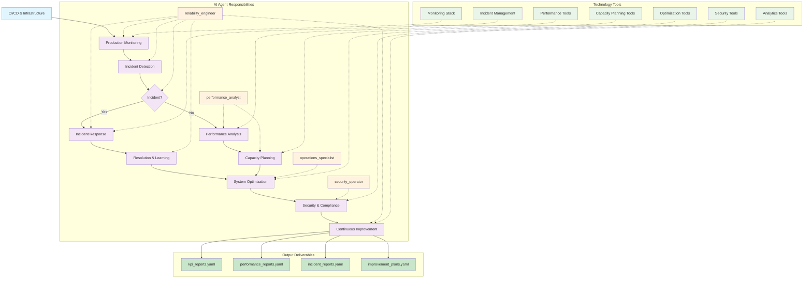

# PATH-Based Production Operations & Maintenance Methodology

## Overview
**PATH-Based Production Operations & Maintenance** is a systematic methodology for ongoing production system management that follows the PATH (People-Agent Teams/Process/Technology) framework. This methodology ensures reliable production operations through human-AI collaboration in incident response, performance optimization, scaling management, and continuous system evolution.ent-Centric Production Operations & Maintenance Methodology

## Overview
**Agent-Centric Production Operations & Maintenance** is a systematic methodology for ongoing production system management that follows the PAPT (People-Agent/Process/Technology) framework. This methodology ensures reliable production operations through incident response, performance optimization, scaling management, and continuous system evolution.

## Methodology Input/Output Specification

### **Input Deliverables (YAML Format)**
```yaml
methodology_inputs:
  ci_cd_pipelines:
    format: "YAML"
    files:
      - "pipeline_configurations.yaml"
      - "build_automation.yaml"
      - "deployment_workflows.yaml"
    content:
      - Production deployment pipelines
      - Automated release processes
      - Rollback and recovery procedures
  
  infrastructure_automation:
    format: "YAML"
    files:
      - "infrastructure_templates.yaml"
      - "environment_configurations.yaml"
      - "scaling_policies.yaml"
    content:
      - Production infrastructure setup
      - Environment management configurations
      - Scaling and resource management rules
  
  monitoring_systems:
    format: "YAML"
    files:
      - "monitoring_configurations.yaml"
      - "alerting_rules.yaml"
      - "dashboard_definitions.yaml"
    content:
      - Production monitoring infrastructure
      - Alerting and escalation procedures
      - Operational visibility and dashboards
```

### **Output Deliverables (YAML Format)**
```yaml
methodology_outputs:
  operational_metrics:
    format: "YAML"
    files:
      - "kpi_reports.yaml"
      - "sla_performance.yaml"
      - "system_health_metrics.yaml"
    content:
      - Key Performance Indicators (KPIs)
      - Service Level Agreement performance
      - System reliability and health metrics
  
  performance_analytics:
    format: "YAML"
    files:
      - "performance_reports.yaml"
      - "capacity_analysis.yaml"
      - "optimization_recommendations.yaml"
    content:
      - System performance analysis
      - Capacity planning and utilization
      - Performance optimization insights
  
  operational_excellence:
    format: "YAML"
    files:
      - "incident_reports.yaml"
      - "improvement_plans.yaml"
      - "compliance_status.yaml"
    content:
      - Incident response and resolution data
      - Continuous improvement initiatives
      - Security and compliance status
```

## Operations Management Process Flow



## PATH Implementation for Production Operations

### **People-Agent Teams: Core Human-AI Operations Team**

#### **agent_reliability_engineer**
**Primary Responsibility**: Site Reliability Engineering and system reliability with SRE teams
**Key Capabilities**: SRE practices, incident response, reliability patterns, chaos engineering
**Decision Authority**: SLA management recommendations, reliability target proposals (human approval)
**Human Collaboration**: Works with SRE teams and operations managers on reliability standards

#### **agent_operations_specialist**
**Primary Responsibility**: Day-to-day operations and maintenance with operations teams
**Key Capabilities**: System maintenance, operational procedures, routine tasks automation
**Decision Authority**: Maintenance schedule recommendations, operational workflow proposals (human oversight)
**Human Collaboration**: Partners with operations engineers and system administrators

#### **agent_performance_analyst**
**Primary Responsibility**: Performance monitoring and optimization with performance engineering teams
**Key Capabilities**: Performance analysis, capacity planning, optimization strategies
**Decision Authority**: Performance target recommendations, scaling decision analysis (human approval)
**Human Collaboration**: Collaborates with performance engineers and capacity planners

#### **agent_security_operator**
**Primary Responsibility**: Production security and compliance maintenance with security teams
**Key Capabilities**: Security monitoring, threat response, compliance validation
**Decision Authority**: Security policy recommendations, threat response proposals (human validation)
**Human Collaboration**: Works with security teams and compliance officers

### **Process: Operations Management Phases**

#### **Phase 1: Production Monitoring and Alerting**
**Lead Agent**: `agent_reliability_engineer`
**Inputs**: Monitoring infrastructure, SLA definitions, operational baselines
**Process Steps**:
1. **SLI/SLO Management**: Monitor Service Level Indicators against Service Level Objectives
2. **Incident Detection**: Automated detection and classification of production incidents
3. **Alert Optimization**: Continuous refinement of alerting thresholds and escalation
4. **Trend Analysis**: Long-term trend analysis for capacity and performance planning

**Outputs**: SLI/SLO dashboards, incident detection systems, optimized alerting
**Quality Gates**: Alert accuracy, detection speed, escalation effectiveness

#### **Phase 2: Incident Response and Resolution**
**Lead Agent**: `agent_reliability_engineer`
**Supporting Agents**: All agents based on incident type
**Process Steps**:
1. **Incident Classification**: Rapid classification and severity assessment
2. **Response Coordination**: Coordinate response team and communication
3. **Resolution Execution**: Systematic problem resolution with documentation
4. **Post-Incident Review**: Comprehensive post-mortem analysis and improvement planning

**Outputs**: Incident response procedures, resolution documentation, improvement plans
**Quality Gates**: Response time, resolution effectiveness, learning capture

#### **Phase 3: Performance Management and Optimization**
**Lead Agent**: `agent_performance_analyst`
**Inputs**: Performance monitoring data, capacity trends, business growth projections
**Process Steps**:
1. **Performance Analysis**: Continuous analysis of system performance and bottlenecks
2. **Capacity Planning**: Proactive capacity planning based on growth and usage patterns
3. **Optimization Implementation**: Performance optimization and resource efficiency improvements
4. **Scaling Management**: Automated and manual scaling based on demand patterns

**Outputs**: Performance reports, capacity plans, optimization implementations
**Quality Gates**: Performance target compliance, capacity adequacy, scaling effectiveness

#### **Phase 4: Security Operations and Compliance**
**Lead Agent**: `agent_security_operator`
**Inputs**: Security monitoring data, compliance requirements, threat intelligence
**Process Steps**:
1. **Security Monitoring**: Continuous monitoring for security threats and vulnerabilities
2. **Threat Response**: Rapid response to security incidents and threats
3. **Compliance Validation**: Regular compliance checking and audit preparation
4. **Security Maintenance**: Security updates, patch management, and vulnerability remediation

**Outputs**: Security monitoring, threat response procedures, compliance reports
**Quality Gates**: Security posture, threat detection, compliance maintenance

#### **Phase 5: Routine Operations and Maintenance**
**Lead Agent**: `agent_operations_specialist`
**Inputs**: Operational procedures, maintenance schedules, system health data
**Process Steps**:
1. **Routine Maintenance**: Scheduled maintenance, updates, and system care
2. **Operational Procedures**: Execute routine operational tasks and workflows
3. **System Health Monitoring**: Regular system health checks and preventive maintenance
4. **Documentation Maintenance**: Keep operational documentation current and accurate

**Outputs**: Maintenance logs, operational reports, updated documentation
**Quality Gates**: Maintenance effectiveness, system health, documentation accuracy

#### **Phase 6: Continuous Improvement and Evolution**
**Lead Agent**: All agents collaboratively
**Process Steps**:
1. **Metrics Analysis**: Analyze operational metrics for improvement opportunities
2. **Process Optimization**: Continuous improvement of operational processes
3. **Technology Evolution**: Evaluate and implement new technologies and practices
4. **Team Learning**: Capture and share operational knowledge and best practices

**Outputs**: Improvement plans, process optimizations, technology updates
**Quality Gates**: Improvement effectiveness, process efficiency, knowledge sharing

#### **Phase 7: Disaster Recovery and Business Continuity**
**Lead Agent**: `agent_reliability_engineer`
**Supporting Agents**: All agents for coordinated response
**Process Steps**:
1. **Recovery Planning**: Maintain and test disaster recovery plans
2. **Backup Management**: Ensure backup systems and data recovery capabilities
3. **Business Continuity**: Plan for business continuity during major incidents
4. **Recovery Testing**: Regular testing of recovery procedures and capabilities

**Outputs**: Recovery plans, backup systems, continuity procedures
**Quality Gates**: Recovery capability, backup reliability, continuity effectiveness

### **Technology: Operations Management Tools**

#### **Monitoring and Observability**
- **Infrastructure Monitoring**: Prometheus, Grafana, DataDog, New Relic
- **Application Performance**: AppDynamics, Dynatrace, New Relic APM
- **Log Management**: ELK Stack, Splunk, Fluentd for centralized logging
- **Distributed Tracing**: Jaeger, Zipkin for microservices observability

#### **Incident Management**
- **Incident Response**: PagerDuty, Opsgenie, VictorOps for alerting and escalation
- **Communication**: Slack, Microsoft Teams, status pages for incident communication
- **Documentation**: Confluence, Notion, GitBook for runbooks and procedures
- **Analysis**: Datadog Incident Management, Splunk for incident analysis

#### **Automation and Orchestration**
- **Infrastructure Automation**: Ansible, Terraform, CloudFormation for infrastructure management
- **Task Automation**: Python scripts, PowerShell, Bash for routine task automation
- **Workflow Orchestration**: Apache Airflow, Temporal for complex workflow management
- **Configuration Management**: Chef, Puppet, Ansible for system configuration

#### **Security and Compliance**
- **Security Monitoring**: Splunk Security, IBM QRadar, CrowdStrike for threat detection
- **Vulnerability Management**: Nessus, Qualys, Rapid7 for vulnerability scanning
- **Compliance Management**: Chef InSpec, AWS Config for compliance automation
- **Backup and Recovery**: Veeam, Commvault, AWS Backup for data protection

## Agent Collaboration Framework

### **Incident Response Collaboration**
- **Primary Response**: `agent_reliability_engineer` leads incident response coordination
- **Specialized Support**: Other agents provide domain-specific expertise based on incident type
- **Communication**: Coordinated communication through incident management platforms
- **Learning**: All agents contribute to post-incident analysis and improvement

### **Operational Decision Making**
- **SLA Decisions**: Led by `agent_reliability_engineer` with input from performance and operations
- **Performance Decisions**: Led by `agent_performance_analyst` with infrastructure and reliability input
- **Security Decisions**: Led by `agent_security_operator` with validation from other agents
- **Operational Decisions**: Led by `agent_operations_specialist` with cross-agent coordination

### **Continuous Improvement Collaboration**
- **Metrics Sharing**: All agents share operational metrics and insights
- **Process Evolution**: Collaborative improvement of operational processes
- **Knowledge Management**: Shared documentation and knowledge base maintenance
- **Technology Evaluation**: Collaborative evaluation of new tools and technologies

## Domain-Specific Operations Adaptations

### **Protocol-Based Systems** (MQTT, HTTP, WebSocket)
- **Monitoring Focus**: Protocol-level monitoring, connection health, message throughput
- **Performance Focus**: Network latency, connection pooling, protocol optimization
- **Security Focus**: Protocol security, connection encryption, authentication monitoring
- **Incident Response**: Protocol-specific debugging, connection analysis, network diagnostics

### **Business Applications** (ERP, CRM, E-commerce)
- **Monitoring Focus**: Business process monitoring, user experience, transaction success
- **Performance Focus**: Database performance, application response time, user satisfaction
- **Security Focus**: Data protection, user access monitoring, business data security
- **Incident Response**: Business impact assessment, user communication, data integrity validation

### **Data Processing Systems** (ETL, Analytics, ML)
- **Monitoring Focus**: Data pipeline health, processing performance, data quality
- **Performance Focus**: Processing throughput, resource utilization, data freshness
- **Security Focus**: Data privacy, access control, data lineage protection
- **Incident Response**: Data pipeline recovery, quality validation, processing resumption

### **Real-Time Systems** (Trading, IoT, Gaming)
- **Monitoring Focus**: Real-time performance, latency monitoring, throughput tracking
- **Performance Focus**: Ultra-low latency optimization, high-frequency processing
- **Security Focus**: Real-time threat detection, performance security, data integrity
- **Incident Response**: Real-time recovery, performance restoration, latency optimization

## Quality Assurance Framework

### **Operations Quality Metrics**
- **Reliability Metrics**: Uptime, MTBF (Mean Time Between Failures), MTTR (Mean Time To Recovery)
- **Performance Metrics**: Response time, throughput, resource utilization, SLA compliance
- **Security Metrics**: Security incident frequency, vulnerability resolution time, compliance score
- **Operational Metrics**: Maintenance effectiveness, process efficiency, automation coverage

### **SRE Quality Framework**
- **Error Budgets**: Define and manage error budgets for service reliability
- **SLI/SLO Management**: Continuous monitoring and optimization of service level objectives
- **Reliability Engineering**: Systematic approach to improving system reliability
- **Chaos Engineering**: Proactive testing of system resilience and failure modes

### **Success Criteria**
- **High Availability**: Consistent uptime meeting or exceeding SLA requirements
- **Performance Excellence**: Optimal system performance under varying load conditions
- **Security Posture**: Strong security with rapid threat detection and response
- **Operational Efficiency**: Streamlined operations with high automation and minimal manual intervention

## Integration with DevOps Methodology

### **DevOps-to-Operations Handoff**
- **Monitoring Infrastructure**: DevOps monitoring systems become operations monitoring foundation
- **Automation Frameworks**: DevOps automation extended to operations workflows
- **Deployment Pipelines**: Operations team manages ongoing deployments and updates
- **Infrastructure Management**: Operations inherits and maintains DevOps infrastructure

### **Operations-to-Architecture Feedback**
- **Performance Insights**: Operations performance data influences architecture evolution
- **Scalability Requirements**: Operations scaling experience guides architecture decisions
- **Reliability Patterns**: Operations reliability insights inform architecture patterns
- **Technology Evaluation**: Operations experience with technology informs architecture choices

The Agent-Centric Production Operations methodology provides systematic production system management that ensures reliable, performant, and secure operation while enabling continuous improvement and evolution of production systems.
