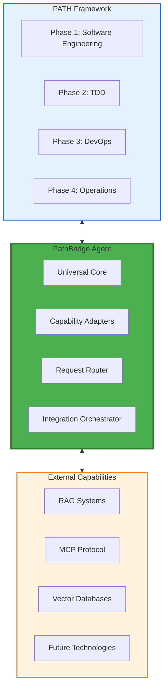

# PathBridge Agent

## Overview

**PathBridge Agent** is the universal bridge that connects the PATH Framework with all current and future capabilities including RAG, MCP, Vector Databases, and emerging AI technologies.

## Core Concept

## Key Features

### **Universal Integration**
- **Framework Agnostic**: Works with PATH Framework while remaining independent
- **Capability Extensible**: Easy integration of new technologies
- **Protocol Adaptive**: Supports multiple communication protocols

### **Bridge Architecture**
- **Bidirectional Communication**: PATH ↔ External Capabilities
- **Request Routing**: Intelligent routing to appropriate capabilities
- **Response Orchestration**: Coordinated responses from multiple sources

### **Future-Proof Design**
- **Modular Adapters**: Add new capabilities without core changes
- **Version Management**: Handle multiple versions of external systems
- **Graceful Degradation**: Continue operation when capabilities are unavailable

## Domain Strategy

- **Primary Domain**: `pathbridge.ai`
- **Purpose**: Official PathBridge Agent platform
- **Future Use**: Documentation, API endpoints, community resources

## Documentation Standards

See [`DOCUMENTATION_NAMING_CONVENTION.md`](DOCUMENTATION_NAMING_CONVENTION.md) for file naming and organization standards.

## Documentation Structure

### **📁 Core Documentation**
- [`core/COREAGENT_USAGE.md`](core/COREAGENT_USAGE.md) - CoreAgent usage guide and examples
- [`core/COREAGENT_IMPLEMENTATION_TASKS.md`](core/COREAGENT_IMPLEMENTATION_TASKS.md) - Implementation tasks
- [`core/coreagent_architecture.md`](core/coreagent_architecture.md) - CoreAgent architecture design

### **🏗️ Architecture Documentation**
- [`architecture/pathbridge_architecture_diagram.md`](architecture/pathbridge_architecture_diagram.md) - System architecture diagrams
- [`architecture/pathbridge_capability_standards.md`](architecture/pathbridge_capability_standards.md) - Capability standards
- [`architecture/pathbridge_interaction_mechanisms.md`](architecture/pathbridge_interaction_mechanisms.md) - Interaction patterns

### **📖 Implementation Guides**
- [`guides/pathbridge_llm_integration_guide.md`](guides/pathbridge_llm_integration_guide.md) - LLM integration guide
- [`guides/pathbridge_ai_coding_assistant.md`](guides/pathbridge_ai_coding_assistant.md) - AI coding assistant guide

### **📋 Technical Specifications**
- [`specifications/AI_CODING_AGENT_SPECIFICATIONS_v1.0.0.md`](specifications/AI_CODING_AGENT_SPECIFICATIONS_v1.0.0.md) - AI agent specifications
- [`specifications/AGENT_SPECIFICATION_CODES_v1.0.0.md`](specifications/AGENT_SPECIFICATION_CODES_v1.0.0.md) - Specification codes

### **🔗 Communication Protocols**
- [`protocols/AGENT_DATA_EXCHANGE_PROTOCOLS_v1.0.0.md`](protocols/AGENT_DATA_EXCHANGE_PROTOCOLS_v1.0.0.md) - Data exchange protocols
- [`protocols/PATH_PROTOCOL_V3.md`](protocols/PATH_PROTOCOL_V3.md) - PATH protocol specification

### **📅 Project Planning**
- [`planning/AGENT_DEVELOPMENT_ROADMAP.md`](planning/AGENT_DEVELOPMENT_ROADMAP.md) - Development roadmap
- [`planning/AGENT_IMPLEMENTATION_PLAN.md`](planning/AGENT_IMPLEMENTATION_PLAN.md) - Implementation plan

## Quick Start

1. **Start with Core**: Read [`core/COREAGENT_USAGE.md`](core/COREAGENT_USAGE.md) for basic usage
2. **Understand Architecture**: Review [`architecture/pathbridge_architecture_diagram.md`](architecture/pathbridge_architecture_diagram.md)
3. **Follow Implementation**: Use [`planning/AGENT_IMPLEMENTATION_PLAN.md`](planning/AGENT_IMPLEMENTATION_PLAN.md)
4. **Integration**: Reference [`guides/pathbridge_llm_integration_guide.md`](guides/pathbridge_llm_integration_guide.md)

## Integration Capabilities

### **Current Targets**
- **RAG Systems**: Retrieval-Augmented Generation integration
- **MCP Protocol**: Model Context Protocol support
- **Vector Databases**: Semantic search and similarity matching
- **PATH Framework**: Native PATH methodology support

### **Future Expansion**
- **Emerging AI Technologies**: Automatic integration framework
- **Custom Protocols**: User-defined integration capabilities
- **Multi-Modal Systems**: Vision, audio, and text processing
- **Distributed Systems**: Cross-platform capability orchestration