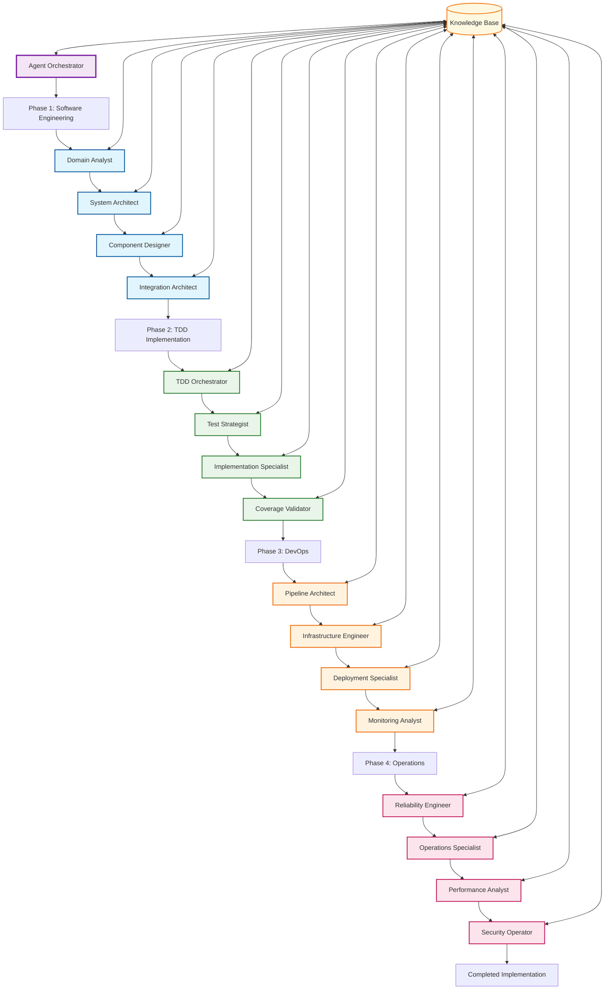
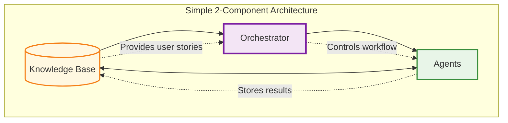
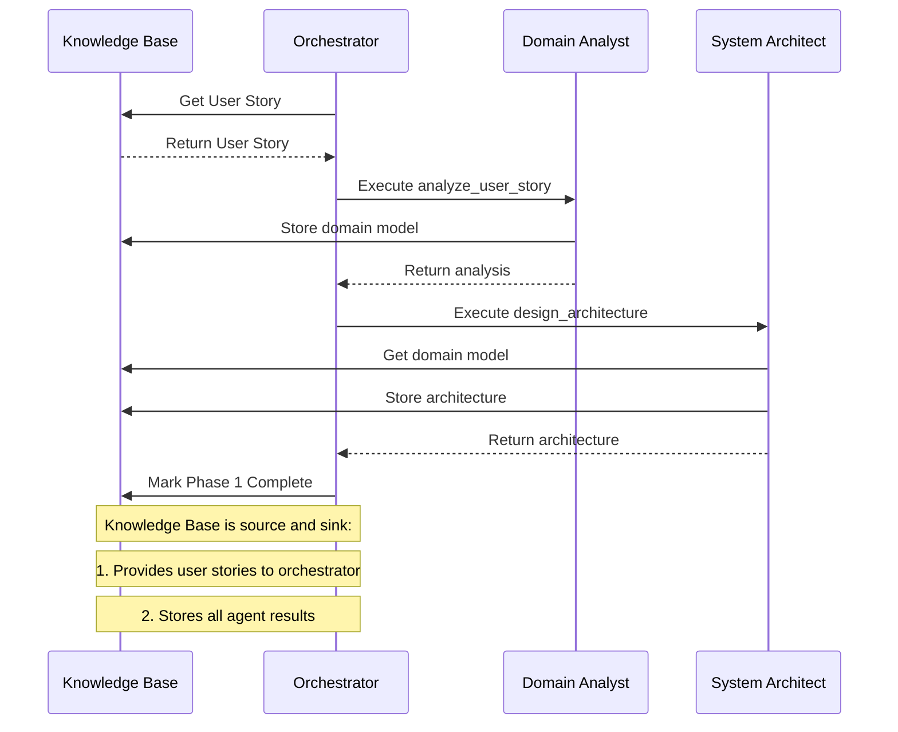
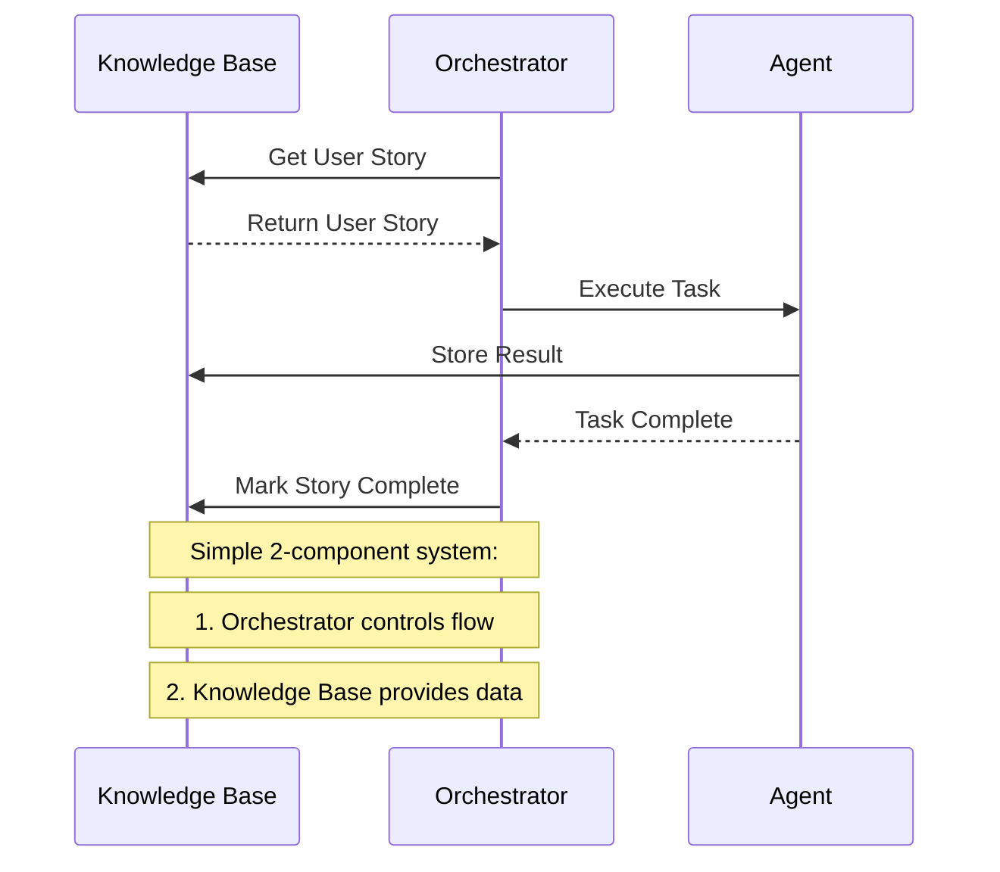

# PathBridge Agent Interaction Mechanisms

## Overview
PATH Framework agents built on CoreAgent foundation interact through 2 simple mechanisms for maximum efficiency and clarity.

## Simplified Architecture

### 1. Agent Orchestrator (Workflow Control)
**Purpose**: Sequential workflow coordination and execution
**Implementation**: `src/orchestration/agent_orchestrator.py`

```python
# Execute complete user story workflow
result = await orchestrator.execute_user_story(user_story)

# Sequential execution: Phase 1 → Phase 2 → Phase 3 → Phase 4
```

**Benefits**:
- Simple workflow control
- Guaranteed execution order
- Centralized error handling
- Easy debugging

### 2. Shared Knowledge Base (Data Storage)
**Purpose**: Persistent data sharing between all agents
**Implementation**: `src/knowledge/knowledge_base.py`

```python
# Store agent output
await knowledge_base.store_agent_output(agent_id, operation, result)

# Retrieve any previous results
data = await knowledge_base.get_agent_output(source_agent, operation)
```

**Benefits**:
- Single source of truth
- Complete audit trail
- Cross-phase data sharing
- Simple data access

## Workflow Execution Pattern



**Legend:**
🟡 Knowledge Base (Source) | 🟣 Orchestrator | 🔵 Phase 1 | 🟢 Phase 2 | 🟠 Phase 3 | 🔴 Phase 4

## Simplified Communication Architecture



## Simple Communication Patterns

### 1. Sequential Execution
```python
# Orchestrator manages simple sequential flow
async def execute_user_story(self, user_story):
    phase1_result = await self._execute_phase1(user_story)
    phase2_result = await self._execute_phase2(phase1_result)
    phase3_result = await self._execute_phase3(phase2_result)
    phase4_result = await self._execute_phase4(phase3_result)
    return complete_result
```

### 2. Data Sharing
```python
# Agents store and retrieve data from single knowledge base
await knowledge_base.store_agent_output(agent_id, operation, result)
previous_work = await knowledge_base.get_agent_output(source_agent, operation)
```

## Quality Gates

### Simple Quality Validation
```python
# Orchestrator validates quality before next phase
quality_result = await self._validate_quality_gate(phase_result)
if not quality_result.passed:
    return await self._handle_quality_failure(phase_result)
```

## Complete Workflow Example



## Simple Interaction Pattern



## Error Handling

### Simple Error Strategy
- **Orchestrator**: Catches agent failures and implements retry logic
- **Knowledge Base**: Maintains audit trail for debugging
- **Rollback**: Return to last successful phase state

## Implementation

```python
# Simple setup
orchestrator = AgentOrchestrator()
knowledge_base = SharedKnowledgeBase()

# Load user stories into knowledge base
await knowledge_base.store_user_stories([
    {"story_id": "US-001", "user_story": "As a customer..."},
    {"story_id": "US-002", "user_story": "As an admin..."}
])

# Register agents
orchestrator.register_agent("domain_analyst", DomainAnalystProfile())
# ... register all 16 agents

# Execute workflow - orchestrator gets stories from KB
result = await orchestrator.process_next_user_story()
```

## Benefits

- **Simplicity**: Only 2 mechanisms to understand
- **Reliability**: Sequential execution ensures consistency
- **Traceability**: Single knowledge base maintains complete history
- **Maintainability**: Minimal complexity for debugging
- **Scalability**: Simple architecture scales easily