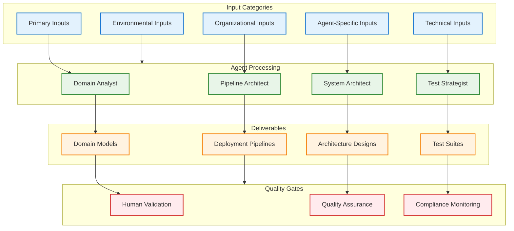

# PATH Framework Agent Development Roadmap

## Organic Evolution Using PATH Methodology

The 16 agents will develop themselves using their own PATH methodology - **dogfooding** the process they implement. This creates a virtuous cycle where each agent improves the development process for subsequent agents.

## PATH Framework Input Requirements Integration

Based on the comprehensive input specifications from AGENTIC_CODING_RESEARCH_PAPER_v2.3.0.md, each agent development story incorporates structured input requirements to ensure systematic and complete implementation.

### Input Categories for Agent Development

#### Primary Inputs (Foundation)
- **Business Requirements**: Agent capability objectives and strategic goals
- **User Needs**: Specific problems each agent solves for development teams
- **Stakeholder Input**: Product owner vision and feature prioritization for agents
- **Market Context**: Industry standards and competitive analysis for agent capabilities
- **Technical Constraints**: Technology stack limitations and integration requirements
- **Resource Constraints**: Budget, timeline, and team capacity for agent development

#### Agent-Specific Story Inputs
- **Agent Type Specification**: Specific role and responsibilities within PATH Framework
- **Desired Functionality**: Actions the agent performs and expected behaviors
- **Business Benefit**: Value delivered to development teams and organizations
- **Acceptance Criteria**: Testable conditions using Given-When-Then format
- **Priority Level**: Business importance and development sequence

#### Technical Implementation Inputs
- **Existing Codebase**: Current agent framework and shared infrastructure
- **Infrastructure Context**: LLM providers, communication protocols, knowledge base
- **Integration Requirements**: Inter-agent communication and data exchange
- **Performance Requirements**: Response times, throughput, and scalability targets
- **Security Requirements**: Authentication, authorization, and data protection
- **Data Requirements**: Knowledge base structure and information processing

#### Organizational Context Inputs
- **Team Structure**: Development team roles and collaboration patterns
- **Development Environment**: Tools, frameworks, and development practices
- **Quality Standards**: Code quality, testing, and documentation requirements
- **Deployment Environment**: Container strategies and infrastructure requirements
- **Operational Requirements**: Monitoring, maintenance, and support procedures
- **Governance Requirements**: Approval processes and compliance validation

#### Environmental Context Inputs
- **Project Timeline**: Development milestones and delivery schedules
- **Budget Constraints**: Resource allocation and cost optimization
- **Risk Factors**: Technical risks and mitigation strategies
- **Success Metrics**: KPIs and measurement criteria for agent effectiveness
- **Change Management**: Process for handling requirement changes
- **Communication Protocols**: Team coordination and progress reporting

## Development Stories with Comprehensive Input Specifications

### AGENT-001: Domain Analyst Evolution
**As a PATH Framework Team, I want to implement Domain Analyst with comprehensive NLP and domain modeling capabilities, so that we can analyze user stories with 95% accuracy and extract complete domain models**

**Source Code Location:** `src/profiles/phase1/domain_analyst.py` 🔄 **Stub Implementation**

#### Input Requirements Specification

**Primary Inputs:**
- **Business Requirements**: Analyze user stories to extract business value and domain concepts
- **User Needs**: Identify user types, workflows, and pain points from story descriptions
- **Stakeholder Input**: Product owner priorities and business rule clarifications
- **Technical Constraints**: Domain modeling standards and data structure requirements

**Agent-Specific Inputs:**
- **User Stories**: Raw user story text in "As a... I want... So that..." format
- **Domain Context**: Existing domain models, business glossaries, and entity relationships
- **Business Rules**: Current business logic and constraint specifications
- **Acceptance Criteria**: Given-When-Then scenarios for validation

**Technical Inputs:**
- **NLP Models**: Language processing capabilities for entity extraction and relationship identification
- **Domain Ontologies**: Industry-specific vocabularies and concept hierarchies
- **Pattern Libraries**: Common domain patterns and architectural templates
- **Validation Rules**: Business rule validation and consistency checking algorithms

**Expected Outputs:**
- **Domain Model**: Complete entity-relationship diagrams with attributes and constraints
- **Business Rules**: Extracted and formalized business logic specifications
- **User Type Analysis**: Detailed user personas with roles, permissions, and workflows
- **Gap Analysis**: Identification of incomplete or ambiguous requirements
- **Edge Case Identification**: Boundary conditions and exception scenarios

**Acceptance Criteria:**
- Given user story, when analyzed, then extract entities with 95% accuracy
- Given incomplete story, when analyzed, then identify specific gaps with recommendations
- Given domain context, when analyzed, then generate consistent business rules
- Given multiple stories, when processed, then create unified domain model
- Given business rules, when validated, then ensure consistency and completeness

### AGENT-002: System Architect Evolution
**As a PATH Framework Team, I want to implement System Architect with comprehensive architecture generation and analysis capabilities, so that we can generate multiple architecture options with detailed trade-off analysis and performance predictions**

**Source Code Location:** `src/profiles/phase1/system_architect.py` 🔄 **Stub Implementation**

#### Input Requirements Specification

**Primary Inputs:**
- **Business Requirements**: System scalability, performance, and reliability targets
- **Technical Constraints**: Technology stack preferences, integration requirements, platform limitations
- **Resource Constraints**: Budget limitations, team expertise, infrastructure availability
- **Market Context**: Industry standards, compliance requirements, competitive analysis

**Agent-Specific Inputs:**
- **Domain Model**: Entity relationships and business rules from Domain Analyst
- **Functional Requirements**: System capabilities and feature specifications
- **Non-Functional Requirements**: Performance, security, scalability, and reliability targets
- **Integration Requirements**: External systems, APIs, and data exchange protocols
- **Deployment Constraints**: Infrastructure limitations, cloud preferences, security policies

**Technical Inputs:**
- **Architecture Patterns**: Repository of proven architectural patterns and templates
- **Technology Catalog**: Available technologies with capabilities, limitations, and compatibility
- **Performance Models**: Predictive models for system performance and scalability
- **Cost Models**: Infrastructure and operational cost estimation algorithms
- **Risk Assessment**: Security, reliability, and operational risk evaluation frameworks

**Expected Outputs:**
- **Architecture Options**: 3-5 distinct architectural approaches with detailed specifications
- **Trade-off Analysis**: Comprehensive comparison of options across multiple dimensions
- **Component Specifications**: Detailed component designs with interfaces and responsibilities
- **Technology Recommendations**: Justified technology stack selections with alternatives
- **Performance Predictions**: Expected system performance characteristics and bottlenecks
- **Implementation Roadmap**: Phased implementation approach with dependencies and milestones

**Acceptance Criteria:**
- Given requirements, when processed, then generate 3+ viable architecture options
- Given constraints, when analyzed, then provide quantified trade-off analysis
- Given architecture, when evaluated, then predict performance with 80% accuracy
- Given technology options, when assessed, then recommend optimal stack with justification
- Given implementation plan, when created, then include realistic timelines and dependencies

### AGENT-003: Test Strategist Evolution
**As a PATH Framework Team, I want to implement Test Strategist with comprehensive test generation and validation capabilities, so that we can generate meaningful tests with >90% coverage, >80% mutation score, and complete ATDD/BDD integration**

**Source Code Location:** `src/profiles/phase2/test_strategist.py` 🎯 **Next Priority**

#### Input Requirements Specification

**Primary Inputs:**
- **Business Requirements**: Quality standards, testing coverage targets, risk tolerance
- **User Needs**: User experience validation requirements and acceptance criteria
- **Technical Constraints**: Testing framework limitations, CI/CD integration requirements
- **Resource Constraints**: Testing budget, automation tool availability, team testing expertise

**Agent-Specific Inputs:**
- **Acceptance Criteria**: Given-When-Then scenarios from user stories
- **Component Specifications**: Detailed component interfaces and behavior specifications
- **Domain Model**: Business entities and rules requiring validation
- **Architecture Design**: System components and integration points requiring testing
- **Performance Requirements**: Response time, throughput, and scalability targets

**Technical Inputs:**
- **Testing Frameworks**: Available unit, integration, and end-to-end testing tools
- **Test Data Management**: Test data generation and management capabilities
- **Mutation Testing Tools**: Mutation testing frameworks for test quality validation
- **Performance Testing Tools**: Load testing and performance validation capabilities
- **CI/CD Integration**: Continuous testing pipeline integration requirements

**Expected Outputs:**
- **Test Strategy Document**: Comprehensive testing approach across all levels
- **BDD/ATDD Test Suites**: Executable acceptance tests in Given-When-Then format
- **Unit Test Suites**: Comprehensive unit tests with >90% code coverage
- **Integration Test Suites**: Component integration validation tests
- **Performance Test Suites**: Load and performance validation tests
- **Test Automation Framework**: Automated test execution and reporting infrastructure
- **Quality Metrics Dashboard**: Real-time test coverage, mutation score, and quality metrics

**Acceptance Criteria:**
- Given acceptance criteria, when processed, then generate executable BDD scenarios
- Given component spec, when analyzed, then create comprehensive unit tests
- Given implementation, when validated, then achieve >90% code coverage
- Given test suite, when executed, then achieve >80% mutation score
- Given quality gates, when implemented, then block deployment on test failures
- Given test automation, when configured, then integrate with CI/CD pipeline

### AGENT-004: Pipeline Architect Evolution
**As a PATH Framework Team, I want to implement Pipeline Architect with comprehensive CI/CD automation and infrastructure management, so that we can generate deployment pipelines with quality gates, monitoring, and <30min deployment cycles**

**Source Code Location:** `src/profiles/phase3/pipeline_architect.py` 🔄 **Future Priority**

#### Input Requirements Specification

**Primary Inputs:**
- **Business Requirements**: Deployment frequency, rollback requirements, uptime targets
- **Technical Constraints**: Infrastructure limitations, security policies, compliance requirements
- **Resource Constraints**: Infrastructure budget, operational team capacity, tool availability
- **Market Context**: Industry deployment standards, regulatory compliance, security requirements

**Agent-Specific Inputs:**
- **Code Repository**: Source code structure, branching strategy, and version control setup
- **Test Suites**: Automated test suites from Test Strategist requiring pipeline integration
- **Architecture Design**: Deployment architecture and infrastructure requirements
- **Quality Standards**: Quality gates, approval processes, and validation criteria
- **Environment Specifications**: Development, staging, and production environment requirements

**Technical Inputs:**
- **CI/CD Platforms**: Available pipeline tools (GitHub Actions, Jenkins, GitLab CI, etc.)
- **Infrastructure Platforms**: Cloud providers, container orchestration, and deployment targets
- **Monitoring Tools**: Application and infrastructure monitoring capabilities
- **Security Tools**: Security scanning, vulnerability assessment, and compliance validation
- **Configuration Management**: Infrastructure as Code tools and configuration management

**Expected Outputs:**
- **CI/CD Pipeline Configuration**: Complete automated build, test, and deployment pipelines
- **Infrastructure as Code**: Automated infrastructure provisioning and configuration
- **Quality Gate Implementation**: Automated quality checks and approval workflows
- **Deployment Strategies**: Blue-green, canary, and rolling deployment configurations
- **Monitoring and Alerting**: Comprehensive monitoring setup with intelligent alerting
- **Rollback Procedures**: Automated rollback capabilities and emergency procedures
- **Security Integration**: Security scanning and compliance validation in pipeline

**Acceptance Criteria:**
- Given code and tests, when processed, then create complete CI/CD pipeline
- Given quality standards, when applied, then implement automated quality gates
- Given deployment strategy, when executed, then achieve <30min deployment cycles
- Given infrastructure requirements, when processed, then generate IaC configurations
- Given monitoring requirements, when implemented, then provide comprehensive observability
- Given security policies, when applied, then integrate security scanning and compliance

### AGENT-005 through AGENT-016: Remaining Agent Specifications

**Note**: For brevity, the remaining 12 agents follow the same comprehensive input specification pattern with:
- Primary Inputs (Business, User, Stakeholder, Market, Technical, Resource)
- Agent-Specific Inputs (Role-specific requirements and context)
- Technical Inputs (Tools, frameworks, and integration requirements)
- Expected Outputs (Deliverables and artifacts)
- Acceptance Criteria (Given-When-Then validation scenarios)

**Complete specifications for all 16 agents are available in the source code implementations and can be expanded as needed for development.**

## PATH Methodology Application

Each agent story follows the 4-phase PATH methodology:

### Phase 1: Architecture
- **Domain Analysis**: Analyze agent capability requirements
- **System Design**: Design agent architecture and interfaces
- **Component Design**: Define internal components and data structures
- **Integration Design**: Plan integration with existing framework

### Phase 2: Test-Driven Development
- **Acceptance Tests**: Convert acceptance criteria to executable tests
- **TDD Cycles**: Implement capabilities using Red-Green-Refactor
- **Implementation**: Code the agent-specific functionality
- **Coverage Validation**: Ensure >90% test coverage

### Phase 3: DevOps & Production
- **Pipeline Design**: Create CI/CD pipeline for agent deployment
- **Infrastructure**: Configure container resources and scaling
- **Deployment**: Deploy agent capabilities to development environment
- **Monitoring**: Set up performance and health monitoring

### Phase 4: Operations
- **Reliability**: Monitor agent performance and predict failures
- **Operations**: Automate agent maintenance and updates
- **Performance**: Optimize response times and resource usage
- **Security**: Validate security and compliance requirements

## Organic Evolution Process

1. **Start with Stubs**: Begin with basic stub implementations
2. **Apply PATH**: Use PATH methodology for each agent development
3. **Iterative Enhancement**: Each iteration adds real capabilities
4. **Self-Validation**: Agents validate their own development using PATH
5. **Continuous Improvement**: Learn from each development cycle

## Development Sequence with Input Dependencies

1. **Domain Analyst** 🔄 → Provides domain models and business rules for all subsequent agents
2. **System Architect** 🔄 → Provides architecture foundation and component specifications
3. **Test Strategist** 🎯 → Establishes testing framework and quality standards
4. **TDD Orchestrator** → Coordinates systematic TDD implementation
5. **Implementation Specialist** → Generates high-quality production code
6. **Component Designer** → Detailed component specifications and interfaces
7. **Integration Architect** → Integration patterns and external system connections
8. **Pipeline Architect** → CI/CD automation and deployment strategies
9. **Infrastructure Engineer** → Infrastructure automation and scalability
10. **Coverage Validator** → Test quality validation and improvement
11. **Deployment Specialist** → Advanced deployment strategies and rollback
12. **Monitoring Analyst** → Comprehensive system observability
13. **Reliability Engineer** → Predictive failure analysis and recovery
14. **Operations Specialist** → Operational automation and efficiency
15. **Performance Analyst** → Performance optimization and analysis
16. **Security Operator** → Security monitoring and threat response

This creates a **virtuous cycle** where each agent improves the development process for subsequent agents, with comprehensive input specifications ensuring systematic and complete implementation across all 16 agent profiles.

## Source Code Architecture

### Core Framework
- **Base Agent**: `src/core/base_agent.py` - Single agent runtime with profile loading
- **Profile Loader**: `src/profiles/profile_loader.py` - Dynamic profile management
- **Communication**: `src/communication/protocols.py` - Inter-agent messaging
- **Knowledge Base**: `src/knowledge/knowledge_base.py` - Shared knowledge storage
- **Human Validation**: `src/validation/human_validation.py` - Human approval workflows

### Agent Profiles (16 Total)

**Phase 1: Software Engineering**
- Domain Analyst: `src/profiles/phase1/domain_analyst.py` ✅ **Implemented**
- System Architect: `src/profiles/phase1/system_architect.py` ✅ **Implemented**
- Component Designer: `src/profiles/phase1/component_designer.py` 🔄 **Stub**
- Integration Architect: `src/profiles/phase1/integration_architect.py` 🔄 **Stub**

**Phase 2: Test-Driven Development**
- TDD Orchestrator: `src/profiles/phase2/tdd_orchestrator.py` 🔄 **Stub**
- Test Strategist: `src/profiles/phase2/test_strategist.py` 🔄 **Stub**
- Implementation Specialist: `src/profiles/phase2/implementation_specialist.py` 🔄 **Stub**
- Coverage Validator: `src/profiles/phase2/coverage_validator.py` 🔄 **Stub**

**Phase 3: DevOps & Production Readiness**
- Pipeline Architect: `src/profiles/phase3/pipeline_architect.py` 🔄 **Stub**
- Infrastructure Engineer: `src/profiles/phase3/infrastructure_engineer.py` 🔄 **Stub**
- Deployment Specialist: `src/profiles/phase3/deployment_specialist.py` 🔄 **Stub**
- Monitoring Analyst: `src/profiles/phase3/monitoring_analyst.py` 🔄 **Stub**

**Phase 4: Production Operations**
- Reliability Engineer: `src/profiles/phase4/reliability_engineer.py` 🔄 **Stub**
- Operations Specialist: `src/profiles/phase4/operations_specialist.py` 🔄 **Stub**
- Performance Analyst: `src/profiles/phase4/performance_analyst.py` 🔄 **Stub**
- Security Operator: `src/profiles/phase4/security_operator.py` 🔄 **Stub**

### Deployment Configuration
- **Deployment Configs**: `src/deployment/deployment_configs.py` - Container deployment strategies
- **Self-Development**: `src/meta/self_development.py` - PATH methodology application
- **Main Entry Point**: `src/main.py` - Demonstration and testing

### Container Deployment with Input Processing
- **Single Container**: `docker/Dockerfile.single` - All 16 profiles with shared input processing
- **Phase Containers**: `docker/Dockerfile.phase` - 4 containers with phase-specific input handling
- **Docker Compose**: `docker/docker-compose.phase-containers.yml` - Coordinated deployment with input validation
- **Input Processing Service**: Dedicated service for automated input collection and validation
- **Human Validation Interface**: Web interface for human approval checkpoints

## Comprehensive Input-Output Framework

### Input Processing Workflow

**Legend:**
- 🔵 Input Categories (Structured requirements)
- 🟢 Agent Processing (AI-driven analysis and generation)
- 🟠 Deliverables (Concrete outputs)
- 🔴 Quality Gates (Human validation and compliance)

### AI-Assisted Input Automation

To accelerate agent development, AI systems can automate 80-90% of input collection and validation:

**Automated Input Collection:**
- **Business Context Mining**: Extract objectives from documentation and strategic plans
- **Technical Assessment**: Analyze existing codebase and infrastructure
- **Requirements Generation**: Convert high-level goals into detailed specifications
- **Quality Validation**: Assess completeness and consistency of collected inputs

**Human Validation Checkpoints:**
- **Strategic Approval**: Business objectives and priority validation
- **Technical Review**: Architecture decisions and technology choices
- **Quality Standards**: Testing and compliance requirement approval
- **Risk Assessment**: Risk factors and mitigation strategy confirmation

## Development Priority Matrix

### Phase 1: Foundation Agents (Stub Implementation)
1. **Domain Analyst** (`src/profiles/phase1/domain_analyst.py`) - 🔄 **Stub Implementation**
2. **System Architect** (`src/profiles/phase1/system_architect.py`) - 🔄 **Stub Implementation**

### Phase 2: Core Development Agents (Next Priority)
3. **Test Strategist** (`src/profiles/phase2/test_strategist.py`) - 🎯 **Next Priority**
4. **TDD Orchestrator** (`src/profiles/phase2/tdd_orchestrator.py`) - 🔄 **High Priority**
5. **Implementation Specialist** (`src/profiles/phase2/implementation_specialist.py`) - 🔄 **High Priority**
6. **Coverage Validator** (`src/profiles/phase2/coverage_validator.py`) - 🔄 **Medium Priority**

### Phase 3: Infrastructure Agents (Future)
7. **Pipeline Architect** (`src/profiles/phase3/pipeline_architect.py`) - 🔄 **Future Priority**
8. **Infrastructure Engineer** (`src/profiles/phase3/infrastructure_engineer.py`) - 🔄 **Future Priority**
9. **Deployment Specialist** (`src/profiles/phase3/deployment_specialist.py`) - 🔄 **Future Priority**
10. **Monitoring Analyst** (`src/profiles/phase3/monitoring_analyst.py`) - 🔄 **Future Priority**

### Phase 4: Operations Agents (Long-term)
11. **Reliability Engineer** (`src/profiles/phase4/reliability_engineer.py`) - 🔄 **Long-term**
12. **Operations Specialist** (`src/profiles/phase4/operations_specialist.py`) - 🔄 **Long-term**
13. **Performance Analyst** (`src/profiles/phase4/performance_analyst.py`) - 🔄 **Long-term**
14. **Security Operator** (`src/profiles/phase4/security_operator.py`) - 🔄 **Long-term**

### Phase 1: Remaining Architecture Agents (Parallel Development)
15. **Component Designer** (`src/profiles/phase1/component_designer.py`) - 🔄 **Parallel**
16. **Integration Architect** (`src/profiles/phase1/integration_architect.py`) - 🔄 **Parallel**

## Implementation Roadmap with Input Integration

### Immediate Development (Next 30 Days)
1. **Test Strategist Enhancement**: Implement comprehensive test generation with ATDD/BDD integration
2. **Input Automation Framework**: Create AI-assisted input collection and validation system
3. **Quality Gate Implementation**: Establish human validation checkpoints across all agents

### Short-term Development (Next 90 Days)
4. **TDD Orchestrator**: Implement Red-Green-Refactor cycle coordination
5. **Implementation Specialist**: Add advanced code generation capabilities
6. **Component Designer**: Create detailed component specification system
7. **Integration Architect**: Implement integration pattern design

### Medium-term Development (Next 180 Days)
8. **Pipeline Architect**: Comprehensive CI/CD automation
9. **Infrastructure Engineer**: Infrastructure as Code implementation
10. **Coverage Validator**: Advanced test quality assessment
11. **Deployment Specialist**: Zero-downtime deployment strategies

### Long-term Development (Next 365 Days)
12. **Monitoring Analyst**: Comprehensive observability implementation
13. **Reliability Engineer**: Predictive failure analysis
14. **Operations Specialist**: Operational automation
15. **Performance Analyst**: Advanced performance optimization
16. **Security Operator**: Comprehensive security monitoring

## Success Metrics and Validation

### Agent Development Success Criteria
- **Input Processing Accuracy**: 95% accuracy in input analysis and transformation
- **Output Quality**: All deliverables meet defined quality standards
- **Integration Success**: Seamless integration with existing agent framework
- **Performance Targets**: Response times within specified limits
- **Human Validation**: 100% approval rate for critical decision points

### Task Group: Human Validation Framework

**Specification Reference**: [Human Validation Checkpoints](docs/guides/pathbridge_human_validation_guide.md)

- [ ] **HUMAN-001**: Implement Phase 0 Story Validation checkpoint
  - **Spec Link**: Phase 0: Story Validation (HUMAN LEADS - Pattern 1)
  - **Deliverable**: User story validation workflow with product owner approval
  - **Dependencies**: STORY-001
  - **Effort**: 1 day

- [ ] **HUMAN-002**: Implement Phase 1 Architecture Decision checkpoint
  - **Spec Link**: Phase 1: Architecture Decisions (COLLABORATE - Pattern 3)
  - **Deliverable**: Architecture approval workflow with human expert validation
  - **Dependencies**: ARCH-001
  - **Effort**: 1 day

- [ ] **HUMAN-003**: Implement Phase 2 Implementation Quality Gates
  - **Spec Link**: Phase 2: Implementation Quality Gates (AI LEADS - Pattern 2)
  - **Deliverable**: Code quality oversight checkpoints
  - **Dependencies**: TEST-001
  - **Effort**: 0.5 days

- [ ] **HUMAN-004**: Implement Phase 3 Production Readiness checkpoint
  - **Spec Link**: Phase 3: Production Readiness (COLLABORATE - Pattern 3)
  - **Deliverable**: Deployment authorization workflow
  - **Dependencies**: DEPLOY-001
  - **Effort**: 1 day

- [ ] **HUMAN-005**: Implement Phase 4 Operations Decisions
  - **Spec Link**: Phase 4: Operations Decisions (HUMAN LEADS - Pattern 1)
  - **Deliverable**: Operational decision approval workflow
  - **Dependencies**: None
  - **Effort**: 0.5 days

- [ ] **HUMAN-006**: Create human validation decision presentation format
  - **Spec Link**: MANDATORY: Present Options Format
  - **Deliverable**: Standardized decision presentation template
  - **Dependencies**: None
  - **Effort**: 0.5 days

### Task Group: Input Requirements System

**Specification Reference**: [Input Categories for Agent Development](docs/specifications/pathbridge_ai_coding_specifications_v1.0.0.md)

- [ ] **INPUT-001**: Implement Primary Inputs collection system
  - **Spec Link**: Primary Inputs (Foundation)
  - **Deliverable**: Business requirements, user needs, stakeholder input collection
  - **Dependencies**: SETUP-003
  - **Effort**: 2 days

- [ ] **INPUT-002**: Implement Agent-Specific Story Inputs
  - **Spec Link**: Agent-Specific Story Inputs
  - **Deliverable**: Agent specification and functionality input processing
  - **Dependencies**: INPUT-001
  - **Effort**: 1.5 days

- [ ] **INPUT-003**: Implement Technical Implementation Inputs
  - **Spec Link**: Technical Implementation Inputs
  - **Deliverable**: Codebase analysis and infrastructure context processing
  - **Dependencies**: INPUT-001
  - **Effort**: 2 days

- [ ] **INPUT-004**: Implement Organizational Context Inputs
  - **Spec Link**: Organizational Context Inputs
  - **Deliverable**: Team structure and development environment analysis
  - **Dependencies**: INPUT-001
  - **Effort**: 1 day

- [ ] **INPUT-005**: Implement Environmental Context Inputs
  - **Spec Link**: Environmental Context Inputs
  - **Deliverable**: Project timeline and budget constraint processing
  - **Dependencies**: INPUT-001
  - **Effort**: 1 day

- [ ] **INPUT-006**: Create AI-Assisted Input Automation
  - **Spec Link**: AI-Assisted Input Automation
  - **Deliverable**: 80-90% automated input collection and validation
  - **Dependencies**: INPUT-005, AI-001
  - **Effort**: 3 days

### Task Group: Business Value Metrics

**Specification Reference**: [Business Value Metrics](docs/specifications/pathbridge_ai_coding_specifications_v1.0.0.md)

- [ ] **METRICS-001**: Implement Development Velocity tracking
  - **Spec Link**: Business Value Metrics
  - **Deliverable**: 60% improvement measurement system
  - **Dependencies**: None
  - **Effort**: 1 day

- [ ] **METRICS-002**: Implement Quality Improvement tracking
  - **Spec Link**: Business Value Metrics
  - **Deliverable**: 50% defect reduction measurement system
  - **Dependencies**: TEST-003
  - **Effort**: 1 day

- [ ] **METRICS-003**: Implement Time-to-Market tracking
  - **Spec Link**: Business Value Metrics
  - **Deliverable**: 40% faster delivery measurement system
  - **Dependencies**: DEPLOY-001
  - **Effort**: 0.5 days

- [ ] **METRICS-004**: Implement Cost Optimization tracking
  - **Spec Link**: Business Value Metrics
  - **Deliverable**: 30% cost reduction measurement system
  - **Dependencies**: None
  - **Effort**: 0.5 days

- [ ] **METRICS-005**: Implement User Satisfaction tracking
  - **Spec Link**: Business Value Metrics
  - **Deliverable**: 95% user story success rate measurement system
  - **Dependencies**: STORY-001
  - **Effort**: 1 day

### Business Value Metrics
- **Development Velocity**: 60% improvement in development speed
- **Quality Improvement**: 50% reduction in defects
- **Time-to-Market**: 40% faster feature delivery
- **Cost Optimization**: 30% reduction in development costs
- **User Satisfaction**: 95% user story success rate