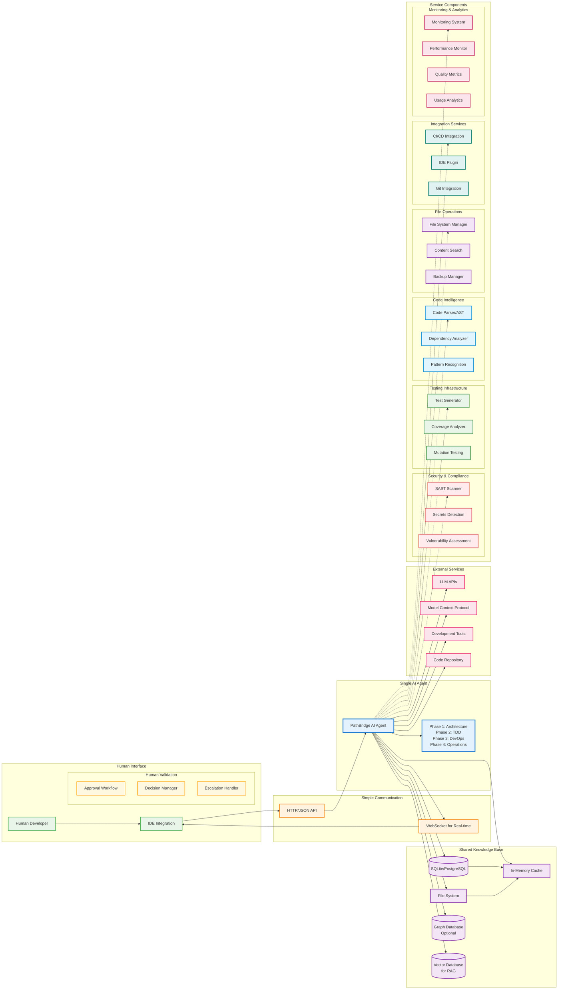

# PATH Framework Agent Data Exchange Protocols & Knowledge Base


## Abstract

This document defines comprehensive data exchange protocols and shared knowledge base architecture for PATH Framework AI agents. The specification covers inter-agent communication formats, shared knowledge structures, data synchronization mechanisms, and common interfaces that enable seamless collaboration across all 16 specialized agents. The protocols ensure consistent data flow, maintain system coherence, and support real-time collaboration while preserving data integrity and security throughout the software development lifecycle.

**Keywords:** Data Exchange, Knowledge Base, Agent Communication, Protocol Buffers, Event Streaming, Shared State Management

## Table of Contents

1. [Data Exchange Architecture](#1-data-exchange-architecture)
2. [Communication Protocols](#2-communication-protocols)
3. [Shared Knowledge Base](#3-shared-knowledge-base)
4. [Message Formats](#4-message-formats)
5. [Event Streaming System](#5-event-streaming-system)
6. [Data Synchronization](#6-data-synchronization)
7. [Security and Access Control](#7-security-and-access-control)
8. [Implementation Guidelines](#8-implementation-guidelines)

## 1. Data Exchange Architecture

### 1.1 Simplified Architecture



**Legend:**
🟢 Human Interface - User interaction points  
🔵 Single AI Agent - Unified agent with multiple modes  
🟠 Simple Communication - HTTP/JSON and WebSocket  
🟣 Shared Knowledge Base - Simple storage solutions  
🔴 External Services - Third-party integrations  
🔴 Security & Compliance - SAST, secrets, vulnerability scanning  
🟢 Testing Infrastructure - Test generation and analysis  
🔵 Code Intelligence - Parsing, dependency analysis, patterns  
🟡 Human Validation - Approval workflows and escalation  
🟣 File Operations - File management and search  
🟢 Integration Services - CI/CD, IDE, Git integration  
🔴 Monitoring & Analytics - Performance and quality metrics

### 1.2 Communication Patterns

**Synchronous Communication:**
- REST API calls for immediate responses
- gRPC for high-performance inter-agent calls
- Direct database queries for knowledge retrieval

**Asynchronous Communication:**
- Message queues for workflow coordination
- Event streams for real-time updates
- Pub/sub patterns for broadcast notifications

**Data Flow Patterns:**
- Request-Response for immediate operations
- Event-Driven for workflow progression
- Stream Processing for continuous monitoring
- Batch Processing for bulk operations

## 2. Communication Protocols

### 2.1 Simplified Protocol Stack

```yaml
SimplifiedProtocolStack:
  application_layer:
    - rest_api: "HTTP/HTTPS RESTful services"
    - websocket: "Real-time bidirectional communication"
  
  message_layer:
    - json: "Human-readable data exchange"
  
  transport_layer:
    - http: "Standard HTTP connections"
    - tls: "Encrypted communication security"
  
  infrastructure_layer:
    - redis: "Optional pub/sub for events"
```

### 2.2 REST API Specifications

**Base URL**: `http://localhost:8080/api/v1`

**Authentication**: Bearer token in Authorization header

**Core Endpoints**:
```yaml
PathBridge_API:
  # Agent Management
  GET /agent/status:
    description: "Get agent status and current phase"
    response: {"phase": "1", "status": "active", "current_task": "architecture"}
  
  POST /agent/task:
    description: "Submit new task to agent"
    request: {"user_story": "...", "acceptance_criteria": [...]}
    response: {"task_id": "task_001", "status": "accepted"}
  
  # Knowledge Base
  GET /knowledge/{type}:
    description: "Retrieve knowledge by type"
    types: ["patterns", "decisions", "user_stories", "generated_code"]
    response: {"data": {...}, "count": 10}
  
  POST /knowledge/{type}:
    description: "Store knowledge"
    request: {"key": "pattern_001", "value": {...}}
    response: {"stored": true, "id": "kb_001"}
  
  # Component Services
  POST /security/scan:
    description: "Trigger security scan"
    request: {"target": "file_path", "scan_type": "sast"}
    response: {"scan_id": "scan_001", "status": "started"}
  
  GET /security/scan/{scan_id}:
    description: "Get scan results"
    response: {"vulnerabilities": [...], "status": "completed"}
  
  POST /testing/generate:
    description: "Generate tests"
    request: {"component": "user_service", "test_type": "unit"}
    response: {"tests_generated": 5, "coverage_estimate": 92}
  
  POST /code/parse:
    description: "Parse code for analysis"
    request: {"code": "...", "language": "python"}
    response: {"ast": {...}, "dependencies": [...]}
  
  # Human Validation
  POST /validation/request:
    description: "Request human approval"
    request: {"decision_type": "architecture", "options": [...], "context": "..."}
    response: {"approval_id": "app_001", "status": "pending"}
  
  GET /validation/{approval_id}:
    description: "Check approval status"
    response: {"status": "approved", "decision": "option_1", "feedback": "..."}
```

### 2.3 JSON Message Schemas

**Standard Message Envelope:**
```json
{
  "message_id": "msg_001",
  "correlation_id": "corr_001",
  "source": "pathbridge_agent",
  "target": "security_scanner",
  "message_type": "scan_request",
  "timestamp": "2025-01-15T10:30:00Z",
  "version": "1.0.0",
  "data": {
    // Message-specific payload
  },
  "metadata": {
    "priority": "high",
    "retry_count": 0,
    "tags": ["security", "sast"]
  }
}
```

**Component Request/Response Schemas:**
```json
// Security Scan Request
{
  "message_type": "security_scan_request",
  "data": {
    "scan_type": "sast",
    "target_files": ["src/auth.py", "src/user.py"],
    "scan_rules": ["sql_injection", "xss", "secrets"]
  }
}

// Security Scan Response
{
  "message_type": "security_scan_response",
  "data": {
    "scan_id": "scan_001",
    "status": "completed",
    "vulnerabilities": [
      {
        "type": "sql_injection",
        "severity": "high",
        "file": "src/auth.py",
        "line": 45,
        "description": "Potential SQL injection vulnerability"
      }
    ],
    "summary": {
      "total_issues": 3,
      "high": 1,
      "medium": 2,
      "low": 0
    }
  }
}

// Test Generation Request
{
  "message_type": "test_generation_request",
  "data": {
    "component_name": "user_service",
    "test_types": ["unit", "integration"],
    "source_files": ["src/user_service.py"],
    "coverage_target": 90
  }
}

// Test Generation Response
{
  "message_type": "test_generation_response",
  "data": {
    "tests_generated": [
      {
        "file": "test_user_service.py",
        "test_count": 12,
        "test_types": ["unit"]
      }
    ],
    "coverage_estimate": 92,
    "status": "completed"
  }
}

// Human Validation Request
{
  "message_type": "human_validation_request",
  "data": {
    "decision_type": "architecture_approval",
    "context": "User authentication system design",
    "options": [
      {
        "id": "option_1",
        "title": "JWT with Redis session store",
        "pros": ["Stateless", "Scalable"],
        "cons": ["Token management complexity"]
      },
      {
        "id": "option_2",
        "title": "Session-based authentication",
        "pros": ["Simple", "Secure"],
        "cons": ["Server state required"]
      }
    ],
    "recommendation": "option_1",
    "urgency": "medium"
  }
}
```

### 2.4 WebSocket Event Schemas

**Real-time Events:**
```json
// Task Progress Update
{
  "event_type": "task_progress",
  "data": {
    "task_id": "task_001",
    "phase": "2",
    "progress": 65,
    "current_step": "Generating unit tests",
    "estimated_completion": "2025-01-15T11:30:00Z"
  }
}

// Component Status Change
{
  "event_type": "component_status",
  "data": {
    "component": "security_scanner",
    "status": "busy",
    "current_operation": "SAST scan in progress"
  }
}

// Human Attention Required
{
  "event_type": "human_attention_required",
  "data": {
    "approval_id": "app_001",
    "decision_type": "architecture_approval",
    "urgency": "high",
    "timeout": "2025-01-15T12:00:00Z"
  }
}

// Error Notification
{
  "event_type": "error_notification",
  "data": {
    "component": "code_parser",
    "error_type": "parsing_failed",
    "message": "Unable to parse Python file: syntax error",
    "file": "src/broken.py",
    "recoverable": true
  }
}
```

### 2.5 Agent-Specific Data Structures

**User Story Data Structure:**
```protobuf
message UserStoryData {
  string story_id = 1;
  string title = 2;
  string description = 3;
  string user_type = 4;
  string functionality = 5;
  string benefit = 6;
  repeated AcceptanceCriteria acceptance_criteria = 7;
  BusinessValue business_value = 8;
  repeated string tags = 9;
  StoryStatus status = 10;
}

message AcceptanceCriteria {
  string criteria_id = 1;
  string given = 2;
  string when = 3;
  string then = 4;
  CriteriaStatus status = 5;
}

message BusinessValue {
  string value_proposition = 1;
  repeated string success_metrics = 2;
  string roi_estimate = 3;
  string priority = 4;
}
```

**Architecture Data Structure:**
```protobuf
message ArchitectureData {
  string architecture_id = 1;
  SystemDesign system_design = 2;
  repeated ComponentSpec components = 3;
  repeated IntegrationPattern integrations = 4;
  TechnologyStack technology_stack = 5;
  repeated QualityAttribute quality_attributes = 6;
}

message SystemDesign {
  string design_id = 1;
  string architecture_pattern = 2;
  repeated string design_principles = 3;
  ScalabilityRequirements scalability = 4;
  SecurityRequirements security = 5;
}

message ComponentSpec {
  string component_id = 1;
  string name = 2;
  string description = 3;
  repeated string responsibilities = 4;
  repeated InterfaceDefinition interfaces = 5;
  repeated string dependencies = 6;
}
```

**Test Data Structure:**
```protobuf
message TestData {
  string test_id = 1;
  TestType test_type = 2;
  string component_id = 3;
  repeated TestCase test_cases = 4;
  TestCoverage coverage = 5;
  TestResults results = 6;
}

message TestCase {
  string case_id = 1;
  string name = 2;
  string description = 3;
  TestScenario scenario = 4;
  repeated TestAssertion assertions = 5;
  TestData test_data = 6;
}

message TestCoverage {
  double line_coverage = 1;
  double branch_coverage = 2;
  double function_coverage = 3;
  double mutation_score = 4;
}
```

## 3. Simplified Shared Knowledge Base

### 3.1 Database Schema

**SQLite/PostgreSQL Tables:**
```sql
-- User Stories
CREATE TABLE user_stories (
    id TEXT PRIMARY KEY,
    title TEXT NOT NULL,
    description TEXT NOT NULL,
    user_type TEXT NOT NULL,
    functionality TEXT NOT NULL,
    benefit TEXT NOT NULL,
    status TEXT DEFAULT 'pending',
    created_at TIMESTAMP DEFAULT CURRENT_TIMESTAMP,
    updated_at TIMESTAMP DEFAULT CURRENT_TIMESTAMP
);

-- Acceptance Criteria
CREATE TABLE acceptance_criteria (
    id TEXT PRIMARY KEY,
    story_id TEXT REFERENCES user_stories(id),
    given_condition TEXT NOT NULL,
    when_action TEXT NOT NULL,
    then_result TEXT NOT NULL,
    status TEXT DEFAULT 'pending'
);

-- Generated Code
CREATE TABLE generated_code (
    id TEXT PRIMARY KEY,
    story_id TEXT REFERENCES user_stories(id),
    file_path TEXT NOT NULL,
    language TEXT NOT NULL,
    code_type TEXT, -- 'implementation', 'test', 'config'
    content TEXT NOT NULL,
    created_at TIMESTAMP DEFAULT CURRENT_TIMESTAMP
);

-- Code Patterns
CREATE TABLE code_patterns (
    id TEXT PRIMARY KEY,
    name TEXT UNIQUE NOT NULL,
    language TEXT NOT NULL,
    pattern_type TEXT, -- 'template', 'snippet', 'boilerplate'
    template TEXT NOT NULL,
    description TEXT,
    usage_count INTEGER DEFAULT 0
);

-- Architecture Decisions
CREATE TABLE architecture_decisions (
    id TEXT PRIMARY KEY,
    title TEXT NOT NULL,
    decision TEXT NOT NULL,
    rationale TEXT NOT NULL,
    alternatives TEXT, -- JSON array
    status TEXT DEFAULT 'active',
    created_at TIMESTAMP DEFAULT CURRENT_TIMESTAMP
);

-- Component Status
CREATE TABLE component_status (
    component_name TEXT PRIMARY KEY,
    status TEXT NOT NULL, -- 'idle', 'busy', 'error'
    current_operation TEXT,
    last_activity TIMESTAMP DEFAULT CURRENT_TIMESTAMP,
    metadata TEXT -- JSON
);

-- Task Tracking
CREATE TABLE tasks (
    id TEXT PRIMARY KEY,
    story_id TEXT REFERENCES user_stories(id),
    phase INTEGER NOT NULL, -- 1,2,3,4
    status TEXT DEFAULT 'pending',
    progress INTEGER DEFAULT 0,
    started_at TIMESTAMP,
    completed_at TIMESTAMP,
    metadata TEXT -- JSON
);
```

### 3.2 File System Organization

```yaml
FileSystemStructure:
  base_path: "./pathbridge_workspace"
  
  directories:
    generated_code/:
      - "{story_id}/"
        - src/          # Implementation files
        - tests/        # Test files
        - docs/         # Documentation
        - config/       # Configuration files
    
    patterns/:
      - python/        # Python templates
      - javascript/    # JS templates
      - sql/          # SQL templates
      - docker/       # Docker templates
    
    knowledge_base/:
      - decisions/     # Architecture decisions
      - requirements/  # Business requirements
      - specifications/ # Technical specs
    
    temp/:
      - uploads/       # Temporary file uploads
      - processing/    # Files being processed
    
    backups/:
      - daily/         # Daily backups
      - snapshots/     # Point-in-time snapshots
```

### 3.3 Knowledge Base API

```python
class SimpleKnowledgeBase:
    def __init__(self, db_path: str, workspace_path: str):
        self.db = sqlite3.connect(db_path)
        self.workspace = Path(workspace_path)
        self.cache = {}
    
    # User Stories
    def store_user_story(self, story: dict) -> str:
        """Store user story and return ID"""
        story_id = f"story_{uuid.uuid4().hex[:8]}"
        # SQL insert logic
        return story_id
    
    def get_user_story(self, story_id: str) -> dict:
        """Retrieve user story by ID"""
        # SQL select logic
        pass
    
    # Generated Code
    def store_generated_code(self, story_id: str, file_path: str, 
                           content: str, language: str) -> str:
        """Store generated code file"""
        # Save to both database and file system
        pass
    
    def get_generated_files(self, story_id: str) -> list:
        """Get all files for a story"""
        pass
    
    # Patterns
    def store_pattern(self, name: str, template: str, 
                     language: str) -> str:
        """Store reusable code pattern"""
        pass
    
    def search_patterns(self, query: str, language: str = None) -> list:
        """Search patterns by name or content"""
        pass
    
    # Decisions
    def store_decision(self, title: str, decision: str, 
                      rationale: str) -> str:
        """Store architecture decision"""
        pass
    
    def get_decisions(self, status: str = 'active') -> list:
        """Get architecture decisions"""
        pass
    
    # Search
    def search(self, query: str, types: list = None) -> list:
        """Full-text search across knowledge base"""
        results = []
        # Search user stories, patterns, decisions
        return results
```

### 3.4 Configuration Management

**Application Configuration:**
```yaml
# config/pathbridge.yaml
server:
  host: "localhost"
  port: 8080
  debug: true

database:
  type: "sqlite"  # or "postgresql"
  path: "./data/pathbridge.db"
  # For PostgreSQL:
  # host: "localhost"
  # port: 5432
  # database: "pathbridge"
  # username: "pathbridge_user"
  # password: "${DB_PASSWORD}"

workspace:
  base_path: "./pathbridge_workspace"
  max_file_size: "10MB"
  backup_enabled: true
  backup_interval: "24h"

components:
  security_scanner:
    enabled: true
    scan_timeout: "300s"
    rules: ["sast", "secrets", "dependencies"]
  
  test_generator:
    enabled: true
    coverage_target: 90
    test_frameworks: ["pytest", "jest", "junit"]
  
  code_parser:
    enabled: true
    supported_languages: ["python", "javascript", "java", "go"]

external_services:
  llm_provider: "openai"  # or "anthropic", "openrouter"
  api_key: "${LLM_API_KEY}"
  model: "gpt-4"
  max_tokens: 4000
  
  vector_db:
    enabled: false
    provider: "pinecone"  # or "weaviate", "chroma"
    api_key: "${VECTOR_DB_API_KEY}"
  
  graph_db:
    enabled: false
    provider: "neo4j"
    uri: "bolt://localhost:7687"

logging:
  level: "INFO"
  format: "json"
  file: "./logs/pathbridge.log"
  max_size: "100MB"
  max_files: 5

security:
  auth_enabled: true
  jwt_secret: "${JWT_SECRET}"
  token_expiry: "24h"
  cors_origins: ["http://localhost:3000"]
```

### 3.5 Simple Knowledge Categories

**Basic Knowledge Storage:**
```json
{
  "user_stories": {
    "story_001": {
      "title": "User Authentication",
      "status": "completed",
      "files_generated": ["auth_service.py", "test_auth.py"]
    }
  },
  "patterns": {
    "fastapi_crud": "# FastAPI CRUD template...",
    "pytest_template": "# Pytest template..."
  },
  "decisions": {
    "auth_method": "JWT tokens chosen for stateless authentication"
  }
}
```

**Simple Pattern Storage:**
```python
# Simple in-memory pattern storage
patterns = {
    "fastapi_endpoint": """
@app.post("/users/")
async def create_user(user: UserCreate):
    # Implementation here
    return user
""",
    "pytest_test": """
def test_create_user():
    # Test implementation
    assert True
"""
}
```

### 3.6 Deployment Specifications

**Docker Configuration:**
```dockerfile
# Dockerfile
FROM python:3.11-slim

WORKDIR /app

# Install system dependencies
RUN apt-get update && apt-get install -y \
    git \
    curl \
    && rm -rf /var/lib/apt/lists/*

# Copy requirements and install Python dependencies
COPY requirements.txt .
RUN pip install --no-cache-dir -r requirements.txt

# Copy application code
COPY . .

# Create workspace directory
RUN mkdir -p /app/pathbridge_workspace

# Expose port
EXPOSE 8080

# Health check
HEALTHCHECK --interval=30s --timeout=10s --start-period=5s --retries=3 \
    CMD curl -f http://localhost:8080/health || exit 1

# Run application
CMD ["python", "main.py"]
```

**Docker Compose:**
```yaml
# docker-compose.yml
version: '3.8'

services:
  pathbridge:
    build: .
    ports:
      - "8080:8080"
    environment:
      - DB_PASSWORD=pathbridge_secret
      - LLM_API_KEY=${LLM_API_KEY}
      - JWT_SECRET=${JWT_SECRET}
    volumes:
      - ./data:/app/data
      - ./pathbridge_workspace:/app/pathbridge_workspace
      - ./logs:/app/logs
    depends_on:
      - redis
      - postgres
    restart: unless-stopped

  postgres:
    image: postgres:15
    environment:
      - POSTGRES_DB=pathbridge
      - POSTGRES_USER=pathbridge_user
      - POSTGRES_PASSWORD=pathbridge_secret
    volumes:
      - postgres_data:/var/lib/postgresql/data
    ports:
      - "5432:5432"

  redis:
    image: redis:7-alpine
    ports:
      - "6379:6379"
    volumes:
      - redis_data:/data

  nginx:
    image: nginx:alpine
    ports:
      - "80:80"
      - "443:443"
    volumes:
      - ./nginx.conf:/etc/nginx/nginx.conf
      - ./ssl:/etc/nginx/ssl
    depends_on:
      - pathbridge

volumes:
  postgres_data:
  redis_data:
```

### 3.7 Simple Knowledge Access

**Basic Operations:**
```python
class SimpleKnowledgeBase:
    def __init__(self):
        self.data = {}
        self.files = {}
    
    def store(self, key: str, value: any):
        """Store knowledge"""
        self.data[key] = value
    
    def retrieve(self, key: str) -> any:
        """Retrieve knowledge"""
        return self.data.get(key)
    
    def search(self, query: str) -> list:
        """Simple text search"""
        results = []
        for key, value in self.data.items():
            if query.lower() in str(value).lower():
                results.append({"key": key, "value": value})
        return results
```

### 3.8 Error Handling Specifications

**Error Response Format:**
```json
{
  "error": {
    "code": "VALIDATION_ERROR",
    "message": "Invalid user story format",
    "details": {
      "field": "acceptance_criteria",
      "reason": "Missing 'then' condition"
    },
    "timestamp": "2025-01-15T10:30:00Z",
    "request_id": "req_001"
  }
}
```

**Error Codes:**
```yaml
ErrorCodes:
  # Client Errors (4xx)
  VALIDATION_ERROR: "Invalid request data"
  AUTHENTICATION_ERROR: "Invalid or missing authentication"
  AUTHORIZATION_ERROR: "Insufficient permissions"
  NOT_FOUND: "Requested resource not found"
  RATE_LIMIT_EXCEEDED: "Too many requests"
  
  # Server Errors (5xx)
  INTERNAL_ERROR: "Internal server error"
  SERVICE_UNAVAILABLE: "Service temporarily unavailable"
  COMPONENT_ERROR: "Component processing error"
  EXTERNAL_SERVICE_ERROR: "External service failure"
  DATABASE_ERROR: "Database operation failed"
```

## 4. Message Formats

### 4.1 Standard Message Types

**Phase Transition Messages:**
```json
{
  "message_type": "phase_transition",
  "source_phase": 1,
  "target_phase": 2,
  "transition_data": {
    "user_stories": ["story_001", "story_002"],
    "architecture_artifacts": ["arch_001"],
    "quality_gates": {
      "story_ready": true,
      "design_complete": true,
      "human_approved": true
    },
    "handoff_checklist": [
      {
        "item": "User stories validated",
        "status": "complete",
        "validator": "human_product_owner"
      }
    ]
  }
}
```

**Quality Gate Messages:**
```json
{
  "message_type": "quality_gate_result",
  "gate_type": "test_coverage",
  "component_id": "user_service",
  "result": {
    "status": "passed",
    "metrics": {
      "line_coverage": 92.5,
      "branch_coverage": 88.3,
      "mutation_score": 82.1
    },
    "recommendations": [
      "Add edge case tests for user validation",
      "Improve error handling test coverage"
    ]
  }
}
```

**Resource Request Messages:**
```json
{
  "message_type": "resource_request",
  "requesting_agent": "AI_Implementation_Specialist",
  "resource_type": "compute_capacity",
  "requirements": {
    "cpu_cores": 4,
    "memory_gb": 16,
    "duration_minutes": 30,
    "priority": "high"
  },
  "justification": "Large codebase refactoring operation"
}
```

### 4.2 Agent-Specific Message Formats

**Domain Analysis Messages:**
```json
{
  "message_type": "domain_analysis_result",
  "analysis_id": "da_001",
  "user_story_id": "story_001",
  "domain_insights": {
    "business_entities": ["User", "Order", "Product"],
    "business_rules": [
      {
        "rule_id": "br_001",
        "description": "Users must be authenticated to place orders",
        "validation_logic": "user.isAuthenticated() && order.userId == user.id"
      }
    ],
    "edge_cases": [
      "Guest user checkout process",
      "Bulk order processing",
      "International shipping restrictions"
    ]
  }
}
```

**Test Strategy Messages:**
```json
{
  "message_type": "test_strategy",
  "component_id": "order_service",
  "test_plan": {
    "acceptance_tests": [
      {
        "scenario": "User places valid order",
        "given": "Authenticated user with valid payment method",
        "when": "User submits order with available products",
        "then": "Order is created and confirmation is sent"
      }
    ],
    "unit_tests": [
      {
        "test_class": "OrderValidationTest",
        "test_methods": ["testValidOrder", "testInvalidPayment", "testOutOfStock"]
      }
    ],
    "integration_tests": [
      {
        "test_scenario": "Order processing workflow",
        "components": ["OrderService", "PaymentService", "InventoryService"]
      }
    ]
  }
}
```

### 4.3 Component Integration Patterns

**Service Discovery:**
```json
{
  "services": {
    "pathbridge_agent": {
      "url": "http://localhost:8080",
      "status": "healthy",
      "version": "1.0.0",
      "capabilities": ["task_management", "knowledge_base"]
    },
    "security_scanner": {
      "url": "http://localhost:8081",
      "status": "healthy",
      "capabilities": ["sast_scan", "secret_detection"]
    },
    "test_generator": {
      "url": "http://localhost:8082",
      "status": "healthy",
      "capabilities": ["unit_tests", "integration_tests"]
    }
  }
}
```

**Health Check Format:**
```json
{
  "status": "healthy",
  "timestamp": "2025-01-15T10:30:00Z",
  "version": "1.0.0",
  "uptime": "72h30m15s",
  "components": {
    "database": "healthy",
    "file_system": "healthy",
    "external_llm": "healthy",
    "redis": "degraded"
  },
  "metrics": {
    "requests_per_minute": 45,
    "average_response_time": "150ms",
    "error_rate": "0.1%"
  }
}
```

## 5. Event Streaming System

### 5.1 Event Stream Architecture

```yaml
EventStreamingSystem:
  event_broker:
    technology: "Apache Kafka"
    configuration:
      - partitions: 12
      - replication_factor: 3
      - retention_period: "7 days"
      - compression: "snappy"
  
  event_topics:
    - user_story_events: "Story creation, updates, and completion"
    - architecture_events: "Design decisions and component changes"
    - test_events: "Test execution, results, and coverage updates"
    - deployment_events: "Build, deployment, and infrastructure changes"
    - monitoring_events: "Performance metrics and alerts"
    - security_events: "Security incidents and compliance updates"
  
  event_schemas:
    - avro_schemas: "Schema evolution and compatibility"
    - json_schemas: "Human-readable event formats"
    - protobuf_schemas: "High-performance binary formats"
```

### 5.2 Event Types and Schemas

**User Story Events:**
```json
{
  "event_type": "user_story_created",
  "event_id": "evt_001",
  "timestamp": "2025-09-22T10:30:00Z",
  "source_agent": "AI_Domain_Analyst",
  "data": {
    "story_id": "story_001",
    "title": "User Authentication",
    "description": "As a user, I want to authenticate securely...",
    "business_value": {
      "priority": "high",
      "estimated_value": "$50000"
    }
  }
}
```

**Architecture Events:**
```json
{
  "event_type": "component_designed",
  "event_id": "evt_002",
  "timestamp": "2025-09-22T11:15:00Z",
  "source_agent": "AI_Component_Designer",
  "data": {
    "component_id": "auth_service",
    "interfaces": [
      {
        "name": "AuthenticationAPI",
        "methods": ["login", "logout", "validateToken"]
      }
    ],
    "dependencies": ["user_repository", "token_service"]
  }
}
```

**Test Events:**
```json
{
  "event_type": "test_execution_completed",
  "event_id": "evt_003",
  "timestamp": "2025-09-22T12:45:00Z",
  "source_agent": "AI_Coverage_Validator",
  "data": {
    "test_suite_id": "auth_service_tests",
    "results": {
      "total_tests": 25,
      "passed": 24,
      "failed": 1,
      "coverage": 91.2
    },
    "failed_tests": [
      {
        "test_name": "testInvalidTokenHandling",
        "error_message": "Expected exception not thrown"
      }
    ]
  }
}
```

### 5.3 Event Processing Patterns

**Stream Processing:**
```yaml
StreamProcessing:
  real_time_processing:
    - event_filtering: "Route events to relevant agents"
    - event_transformation: "Convert between event formats"
    - event_aggregation: "Combine related events for analysis"
    - event_correlation: "Link related events across time"
  
  batch_processing:
    - daily_summaries: "Aggregate daily development metrics"
    - trend_analysis: "Identify patterns in development data"
    - performance_analytics: "Analyze system performance trends"
    - quality_reporting: "Generate quality and compliance reports"
  
  complex_event_processing:
    - pattern_detection: "Identify complex event patterns"
    - anomaly_detection: "Detect unusual system behavior"
    - predictive_analytics: "Forecast future events and trends"
    - automated_responses: "Trigger automated actions based on events"
```

## 6. Data Synchronization

### 6.1 Synchronization Strategies

```yaml
DataSynchronization:
  consistency_models:
    - eventual_consistency: "Acceptable for non-critical data"
    - strong_consistency: "Required for critical business data"
    - causal_consistency: "Maintains causal relationships"
    - session_consistency: "Consistent within user sessions"
  
  synchronization_patterns:
    - master_slave: "Single source of truth with replicas"
    - multi_master: "Multiple writable copies with conflict resolution"
    - event_sourcing: "Append-only event log as source of truth"
    - cqrs: "Separate read and write models"
  
  conflict_resolution:
    - last_write_wins: "Simple timestamp-based resolution"
    - vector_clocks: "Causal ordering preservation"
    - operational_transform: "Concurrent operation transformation"
    - human_intervention: "Manual resolution for critical conflicts"
```

### 6.2 Data Versioning and Evolution

**Schema Evolution:**
```yaml
SchemaEvolution:
  versioning_strategy:
    - semantic_versioning: "Major.Minor.Patch version numbers"
    - backward_compatibility: "New versions support old data"
    - forward_compatibility: "Old versions ignore new fields"
    - migration_scripts: "Automated data transformation"
  
  evolution_patterns:
    - additive_changes: "Add new fields without breaking existing"
    - deprecation_process: "Gradual removal of obsolete fields"
    - field_renaming: "Maintain aliases during transition"
    - type_changes: "Safe type evolution strategies"
  
  validation_rules:
    - schema_validation: "Ensure data conforms to current schema"
    - business_rules: "Validate business logic constraints"
    - referential_integrity: "Maintain data relationship consistency"
    - data_quality: "Ensure data accuracy and completeness"
```

## 7. Security and Access Control

### 7.1 Security Architecture

```yaml
SecurityArchitecture:
  authentication:
    - agent_authentication: "Service-to-service authentication"
    - human_authentication: "Multi-factor authentication for users"
    - token_management: "JWT and OAuth 2.0 token lifecycle"
    - certificate_management: "TLS certificate rotation and validation"
  
  authorization:
    - role_based_access: "RBAC for human users and agents"
    - attribute_based_access: "ABAC for fine-grained permissions"
    - resource_permissions: "Data and operation access control"
    - dynamic_permissions: "Context-aware access decisions"
  
  data_protection:
    - encryption_at_rest: "Database and file system encryption"
    - encryption_in_transit: "Network communication protection"
    - key_management: "Centralized key lifecycle management"
    - data_masking: "Sensitive data protection in non-production"
```

### 7.2 Access Control Matrix

**Agent Access Permissions:**
```yaml
AgentAccessControl:
  phase_1_agents:
    domain_analyst:
      read: ["user_stories", "business_requirements", "domain_models"]
      write: ["refined_stories", "domain_analysis", "business_rules"]
      execute: ["story_validation", "gap_analysis", "stakeholder_alignment"]
    
    system_architect:
      read: ["refined_stories", "technical_constraints", "architecture_patterns"]
      write: ["system_architecture", "component_specs", "technology_decisions"]
      execute: ["architecture_generation", "trade_off_analysis", "scalability_planning"]
  
  phase_2_agents:
    tdd_orchestrator:
      read: ["user_stories", "component_specs", "test_strategies"]
      write: ["test_execution_plans", "progress_reports", "traceability_matrix"]
      execute: ["workflow_orchestration", "progress_tracking", "quality_assurance"]
    
    test_strategist:
      read: ["acceptance_criteria", "component_specs", "business_rules"]
      write: ["acceptance_tests", "unit_test_cases", "test_data"]
      execute: ["test_generation", "scenario_analysis", "quality_validation"]
```

### 7.3 Audit and Compliance

**Audit Framework:**
```yaml
AuditFramework:
  audit_events:
    - data_access: "All data read and write operations"
    - agent_actions: "All agent decisions and operations"
    - human_interactions: "All human approvals and interventions"
    - system_changes: "Configuration and deployment changes"
  
  audit_storage:
    - immutable_log: "Tamper-proof audit trail"
    - encrypted_storage: "Protected audit data"
    - long_term_retention: "Compliance-required retention periods"
    - searchable_index: "Efficient audit query capabilities"
  
  compliance_reporting:
    - regulatory_reports: "Automated compliance report generation"
    - access_reviews: "Periodic access permission audits"
    - security_assessments: "Regular security posture evaluations"
    - incident_reports: "Security incident documentation and analysis"
```

## 8. Implementation Guidelines

### 8.1 Development Setup

**Prerequisites:**
```bash
# Install Python 3.11+
python --version

# Install uv package manager
curl -LsSf https://astral.sh/uv/install.sh | sh

# Clone repository
git clone https://github.com/your-org/pathbridge.git
cd pathbridge

# Setup virtual environment and dependencies
uv sync

# Setup environment variables
cp .env.example .env
# Edit .env with your API keys

# Initialize database
uv run python scripts/init_db.py

# Start development server
uv run python main.py
```

**Project Structure:**
```
pathbridge/
├── src/
│   ├── pathbridge/
│   │   ├── agent/          # Core AI agent
│   │   ├── components/     # Service components
│   │   ├── knowledge/      # Knowledge base
│   │   ├── api/           # REST API
│   │   ├── websocket/     # WebSocket handlers
│   │   └── utils/         # Utilities
│   └── tests/             # Test files
├── config/                # Configuration files
├── scripts/               # Setup/deployment scripts
├── docs/                  # Documentation
├── docker/                # Docker files
└── pathbridge_workspace/  # Generated code workspace
```

### 8.2 Component Implementation Order

**Phase 1: Core Foundation (Week 1-2)**
1. Basic HTTP server with health checks
2. SQLite database setup and models
3. Simple knowledge base operations
4. Basic REST API endpoints

**Phase 2: Agent Core (Week 3-4)**
1. AI agent shell with LLM integration
2. Task management system
3. WebSocket real-time communication
4. Human validation workflows

**Phase 3: Service Components (Week 5-8)**
1. Security scanner integration
2. Test generator implementation
3. Code parser and analysis
4. File operations management

**Phase 4: Advanced Features (Week 9-12)**
1. Vector database for RAG
2. Monitoring and analytics
3. Performance optimization
4. Production deployment

### 8.3 Testing Strategy

**Test Types:**
```python
# Unit Tests
class TestKnowledgeBase:
    def test_store_user_story(self):
        kb = SimpleKnowledgeBase(":memory:", "/tmp")
        story_id = kb.store_user_story({
            "title": "User login",
            "description": "As a user..."
        })
        assert story_id.startswith("story_")

# Integration Tests
class TestAPIEndpoints:
    def test_create_task_endpoint(self):
        response = client.post("/api/v1/agent/task", json={
            "user_story": "As a user, I want to login",
            "acceptance_criteria": [...]
        })
        assert response.status_code == 200
        assert "task_id" in response.json()

# End-to-End Tests
class TestFullWorkflow:
    def test_complete_user_story_workflow(self):
        # Submit user story
        # Verify architecture phase
        # Check test generation
        # Validate code generation
        pass
```

### 8.4 Technology Stack Recommendations

**Core Infrastructure:**
```yaml
TechnologyStack:
  message_broker:
    primary: "Apache Kafka"
    alternatives: ["Amazon MSK", "Confluent Cloud", "Azure Event Hubs"]
    
  databases:
    vector_db: "Pinecone or Weaviate"
    graph_db: "Neo4j or Amazon Neptune"
    document_db: "MongoDB or Amazon DocumentDB"
    cache: "Redis or Amazon ElastiCache"
    
  api_gateway:
    primary: "Kong or AWS API Gateway"
    alternatives: ["Istio", "Ambassador", "Zuul"]
    
  monitoring:
    metrics: "Prometheus + Grafana"
    logging: "ELK Stack or Amazon CloudWatch"
    tracing: "Jaeger or AWS X-Ray"
```

### 8.5 Deployment Architecture

**Containerized Deployment:**
```yaml
ContainerDeployment:
  orchestration: "Kubernetes"
  service_mesh: "Istio or Linkerd"
  ingress: "NGINX or AWS ALB"
  storage: "Persistent volumes for databases"
  
  scaling:
    horizontal_pod_autoscaler: "CPU and memory-based scaling"
    vertical_pod_autoscaler: "Resource optimization"
    cluster_autoscaler: "Node-level scaling"
    
  security:
    network_policies: "Pod-to-pod communication control"
    pod_security_policies: "Container security standards"
    secrets_management: "Kubernetes secrets or external vaults"
```

### 8.6 Performance Optimization

**Performance Guidelines:**
```yaml
PerformanceOptimization:
  caching_strategies:
    - application_cache: "In-memory caching for frequently accessed data"
    - distributed_cache: "Redis cluster for shared cache"
    - cdn_cache: "Content delivery network for static assets"
    - database_cache: "Query result caching"
  
  connection_pooling:
    - database_pools: "Optimized database connection management"
    - http_pools: "HTTP client connection reuse"
    - message_broker_pools: "Kafka producer and consumer optimization"
    
  data_optimization:
    - compression: "Data compression for storage and transmission"
    - indexing: "Optimized database indexes"
    - partitioning: "Data partitioning for scalability"
    - archiving: "Historical data archival strategies"
```

---

**Corresponding Author**: PATH Framework Research Team  
**Institution**: Precocity Research Limited  
**Email**: info@precocity.nz  
**Date**: September 22, 2025  
**Version**: 1.0.0  
**Framework Version**: PATH Framework 2.0.0 with Agent Data Exchange Protocols  
**License**: MIT License - Open Source Methodology