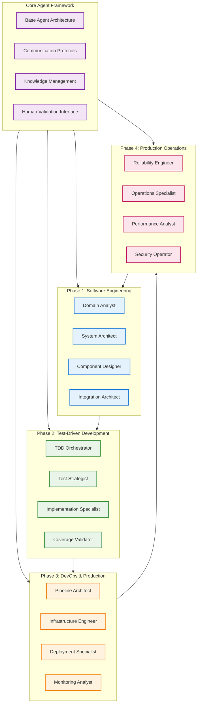

# PATH Framework AI Coding Agent Specifications


## Abstract

This document provides comprehensive technical specifications for AI coding agents that implement the PATH (Process/AI/Technology/Human) Framework methodology. Based on the PATH Framework research paper v2.3.0, these specifications define 16 specialized AI agents across four phases of software development: Software Engineering, Test-Driven Development, DevOps & Production Readiness, and Production Operations. Each agent specification includes functional requirements, technical capabilities, integration protocols, human validation interfaces, and performance metrics. The specifications ensure systematic human-AI collaboration while maintaining quality, security, and business value delivery throughout the software development lifecycle.

**Keywords:** AI Agents, PATH Framework, Software Engineering Automation, Human-AI Collaboration, Agent Architecture, Technical Specifications

## Agent Coding System

### Agent Codes (Two-Letter System)

**Phase 1: Software Engineering**
- **DA**: AI Domain Analyst
- **SA**: AI System Architect  
- **CD**: AI Component Designer
- **IA**: AI Integration Architect

**Phase 2: Test-Driven Development**
- **TO**: AI TDD Orchestrator
- **TS**: AI Test Strategist
- **IS**: AI Implementation Specialist
- **CV**: AI Coverage Validator

**Phase 3: DevOps & Production Readiness**
- **PA**: AI Pipeline Architect
- **IE**: AI Infrastructure Engineer
- **DS**: AI Deployment Specialist
- **MA**: AI Monitoring Analyst

**Phase 4: Production Operations**
- **RE**: AI Reliability Engineer
- **OS**: AI Operations Specialist
- **PF**: AI Performance Analyst
- **SO**: AI Security Operator

### Specification ID System

**Format**: `{AgentCode}-{Category}-{Number}`

**Categories:**
- **IN**: Inputs
- **OU**: Outputs  
- **CA**: Capabilities
- **PM**: Performance Metrics
- **HV**: Human Validation
- **IR**: Integration Requirements

**Examples:**
- `DA-IN-001`: Domain Analyst Input #1
- `SA-CA-003`: System Architect Capability #3
- `TO-PM-002`: TDD Orchestrator Performance Metric #2

## Table of Contents

1. [Introduction](#1-introduction)
   - 1.1 [Purpose and Scope](#11-purpose-and-scope)
   - 1.2 [Agent Architecture Overview](#12-agent-architecture-overview)
   - 1.3 [Human-AI Collaboration Model](#13-human-ai-collaboration-model)
   - 1.4 [Quality and Performance Standards](#14-quality-and-performance-standards)
2. [Core Agent Framework](#2-core-agent-framework)
   - 2.1 [Agent Base Architecture](#21-agent-base-architecture)
   - 2.2 [Communication Protocols](#22-communication-protocols)
   - 2.3 [Knowledge Management](#23-knowledge-management)
   - 2.4 [Human Validation Integration](#24-human-validation-integration)
3. [Phase 1 Agents: Software Engineering](#3-phase-1-agents-software-engineering)
   - 3.1 [AI Domain Analyst](#31-ai-domain-analyst)
   - 3.2 [AI System Architect](#32-ai-system-architect)
   - 3.3 [AI Component Designer](#33-ai-component-designer)
   - 3.4 [AI Integration Architect](#34-ai-integration-architect)
4. [Phase 2 Agents: Test-Driven Development](#4-phase-2-agents-test-driven-development)
   - 4.1 [AI TDD Orchestrator](#41-ai-tdd-orchestrator)
   - 4.2 [AI Test Strategist](#42-ai-test-strategist)
   - 4.3 [AI Implementation Specialist](#43-ai-implementation-specialist)
   - 4.4 [AI Coverage Validator](#44-ai-coverage-validator)
5. [Phase 3 Agents: DevOps & Production Readiness](#5-phase-3-agents-devops--production-readiness)
   - 5.1 [AI Pipeline Architect](#51-ai-pipeline-architect)
   - 5.2 [AI Infrastructure Engineer](#52-ai-infrastructure-engineer)
   - 5.3 [AI Deployment Specialist](#53-ai-deployment-specialist)
   - 5.4 [AI Monitoring Analyst](#54-ai-monitoring-analyst)
6. [Phase 4 Agents: Production Operations](#6-phase-4-agents-production-operations)
   - 6.1 [AI Reliability Engineer](#61-ai-reliability-engineer)
   - 6.2 [AI Operations Specialist](#62-ai-operations-specialist)
   - 6.3 [AI Performance Analyst](#63-ai-performance-analyst)
   - 6.4 [AI Security Operator](#64-ai-security-operator)
7. [Agent Integration and Coordination](#7-agent-integration-and-coordination)
   - 7.1 [Cross-Phase Communication](#71-cross-phase-communication)
   - 7.2 [Shared Knowledge Base](#72-shared-knowledge-base)
   - 7.3 [Conflict Resolution](#73-conflict-resolution)
   - 7.4 [Performance Monitoring](#74-performance-monitoring)
8. [Implementation Guidelines](#8-implementation-guidelines)
   - 8.1 [Deployment Architecture](#81-deployment-architecture)
   - 8.2 [Scaling Strategies](#82-scaling-strategies)
   - 8.3 [Security Requirements](#83-security-requirements)
   - 8.4 [Compliance and Governance](#84-compliance-and-governance)
9. [Quality Assurance and Testing](#9-quality-assurance-and-testing)
   - 9.1 [Agent Testing Framework](#91-agent-testing-framework)
   - 9.2 [Performance Benchmarks](#92-performance-benchmarks)
   - 9.3 [Validation Procedures](#93-validation-procedures)
   - 9.4 [Continuous Improvement](#94-continuous-improvement)

## 1. Introduction

### 1.1 Purpose and Scope

This specification document defines the technical requirements and implementation guidelines for AI coding agents that implement the PATH Framework methodology. The specifications ensure:

- **Systematic Human-AI Collaboration**: Structured interaction patterns across all development phases
- **Quality Assurance**: Consistent quality standards and validation procedures
- **Business Value Delivery**: Traceability from user stories to production features
- **Scalability**: Support for teams ranging from 5 to 500+ developers
- **Technology Agnostic**: Implementation across multiple programming languages and platforms

### 1.2 Agent Architecture Overview



**Legend:**
- 🟣 Core Agent Framework (Shared infrastructure and protocols)
- 🔵 Phase 1 Agents (Architecture and design specialists)
- 🟢 Phase 2 Agents (TDD and implementation specialists)
- 🟠 Phase 3 Agents (DevOps and deployment specialists)
- 🔴 Phase 4 Agents (Operations and monitoring specialists)

### 1.3 Human-AI Collaboration Model

**Collaboration Patterns:**
- **Pattern 1 (Human Leads)**: Strategic decisions, creative problem-solving (20% of workflows)
- **Pattern 2 (AI Leads)**: Routine tasks, systematic execution (60% of workflows)
- **Pattern 3 (Collaborate)**: Critical decisions requiring both perspectives (20% of workflows)

**Human Validation Gates:**
- **Mandatory Approval Points**: Critical decisions requiring human judgment
- **Oversight Checkpoints**: Human review during AI execution
- **No Bypass Protocol**: AI agents cannot circumvent human validation requirements
- **Audit Trail**: Complete documentation of all human decisions and rationale

### 1.4 Quality and Performance Standards

**Performance Targets:**
- **Response Time**: <2 seconds for routine operations, <30 seconds for complex analysis
- **Accuracy**: >95% for automated analysis and recommendations
- **Availability**: 99.9% uptime for critical development operations
- **Scalability**: Support 1-1000 concurrent users per agent instance

**Quality Standards:**
- **Code Quality**: Generated code must meet >90% quality score
- **Test Coverage**: Generated tests must achieve >90% code coverage
- **Security**: All generated code must pass security scanning
- **Compliance**: Full adherence to organizational coding standards

## 2. Core Agent Framework

### 2.1 Agent Base Architecture

**Core Components:**
```yaml
CoreAgent:
  components:
    - reasoning_engine: "LLM-based decision making"
    - knowledge_base: "Domain-specific knowledge storage"
    - communication_interface: "Human and agent interaction"
    - validation_engine: "Quality and compliance checking"
    - learning_module: "Continuous improvement from feedback"
    - security_layer: "Authentication and authorization"
  
  capabilities:
    - natural_language_processing: "Human communication"
    - code_generation: "Programming language output"
    - analysis_and_reasoning: "Problem solving and decision making"
    - integration_apis: "Tool and system integration"
    - monitoring_and_logging: "Performance and audit tracking"
```

**Technical Requirements:**
- **Runtime Environment**: Python 3.9+, Node.js 18+, or containerized deployment
- **Memory Requirements**: 4GB minimum, 16GB recommended for complex operations
- **Storage**: 100GB for knowledge base and temporary files
- **Network**: HTTPS/TLS 1.3 for all communications
- **Authentication**: OAuth 2.0 / SAML 2.0 integration

### 2.2 Communication Protocols

**Inter-Agent Communication:**
```yaml
AgentCommunication:
  protocol: "gRPC with Protocol Buffers"
  message_format:
    - agent_id: "Unique agent identifier"
    - phase: "Current development phase"
    - operation: "Specific operation being performed"
    - payload: "Operation-specific data"
    - timestamp: "UTC timestamp"
    - correlation_id: "Request tracking identifier"
  
  security:
    - encryption: "AES-256 encryption for all messages"
    - authentication: "Mutual TLS authentication"
    - authorization: "Role-based access control"
```

**Human-Agent Interface:**
```yaml
HumanInterface:
  channels:
    - web_ui: "Browser-based dashboard"
    - api_endpoints: "RESTful API for integration"
    - notifications: "Email, Slack, Teams integration"
    - mobile_app: "iOS/Android applications"
  
  interaction_patterns:
    - decision_presentation: "Structured options with recommendations"
    - approval_workflows: "Multi-step approval processes"
    - feedback_collection: "Rating and comment systems"
    - real_time_chat: "Interactive conversation interface"
```

### 2.3 Knowledge Management

**Shared Knowledge Base:**
```yaml
KnowledgeBase:
  components:
    - project_context: "Current project state and history"
    - code_patterns: "Successful implementation patterns"
    - business_rules: "Domain-specific business logic"
    - technical_standards: "Coding standards and best practices"
    - lessons_learned: "Historical insights and improvements"
  
  storage:
    - vector_database: "Semantic search and retrieval"
    - graph_database: "Relationship mapping and traversal"
    - document_store: "Structured and unstructured documents"
    - cache_layer: "High-performance data access"
  
  synchronization:
    - real_time_updates: "Immediate knowledge sharing"
    - conflict_resolution: "Automated merge strategies"
    - version_control: "Change tracking and rollback"
```

### 2.4 Human Validation Integration

**Validation Framework:**
```yaml
ValidationFramework:
  gates:
    - story_validation: "User story format and business value"
    - architecture_approval: "System design and technology decisions"
    - implementation_review: "Code quality and security validation"
    - deployment_authorization: "Production release approval"
    - operations_oversight: "Performance and incident management"
  
  escalation:
    - primary_approver: "Designated decision maker"
    - backup_approver: "Secondary decision maker"
    - emergency_override: "Critical situation handling"
    - audit_logging: "Complete decision trail"
```

## 3. Phase 1 Agents: Software Engineering

### 3.1 AI Domain Analyst

**Primary Responsibilities:**
- Analyze user stories for domain patterns and business logic
- Identify missing requirements and edge cases
- Validate business value and user story completeness
- Generate domain models and business rule specifications

**Technical Specifications:**
```yaml
DomainAnalyst:
  agent_code: "DA"
  
  inputs:
    DA-IN-001: "user_stories: Business requirements in story format"
    DA-IN-002: "domain_documentation: Existing business process documentation"
    DA-IN-003: "stakeholder_feedback: User interviews and feedback"
    DA-IN-004: "market_analysis: Competitive and industry context"
  
  outputs:
    DA-OU-001: "refined_stories: Enhanced user stories with edge cases"
    DA-OU-002: "domain_model: Business entity and relationship models"
    DA-OU-003: "business_rules: Formal business logic specifications"
    DA-OU-004: "requirements_gaps: Missing or incomplete requirements"
  
  capabilities:
    DA-CA-001: "story_analysis: Natural language processing of user stories"
    DA-CA-002: "domain_modeling: Entity-relationship diagram generation"
    DA-CA-003: "gap_analysis: Requirement completeness validation"
    DA-CA-004: "stakeholder_alignment: Business value validation"
  
  performance_metrics:
    DA-PM-001: "story_completeness: >95% of stories meet quality criteria"
    DA-PM-002: "gap_detection: >90% accuracy in identifying missing requirements"
    DA-PM-003: "stakeholder_satisfaction: >4.0/5.0 rating from product owners"
    DA-PM-004: "processing_time: <5 minutes per user story"
```

**Human Validation Points:**
```yaml
human_validation:
  DA-HV-001: "Business Strategy Review: Human approval of domain understanding and business logic"
  DA-HV-002: "Stakeholder Alignment: Product owner validation of refined user stories"
  DA-HV-003: "Requirements Completeness: Business analyst approval of requirement specifications"
```

**Integration Requirements:**
```yaml
integration_requirements:
  DA-IR-001: "Input Sources: JIRA, Azure DevOps, Confluence, user research tools"
  DA-IR-002: "Output Destinations: Architecture documentation, test planning systems"
  DA-IR-003: "APIs: RESTful APIs for story management and domain modeling tools"
```

### 3.2 AI System Architect

**Primary Responsibilities:**
- Generate architecture options and analyze trade-offs
- Ensure system scalability and performance requirements
- Design integration patterns with external systems
- Create technical specifications for development teams

**Technical Specifications:**
```yaml
SystemArchitect:
  agent_code: "SA"
  
  inputs:
    SA-IN-001: "refined_stories: Domain analyst output"
    SA-IN-002: "technical_constraints: Platform and technology limitations"
    SA-IN-003: "performance_requirements: Scalability and performance targets"
    SA-IN-004: "integration_requirements: External system dependencies"
  
  outputs:
    SA-OU-001: "system_architecture: High-level system design documents"
    SA-OU-002: "component_specifications: Detailed component designs"
    SA-OU-003: "integration_patterns: External system integration designs"
    SA-OU-004: "technology_recommendations: Technology stack decisions"
  
  capabilities:
    SA-CA-001: "architecture_generation: Multiple architecture option creation"
    SA-CA-002: "trade_off_analysis: Performance, cost, and complexity analysis"
    SA-CA-003: "scalability_planning: Load and growth capacity planning"
    SA-CA-004: "technology_evaluation: Technology stack assessment and selection"
  
  performance_metrics:
    SA-PM-001: "architecture_quality: >90% architect approval rating"
    SA-PM-002: "scalability_accuracy: >95% performance prediction accuracy"
    SA-PM-003: "integration_success: >98% successful external integrations"
    SA-PM-004: "delivery_time: <2 hours for initial architecture design"
```

**Human Validation Points:**
```yaml
human_validation:
  SA-HV-001: "Technology Stack Approval: Human architect validates technology choices"
  SA-HV-002: "Architecture Review: Senior architect approval of system design"
  SA-HV-003: "Integration Strategy: Human validation of external system connections"
```

### 3.3 AI Component Designer

**Primary Responsibilities:**
- Design component interfaces and specifications
- Identify reusable components and shared libraries
- Create detailed functional and non-functional requirements
- Plan component testing and validation strategies

**Technical Specifications:**
```yaml
ComponentDesigner:
  inputs:
    - system_architecture: "High-level system design"
    - user_stories: "Business requirements"
    - technical_standards: "Coding standards and patterns"
    - reusability_requirements: "Component sharing requirements"
  
  outputs:
    - component_specifications: "Detailed component designs"
    - interface_definitions: "API and data contract specifications"
    - dependency_maps: "Component relationship diagrams"
    - reusability_analysis: "Shared component identification"
  
  capabilities:
    - interface_design: "API and contract specification"
    - dependency_analysis: "Component relationship mapping"
    - reusability_identification: "Shared component detection"
    - specification_generation: "Detailed requirement documentation"
  
  performance_metrics:
    - specification_completeness: ">95% complete component specifications"
    - reusability_identification: ">80% of reusable components identified"
    - interface_quality: ">90% developer satisfaction with APIs"
    - design_time: "<30 minutes per component"
```

### 3.4 AI Integration Architect

**Primary Responsibilities:**
- Design integration patterns and protocols
- Plan acceptance test infrastructure
- Create data exchange and transformation specifications
- Ensure security and compliance in integrations

**Technical Specifications:**
```yaml
IntegrationArchitect:
  inputs:
    - system_architecture: "Overall system design"
    - external_systems: "Third-party system specifications"
    - security_requirements: "Authentication and authorization needs"
    - compliance_requirements: "Regulatory and policy constraints"
  
  outputs:
    - integration_patterns: "Integration design patterns"
    - test_infrastructure: "Acceptance testing framework design"
    - security_specifications: "Authentication and authorization designs"
    - data_transformation: "Data mapping and conversion specifications"
  
  capabilities:
    - integration_design: "External system connection patterns"
    - security_planning: "Authentication and authorization design"
    - test_framework_design: "Acceptance testing infrastructure"
    - compliance_validation: "Regulatory requirement verification"
  
  performance_metrics:
    - integration_success: ">98% successful integrations"
    - security_compliance: "100% security requirement adherence"
    - test_framework_quality: ">95% test automation coverage"
    - design_accuracy: ">90% first-time implementation success"
```

## 4. Phase 2 Agents: Test-Driven Development

### 4.1 AI TDD Orchestrator

**Primary Responsibilities:**
- Coordinate ATDD/TDD cycles across development teams
- Track user story progress and implementation status
- Manage test execution and validation workflows
- Ensure traceability between stories, tests, and code

**Technical Specifications:**
```yaml
TDDOrchestrator:
  inputs:
    - user_stories: "Business requirements with acceptance criteria"
    - component_specifications: "Technical component designs"
    - test_strategies: "Testing approach and frameworks"
    - development_progress: "Current implementation status"
  
  outputs:
    - test_execution_plans: "Coordinated testing workflows"
    - progress_reports: "Story implementation status"
    - traceability_matrix: "Story-test-code mapping"
    - quality_metrics: "Test coverage and quality indicators"
  
  capabilities:
    - workflow_orchestration: "ATDD/TDD cycle coordination"
    - progress_tracking: "Real-time development status monitoring"
    - traceability_management: "End-to-end requirement tracking"
    - quality_assurance: "Test quality and coverage validation"
  
  performance_metrics:
    - cycle_efficiency: ">90% on-time TDD cycle completion"
    - traceability_accuracy: ">98% correct story-code mapping"
    - quality_gate_success: ">95% first-pass quality gate approval"
    - orchestration_overhead: "<5% additional development time"
```

### 4.2 AI Test Strategist

**Primary Responsibilities:**
- Generate acceptance test scaffolding and frameworks
- Suggest comprehensive unit test cases and scenarios
- Create meaningful test assertions and validations
- Implement mutation testing and quality validation

**Technical Specifications:**
```yaml
TestStrategist:
  inputs:
    - acceptance_criteria: "User story validation requirements"
    - component_specifications: "Technical implementation details"
    - business_rules: "Domain-specific logic requirements"
    - edge_cases: "Boundary conditions and error scenarios"
  
  outputs:
    - acceptance_tests: "BDD/ATDD test specifications"
    - unit_test_cases: "Comprehensive unit test suites"
    - test_data: "Realistic test data and scenarios"
    - mutation_tests: "Code quality validation tests"
  
  capabilities:
    - test_generation: "Automated test case creation"
    - scenario_analysis: "Edge case and boundary identification"
    - assertion_design: "Meaningful behavioral validation"
    - quality_validation: "Mutation testing and coverage analysis"
  
  performance_metrics:
    - test_coverage: ">90% code coverage achievement"
    - mutation_score: ">80% mutation detection rate"
    - test_quality: ">95% meaningful assertion rate"
    - generation_speed: "<10 minutes per component test suite"
```

### 4.3 AI Implementation Specialist

**Primary Responsibilities:**
- Generate minimal code to pass tests
- Suggest implementation patterns and best practices
- Provide code scaffolding and structure templates
- Ensure code quality and maintainability standards

**Technical Specifications:**
```yaml
ImplementationSpecialist:
  inputs:
    - failing_tests: "Red phase TDD test cases"
    - component_specifications: "Technical requirements"
    - coding_standards: "Quality and style guidelines"
    - design_patterns: "Architectural pattern library"
  
  outputs:
    - implementation_code: "Minimal viable implementation"
    - code_scaffolding: "Structure and template code"
    - refactoring_suggestions: "Code improvement recommendations"
    - pattern_applications: "Design pattern implementations"
  
  capabilities:
    - code_generation: "Programming language code creation"
    - pattern_application: "Design pattern implementation"
    - quality_optimization: "Code quality improvement"
    - scaffolding_creation: "Project structure generation"
  
  performance_metrics:
    - code_quality: ">90% quality score achievement"
    - test_pass_rate: ">98% generated code passes tests"
    - pattern_accuracy: ">95% correct pattern application"
    - generation_time: "<5 minutes per component implementation"
```

### 4.4 AI Coverage Validator

**Primary Responsibilities:**
- Analyze test coverage and identify gaps
- Validate test meaningfulness and quality
- Identify untested code paths and scenarios
- Generate coverage reports and recommendations

**Technical Specifications:**
```yaml
CoverageValidator:
  inputs:
    - test_suites: "Complete test case collections"
    - implementation_code: "Production code under test"
    - coverage_reports: "Test execution coverage data"
    - quality_metrics: "Code and test quality indicators"
  
  outputs:
    - coverage_analysis: "Detailed coverage gap identification"
    - quality_assessment: "Test meaningfulness evaluation"
    - improvement_recommendations: "Coverage enhancement suggestions"
    - compliance_reports: "Quality standard adherence validation"
  
  capabilities:
    - coverage_analysis: "Code path and branch coverage evaluation"
    - gap_identification: "Untested code detection"
    - quality_assessment: "Test assertion meaningfulness analysis"
    - compliance_validation: "Quality standard verification"
  
  performance_metrics:
    - coverage_accuracy: ">99% accurate coverage reporting"
    - gap_detection: ">95% untested code identification"
    - quality_assessment: ">90% meaningful test identification"
    - analysis_time: "<2 minutes per component analysis"
```

## 5. Phase 3 Agents: DevOps & Production Readiness

### 5.1 AI Pipeline Architect

**Primary Responsibilities:**
- Design CI/CD pipelines and automation workflows
- Implement automated quality gates and validation
- Configure deployment strategies and rollback procedures
- Optimize build and deployment performance

**Technical Specifications:**
```yaml
PipelineArchitect:
  inputs:
    - implementation_code: "Production-ready code"
    - test_suites: "Complete test automation"
    - deployment_requirements: "Environment and infrastructure needs"
    - quality_standards: "Validation and approval criteria"
  
  outputs:
    - pipeline_configurations: "CI/CD pipeline definitions"
    - quality_gates: "Automated validation checkpoints"
    - deployment_strategies: "Release and rollback procedures"
    - monitoring_integration: "Pipeline performance tracking"
  
  capabilities:
    - pipeline_design: "CI/CD workflow creation"
    - automation_implementation: "Build and deployment automation"
    - quality_gate_configuration: "Validation checkpoint setup"
    - performance_optimization: "Pipeline speed and efficiency tuning"
  
  performance_metrics:
    - pipeline_reliability: ">99% successful pipeline execution"
    - deployment_speed: "<30 minutes for typical deployments"
    - quality_gate_effectiveness: ">95% defect detection rate"
    - automation_coverage: ">90% automated deployment processes"
```

### 5.2 AI Infrastructure Engineer

**Primary Responsibilities:**
- Provision infrastructure using Infrastructure as Code
- Optimize resource allocation and cost management
- Configure auto-scaling and capacity management
- Ensure security and compliance in infrastructure

**Technical Specifications:**
```yaml
InfrastructureEngineer:
  inputs:
    - system_architecture: "Infrastructure requirements"
    - performance_requirements: "Scalability and capacity needs"
    - security_requirements: "Compliance and security standards"
    - cost_constraints: "Budget and optimization targets"
  
  outputs:
    - infrastructure_code: "IaC templates and configurations"
    - scaling_policies: "Auto-scaling and capacity rules"
    - security_configurations: "Compliance and security settings"
    - cost_optimization: "Resource efficiency recommendations"
  
  capabilities:
    - infrastructure_provisioning: "Automated resource creation"
    - scaling_configuration: "Dynamic capacity management"
    - security_implementation: "Compliance and protection setup"
    - cost_optimization: "Resource efficiency maximization"
  
  performance_metrics:
    - provisioning_success: ">98% successful infrastructure deployment"
    - cost_optimization: ">20% cost reduction through optimization"
    - security_compliance: "100% security standard adherence"
    - scaling_effectiveness: ">95% appropriate scaling decisions"
```

### 5.3 AI Deployment Specialist

**Primary Responsibilities:**
- Automate deployment procedures and workflows
- Manage environment promotion and configuration
- Implement blue-green and canary deployment strategies
- Handle rollback and emergency procedures

**Technical Specifications:**
```yaml
DeploymentSpecialist:
  inputs:
    - pipeline_configurations: "CI/CD pipeline definitions"
    - infrastructure_code: "Provisioned infrastructure"
    - application_code: "Deployable application artifacts"
    - deployment_policies: "Release and rollback strategies"
  
  outputs:
    - deployment_automation: "Automated deployment workflows"
    - environment_management: "Configuration and promotion procedures"
    - rollback_procedures: "Emergency recovery workflows"
    - deployment_reports: "Release status and metrics"
  
  capabilities:
    - deployment_automation: "Zero-downtime deployment execution"
    - environment_management: "Configuration consistency maintenance"
    - rollback_execution: "Rapid failure recovery"
    - deployment_monitoring: "Release health and status tracking"
  
  performance_metrics:
    - deployment_success: ">99% successful deployments"
    - rollback_speed: "<5 minutes for emergency rollbacks"
    - downtime_minimization: "<30 seconds average downtime"
    - configuration_accuracy: ">99% correct environment configuration"
```

### 5.4 AI Monitoring Analyst

**Primary Responsibilities:**
- Configure application and infrastructure monitoring
- Set up intelligent alerting and notification systems
- Create performance dashboards and reporting
- Implement log aggregation and analysis

**Technical Specifications:**
```yaml
MonitoringAnalyst:
  inputs:
    - application_architecture: "System component structure"
    - performance_requirements: "SLA and performance targets"
    - business_metrics: "User story success indicators"
    - operational_procedures: "Incident response workflows"
  
  outputs:
    - monitoring_configuration: "APM and infrastructure monitoring setup"
    - alerting_rules: "Intelligent notification and escalation"
    - dashboards: "Real-time performance and business metrics"
    - log_analysis: "Centralized logging and search capabilities"
  
  capabilities:
    - monitoring_setup: "Comprehensive system observation"
    - alert_configuration: "Intelligent notification management"
    - dashboard_creation: "Visual performance and business reporting"
    - log_management: "Centralized logging and analysis"
  
  performance_metrics:
    - monitoring_coverage: ">95% system component coverage"
    - alert_accuracy: ">90% actionable alert rate"
    - dashboard_utility: ">4.0/5.0 user satisfaction rating"
    - log_analysis_speed: "<30 seconds for typical queries"
```

## 6. Phase 4 Agents: Production Operations

### 6.1 AI Reliability Engineer

**Primary Responsibilities:**
- Monitor system reliability and predict failures
- Implement chaos engineering and resilience testing
- Analyze incident patterns and root causes
- Optimize system availability and performance

**Technical Specifications:**
```yaml
ReliabilityEngineer:
  inputs:
    - system_metrics: "Performance and availability data"
    - incident_history: "Historical failure and recovery data"
    - user_feedback: "Customer experience and satisfaction"
    - business_impact: "Revenue and operational impact metrics"
  
  outputs:
    - reliability_reports: "System health and availability analysis"
    - failure_predictions: "Proactive failure identification"
    - resilience_recommendations: "System robustness improvements"
    - incident_analysis: "Root cause and prevention strategies"
  
  capabilities:
    - predictive_analysis: "Failure prediction and prevention"
    - chaos_engineering: "Controlled failure testing"
    - incident_analysis: "Root cause identification and resolution"
    - reliability_optimization: "System robustness enhancement"
  
  performance_metrics:
    - prediction_accuracy: ">85% failure prediction accuracy"
    - availability_improvement: ">99.9% system uptime achievement"
    - incident_reduction: ">30% reduction in production incidents"
    - recovery_time: "<15 minutes mean time to recovery"
```

### 6.2 AI Operations Specialist

**Primary Responsibilities:**
- Automate routine operational tasks and procedures
- Handle incident response and escalation workflows
- Manage system maintenance and updates
- Coordinate operational activities across teams

**Technical Specifications:**
```yaml
OperationsSpecialist:
  inputs:
    - operational_procedures: "Standard operating procedures"
    - incident_reports: "System failures and issues"
    - maintenance_schedules: "Planned system updates"
    - team_coordination: "Cross-functional workflow requirements"
  
  outputs:
    - automation_workflows: "Routine task automation"
    - incident_responses: "Automated incident handling"
    - maintenance_execution: "Scheduled system updates"
    - operational_reports: "Activity status and performance metrics"
  
  capabilities:
    - task_automation: "Routine operational procedure execution"
    - incident_handling: "Automated response and escalation"
    - maintenance_management: "Scheduled update coordination"
    - workflow_coordination: "Cross-team activity synchronization"
  
  performance_metrics:
    - automation_coverage: ">80% routine tasks automated"
    - incident_response_time: "<5 minutes initial response"
    - maintenance_success: ">98% successful maintenance execution"
    - operational_efficiency: ">40% reduction in manual operations"
```

### 6.3 AI Performance Analyst

**Primary Responsibilities:**
- Analyze system performance metrics and trends
- Identify bottlenecks and optimization opportunities
- Generate performance improvement recommendations
- Monitor user experience and satisfaction metrics

**Technical Specifications:**
```yaml
PerformanceAnalyst:
  inputs:
    - performance_metrics: "System response time and throughput"
    - user_experience_data: "Customer satisfaction and usage patterns"
    - resource_utilization: "Infrastructure capacity and efficiency"
    - business_metrics: "Revenue and operational impact"
  
  outputs:
    - performance_analysis: "System efficiency and bottleneck identification"
    - optimization_recommendations: "Performance improvement strategies"
    - capacity_planning: "Resource scaling and allocation guidance"
    - user_experience_reports: "Customer satisfaction and engagement analysis"
  
  capabilities:
    - performance_monitoring: "Real-time system efficiency tracking"
    - bottleneck_identification: "Performance constraint detection"
    - optimization_planning: "Improvement strategy development"
    - capacity_forecasting: "Resource requirement prediction"
  
  performance_metrics:
    - analysis_accuracy: ">90% correct bottleneck identification"
    - optimization_impact: ">25% performance improvement achievement"
    - capacity_prediction: ">95% accurate resource forecasting"
    - user_satisfaction: ">4.0/5.0 customer experience rating"
```

### 6.4 AI Security Operator

**Primary Responsibilities:**
- Monitor security events and detect anomalies
- Implement automated threat response procedures
- Conduct security assessments and vulnerability analysis
- Ensure compliance with security policies and regulations

**Technical Specifications:**
```yaml
SecurityOperator:
  inputs:
    - security_logs: "System and application security events"
    - threat_intelligence: "External threat and vulnerability data"
    - compliance_requirements: "Regulatory and policy standards"
    - incident_history: "Historical security events and responses"
  
  outputs:
    - security_analysis: "Threat detection and risk assessment"
    - incident_responses: "Automated security event handling"
    - compliance_reports: "Regulatory adherence validation"
    - vulnerability_assessments: "Security weakness identification"
  
  capabilities:
    - threat_detection: "Anomaly and attack identification"
    - incident_response: "Automated security event handling"
    - vulnerability_scanning: "Security weakness assessment"
    - compliance_monitoring: "Regulatory requirement validation"
  
  performance_metrics:
    - threat_detection_rate: ">95% security event identification"
    - false_positive_rate: "<5% incorrect threat alerts"
    - response_time: "<2 minutes for critical security events"
    - compliance_adherence: "100% regulatory requirement compliance"
```

## 7. Agent Integration and Coordination

### 7.1 Cross-Phase Communication

**Communication Architecture:**
```yaml
CrossPhaseCommunication:
  protocols:
    - message_bus: "Event-driven communication system"
    - api_gateway: "Centralized API management"
    - notification_system: "Real-time alert and update distribution"
    - data_synchronization: "Consistent state management"
  
  message_types:
    - phase_transition: "Workflow progression notifications"
    - quality_gate_results: "Validation outcome communication"
    - resource_requests: "Cross-phase resource coordination"
    - status_updates: "Progress and health reporting"
  
  coordination_patterns:
    - sequential_handoff: "Phase-to-phase workflow progression"
    - parallel_execution: "Concurrent agent operation"
    - feedback_loops: "Iterative improvement cycles"
    - emergency_escalation: "Critical issue handling"
```

### 7.2 Shared Knowledge Base

**Knowledge Management System:**
```yaml
SharedKnowledgeBase:
  components:
    - project_context: "Current project state and history"
    - pattern_library: "Successful implementation patterns"
    - decision_history: "Architectural and technical decisions"
    - performance_metrics: "Historical performance and quality data"
    - lessons_learned: "Continuous improvement insights"
  
  access_patterns:
    - real_time_queries: "Immediate knowledge retrieval"
    - batch_updates: "Periodic knowledge synchronization"
    - semantic_search: "Context-aware information discovery"
    - relationship_traversal: "Connected information exploration"
  
  consistency_management:
    - version_control: "Change tracking and rollback"
    - conflict_resolution: "Automated merge strategies"
    - validation_rules: "Data quality and integrity checks"
    - access_control: "Security and permission management"
```

### 7.3 Conflict Resolution

**Conflict Resolution Framework:**
```yaml
ConflictResolution:
  conflict_types:
    - resource_contention: "Competing agent resource requests"
    - decision_disagreement: "Conflicting recommendations"
    - priority_conflicts: "Competing task priorities"
    - data_inconsistency: "Conflicting information sources"
  
  resolution_strategies:
    - priority_based: "Hierarchical decision making"
    - consensus_building: "Multi-agent agreement"
    - human_escalation: "Expert human intervention"
    - automated_arbitration: "Rule-based conflict resolution"
  
  escalation_procedures:
    - agent_level: "Peer-to-peer negotiation"
    - phase_level: "Phase coordinator intervention"
    - system_level: "System administrator involvement"
    - human_level: "Expert human decision making"
```

### 7.4 Performance Monitoring

**Agent Performance Tracking:**
```yaml
PerformanceMonitoring:
  metrics:
    - response_time: "Agent operation completion time"
    - accuracy: "Correctness of agent outputs"
    - resource_utilization: "Computational resource consumption"
    - user_satisfaction: "Human feedback and ratings"
  
  monitoring_systems:
    - real_time_dashboards: "Live performance visualization"
    - alerting_systems: "Performance threshold notifications"
    - trend_analysis: "Historical performance patterns"
    - predictive_analytics: "Performance forecasting"
  
  optimization_strategies:
    - load_balancing: "Workload distribution optimization"
    - caching_strategies: "Response time improvement"
    - resource_scaling: "Dynamic capacity adjustment"
    - algorithm_tuning: "Performance algorithm optimization"
```

## 8. Implementation Guidelines

### 8.1 Deployment Architecture

**Recommended Deployment Patterns:**
```yaml
DeploymentArchitecture:
  patterns:
    - microservices: "Individual agent service deployment"
    - containerization: "Docker/Kubernetes orchestration"
    - serverless: "Function-as-a-Service for specific agents"
    - hybrid: "Mixed deployment based on agent requirements"
  
  infrastructure:
    - compute: "CPU and memory requirements per agent"
    - storage: "Database and file system requirements"
    - networking: "Communication and security requirements"
    - monitoring: "Observability and logging infrastructure"
  
  scalability:
    - horizontal_scaling: "Multiple agent instance deployment"
    - vertical_scaling: "Resource allocation adjustment"
    - auto_scaling: "Dynamic capacity management"
    - load_balancing: "Request distribution optimization"
```

### 8.2 Scaling Strategies

**Agent Scaling Framework:**
```yaml
ScalingStrategies:
  team_sizes:
    - small_team: "5-10 developers, 4 agents (1 per phase)"
    - medium_team: "10-50 developers, 8 agents (2 per phase)"
    - large_team: "50-200 developers, 16 agents (4 per phase)"
    - enterprise: "200+ developers, 16+ agents (specialized instances)"
  
  scaling_triggers:
    - workload_volume: "Request volume thresholds"
    - response_time: "Performance degradation indicators"
    - resource_utilization: "Infrastructure capacity limits"
    - user_satisfaction: "Quality and satisfaction metrics"
  
  scaling_actions:
    - instance_replication: "Additional agent instance deployment"
    - resource_allocation: "CPU and memory scaling"
    - load_redistribution: "Workload balancing optimization"
    - capacity_planning: "Proactive scaling preparation"
```

### 8.3 Security Requirements

**Security Framework:**
```yaml
SecurityRequirements:
  authentication:
    - multi_factor: "MFA for human users"
    - service_accounts: "Agent-to-agent authentication"
    - token_management: "JWT and OAuth 2.0 implementation"
    - certificate_management: "TLS certificate lifecycle"
  
  authorization:
    - role_based_access: "RBAC for human users"
    - agent_permissions: "Fine-grained agent capabilities"
    - resource_access: "Data and system access control"
    - audit_logging: "Complete access audit trail"
  
  data_protection:
    - encryption_at_rest: "Database and file encryption"
    - encryption_in_transit: "Network communication protection"
    - data_masking: "Sensitive information protection"
    - backup_security: "Secure backup and recovery"
```

### 8.4 Compliance and Governance

**Governance Framework:**
```yaml
ComplianceGovernance:
  regulatory_compliance:
    - gdpr: "Data privacy and protection compliance"
    - hipaa: "Healthcare information security"
    - sox: "Financial reporting and controls"
    - iso27001: "Information security management"
  
  organizational_governance:
    - change_management: "Controlled system modifications"
    - approval_workflows: "Multi-level authorization processes"
    - audit_requirements: "Complete activity logging"
    - risk_management: "Risk assessment and mitigation"
  
  quality_assurance:
    - code_standards: "Coding quality and style enforcement"
    - testing_requirements: "Comprehensive test coverage"
    - documentation_standards: "Complete system documentation"
    - performance_benchmarks: "Quality and performance targets"
```

## 9. Quality Assurance and Testing

### 9.1 Agent Testing Framework

**Testing Strategy:**
```yaml
AgentTestingFramework:
  test_types:
    - unit_tests: "Individual agent function testing"
    - integration_tests: "Agent-to-agent communication testing"
    - system_tests: "End-to-end workflow validation"
    - performance_tests: "Load and stress testing"
  
  test_automation:
    - continuous_testing: "Automated test execution"
    - regression_testing: "Change impact validation"
    - acceptance_testing: "Business requirement validation"
    - security_testing: "Vulnerability and compliance testing"
  
  quality_metrics:
    - test_coverage: ">90% code coverage requirement"
    - defect_rate: "<1% production defect rate"
    - performance_benchmarks: "Response time and throughput targets"
    - user_satisfaction: ">4.0/5.0 satisfaction rating"
```

### 9.2 Performance Benchmarks

**Performance Standards:**
```yaml
PerformanceBenchmarks:
  response_time:
    - simple_operations: "<2 seconds"
    - complex_analysis: "<30 seconds"
    - batch_processing: "<5 minutes"
    - emergency_response: "<30 seconds"
  
  throughput:
    - concurrent_users: "1-1000 users per agent"
    - request_volume: "100-10000 requests per hour"
    - data_processing: "1GB-1TB data processing capability"
    - scalability: "Linear scaling with resource allocation"
  
  availability:
    - uptime_target: "99.9% availability"
    - recovery_time: "<5 minutes for failures"
    - maintenance_windows: "<4 hours monthly downtime"
    - disaster_recovery: "<1 hour full system recovery"
```

### 9.3 Validation Procedures

**Validation Framework:**
```yaml
ValidationProcedures:
  functional_validation:
    - requirement_compliance: "Business requirement adherence"
    - output_quality: "Generated artifact quality assessment"
    - integration_compatibility: "System integration validation"
    - user_acceptance: "Stakeholder approval and satisfaction"
  
  non_functional_validation:
    - performance_testing: "Speed and efficiency validation"
    - security_assessment: "Vulnerability and compliance testing"
    - reliability_testing: "Failure recovery and resilience"
    - usability_evaluation: "User experience and interface quality"
  
  continuous_validation:
    - monitoring_validation: "Real-time performance tracking"
    - feedback_integration: "User feedback incorporation"
    - improvement_cycles: "Iterative enhancement processes"
    - compliance_auditing: "Regulatory requirement verification"
```

### 9.4 Continuous Improvement

**Improvement Framework:**
```yaml
ContinuousImprovement:
  feedback_collection:
    - user_feedback: "Human user satisfaction and suggestions"
    - performance_metrics: "System performance and efficiency data"
    - error_analysis: "Failure and issue pattern identification"
    - usage_analytics: "Agent utilization and effectiveness metrics"
  
  improvement_processes:
    - regular_reviews: "Monthly performance and quality assessments"
    - update_cycles: "Quarterly agent capability enhancements"
    - training_updates: "Continuous learning model improvements"
    - feature_development: "New capability development and deployment"
  
  success_metrics:
    - performance_improvement: ">10% quarterly performance gains"
    - user_satisfaction: ">4.5/5.0 satisfaction rating target"
    - defect_reduction: ">20% annual defect rate reduction"
    - efficiency_gains: ">15% development velocity improvement"
```

---

**Corresponding Author**: PATH Framework Research Team  
**Institution**: Precocity Research Limited  
**Email**: info@precocity.nz  
**Date**: September 22, 2025  
**Version**: 1.0.0  
**Framework Version**: PATH Framework 2.0.0 with AI Agent Specifications  
**License**: MIT License - Open Source Methodology